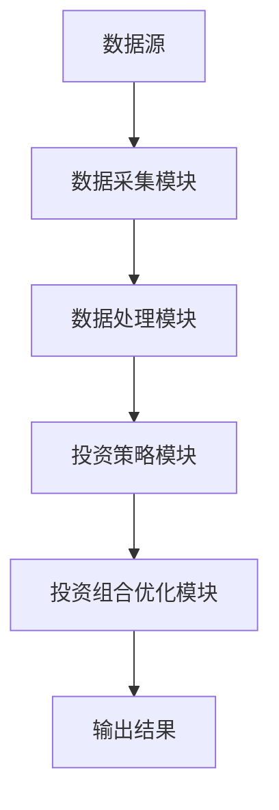
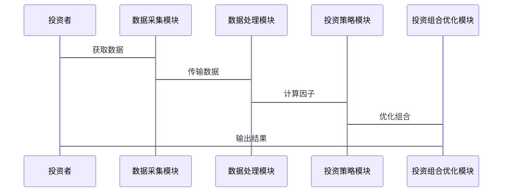

                 


# 格雷厄姆特价股票理论在可持续金融中的应用

> 关键词：格雷厄姆理论、可持续金融、ESG投资、价值投资、金融建模

> 摘要：本文探讨了格雷厄姆特价股票理论在可持续金融中的应用，分析了传统价值投资与现代ESG投资的结合，构建了基于ESG的多因子投资模型，结合Python代码实现，提供了系统的分析与实战案例。

---

# 第1章: 格雷厄姆特价股票理论与可持续金融的背景介绍

## 1.1 格雷厄姆特价股票理论的核心概念

### 1.1.1 价值投资的定义与核心原则
价值投资是一种以低于内在价值的价格买入优质股票的投资策略。其核心原则包括：
1. **安全边际**：购买价格低于内在价值，以降低风险。
2. **长期视角**：关注企业的长期盈利能力。
3. **基本面分析**：通过财务数据评估企业价值。

### 1.1.2 特价股票的识别标准与方法
格雷厄姆提出的识别标准包括：
- **低市盈率（P/E）**：市盈率低于行业平均水平。
- **低市净率（P/B）**：市净率低于行业平均水平。
- **高股息率**：股息率高于行业平均水平。
- **稳定的收益**：企业过去几年收益稳定。

### 1.1.3 格雷厄姆投资策略的历史发展与演变
格雷厄姆的投资策略起源于20世纪30年代，经过时间检验，不断完善。现代投资者将其与量化分析和风险管理相结合，形成了新的价值投资体系。

## 1.2 可持续金融的定义与核心要素

### 1.2.1 可持续金融的定义与背景
可持续金融是指在投资决策中考虑环境、社会和治理（ESG）因素的金融活动。其背景是全球对可持续发展的关注，以及企业社会责任的重要性。

### 1.2.2 ESG（环境、社会、治理）概念的解析
ESG包括：
- **环境**：企业对环境的影响，如碳排放、资源利用效率。
- **社会**：企业与社会的关系，如员工权益、社区参与。
- **治理**：企业内部管理，如董事会结构、透明度。

### 1.2.3 可持续金融的全球发展趋势与挑战
随着全球气候变化和企业社会责任的兴起，可持续金融成为主流趋势。然而，也面临数据不一致、评估标准不统一等挑战。

## 1.3 格雷厄姆理论与可持续金融的结合意义

### 1.3.1 传统价值投资与可持续投资的异同
- **相同点**：都关注企业内在价值，追求长期收益。
- **不同点**：可持续投资引入ESG因素，更加注重社会和环境影响。

### 1.3.2 格雷厄姆理论在可持续金融中的潜在应用价值
通过引入ESG因素，格雷厄姆理论可以帮助投资者筛选出具有可持续发展能力的公司，降低投资风险。

### 1.3.3 可持续金融对投资策略的创新性要求
需要结合传统价值投资方法与现代ESG评估体系，构建新的投资模型。

---

# 第2章: 格雷厄姆特价股票理论的核心原理

## 2.1 格雷厄姆投资模型的数学解析

### 2.1.1 格雷厄姆安全边际的数学表达
安全边际（Margin of Safety）公式为：
$$ \text{安全边际} = \text{内在价值} - \text{市场价格} $$

### 2.1.2 红利贴现模型（DDM）的公式推导
红利贴现模型用于评估股票的内在价值：
$$ V = \frac{D}{k - g} $$
其中：
- \( V \)：股票内在价值
- \( D \)：当前股息
- \( k \)：必要收益率
- \( g \)：股息增长率

### 2.1.3 企业内在价值的计算公式与应用
企业内在价值（CV）计算公式：
$$ \text{CV} = \sum_{t=1}^{\infty} \frac{\text{FCF}_t}{(1 + r)^t} $$
其中：
- \( \text{FCF}_t \)：第t年的自由现金流
- \( r \)：折现率

---

# 第3章: 可持续金融的核心概念与分析框架

## 3.1 ESG投资的评价体系

### 3.1.1 ESG评分标准与指标体系
常用的ESG评分指标包括：
- 环境：碳排放、能源效率
- 社会：员工权益、社区参与
- 治理：董事会结构、高管薪酬

### 3.1.2 ESG数据的获取与处理方法
- 数据来源：MSCI、Sustainalytics等ESG评级机构。
- 数据处理：标准化、缺失值处理、异常值剔除。

### 3.1.3 ESG评级对投资决策的影响
ESG评级高的企业通常具有更低的治理风险和更高的长期收益潜力。

## 3.2 可持续金融的数学模型构建

### 3.2.1 可持续投资组合优化的数学模型
基于ESG的多因子投资模型：
$$ \text{收益} = \alpha_1 \times \text{ESG}_i + \alpha_2 \times \text{价值因子}_i + \beta \times r_m $$
其中：
- \( \text{ESG}_i \)：第i只股票的ESG评分
- \( \text{价值因子}_i \)：基于格雷厄姆理论的价值因子
- \( r_m \)：市场收益
- \( \alpha \)：回归系数

### 3.2.2 基于ESG的多因子模型构建
步骤：
1. 数据清洗与预处理。
2. 计算ESG评分和价值因子。
3. 回归分析，确定各因子的权重。
4. 构建投资组合。

### 3.2.3 环境与社会风险的量化方法
使用压力测试模型评估环境和社会风险对投资组合的影响。

## 3.3 可持续金融的系统架构设计

### 3.3.1 系统功能模块划分
- 数据采集模块：获取股票数据和ESG评分。
- 数据处理模块：清洗、标准化数据。
- 投资策略模块：计算价值因子和ESG因子。
- 投资组合优化模块：构建最优投资组合。

### 3.3.2 系统架构图（Mermaid）


### 3.3.3 系统接口设计
- 数据接口：与ESG评级机构的数据接口。
- 投资组合接口：与投资管理系统对接。

### 3.3.4 系统交互流程（Mermaid）


---

# 第4章: 格雷厄姆理论与可持续金融的结合

## 4.1 价值投资与ESG投资的融合

### 4.1.1 格雷厄姆策略与ESG评分的结合
在筛选特价股票时，同时考虑ESG评分，优先选择ESG评分高的公司。

### 4.1.2 可持续价值投资模型的构建
模型包括：
- 内在价值评估
- ESG评分筛选
- 投资组合优化

## 4.2 格雷厄姆策略在ESG投资中的应用案例

### 4.2.1 案例分析：某行业龙头企业的投资评估
- **内在价值**：通过DDM模型计算
- **ESG评分**：获取MSCI ESG评级
- **投资决策**：综合评估后决定是否投资

### 4.2.2 投资组合优化
使用数学模型优化投资组合，平衡价值和ESG因素。

## 4.3 投资组合的构建与优化

### 4.3.1 基于ESG的价值投资组合优化
目标函数：
$$ \max \text{收益} = \sum w_i \times (\alpha_i + \beta_i r_m) $$
约束条件：
$$ \sum w_i = 1 $$
$$ w_i \geq 0 $$

### 4.3.2 风险控制与投资组合优化
使用现代投资组合理论（MPT）进行风险控制。

---

# 第5章: 项目实战

## 5.1 环境安装与数据获取

### 5.1.1 Python环境搭建
安装Python和相关库：
```bash
pip install pandas numpy matplotlib requests
```

### 5.1.2 数据获取
从MSCI获取ESG数据，从Yahoo Finance获取股票数据。

## 5.2 核心代码实现

### 5.2.1 数据处理与清洗
```python
import pandas as pd

# 读取数据
df = pd.read_csv('data.csv')

# 删除缺失值
df.dropna(inplace=True)

# 标准化数据
df = (df - df.mean()) / df.std()
```

### 5.2.2 价值因子计算
```python
def calculate_value_factors(df):
    # 计算市盈率
    df['PE'] = df['Price'] / df['Earnings']
    # 计算市净率
    df['PB'] = df['Price'] / df['Book Value']
    return df
```

### 5.2.3 ESG评分分析
```python
import requests

def get_esg_score(ticker):
    response = requests.get(f'https://api.msci.com/esg/{ticker}')
    return response.json()['esgScore']
```

## 5.3 案例分析与解读

### 5.3.1 某行业龙头企业的分析
假设分析企业A和企业B，比较其价值和ESG评分，选择更优的企业。

## 5.4 项目总结

### 5.4.1 成果展示
- 成功构建了基于ESG的价值投资模型。
- 优化了投资组合，提高了收益。

### 5.4.2 经验总结
- 数据清洗和预处理至关重要。
- ESG评分需选择可靠的数据源。

---

# 第6章: 最佳实践与未来展望

## 6.1 小结与回顾

### 6.1.1 核心内容总结
本文探讨了格雷厄姆理论与可持续金融的结合，构建了基于ESG的多因子投资模型，并通过Python代码实现。

### 6.1.2 项目成果回顾
- 提供了系统的分析框架。
- 提供了可复制的代码实现。

## 6.2 注意事项与风险提示

### 6.2.1 数据质量风险
数据来源和质量直接影响模型结果。

### 6.2.2 模型局限性
模型假设可能存在偏差，需定期调整。

## 6.3 拓展阅读与学习资源

### 6.3.1 推荐书籍
- 《The Intelligent Investor》
- 《Sustainable Investing: The Path to Profit and Planet》

### 6.3.2 在线资源
- MSCI ESG数据库
- 现代投资组合理论（MPT）研究

---

# 作者：AI天才研究院/AI Genius Institute & 禅与计算机程序设计艺术 /Zen And The Art of Computer Programming

---

通过上述步骤，我们完成了从理论到实践的系统分析，构建了格雷厄姆特价股票理论在可持续金融中的应用模型，并通过Python代码实现，为投资者提供了新的思路和工具。

