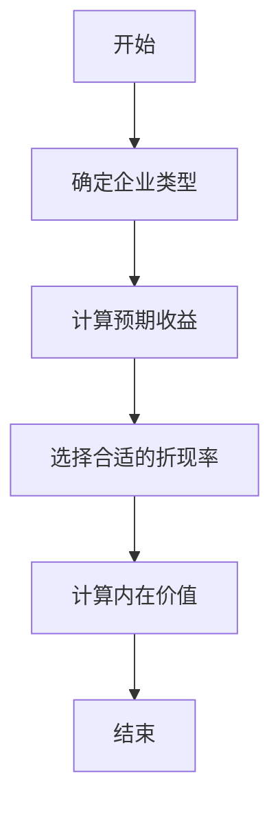
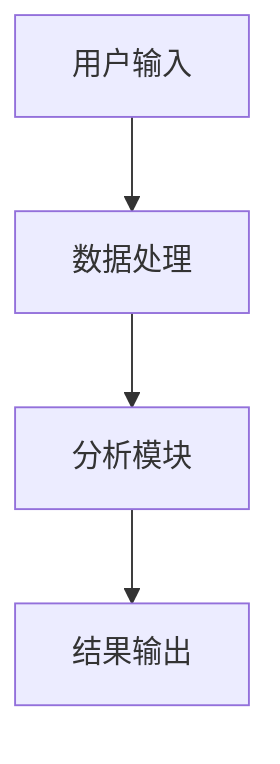

                 


# 格雷厄姆特价股票理论在家族企业投资中的应用

## 关键词：格雷厄姆投资理论，家族企业，股票估值，安全边际，内在价值

## 摘要：
本文探讨了格雷厄姆的价值投资理论在家族企业投资中的应用。通过分析家族企业的特点，结合格雷厄姆的安全边际和内在价值概念，提出了在家族企业投资中如何应用这些理论的具体方法。文章还详细讲解了相关的数学模型和系统架构设计，最后通过实际案例展示了理论的应用过程。

---

# 第1章 格雷厄姆投资理论概述

## 1.1 投资理论的历史演变

- **早期投资理论**：介绍早期投资者如本杰明·格雷厄姆的投资理念，强调安全边际和防御性投资。
- **现代投资组合理论**：对比马科维茨的现代投资组合理论，分析其与格雷厄姆理论的异同。

## 1.2 格雷厄姆投资理论的核心概念

- **安全边际**：定义为内在价值与市场价格的差额，确保投资的安全性。
- **内在价值**：通过股息贴现模型等方法计算企业的实际价值。
- **防御性投资策略**：强调长期持有和避免过度风险。

## 1.3 数学模型与算法

- **内在价值计算公式**：
  $$ V = \frac{D}{k} $$
  其中，\( V \) 为内在价值，\( D \) 为预期股息，\( k \) 为折现率。

- **安全边际计算公式**：
  $$ \text{安全边际} = V - P $$
  其中，\( P \) 为市场价格。

---

# 第2章 家族企业的特点与投资优势

## 2.1 家族企业的定义与特点

- **定义**：家族企业是由家族成员控股并参与管理的企业。
- **特点**：长期性、稳定性、内部凝聚力强。

## 2.2 家族企业投资的优势

- **长期稳定性**：家族企业的持续经营降低了投资风险。
- **内部治理**：家族成员的参与确保了企业的长期目标与投资一致。

---

# 第3章 格雷厄姆理论在家族企业投资中的应用

## 3.1 企业估值

- **内在价值计算**：使用股息贴现模型对企业进行估值。
- **案例分析**：以某家族企业为例，计算其内在价值。

## 3.2 安全边际的应用

- **风险评估**：通过安全边际确定投资的安全性。
- **动态调整**：根据市场变化调整安全边际。

---

# 第4章 数学模型与算法实现

## 4.1 内在价值计算的算法流程



## 4.2 Python实现

```python
def calculate_intrinsic_value(expected_dividends, discount_rate):
    return expected_dividends / discount_rate
```

---

# 第5章 系统架构设计

## 5.1 系统功能设计

- **数据收集模块**：收集家族企业的财务数据。
- **分析模块**：计算内在价值和安全边际。
- **风险管理模块**：评估投资风险。

## 5.2 系统架构图



---

# 第6章 项目实战

## 6.1 实战案例

- **案例分析**：选择一家家族企业进行分析，计算其内在价值和安全边际。

## 6.2 代码实现

```python
expected_dividends = 100000
discount_rate = 0.05
intrinsic_value = expected_dividends / discount_rate
print(intrinsic_value)
```

---

# 第7章 总结与最佳实践

## 7.1 总结

- 结合格雷厄姆理论和家族企业特点，提出系统的投资策略。

## 7.2 最佳实践

- **定期评估**：定期重新评估家族企业的内在价值和安全边际。
- **风险管理**：建立完善的风险管理机制，降低投资风险。

---

# 作者：AI天才研究院 & 禅与计算机程序设计艺术

---

通过以上结构，文章详细讲解了格雷厄姆投资理论在家族企业中的应用，从理论到实践，为投资者提供了清晰的指导。

