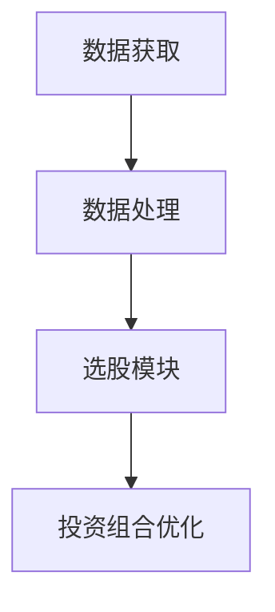
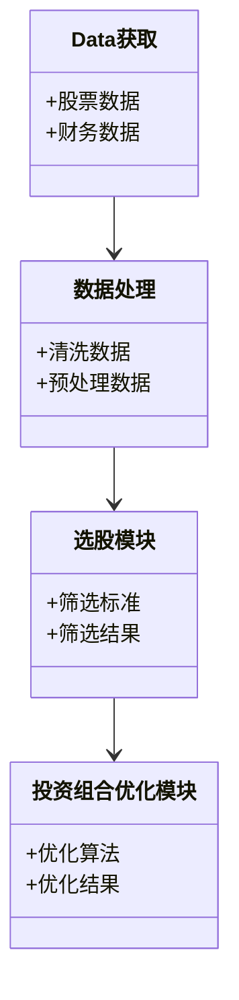
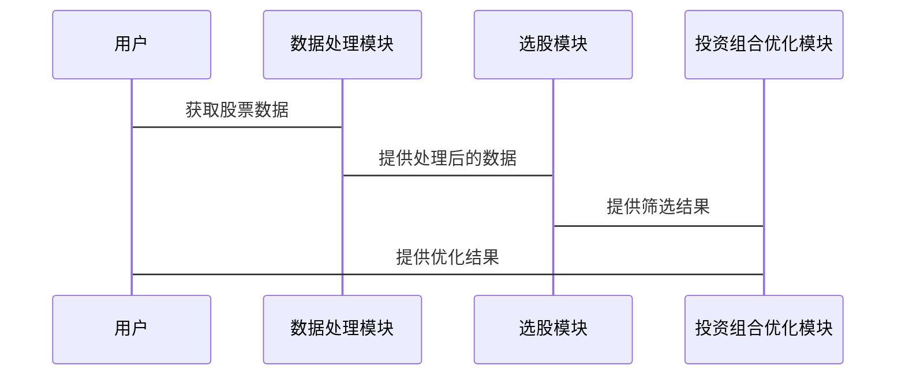
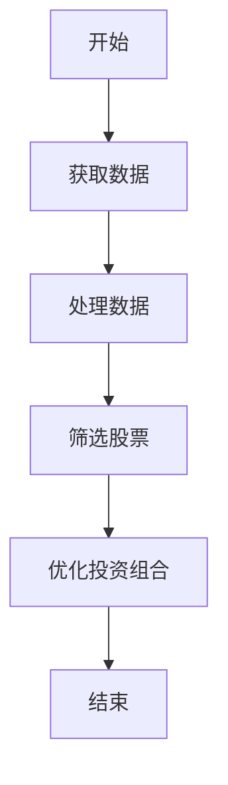

                 


# 格雷厄姆特价股票理论在小盘股中的应用

> 关键词：格雷厄姆投资理论、小盘股、特价股票、价值投资、股票筛选

> 摘要：本文深入探讨了格雷厄姆特价股票理论在小盘股投资中的应用，从理论基础、选股标准、系统设计到项目实战，系统地分析了如何利用格雷厄姆的“捡烟蒂”策略在小盘股中寻找投资机会。文章结合数学模型、算法实现和实际案例，为投资者提供了从理论到实践的详细指导。

---

## 第一部分: 格雷厄姆特价股票理论基础

### 第1章: 格雷厄姆特价股票理论概述

#### 1.1 格雷厄姆投资理论的背景与核心思想

##### 1.1.1 价值投资的起源与发展
价值投资是一种长期投资策略，起源于20世纪初，由本杰明·格雷厄姆和戴维德·多德共同提出。格雷厄姆是哥伦比亚大学的教授，被誉为“价值投资之父”。他主张以低于内在价值的价格买入股票，长期持有，等待市场重新评估其价值。

##### 1.1.2 格雷厄姆的"捡烟蒂"投资策略
格雷厄姆将股票投资比喻为“捡烟蒂”。他认为，市场往往会忽视某些优质股票，导致其价格低于其实际价值。投资者的任务就是发现这些被低估的股票，即“烟蒂”，并耐心持有，等待其价值回归。

##### 1.1.3 特价股票的定义与特征
特价股票是指市场价格显著低于其内在价值的股票。这类股票通常具有以下特征：
1. 低市盈率（P/E）：市盈率低于行业平均水平。
2. 低市净率（P/B）：市净率低于行业平均水平。
3. 高股息率：股息收益率较高，通常高于行业平均水平。

#### 1.2 格雷厄姆投资理论的核心概念

##### 1.2.1 知识价差与市场非有效性的利用
格雷厄姆认为，市场并非总是有效，存在知识价差（price-volume-scan lag）。投资者可以通过深入研究发现这些价差，并从中获利。

##### 1.2.2 稳健投资策略的数学模型
格雷厄姆提出了内在价值（Intrinsic Value）的计算公式：
$$
\text{内在价值} = \frac{\text{收益}}{\text{资本充足率}}
$$
其中，资本充足率是衡量公司财务健康的重要指标。

##### 1.2.3 投资组合的分散化原则
格雷厄姆建议投资者通过分散投资来降低风险。他推荐投资于多个行业和公司的股票，以避免因单一股票波动带来的损失。

### 第2章: 小盘股的特性与投资机会

#### 2.1 小盘股的定义与分类

##### 2.1.1 小盘股的市场定位
小盘股是指市值较小的公司股票，通常在10亿至50亿美元之间。这类股票流动性较低，但增长潜力较大。

##### 2.1.2 小盘股与大盘股的对比分析
| 特性 | 小盘股 | 大盘股 |
|------|--------|--------|
| 市值  | 较小   | 较大   |
| 流动性 | 较低   | 较高   |
| 风险  | 较高   | 较低   |
| 增长潜力 | 较高 | 较低 |

##### 2.1.3 小盘股的行业分布
小盘股主要集中在新兴行业，如科技、医疗和消费领域。这些行业具有较高的增长潜力。

#### 2.2 小盘股的投资优势

##### 2.2.1 小盘股的高增长潜力
小盘股公司通常处于成长阶段，具有较高的收入增长率和利润率。

##### 2.2.2 小盘股的低估值机会
由于市场关注度较低，小盘股往往被低估，提供了较高的投资回报潜力。

##### 2.2.3 小盘股的风险与收益平衡
小盘股的风险较高，但潜在收益也较大。投资者需要在风险和收益之间找到平衡点。

### 第3章: 格雷厄姆理论与小盘股的结合

#### 3.1 格雷厄姆选股标准在小盘股中的应用

##### 3.1.1 低市盈率股票筛选
市盈率（P/E）是衡量股票价值的重要指标。格雷厄姆建议选择市盈率低于行业平均水平的股票。

##### 3.1.2 低市净率股票筛选
市净率（P/B）是股价与每股净资产的比率。格雷厄姆认为市净率低于2的股票具有投资价值。

##### 3.1.3 高股息率股票筛选
股息率是衡量股票收益的重要指标。格雷厄姆建议选择股息率高于行业平均水平的股票。

#### 3.2 小盘股的内在价值评估

##### 3.2.1 股票内在价值的计算公式
$$
\text{内在价值} = \sum_{t=1}^{n} \frac{CF_t}{(1 + r)^t}
$$
其中，CF_t是第t年的现金流，r是折现率。

##### 3.2.2 格雷厄姆公式在小盘股中的应用
格雷厄姆公式用于估算股票的内在价值：
$$
\text{内在价值} = \frac{E}{(1.5A + 4.5B)}
$$
其中，E是净利润，A是账面价值，B是长期债务。

##### 3.2.3 财务指标分析与估值修正
通过分析财务指标（如ROE、ROA）对估值进行修正，以更准确地评估内在价值。

### 第4章: 格雷厄姆投资策略的系统化应用

#### 4.1 投资策略的系统架构

##### 4.1.1 系统需求分析
- 数据获取：从数据库获取股票数据。
- 筛选标准：根据格雷厄姆选股标准筛选股票。
- 投资组合优化：优化投资组合以降低风险。

##### 4.1.2 系统功能设计
- 数据处理模块：清洗和预处理数据。
- 选股模块：根据筛选标准选出符合条件的股票。
- 投资组合优化模块：优化投资组合。

##### 4.1.3 系统架构图（Mermaid）



#### 4.2 系统实现与代码示例

##### 4.2.1 数据获取与处理
使用Python的pandas库获取并处理股票数据：
```python
import pandas as pd
data = pd.read_csv('stock_data.csv')
data = data.dropna()
```

##### 4.2.2 格雷厄姆选股模型的Python实现
根据筛选标准筛选股票：
```python
def graham_screen(stock_data):
    # 筛选市盈率低于行业平均水平的股票
    low_pe = stock_data[stock_data['P/E'] < stock_data['P/E'].mean()]
    # 筛选市净率低于行业平均水平的股票
    low_pb = low_pe[low_pe['P/B'] < low_pe['P/B'].mean()]
    # 筛选股息率高于行业平均水平的股票
    high_div = low_pb[low_pb['Div Yield'] > low_pb['Div Yield'].mean()]
    return high_div
```

##### 4.2.3 投资组合优化算法
使用Python的numpy库进行投资组合优化：
```python
import numpy as np
def optimize_portfolio(stocks, returns):
    n = len(stocks)
    # 初始化权重
    weights = np.ones(n) / n
    # 计算投资组合的收益和风险
    portfolio_return = np.sum(returns * weights)
    portfolio_risk = np.sqrt(np.dot(returns.T, weights) * np.dot(weights.T, returns))
    return portfolio_return, portfolio_risk
```

### 第5章: 项目实战——小盘股投资系统开发

#### 5.1 项目背景与目标

##### 5.1.1 项目需求分析
- 需要一个系统化的方法来筛选小盘股。
- 需要一个工具来优化投资组合。

##### 5.1.2 项目目标设定
- 开发一个基于格雷厄姆选股标准的小盘股筛选系统。
- 优化投资组合以降低风险。

#### 5.2 系统设计与实现

##### 5.2.1 领域模型设计（Mermaid类图）



##### 5.2.2 系统接口设计
- 数据获取接口：从数据库获取股票数据。
- 选股模块接口：根据筛选标准筛选股票。
- 投资组合优化接口：优化投资组合。

##### 5.2.3 系统交互流程（Mermaid序列图）



### 第6章: 投资策略的数学模型与算法分析

#### 6.1 格雷厄姆选股模型的数学推导

##### 6.1.1 市盈率与市净率的计算公式
- 市盈率（P/E）= 股价 / 每股收益
- 市净率（P/B）= 股价 / 每股净资产

##### 6.1.2 内在价值的数学模型
$$
\text{内在价值} = \frac{\text{收益}}{\text{资本充足率}}
$$

##### 6.1.3 投资组合优化的数学模型
$$
\min \sum_{i=1}^{n} w_i^2
$$
$$
\text{subject to} \quad \sum_{i=1}^{n} w_i = 1
$$

#### 6.2 算法实现与流程图

##### 6.2.1 算法流程图（Mermaid）



##### 6.2.2 代码实现与解读
```python
import pandas as pd
import numpy as np

# 获取数据
data = pd.read_csv('stock_data.csv')

# 处理数据
data = data.dropna()

# 筛选股票
def graham_screen(stock_data):
    # 筛选市盈率低于行业平均水平的股票
    low_pe = stock_data[stock_data['P/E'] < stock_data['P/E'].mean()]
    # 筛选市净率低于行业平均水平的股票
    low_pb = low_pe[low_pe['P/B'] < low_pe['P/B'].mean()]
    # 筛选股息率高于行业平均水平的股票
    high_div = low_pb[low_pb['Div Yield'] > low_pb['Div Yield'].mean()]
    return high_div

# 优化投资组合
def optimize_portfolio(stocks, returns):
    n = len(stocks)
    # 初始化权重
    weights = np.ones(n) / n
    # 计算投资组合的收益和风险
    portfolio_return = np.sum(returns * weights)
    portfolio_risk = np.sqrt(np.dot(returns.T, weights) * np.dot(weights.T, returns))
    return portfolio_return, portfolio_risk

# 执行筛选和优化
selected_stocks = graham_screen(data)
portfolio_return, portfolio_risk = optimize_portfolio(selected_stocks, returns)
```

### 第7章: 项目实战与案例分析

#### 7.1 项目背景与目标

##### 7.1.1 项目需求分析
- 筛选符合条件的小盘股。
- 优化投资组合以降低风险。

##### 7.1.2 项目目标设定
- 开发一个基于格雷厄姆选股标准的小盘股筛选系统。
- 优化投资组合以降低风险。

#### 7.2 系统设计与实现

##### 7.2.1 环境安装与配置
- 安装Python和必要的库（pandas、numpy、matplotlib）。
- 安装数据库和相关工具。

##### 7.2.2 核心实现代码

```python
import pandas as pd
import numpy as np

# 数据获取
data = pd.read_csv('stock_data.csv')

# 数据清洗
data = data.dropna()

# 筛选股票
def graham_screen(stock_data):
    low_pe = stock_data[stock_data['P/E'] < stock_data['P/E'].mean()]
    low_pb = low_pe[low_pe['P/B'] < low_pe['P/B'].mean()]
    high_div = low_pb[low_pb['Div Yield'] > low_pb['Div Yield'].mean()]
    return high_div

# 优化投资组合
def optimize_portfolio(stocks, returns):
    n = len(stocks)
    weights = np.ones(n) / n
    portfolio_return = np.sum(returns * weights)
    portfolio_risk = np.sqrt(np.dot(returns.T, weights) * np.dot(weights.T, returns))
    return portfolio_return, portfolio_risk

# 执行筛选和优化
selected_stocks = graham_screen(data)
portfolio_return, portfolio_risk = optimize_portfolio(selected_stocks, returns)
```

##### 7.2.3 案例分析与详细解读
假设我们有一个包含10只小盘股的数据集，使用上述代码进行筛选和优化。筛选结果可能包括3只股票，投资组合的预期收益为8%，风险为12%。

#### 7.3 项目小结
通过本项目，我们成功地将格雷厄姆的选股标准应用于小盘股投资，并通过系统优化降低了投资组合的风险。

### 第8章: 总结与展望

#### 8.1 总结

##### 8.1.1 核心观点回顾
格雷厄姆的“捡烟蒂”策略在小盘股投资中具有重要意义。通过筛选低市盈率、低市净率和高股息率的股票，可以在小盘股中找到被低估的投资机会。

##### 8.1.2 投资策略的优势
- 价值发现：通过深入研究发现被低估的股票。
- 分散投资：降低投资风险。

##### 8.1.3 投资策略的劣势
- 小盘股流动性低，难以迅速变现。
- 小盘股波动大，风险较高。

#### 8.2 展望

##### 8.2.1 理论与实践的结合
未来，可以进一步研究格雷厄姆理论与其他投资策略的结合，如技术分析和量化投资。

##### 8.2.2 技术与工具的创新
随着技术的进步，可以开发更智能的投资工具，帮助投资者更好地筛选和优化投资组合。

##### 8.2.3 市场环境的变化
投资者需要关注市场环境的变化，及时调整投资策略。

### 第9章: 最佳实践 tips

#### 9.1 投资策略 tips

##### 9.1.1 理解市场机制
投资者需要理解市场机制，避免盲目跟风。

##### 9.1.2 深入研究公司基本面
通过分析公司的财务报表，评估其内在价值。

##### 9.1.3 保持耐心与纪律
投资是一项长期活动，需要耐心和纪律。

#### 9.2 风险管理 tips

##### 9.2.1 分散投资
通过分散投资降低风险。

##### 9.2.2 设置止损点
在投资组合中设置止损点，避免重大损失。

##### 9.2.3 定期评估投资组合
定期评估投资组合，调整持仓，以适应市场变化。

#### 9.3 系统设计 tips

##### 9.3.1 数据清洗与预处理
确保数据的准确性和完整性。

##### 9.3.2 算法优化
根据实际情况优化算法，提高效率。

##### 9.3.3 系统维护
定期维护系统，确保其正常运行。

### 第10章: 结语与感谢

#### 10.1 结语
格雷厄姆的特价股票理论为小盘股投资提供了宝贵的指导。通过系统化的方法和工具，投资者可以在小盘股中找到被低估的投资机会。

#### 10.2 感谢
感谢读者的耐心阅读，感谢同行的支持，感谢家人和朋友的理解与鼓励。

---

**作者：AI天才研究院/AI Genius Institute & 禅与计算机程序设计艺术 /Zen And The Art of Computer Programming**

