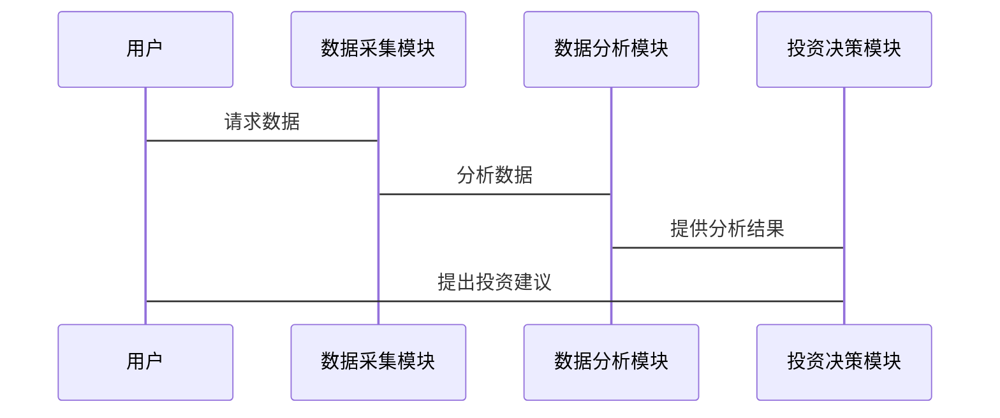

                 


# 格雷厄姆特价股票理论在平台经济产业中的应用

> **关键词**：格雷厄姆投资理论、平台经济、价值投资、股票估值、安全边际、财务分析

> **摘要**：本文深入探讨了格雷厄姆的价值投资理论在平台经济中的应用，分析了平台经济的基本概念、商业模式以及如何将格雷厄姆的选股标准应用于平台企业的估值与投资策略。通过具体的案例分析和系统设计，本文展示了如何利用格雷厄姆的安全边际概念来降低投资风险，并结合实际项目实战，为读者提供了清晰的指导和实用的建议。

---

## 第1章: 格雷厄姆投资理论概述

### 1.1 格雷厄姆投资理论的核心概念

#### 1.1.1 投资的定义与目标
投资是指将资金投入到能够产生收益的资产中，其目标是通过长期价值增长实现财富增值。格雷厄姆认为，投资的核心在于寻找具有内在价值的资产，并以低于其内在价值的价格买入。

#### 1.1.2 格雷厄姆的价值投资理念
格雷厄姆的价值投资理念强调以低于内在价值的价格买入股票，关注企业的基本面，而不是市场的短期波动。他认为市场先生（市场情绪）是投资的敌人，而企业基本面才是投资的真正依据。

#### 1.1.3 安全边际的概念与重要性
安全边际是指股票的市场价格与内在价值之间的差距。格雷厄姆认为，通过购买具有足够安全边际的股票，可以有效降低投资风险，同时确保收益的稳定性。

### 1.2 格雷厄姆选股标准

#### 1.2.1 低市盈率策略
格雷厄姆建议投资者选择市盈率低于市场平均水平的企业，以确保企业具有较高的盈利能力和较低的估值风险。

#### 1.2.2 低市净率策略
市净率是企业市值与净资产的比率，格雷厄姆认为低市净率的股票通常具有较高的投资价值，因为这些企业可能具有低估的资产价值。

#### 1.2.3 高股息率与股息支付率
格雷厄姆重视股息收益率，认为高股息率的企业具有稳定的盈利能力和较高的投资价值。

### 1.3 格雷厄姆投资哲学

#### 1.3.1 避免情绪化投资
格雷厄姆强调避免受市场情绪的影响，坚持理性投资，避免盲目跟风。

#### 1.3.2 长期持有与复利效应
格雷厄姆倡导长期持有优质资产，通过复利效应实现财富的长期增长。

#### 1.3.3 风险控制与投资组合管理
格雷厄姆认为，投资组合的分散化是降低风险的重要手段，同时需要定期审视和调整投资组合，以应对市场变化。

---

## 第2章: 平台经济的基本概念

### 2.1 平台经济的定义与特点

#### 2.1.1 平台经济的定义
平台经济是一种基于互联网技术的商业模式，通过平台连接供需双方，提供撮合、交易、支付等服务，形成双边市场。

#### 2.1.2 平台经济的核心特征
- **双边市场**：平台同时服务于两个或多个不同的用户群体。
- **网络效应**：用户数量的增加会提高平台的整体价值。
- **数据驱动**：平台通过收集和分析数据，优化服务和用户体验。

#### 2.1.3 平台经济的参与者与利益相关者
- **平台提供者**：提供平台服务的企业。
- **供需双方**：使用平台进行交易的买方和卖方。
- **第三方服务提供商**：为平台提供技术支持、数据分析等服务的企业。

### 2.2 平台经济的商业模式

#### 2.2.1 双边市场模式
平台通过连接供需双方，收取交易佣金、会员费或其他服务费。

#### 2.2.2 网络效应与平台扩张
平台通过吸引更多的用户，形成正向反馈循环，进一步增强平台的市场影响力。

#### 2.2.3 平台的收入来源与成本结构
- **收入来源**：交易佣金、广告收入、会员费等。
- **成本结构**：技术开发成本、运营成本、市场推广成本等。

---

## 第3章: 格雷厄姆理论与平台经济的结合

### 3.1 平台经济中的价值评估

#### 3.1.1 平台企业的财务指标分析
- **收入与利润**：关注平台的收入增长和盈利能力。
- **资产与负债**：分析平台的资产结构和财务健康状况。
- **现金流**：评估平台的现金流稳定性。

#### 3.1.2 平台企业的市场地位与竞争优势
- **市场占有率**：平台在市场中的份额。
- **竞争优势**：平台的核心竞争力，如技术优势、品牌影响力等。

#### 3.1.3 平台企业的成长性与可持续性
- **增长潜力**：平台未来的发展空间。
- **可持续性**：平台商业模式的长期可行性。

### 3.2 格雷厄姆选股标准在平台经济中的应用

#### 3.2.1 低市盈率平台企业的识别
选择市盈率低于行业平均水平的平台企业，关注企业的盈利能力和估值合理性。

#### 3.2.2 低市净率平台企业的识别
选择市净率低于行业平均水平的平台企业，关注企业的资产价值和财务健康状况。

#### 3.2.3 高股息率平台企业的识别
选择股息率较高的平台企业，关注企业的盈利能力和股息支付能力。

### 3.3 平台经济中的投资策略

#### 3.3.1 价值投资策略的制定
基于格雷厄姆的选股标准，制定适合平台经济的投资策略，重点关注具有安全边际的企业。

#### 3.3.2 投资组合的构建与优化
通过分散化投资降低风险，定期审视和优化投资组合。

#### 3.3.3 风险管理与投资纪律
严格遵守投资纪律，避免情绪化投资，及时止损。

---

## 第4章: 平台经济中的财务分析与估值模型

### 4.1 平台企业的财务报表分析

#### 4.1.1 收入与利润分析
分析平台企业的收入来源、增长率以及盈利能力。

#### 4.1.2 资产负债表分析
分析平台企业的资产结构、负债情况和财务健康状况。

#### 4.1.3 现金流量表分析
分析平台企业的现金流情况，评估企业的财务流动性。

### 4.2 平台企业的估值方法

#### 4.2.1 市盈率法
通过市盈率（P/E）评估平台企业的估值合理性。

#### 4.2.2 市净率法
通过市净率（P/B）评估平台企业的资产价值。

#### 4.2.3 现金流折现法
通过现金流折现模型（DCF）评估平台企业的内在价值。

### 4.3 格雷厄姆安全边际的应用

#### 4.3.1 安全边际的计算
计算平台企业的市场价格与内在价值之间的差距，确保投资的安全性。

#### 4.3.2 安全边际在平台经济中的应用
通过安全边际的概念，选择具有低估潜力的平台企业进行投资。

#### 4.3.3 安全边际与投资风险控制
利用安全边际降低投资风险，确保投资收益的稳定性。

---

## 第5章: 平台经济中的投资案例分析

### 5.1 典型平台企业的分析与解读

#### 5.1.1 案例一：滴滴出行
分析滴滴出行的商业模式、财务状况以及格雷厄姆理论的应用。

#### 5.1.2 案例二：美团点评
分析美团点评的市场地位、竞争优势以及投资价值。

#### 5.1.3 案例三：亚马逊
分析亚马逊的长期成长性及其与格雷厄姆投资理念的契合点。

### 5.2 投资策略的制定与实施

#### 5.2.1 投资策略的制定
基于平台企业的分析，制定适合的格雷厄姆投资策略。

#### 5.2.2 投资策略的实施
通过实际案例分析，展示格雷厄姆理论在平台经济中的具体应用。

---

## 第6章: 平台经济中的系统分析与架构设计

### 6.1 问题场景介绍

#### 6.1.1 问题背景
平台经济的复杂性要求我们采用系统化的分析方法，确保投资决策的科学性和准确性。

#### 6.1.2 问题描述
本文将从系统架构的角度，分析平台经济的核心要素，设计适合的投资系统。

### 6.2 系统功能设计

#### 6.2.1 领域模型
使用Mermaid类图展示平台经济的领域模型，包括平台、用户、服务等核心要素。

```mermaid
classDiagram
    class 平台 {
        用户
        服务
        交易
    }
    平台 <-- 关联> 用户
    平台 <-- 关联> 服务
    平台 <-- 关联> 交易
```

#### 6.2.2 系统架构设计
使用Mermaid架构图展示平台经济的投资系统架构。


### 6.3 系统接口设计

#### 6.3.1 数据接口
定义平台企业数据的接口规范，确保数据的准确性和完整性。

#### 6.3.2 用户接口
设计用户友好的界面，方便投资者进行数据分析和投资决策。

### 6.4 系统交互设计

#### 6.4.1 交互流程
使用Mermaid序列图展示系统的交互流程。



---

## 第7章: 平台经济中的项目实战

### 7.1 环境安装与配置

#### 7.1.1 安装Python环境
使用Anaconda或PyCharm等工具安装Python环境。

#### 7.1.2 安装必要的库
安装pandas、numpy、scipy等数据分析库。

### 7.2 系统核心实现

#### 7.2.1 数据采集模块
编写代码从公开数据源（如Yahoo Finance）获取平台企业的财务数据。

```python
import pandas as pd

# 示例代码：从Yahoo Finance获取数据
def get_stock_data(ticker):
    # 数据获取逻辑
    pass

# 示例代码：计算市盈率
def calculate_pe(ticker):
    price = get_stock_price(ticker)
    earnings_per_share = get_earnings_per_share(ticker)
    return price / earnings_per_share
```

#### 7.2.2 数据分析模块
编写代码分析平台企业的财务指标，计算安全边际。

```python
import pandas as pd

def calculate_margin_of_safety(ticker):
    intrinsic_value = calculate_intrinsic_value(ticker)
    market_price = get_market_price(ticker)
    return intrinsic_value - market_price
```

#### 7.2.3 投资决策模块
基于格雷厄姆的选股标准，制定投资策略。

```python
def investment_strategy(ticker):
    pe_ratio = calculate_pe(ticker)
    pb_ratio = calculate_pb(ticker)
    if pe_ratio < 15 and pb_ratio < 2:
        return "买入"
    else:
        return "观望"
```

### 7.3 代码实现与解读

#### 7.3.1 代码实现
编写完整的代码实现，展示如何利用格雷厄姆理论进行平台企业的估值与投资决策。

#### 7.3.2 代码解读
对代码进行详细解读，说明每部分的功能和实现逻辑。

### 7.4 案例分析与总结

#### 7.4.1 案例分析
以具体平台企业为例，展示代码的应用和分析结果。

#### 7.4.2 总结
总结项目实战的经验，提出改进建议和未来研究方向。

---

## 第8章: 平台经济中的最佳实践与小结

### 8.1 最佳实践 tips

#### 8.1.1 风险管理
严格控制投资风险，避免过度集中投资。

#### 8.1.2 长期投资
坚持长期投资，避免短期波动的影响。

#### 8.1.3 持续学习
不断学习和更新投资知识，适应市场变化。

### 8.2 小结

通过本文的分析与实践，我们可以看到，格雷厄姆的价值投资理论在平台经济中的应用具有很大的潜力。通过系统化的分析和科学的投资策略，投资者可以在平台经济中实现稳健的投资收益。

### 8.3 注意事项

#### 8.3.1 投资风险
平台经济具有较高的波动性和不确定性，投资者需谨慎评估风险。

#### 8.3.2 市场变化
市场环境的变化可能会影响投资策略的有效性，需定期审视和调整。

#### 8.3.3 数据质量
数据的准确性和完整性对投资决策至关重要，需确保数据来源的可靠性。

### 8.4 拓展阅读

推荐一些与格雷厄姆投资理论和平台经济相关的书籍和资源，供读者进一步学习和研究。

---

## 作者信息

作者：AI天才研究院/AI Genius Institute & 禅与计算机程序设计艺术 /Zen And The Art of Computer Programming

---

通过本文的系统分析和详细讲解，读者可以深入了解格雷厄姆的价值投资理论在平台经济中的应用，并通过实际案例和项目实战掌握具体的实现方法。希望本文能为投资者提供有价值的参考和启发。

