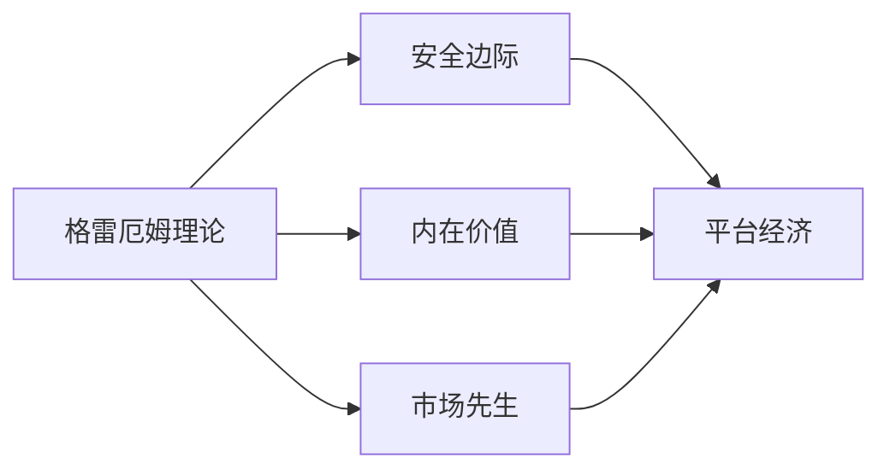
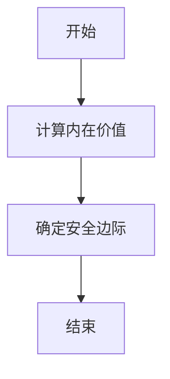
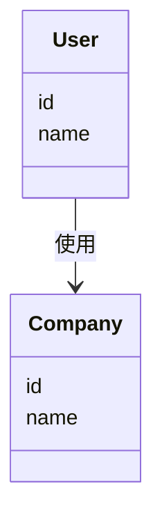
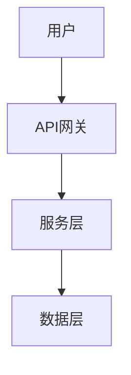
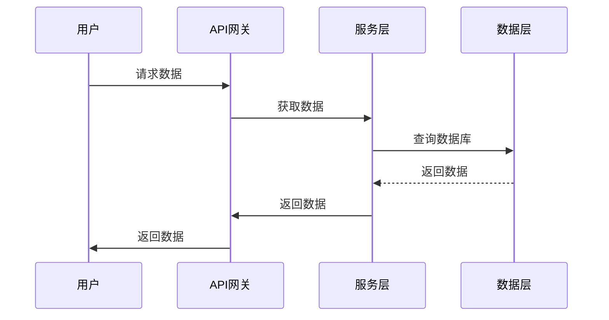

                 


# 格雷厄姆特价股票理论在平台经济时代的新思考

> 关键词：格雷厄姆特价股票理论，平台经济，价值投资，数学模型，算法设计

> 摘要：本文深入探讨格雷厄姆特价股票理论在平台经济时代的新应用，结合互联网平台的特点，分析其投资策略的演变。通过数学模型和算法设计，提出适用于平台经济的股票估值方法，结合实际案例，展示如何在数字经济时代优化投资决策。

---

## 第一部分：背景介绍

### 第1章：格雷厄姆特价股票理论概述

#### 1.1 格雷厄姆投资理论的起源与发展

- **问题背景**：20世纪30年代，本杰明·格雷厄姆提出了价值投资理论，强调寻找市场低估的股票。这一理论在传统金融中取得了巨大成功。
- **问题描述**：随着平台经济的兴起，传统股票估值方法面临新挑战，需要适应互联网平台的特殊商业模式。
- **问题解决**：引入网络效应、数据资产等新概念，扩展格雷厄姆理论的应用范围。
- **边界与外延**：适用于互联网平台企业，不包括传统实体企业。

#### 1.2 平台经济的定义与特点

- **网络效应**：用户数量增加，平台价值呈指数级增长。
- **双边市场**：同时服务买方和卖方，产生交叉网络效应。
- **数据资产**：数据成为核心竞争力，影响企业估值。

#### 核心要素对比表

| 要素       | 传统企业         | 平台企业         |
|------------|------------------|------------------|
| 估值指标   | P/E, P/B         | 用户数, GMV      |
| 收入模式   | 销售产品         | 平台佣金, 广告费 |

#### ER实体关系图

```mermaid
entity User
entity Company
entity Transaction
User -[N:1]-> Transaction
Company -[N:1]-> Transaction
```

---

### 第2章：格雷厄姆特价股票理论的核心概念

#### 2.1 格雷厄姆理论的核心要素

- **安全边际**：买入价低于内在价值，确保投资安全。
- **内在价值**：企业未来现金流的现值。
- **市场先生**：市场情绪波动，提供投资机会。

#### 2.2 平台经济中的新概念引入

- **网络效应**：用户增长带来的价值提升。
- **双边市场**：连接多方用户，产生协同效应。
- **数据资产**：数据驱动的商业模式。

#### 核心概念结构图



---

## 第二部分：格雷厄姆理论的算法与数学模型

### 第3章：格雷厄姆理论的数学模型

#### 3.1 内在价值的计算公式

$$ V = \frac{D}{k} $$

其中，\( D \) 是股息，\( k \) 是折现率。

#### 3.2 安全边际的计算方法

$$ MS = V_{\text{实际}} - V_{\text{市场}} $$

#### 算法流程图



---

## 第三部分：平台经济中的系统分析与架构设计

### 第4章：平台经济的系统架构设计

#### 4.1 问题场景介绍

分析一个互联网平台的股票投资策略，涉及用户增长、收入模式等因素。

#### 4.2 系统功能设计



#### 4.3 系统架构图



#### 4.4 系统交互序列图



---

## 第四部分：项目实战与案例分析

### 第5章：项目实战

#### 5.1 环境安装

安装Python和相关库：

```bash
pip install pandas numpy matplotlib
```

#### 5.2 核心代码实现

```python
import pandas as pd
import numpy as np

def calculate_intrinsic_value(dividends, discount_rate):
    return dividends / discount_rate

def calculate_margin_of_safety(intrinsic_value, market_price):
    return intrinsic_value - market_price

# 示例数据
dividends = 1.5
discount_rate = 0.08
market_price = 50

iv = calculate_intrinsic_value(dividends, discount_rate)
mos = calculate_margin_of_safety(iv, market_price)

print(f"内在价值: {iv:.2f}")
print(f"安全边际: {mos:.2f}")
```

#### 5.3 代码解读与分析

- `calculate_intrinsic_value`：计算内在价值。
- `calculate_margin_of_safety`：计算安全边际。
- 示例中，市场价为50，内在价值为18.75，安全边际为-31.25，表明被高估。

#### 5.4 实际案例分析

分析某互联网平台，考虑用户增长和收入模式，调整内在价值计算公式：

$$ V_{\text{new}} = \frac{GMV \times margin}{k} $$

---

## 第五部分：总结与展望

### 第6章：总结与小结

- **本文总结**：格雷厄姆理论在平台经济中的应用需要考虑新因素，通过数学模型和算法设计，优化投资策略。
- **注意事项**：数据质量、模型适用性、市场波动。
- **未来研究**：动态网络效应、数据资产估值。

### 第7章：最佳实践与拓展阅读

- **投资建议**：长期持有优质平台企业，关注用户增长和数据资产。
- **推荐书籍**：《平台经济学》、《网络经济》。

---

## 作者：AI天才研究院/AI Genius Institute & 禅与计算机程序设计艺术 /Zen And The Art of Computer Programming

---

这篇文章系统地探讨了格雷厄姆特价股票理论在平台经济中的应用，通过数学模型、算法设计和实际案例分析，为投资者提供了新的视角。希望对读者有所帮助！

