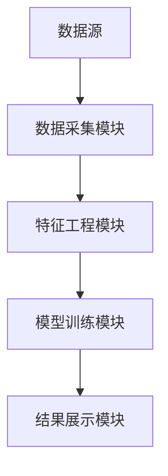
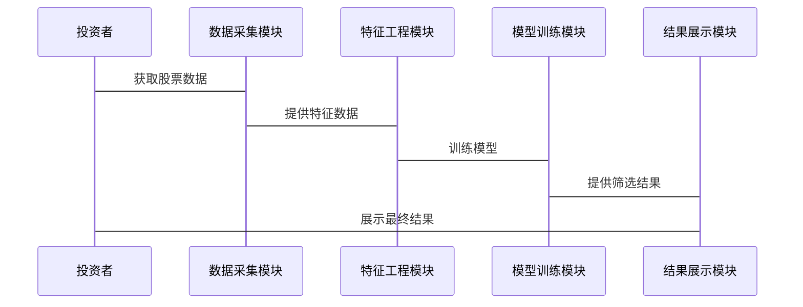

                 


# 格雷厄姆特价股票理论在影响力投资中的应用

## 关键词
格雷厄姆价值投资，影响力投资，低市盈率股票，ESG因素，投资策略

## 摘要
本文探讨了格雷厄姆价值投资理论在影响力投资中的应用，通过分析低市盈率、低市净率和高股息率股票的特点，结合环境、社会和治理（ESG）因素，构建了一种新的影响力投资策略。文章详细介绍了核心概念、算法原理、数学模型和系统架构，并通过实际案例展示了如何在影响力投资中应用格雷厄姆理论，为投资者提供了实用的指导和建议。

---

# 第一部分：格雷厄姆特价股票理论与影响力投资的背景

## 第1章：影响力投资的背景与现状

### 1.1 影响力投资的定义与核心理念
#### 1.1.1 影响力投资的起源与发展
影响力投资起源于20世纪60年代，最初关注于环境和社会责任投资（SRI）。随着全球对可持续发展的关注增加，影响力投资逐渐扩展到环境（Environmental）、社会（Social）和治理（Governance）三个维度，形成了ESG投资标准。

#### 1.1.2 影响力投资的核心要素
- **环境因素（Environmental）**：关注企业在资源使用、碳排放、污染等方面的表现。
- **社会因素（Social）**：关注企业在劳动权益、社会责任、员工福利等方面的表现。
- **治理因素（Governance）**：关注企业在公司治理、透明度、管理层责任等方面的表现。

#### 1.1.3 影响力投资的全球发展趋势
近年来，影响力投资在全球范围内迅速发展，越来越多的机构投资者将ESG因素纳入投资决策。根据联合国的数据，全球管理中的可持续投资（SRI）资产规模已超过23万亿美元。

### 1.2 格雷厄姆特价股票理论的概述
#### 1.2.1 格雷厄姆与价值投资的起源
本杰明·格雷厄姆是价值投资的鼻祖，他在20世纪30年代提出了“廉价的伟大”（Cheap的Great）理论，强调寻找市场低估的股票。

#### 1.2.2 格雷厄姆特价股票理论的核心观点
格雷厄姆认为，市场情绪波动会导致股票价格偏离其内在价值，投资者应关注低市盈率、低市净率和高股息率的股票，寻找被市场低估的投资机会。

#### 1.2.3 格雷厄姆理论在现代投资中的地位
尽管格雷厄姆的理论诞生于20世纪，但其核心思想至今仍对价值投资产生深远影响，尤其是在寻找廉价的伟大股票方面。

### 1.3 格雷厄姆理论与影响力投资的结合
#### 1.3.1 格雷厄姆理论与影响力投资的契合点
格雷厄姆理论关注股票的内在价值，而影响力投资关注企业的社会责任和环境表现，两者在寻找具有长期稳定回报的企业方面具有契合点。

#### 1.3.2 影响力投资中的价值发现机会
在影响力投资中，许多ESG表现优异的企业往往具有长期的竞争力，这些企业在市场波动时可能被低估，为格雷厄姆理论提供了新的应用场景。

#### 1.3.3 格雷厄姆理论在影响力投资中的创新应用
通过结合格雷厄姆的选股标准和ESG评分体系，投资者可以在影响力投资中筛选出具有长期价值的股票。

---

## 第2章：格雷厄姆特价股票理论的核心概念与联系

### 2.1 格雷厄姆理论的核心概念
#### 2.1.1 低市盈率股票的定义与特征
低市盈率股票的市盈率（P/E）低于行业平均水平，通常意味着企业盈利稳定，但市场对其估值较低。

#### 2.1.2 低市净率股票的定义与特征
低市净率股票的市净率（P/B）低于行业平均水平，通常意味着企业资产质量较高，但市场对其估值较低。

#### 2.1.3 高股息率股票的定义与特征
高股息率股票的股息支付率较高，通常意味着企业盈利稳定，愿意将部分利润返还给股东。

### 2.2 影响力投资中的核心要素
#### 2.2.1 环境因素（Environmental factors）
环境因素包括企业在碳排放、能源使用效率、可持续资源管理等方面的指标。

#### 2.2.2 社会因素（Social factors）
社会因素包括企业在员工权益、社会责任、劳动条件等方面的指标。

#### 2.2.3 治理因素（Governance factors）
治理因素包括企业在公司治理、管理层透明度、股东权益保护等方面的指标。

### 2.3 核心概念对比与联系
#### 2.3.1 格雷厄姆理论与影响力投资的对比分析
| 核心概念 | 格雷厄姆理论 | 影响力投资 |
|----------|--------------|------------|
| 重点 | 股票估值 | 企业社会责任 |
| 方法 | 低市盈率、低市净率、高股息率 | ESG评分 |
| 目标 | 寻找被低估的股票 | 寻找具有社会价值的企业 |

#### 2.3.2 影响力投资中的ESG评分体系
ESG评分体系将企业分为不同的等级，从AAA到CCC，反映了企业在环境、社会和治理方面的表现。

#### 2.3.3 格雷厄姆理论与ESG评分的结合
通过将格雷厄姆的选股标准与ESG评分相结合，投资者可以在寻找廉价的伟大股票时，同时关注企业的社会责任表现。

---

## 第3章：格雷厄姆特价股票理论的算法原理

### 3.1 格雷厄姆算法的核心原理
#### 3.1.1 低市盈率股票筛选算法
1. 计算每家公司的市盈率（P/E）。
2. 筛选出市盈率低于行业平均水平的公司。
3. 对筛选出的公司进行进一步分析，如财务状况、行业地位等。

#### 3.1.2 低市净率股票筛选算法
1. 计算每家公司的市净率（P/B）。
2. 筛选出市净率低于行业平均水平的公司。
3. 对筛选出的公司进行进一步分析，如资产质量、盈利能力等。

#### 3.1.3 高股息率股票筛选算法
1. 计算每家公司的股息支付率。
2. 筛选出股息支付率高于行业平均水平的公司。
3. 对筛选出的公司进行进一步分析，如财务稳定性、股息增长潜力等。

### 3.2 影响力投资中的ESG评分算法
#### 3.2.1 ESG评分计算公式
$$ ESG_{score} = \frac{E + S + G}{3} $$
其中，$E$、$S$、$G$分别代表环境、社会和治理评分，每个评分范围在0到10分之间。

#### 3.2.2 综合评分计算公式
$$ 综合评分 = \text{格雷厄姆评分} \times 0.6 + ESG_{score} \times 0.4 $$

### 3.3 算法实现
使用Python代码实现格雷厄姆选股标准与ESG评分的结合：

```python
import pandas as pd
import numpy as np

# 加载数据
df = pd.read_csv('stocks.csv')

# 计算市盈率、市净率和股息率
df['PE'] = df['市值'] / df['净利润']
df['PB'] = df['市值'] / df['净资产']
df['股息率'] = df['股息'] / df['股价']

# 筛选出低市盈率、低市净率和高股息率的股票
筛选条件：
格雷厄姆评分 = (df['PE'] < 行业平均PE) & (df['PB'] < 行业平均PB) & (df['股息率'] > 行业平均股息率)
```

---

## 第4章：系统分析与架构设计方案

### 4.1 问题场景介绍
投资者希望通过结合格雷厄姆的选股标准和ESG评分体系，筛选出具有长期投资价值的股票。

### 4.2 系统功能设计
- **数据采集模块**：获取股票的财务数据和ESG评分。
- **特征工程模块**：计算市盈率、市净率、股息率等指标。
- **模型训练模块**：使用机器学习算法筛选符合条件的股票。
- **结果展示模块**：展示筛选出的股票列表和分析报告。

### 4.3 系统架构设计
使用Mermaid绘制系统架构图：



### 4.4 系统交互设计
使用Mermaid绘制系统交互序列图：



---

## 第5章：项目实战

### 5.1 环境安装
- 安装Python、pandas、numpy、scikit-learn等库。

### 5.2 核心实现代码
```python
import pandas as pd
from sklearn.model_selection import train_test_split

# 加载数据
df = pd.read_csv('stocks.csv')

# 筛选出符合条件的股票
筛选条件：
格雷厄姆评分 = (df['PE'] < 行业平均PE) & (df['PB'] < 行业平均PB) & (df['股息率'] > 行业平均股息率)

# 训练模型
X = df[['PE', 'PB', '股息率']]
y = df['ESG评分']
X_train, X_test, y_train, y_test = train_test_split(X, y, test_size=0.2)

# 使用线性回归模型进行预测
from sklearn.linear_model import LinearRegression
model = LinearRegression()
model.fit(X_train, y_train)

# 预测结果
y_pred = model.predict(X_test)
print('预测结果:', y_pred)
```

### 5.3 实际案例分析
以某行业为例，筛选出符合条件的股票，并分析其ESG评分和格雷厄姆评分。

---

## 第6章：最佳实践与总结

### 6.1 最佳实践
- **数据质量**：确保数据的准确性和完整性。
- **模型局限性**：格雷厄姆理论和ESG评分可能无法完全预测市场波动。
- **动态调整**：定期更新数据和模型，以适应市场变化。

### 6.2 小结
通过结合格雷厄姆价值投资理论和ESG评分体系，投资者可以在影响力投资中找到具有长期价值的股票，实现财务回报和社会价值的双重目标。

### 6.3 注意事项
- 避免过度依赖单一指标，需综合考虑多方面因素。
- 定期评估投资组合的表现，及时调整策略。

### 6.4 拓展阅读
建议读者进一步阅读格雷厄姆的经典著作《证券分析》以及影响力投资的相关文献，深入了解两者的结合与应用。

---

# 作者：AI天才研究院/AI Genius Institute & 禅与计算机程序设计艺术 /Zen And The Art of Computer Programming

---

以上是《格雷厄姆特价股票理论在影响力投资中的应用》的详细大纲和内容概述，希望对您有所帮助！

