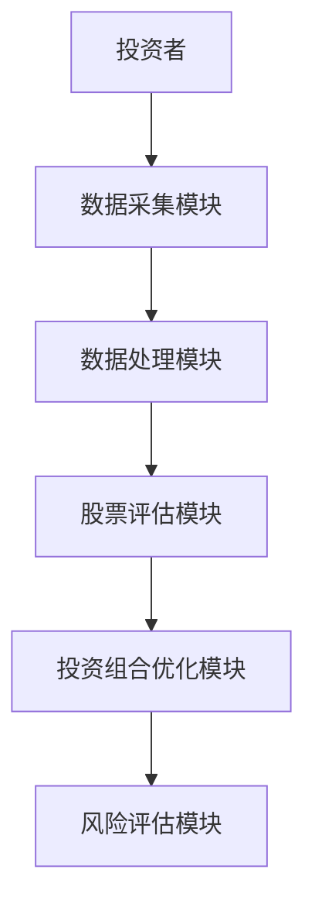

                 


# 《格雷厄姆特价股票理论在循环经济产业中的应用》

> 关键词：格雷厄姆投资理论，特价股票，循环经济，投资策略，价值投资

> 摘要：本文探讨了格雷厄姆的特价股票理论在循环经济产业中的应用，分析了循环经济产业的特点及其投资价值，提出了结合价值投资理念的投资策略，为投资者提供了新的视角和方法。

---

## 第1章: 格雷厄姆特价股票理论概述

### 1.1 格雷厄姆投资理论的核心理念

#### 1.1.1 价值投资的定义与核心思想
价值投资是一种以低于内在价值的价格购买优质股票的投资策略。格雷厄姆在其著作《证券分析》中提出，投资者应关注企业的内在价值，而非市场的短期波动。他强调，股票不仅是价格标签，更是企业的所有权凭证。

#### 1.1.2 特价股票的定义与特征
特价股票指的是市场价格低于其内在价值的股票。格雷厄姆认为，这类股票通常具有较高的安全边际，能够为投资者提供较高的风险调整后收益。

#### 1.1.3 格雷厄姆投资策略的历史发展
格雷厄姆的投资策略起源于20世纪30年代的大萧条时期。他通过分析市场恐慌和非理性行为，发现许多优质企业因市场抛售而被低估。这种策略在后来的价值投资中被广泛应用，并成为现代投资理论的重要组成部分。

---

### 1.2 格雷厄姆选股指标与方法

#### 1.2.1 市盈率（P/E）与市净率（P/B）的计算与应用
市盈率（P/E）= 股价 / 每股净利润  
市净率（P/B）= 股价 / 每股净资产  

格雷厄姆建议投资者选择市盈率和市净率低于行业平均水平的企业，尤其是那些具有稳定盈利能力和良好财务状况的企业。

#### 1.2.2 股票内在价值的评估方法
格雷厄姆提出了内在价值的评估公式：
$$
\text{内在价值} = \frac{\text{预期收益}}{\text{折现率}}
$$  
他强调，内在价值是股票的长期合理价格，而非短期市场波动的结果。

#### 1.2.3 股票安全边际的概念与计算
安全边际 = 股票市场价格 × 股票内在价值  
格雷厄姆认为，安全边际越大，投资风险越小。

---

### 1.3 格雷厄姆投资策略的优缺点分析

#### 1.3.1 格雷厄姆策略的优势
- **稳定性**：注重长期价值，减少短期市场波动的影响。
- **风险控制**：通过安全边际降低投资风险。
- **长期收益**：通过购买低估股票实现长期资本增值。

#### 1.3.2 格雷厄姆策略的局限性
- **周期性限制**：在市场繁荣时期，低估股票可能较难找到。
- **流动性风险**：某些低估股票可能流动性较差，难以快速变现。

#### 1.3.3 现代投资环境对格雷厄姆策略的影响
随着市场的成熟和信息的透明化，格雷厄姆策略的有效性可能受到挑战。然而，其核心思想依然适用于价值投资。

---

## 第2章: 循环经济产业概述

### 2.1 循环经济的基本概念与特征

#### 2.1.1 循环经济的定义
循环经济是一种以资源高效利用和循环利用为核心，以减少资源消耗和环境污染为目标的经济模式。

#### 2.1.2 循环经济的核心特征
- **资源节约**：减少对自然资源的依赖。
- **循环利用**：最大化资源的使用效率。
- **环境污染控制**：减少生产过程中的废弃物和污染物。

#### 2.1.3 循环经济与传统经济的区别
| 特性         | 循环经济                 | 传统经济                 |
|--------------|--------------------------|--------------------------|
| 资源利用     | 高效循环                 | 低效一次性               |
| 环境影响     | 低污染                   | 高污染                   |
| 经济模式     | 资源节约与循环利用       | 资源消耗与废弃物产生     |

---

### 2.2 循环经济产业的主要模式

#### 2.2.1 产品生命周期管理
循环经济强调产品的全生命周期管理，从原材料采购、生产、使用到回收，每个环节都追求资源的高效利用。

#### 2.2.2 资源循环利用模式
通过技术创新，将废弃物转化为新的资源，形成闭环的资源利用模式。

#### 2.2.3 循环经济产业链的构建
从上游资源供应到下游产品回收，构建完整的循环经济产业链。

---

### 2.3 循环经济产业的投资价值分析

#### 2.3.1 循环经济产业的市场潜力
随着环保政策的加强和资源短缺的加剧，循环经济产业的市场潜力巨大。

#### 2.3.2 循环经济企业的核心竞争力
- **技术创新**：掌握资源高效利用的核心技术。
- **成本优势**：通过循环利用降低生产成本。
- **政策支持**：政府对循环经济的政策支持为企业发展提供了保障。

#### 2.3.3 循环经济产业的风险
- **技术风险**：技术创新的不确定性和失败风险。
- **市场风险**：市场需求的不确定性和价格波动。

---

## 第3章: 格雷厄姆特价股票理论在循环经济产业中的应用

### 3.1 核心概念与联系

#### 3.1.1 核心概念对比
| 特性         | 格雷厄姆特价股票理论      | 循环经济产业             |
|--------------|--------------------------|--------------------------|
| 核心目标     | 寻找被低估的股票           | 实现资源的循环利用        |
| 投资策略     | 价值投资，追求安全边际    | 投资循环经济企业，推动可持续发展 |

#### 3.1.2 实体关系图（ER图）
```mermaid
erd
    班级 {
        班级ID
        班级名称
    }
    学生 {
        学生ID
        姓名
        班级ID
    }
```

---

### 3.2 算法与数学模型

#### 3.2.1 选股指标的数学模型
$$
\text{安全边际} = \text{股价} \times \text{内在价值}
$$  
其中，内在价值的计算公式为：
$$
\text{内在价值} = \frac{\text{预期收益}}{\text{折现率}}
$$  

#### 3.2.2 循环经济企业的评估指标
$$
\text{资源利用率} = \frac{\text{资源循环利用量}}{\text{总资源消耗量}}
$$  

---

### 3.3 系统分析与架构设计

#### 3.3.1 投资决策支持系统
系统功能模块：
- 数据采集与处理
- 股票评估与分析
- 投资组合优化
- 风险评估与预警

系统架构图：


---

### 3.4 项目实战

#### 3.4.1 环境配置
```bash
pip install numpy pandas matplotlib
```

#### 3.4.2 核心代码实现
```python
import numpy as np
import pandas as pd

# 假设df为股票数据，包含'股价'和'内在价值'两列
df['安全边际'] = df['股价'] * df['内在价值']

# 找出安全边际小于内在价值的股票
selected_stocks = df[df['安全边际'] < df['内在价值']]
```

#### 3.4.3 案例分析
以某循环经济企业为例，计算其安全边际：
- 股价：10元
- 内在价值：15元
- 安全边际：10 × 15 = 150元

由于安全边际远大于股价，该股票具有较高的投资价值。

---

## 第4章: 最佳实践与总结

### 4.1 最佳实践 tips
- **长期视角**：关注企业的长期价值，而非短期波动。
- **风险管理**：合理配置资产，分散投资风险。
- **持续学习**：关注行业动态和技术进步，及时调整投资策略。

### 4.2 小结
格雷厄姆的特价股票理论为循环经济产业的投资提供了新的视角和方法。通过价值投资理念，投资者可以在支持可持续发展的同时实现资本增值。

### 4.3 注意事项
- 避免过度依赖单一指标，结合多维度分析。
- 考虑宏观经济环境和政策变化的影响。

### 4.4 拓展阅读
- 格雷厄姆《证券分析》
- 环境保护组织报告

---

## 作者：AI天才研究院 & 禅与计算机程序设计艺术

---

通过以上内容，我们系统地分析了格雷厄姆特价股票理论在循环经济产业中的应用，为投资者提供了理论支持和实践指导。希望本文能够为循环经济产业的投资决策提供新的思路。

