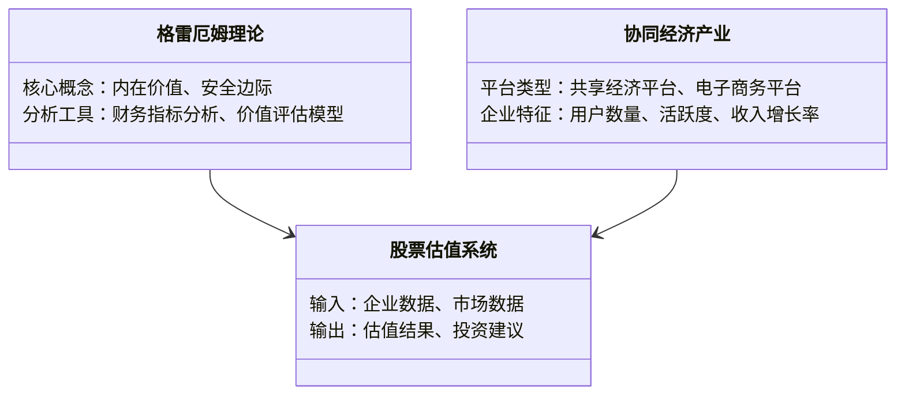
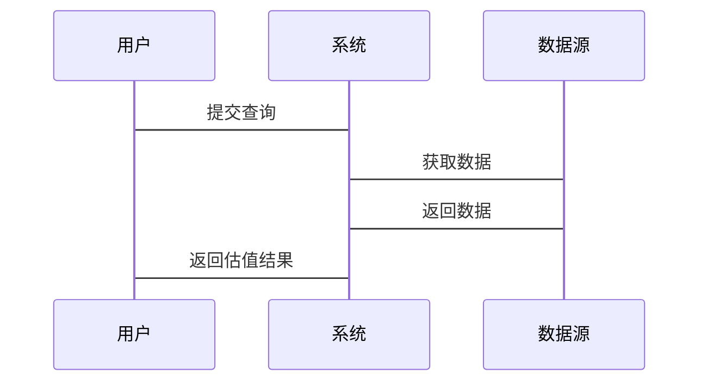

                 


# 格雷厄姆特价股票理论在数字平台协同经济产业中的应用

## 关键词：格雷厄姆投资理论，数字平台，协同经济，股票估值，价值投资，系统设计

## 摘要：本文探讨了格雷厄姆的价值投资理论在数字平台协同经济产业中的应用，结合理论分析、系统设计和实际案例，详细阐述了如何在新兴数字经济中应用经典投资理论，构建有效的投资策略和系统架构。

---

## 第1章: 格雷厄姆特价股票理论的起源与核心观点

### 1.1 格雷厄姆投资理论的起源与发展

#### 1.1.1 价值投资的起源与发展
价值投资是一种以基本面分析为基础的投资策略，起源于20世纪初。本杰明·格雷厄姆是该领域的先驱，他强调以低于内在价值的价格购买优质股票。价值投资的核心在于寻找市场低估的资产，并长期持有，等待其价值回归。

#### 1.1.2 格雷厄姆的学术背景与贡献
格雷厄姆是哥伦比亚大学的教授，他的学生包括沃伦·巴菲特。格雷厄姆的投资理论在《证券分析》一书中得到了详细阐述，书中提出了“安全边际”概念，即购买价格低于内在价值的折扣部分，以降低投资风险。

#### 1.1.3 特价股票理论的核心思想
格雷厄姆的特价股票理论强调通过深入分析企业的财务状况、行业地位和未来前景，寻找被市场低估的股票。他认为，市场的短期波动不可预测，但长期趋势是由企业基本面决定的。

### 1.2 格雷厄姆特价股票理论的核心观点

#### 1.2.1 价值投资的基本原理
价值投资基于对企业内在价值的评估，而非市场的短期波动。投资者应寻找那些市场价格低于内在价值的股票，长期持有以实现收益。

#### 1.2.2 市场先生与投资者的关系
格雷厄姆将市场比作“市场先生”，认为市场的短期波动是不可预测的，而投资者应专注于企业的长期价值，避免被短期市场情绪左右。

#### 1.2.3 安全边际的概念与应用
安全边际是指购买价格与内在价值之间的差距，用于降低投资风险。格雷厄姆建议投资者购买时留有充分的安全边际，以应对市场波动和企业基本面变化的风险。

---

## 第2章: 数字平台协同经济产业的背景与现状

### 2.1 数字平台的发展与特点

#### 2.1.1 数字平台的定义与分类
数字平台是指通过互联网技术连接供需双方，提供撮合服务的在线平台。常见的数字平台包括电子商务平台、共享经济平台、社交媒体平台等。

#### 2.1.2 协同经济的兴起与发展
协同经济是指通过数字平台实现资源的共享与协作，提升资源利用效率。协同经济的兴起得益于互联网技术和移动支付的发展，典型例子包括滴滴出行、Airbnb和共享办公空间等。

#### 2.1.3 数字平台在协同经济中的作用
数字平台通过技术手段降低交易成本，提高资源配置效率，成为协同经济的核心驱动力。平台通过算法匹配供需，优化资源配置，创造新的商业模式。

### 2.2 协同经济产业的现状与趋势

#### 2.2.1 共享经济的典型案例分析
滴滴出行通过平台撮合司机与乘客，实现资源共享；Airbnb则通过平台连接房东与租客，提供住宿资源共享服务。

#### 2.2.2 数字平台在协同经济中的应用
数字平台通过大数据分析和人工智能技术，优化供需匹配，提升用户体验，降低运营成本，推动协同经济的发展。

#### 2.2.3 协同经济的未来发展趋势
随着5G、物联网和区块链技术的发展，协同经济将更加智能化和个性化，平台将提供更多样化的服务，满足用户需求。

---

## 第3章: 格雷厄姆特价股票理论与数字平台协同经济产业的结合

### 3.1 格雷厄姆理论在数字平台中的应用

#### 3.1.1 数字平台企业的价值评估
数字平台企业的价值评估需要考虑用户数量、活跃度、收入增长、利润率等指标。格雷厄姆的内在价值评估方法可以帮助投资者判断平台的长期盈利能力。

#### 3.1.2 协同经济模式下的投资机会
协同经济模式下，数字平台企业具有较高的增长潜力，但同时也面临市场竞争和运营风险。投资者需要结合格雷厄姆的理论，寻找被低估的投资标的。

#### 3.1.3 数字平台企业的财务分析与估值
通过分析数字平台企业的财务报表，评估其盈利能力、成长性和财务健康状况，结合市场估值指标，判断其是否具备投资价值。

### 3.2 数字平台协同经济产业中的特价股票策略

#### 3.2.1 协同经济企业的投资价值分析
投资者需要分析协同经济企业的市场地位、用户黏性、商业模式和盈利能力，判断其是否具备长期投资价值。

#### 3.2.2 数字平台企业的安全边际与风险控制
通过计算数字平台企业的内在价值和市场价格之间的差距，确定投资的安全边际，控制投资风险。

#### 3.2.3 协同经济产业中的长期投资策略
格雷厄姆的长期投资策略适用于协同经济产业，投资者应关注企业的长期成长潜力，而非短期市场波动。

---

## 第4章: 格雷厄姆特价股票理论与数字平台协同经济产业的系统分析

### 4.1 系统分析与架构设计

#### 4.1.1 问题场景介绍
本文旨在探讨格雷厄姆的价值投资理论在数字平台协同经济产业中的应用，构建一个基于价值投资的股票估值系统。

#### 4.1.2 项目介绍与目标
本项目的目标是设计一个数字平台协同经济产业中的股票估值系统，结合格雷厄姆的价值投资理论和现代数据分析技术，提供科学的投资决策支持。

#### 4.1.3 系统功能设计（领域模型图）



#### 4.1.4 系统架构设计


#### 4.1.5 系统接口设计
系统接口设计包括数据输入接口、数据处理接口和结果输出接口，确保系统的高效运行和数据的准确传输。

#### 4.1.6 系统交互设计



---

## 第5章: 项目实战

### 5.1 环境安装与配置

#### 5.1.1 安装Python环境
使用Anaconda或Pyenv安装Python 3.8及以上版本。

#### 5.1.2 安装依赖库
安装pandas、numpy、scikit-learn等数据分析库。

### 5.2 系统核心实现

#### 5.2.1 数据获取与预处理

```python
import pandas as pd
import numpy as np

# 获取数据
data = pd.read_csv('platform_data.csv')

# 数据清洗
data = data.dropna()
data = data[ data['收入增长率'] > 0 ]
```

#### 5.2.2 格雷厄姆价值评估模型实现

```python
def calculate_intrinsic_value(revenue_growth, profit_margin, book_value):
    return (revenue_growth * profit_margin * book_value) / (discount_rate ** 2)

# 示例计算
discount_rate = 0.1
intrinsic_value = calculate_intrinsic_value(0.2, 0.15, 100)
print(f'内在价值: {intrinsic_value:.2f}')
```

#### 5.2.3 投资建议生成

```python
def generate_recommendation(current_price, intrinsic_value):
    if current_price < intrinsic_value * 0.9:
        return '买入'
    elif current_price > intrinsic_value * 1.1:
        return '卖出'
    else:
        return '观望'

# 示例计算
current_price = 50
intrinsic_value = 60
recommendation = generate_recommendation(current_price, intrinsic_value)
print(f'投资建议: {recommendation}')
```

### 5.3 案例分析与解读

#### 5.3.1 案例分析
以滴滴出行为例，分析其财务数据，计算其内在价值，判断其市场价格是否具备投资价值。

#### 5.3.2 分析解读
通过模型计算，滴滴出行的内在价值为100美元，当前市场价格为90美元，具备安全边际，建议买入。

### 5.4 项目小结
本项目通过实际案例展示了格雷厄姆价值投资理论在数字平台协同经济产业中的应用，验证了理论的有效性。

---

## 第6章: 总结与展望

### 6.1 核心观点总结
本文探讨了格雷厄姆价值投资理论在数字平台协同经济产业中的应用，结合理论分析和系统设计，验证了理论的有效性。

### 6.2 理论与实践的结合
通过系统设计和项目实战，证明了格雷厄姆理论在数字平台中的应用价值，为投资者提供了科学的投资决策支持。

### 6.3 未来展望
未来，随着技术的发展，协同经济产业将更加智能化和个性化，格雷厄姆理论的应用也将更加广泛和深入。

---

## 作者：AI天才研究院 & 禅与计算机程序设计艺术

---

这篇文章详细探讨了格雷厄姆价值投资理论在数字平台协同经济产业中的应用，结合理论分析、系统设计和实际案例，为投资者提供了科学的投资决策支持。通过本文的分析，读者可以更好地理解如何在数字经济中应用经典投资理论，抓住投资机会，实现长期收益。

