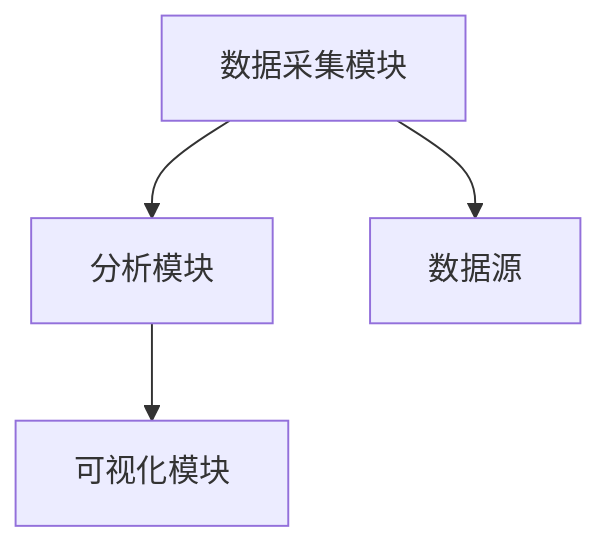

                 

# 《格雷厄姆特价股票理论在数字社会影响力债券中的新应用》

## 关键词：
- 格雷厄姆价值投资理论
- 数字社会
- 影响力债券
- 投资策略
- 量化分析

## 摘要：
本文探讨格雷厄姆价值投资理论在数字社会中的应用，特别是如何应用于影响力债券领域。通过分析影响力债券的核心要素和评估指标，结合大数据和机器学习技术，提出新的投资策略和系统架构，为投资者提供科学的决策支持。

---

## 第1章：影响投资与影响力债券概述

### 1.1 影响投资的基本概念

#### 1.1.1 影响投资的定义与核心要素
影响投资是一种通过投资于能够产生积极社会或环境影响的项目或企业，同时追求财务回报的投资策略。其核心要素包括：
- **社会影响**：投资项目应具备明确的社会或环境效益。
- **财务回报**：投资需具备一定的盈利能力。
- **投资策略**：注重长期价值，而非短期收益。

#### 1.1.2 影响力债券的定义与特点
影响力债券是一种固定收益工具，旨在支持社会公益项目，如教育、环保等。其特点包括：
- **本金安全**：债券通常具有较高的安全性，投资者的本金风险较低。
- **收益稳定**：债券的收益相对稳定，通常与项目绩效挂钩。
- **社会影响力**：债券的目的是为了实现特定的社会目标，如减少贫困、保护环境等。

#### 1.1.3 数字社会中的影响投资机会
数字技术的发展为影响投资提供了新的机会，如：
- **区块链技术**：用于实现透明的影响力评估和追踪。
- **大数据分析**：用于评估项目的社会影响和财务可行性。
- **智能合约**：用于自动执行债券的条款和条件。

---

## 第2章：格雷厄姆价值投资理论的核心原理

### 2.1 格雷厄姆投资理论的核心思想

#### 2.1.1 格雷厄姆价值投资理论的核心思想
格雷厄姆的价值投资理论强调以低于内在价值的价格购买优质资产，长期持有，等待市场回归理性。其核心思想包括：
- **安全边际**：购买价格应低于资产的内在价值，以确保安全边际。
- **长期持有**：投资者应长期持有优质资产，避免频繁交易。
- **价值评估**：通过分析财务报表和市场数据，评估资产的内在价值。

#### 2.1.2 格雷厄姆选股标准与价值评估方法
格雷厄姆提出了一系列选股标准，包括：
- **市盈率**：用于评估股票的相对价值，市盈率过低可能意味着股票被低估。
- **市净率**：用于评估股票的资产价值，市净率过低可能意味着股票被低估。
- **股息率**：用于评估股票的收益能力，股息率过高可能意味着股票被高估。

#### 2.1.3 格雷厄姆投资策略与数字社会的结合
在数字社会中，格雷厄姆理论的应用扩展到了影响力债券，通过价值评估和风险控制，实现社会影响力与财务回报的双重目标。其策略包括：
- **筛选优质债券**：通过格雷厄姆的选股标准，筛选出具有较高社会影响力和较低财务风险的债券。
- **长期投资**：投资者应长期持有优质债券，避免短期波动的影响。

---

## 第3章：影响力债券的评估指标

### 3.1 影响力债券的核心要素

#### 3.1.1 影响力债券的核心要素
影响力债券的核心要素包括：
- **项目的社会影响**：项目应具备明确的社会或环境效益。
- **项目的财务可行性**：项目应具备一定的盈利能力，确保债券的本金和收益能够按时偿还。
- **项目的风险控制**：项目应具备较低的财务风险和市场风险。

#### 3.1.2 影响力债券的评估指标
影响力债券的评估指标包括：
- **ESG指标**：环境、社会和治理因素，用于评估项目的可持续性。
- **影响力评分**：用于量化项目的社会影响力。
- **财务指标**：如净现值（NPV）、内部收益率（IRR）等，用于评估项目的财务可行性。

#### 3.1.3 格雷厄姆理论在影响力债券评估中的应用
通过分析债券的内在价值和市场价值，寻找被低估的投资机会。其应用包括：
- **价值评估**：通过格雷厄姆的选股标准，评估债券的内在价值。
- **风险控制**：通过分析债券的财务风险和市场风险，确保投资的安全性。

---

## 第4章：影响力债券的量化分析方法

### 4.1 影响力债券的量化分析框架

#### 4.1.1 数据采集与处理
影响力债券的量化分析需要收集和处理大量的数据，包括：
- **项目数据**：如项目规模、社会影响目标、财务数据等。
- **市场数据**：如债券的发行价格、收益率、市场波动性等。
- **社会影响数据**：如项目的环境效益、社会效益等。

#### 4.1.2 影响力评分模型构建
基于机器学习算法，构建影响力评分模型，量化项目的社会影响。其步骤包括：
- **数据清洗**：去除无效数据，确保数据的准确性和完整性。
- **特征提取**：提取影响评分的关键特征，如项目规模、社会影响目标等。
- **模型训练**：使用机器学习算法（如随机森林、支持向量机等）训练影响力评分模型。

#### 4.1.3 量化分析的实现与优化
通过回归分析和时间序列分析，优化模型的预测精度。其优化方法包括：
- **特征选择**：通过逐步回归等方法，选择对影响力评分影响最大的特征。
- **模型调优**：通过网格搜索等方法，优化模型的参数，提高预测精度。

---

## 第5章：系统架构设计

### 5.1 系统架构设计概述

#### 5.1.1 系统功能模块设计
系统功能模块包括：
- **数据采集模块**：负责收集影响力债券的相关数据。
- **分析模块**：负责对数据进行清洗、特征提取和模型训练。
- **可视化模块**：负责将分析结果以图表等形式展示给用户。

#### 5.1.2 系统架构图
使用Mermaid绘制系统架构图，展示各模块的交互和数据流。

#### 5.1.3 系统实现的技术选型
系统实现的技术选型包括：
- **编程语言**：Python
- **框架**：Django或Flask
- **工具**：Pandas、NumPy、Scikit-learn等。

---

## 第6章：项目实战

### 6.1 环境搭建与数据采集

#### 6.1.1 环境搭建
安装必要的库和工具，如：
- **Python**：安装Python 3.8及以上版本。
- **Pandas**：用于数据处理。
- **Scikit-learn**：用于机器学习算法。

#### 6.1.2 数据采集
从公开数据源获取影响力债券的相关数据，清洗并预处理。

#### 6.1.3 核心算法实现
基于机器学习算法，实现影响力评分模型。

#### 6.1.4 实证分析与结果解读
通过实证分析，验证模型的有效性和准确性。

---

## 第7章：总结与展望

### 7.1 核心理论总结

#### 7.1.1 格雷厄姆理论在影响力债券中的应用总结
通过案例分析，总结格雷厄姆理论在影响力债券中的应用效果。

#### 7.1.2 数字社会中的影响投资展望
探讨未来影响投资的发展趋势和技术创新。

#### 7.1.3 投资者的最佳实践与注意事项
为投资者提供实用的建议和注意事项。

---

## 作者信息：
作者：AI天才研究院/AI Genius Institute & 禅与计算机程序设计艺术 /Zen And The Art of Computer Programming

---

以上是《格雷厄姆特价股票理论在数字社会影响力债券中的新应用》的完整内容。希望这篇文章能够为读者提供清晰的思路和深入的分析，帮助他们在数字社会中利用格雷厄姆价值投资理论，实现社会影响力与财务回报的双重目标。

