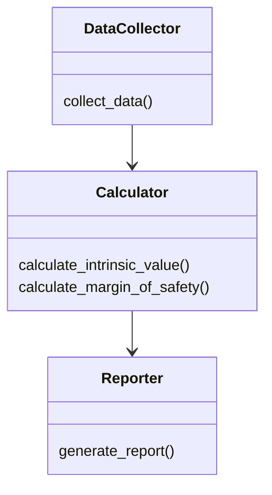
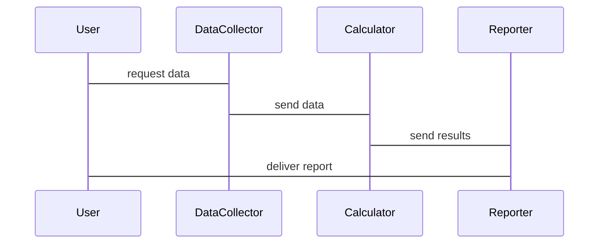

                 


# 格雷厄姆特价股票理论在数字货币时代的新思考

> **关键词**：格雷厄姆投资理论，数字货币，价值投资，安全边际，内在价值  
> **摘要**：本文探讨了格雷厄姆价值投资理论在数字货币时代的应用，分析了数字货币市场的特点，并提出了基于格雷厄姆理论的评估模型和投资策略。通过数学模型、算法设计和实际案例，展示了如何在数字货币市场中寻找低估资产，实现稳健投资。

---

## 第1章: 引言

### 1.1 数字货币市场的特点
数字货币市场是近年来崛起的新兴市场，其特点包括高波动性、去中心化、全球性以及技术驱动。与传统股票市场相比，数字货币市场的交易量大、参与者多，且受政策和技术的影响较大。

### 1.2 格雷厄姆投资理论的简介
格雷厄姆的价值投资理论强调安全边际和内在价值。他主张以低于内在价值的价格买入优质资产，长期持有，以获得稳定的收益。其核心在于寻找市场低估的资产，并通过安全边际来降低风险。

### 1.3 数字货币市场与传统股票市场的对比
- **市场机制**：传统股票市场受监管机构和上市公司的影响较大，而数字货币市场则主要依赖市场供需和技术驱动。
- **波动性**：数字货币市场的波动性远高于传统股票市场，这也意味着投资风险更大，但潜在收益也更高。

### 1.4 本书的研究意义与目标
本文旨在探讨格雷厄姆投资理论在数字货币市场中的适用性，通过数学模型和实际案例，提出一套适合数字货币投资的策略。

---

## 第2章: 格雷厄姆投资理论的核心概念

### 2.1 格雷厄姆投资理论的核心要素
- **内在价值**：资产在市场上的真实价值，不随市场波动而变化。
- **安全边际**：购买价格与内在价值之间的差距，用于降低投资风险。

### 2.2 格雷厄姆投资理论的数学模型

#### 2.2.1 内在价值的计算公式
$$ V = \frac{D}{k} $$
其中，\( V \) 是内在价值，\( D \) 是预期股息，\( k \) 是折现率。

#### 2.2.2 安全边际的量化方法
$$ \text{安全边际} = \text{内在价值} - \text{市场价格} $$

### 2.3 格雷厄姆理论与数字货币市场的结合

#### 2.3.1 格雷厄姆理论在数字货币中的应用潜力
- 通过分析数字货币的内在价值，寻找被市场低估的币种。
- 结合安全边际，降低投资风险。

#### 2.3.2 数字货币市场的独特性对格雷厄姆理论的影响
- 高波动性使得安全边际的概念更具挑战性。
- 去中心化的特点使得内在价值的评估更加复杂。

---

## 第3章: 数字货币市场的分析与评估

### 3.1 数字货币市场的基本分析

#### 3.1.1 市场容量与交易量的分析
通过分析交易量和市场容量，评估市场的流动性和活跃度。

#### 3.1.2 币种的分类与特性
将数字货币分为不同的类别，如比特币、以太坊等，分析其各自的特点和市场表现。

### 3.2 格雷厄姆理论在数字货币中的应用

#### 3.2.1 寻找低估资产
通过比较市场价格与内在价值，寻找被市场低估的数字货币。

#### 3.2.2 评估安全边际
计算安全边际，确保投资价格低于内在价值。

---

## 第4章: 数学模型与算法

### 4.1 评估模型的设计

#### 4.1.1 内在价值的评估
基于历史数据和市场趋势，建立数学模型来计算数字货币的内在价值。

#### 4.1.2 安全边际的计算
使用算法确定安全边际，并评估投资风险。

### 4.2 算法原理

#### 4.2.1 算法流程
1. 收集数据：获取目标数字货币的历史价格、交易量等数据。
2. 计算内在价值：使用数学模型计算内在价值。
3. 确定安全边际：计算市场价格与内在价值的差距。
4. 评估投资风险：基于安全边际和市场趋势，评估投资风险。

#### 4.2.2 Python实现

```python
def calculate_intrinsic_value(dividends, discount_rate):
    return dividends / discount_rate

def calculate_margin_of_safety(intrinsic_value, market_price):
    return intrinsic_value - market_price

# 示例
dividends = 100  # 假设年股息
discount_rate = 0.05  # 折现率
market_price = 2000  # 当前市场价格

intrinsic_value = calculate_intrinsic_value(dividends, discount_rate)
margin_of_safety = calculate_margin_of_safety(intrinsic_value, market_price)

print(f"内在价值: {intrinsic_value}")
print(f"安全边际: {margin_of_safety}")
```

---

## 第5章: 系统分析与架构设计

### 5.1 系统功能设计

#### 5.1.1 系统功能模块
- 数据采集模块：收集数字货币的价格、交易量等数据。
- 计算模块：计算内在价值和安全边际。
- 报告生成模块：生成投资报告和风险评估。

### 5.2 系统架构设计

#### 5.2.1 类图设计


#### 5.2.2 序列图设计


---

## 第6章: 项目实战

### 6.1 环境安装
- 安装必要的库：Pandas、NumPy、Matplotlib。

### 6.2 核心实现

#### 6.2.1 数据采集
使用API获取比特币的价格数据。

```python
import requests

def get_btc_price():
    response = requests.get("https://api.example.com/btc_price")
    return response.json()["price"]
```

#### 6.2.2 内在价值计算
基于历史数据计算比特币的内在价值。

```python
def calculate_btc_intrinsic_value(prices, discount_rate):
    return sum(prices) / len(prices) / discount_rate
```

### 6.3 案例分析
以比特币为例，分析其内在价值和安全边际，评估投资风险。

---

## 第7章: 总结与展望

### 7.1 总结
本文探讨了格雷厄姆投资理论在数字货币市场的应用，通过数学模型和系统设计，提出了有效的投资策略。

### 7.2 展望
未来，随着数字货币市场的成熟，格雷厄姆理论将有更广泛的应用，同时需要进一步优化评估模型，以应对市场的变化。

---

## 作者：AI天才研究院 & 禅与计算机程序设计艺术

本文作者是AI天才研究院，专注于人工智能和计算机科学的研究。如需转载请注明出处。

