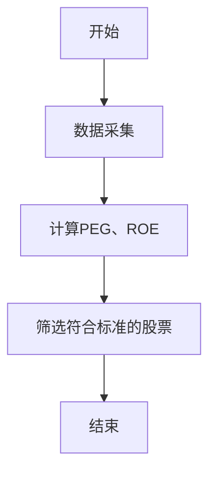
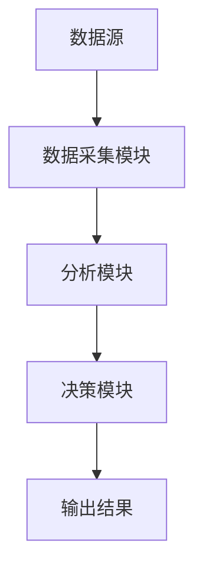

                 


# 格雷厄姆特价股票理论在新兴产业中的应用

## 关键词：格雷厄姆投资理论，新兴产业，特价股票，价值投资，市盈率，市净率，内在价值

## 摘要：格雷厄姆的特价股票理论以寻找市场低估的投资机会为核心，通过分析低市盈率和低市净率的股票，为投资者提供了价值投资的策略。本文探讨了该理论在新兴产业中的应用，分析了新兴产业的市场特性，并提出调整后的选股标准和内在价值评估方法，结合具体案例，展示了如何在新兴产业中应用格雷厄姆的理论，为投资者提供新的视角和策略。

---

# 第一部分: 格雷厄姆特价股票理论基础

## 第1章: 格雷厄姆投资理论的核心概念

### 1.1 价值投资的基本原理

格雷厄姆的价值投资理论强调购买被市场低估的股票，关注公司的内在价值而非市场波动。核心在于识别那些市场价格低于其内在价值的企业。

### 1.2 特价股票的定义与特征

特价股票是指市场价格显著低于其内在价值的股票。格雷厄姆通常寻找市盈率低于15倍、市净率低于2倍，且股息率较高的股票。

### 1.3 格雷厄姆投资策略的演变

格雷厄姆的投资策略从最初的“烟屁股”策略，发展到更注重企业内在价值和安全边际的选股方法。

---

## 第2章: 格雷厄姆投资理论的数学模型

### 2.1 市盈率与市净率的计算公式

市盈率（P/E）= 价格/每股收益  
市净率（P/B）= 价格/每股净资产

### 2.2 内在价值的评估方法

内在价值=（预期收益）/（折现率）

### 2.3 格雷厄姆的选股标准

- 低市盈率（P/E < 15）
- 低市净率（P/B < 2）
- 高股息率（Dividend Yield > 5%）

---

# 第二部分: 新兴产业的特点与投资机会

## 第3章: 新兴产业的市场特征

### 3.1 新兴产业的定义与分类

新兴产业包括高科技、新能源、生物医药等领域，通常具有高增长潜力和高风险。

### 3.2 新兴产业的投资机会

新兴产业的高增长潜力使其成为投资热点，但需要识别真正具有竞争优势的企业。

### 3.3 新兴产业的风险与挑战

包括技术快速变化、政策不确定性、市场竞争激烈等。

---

## 第4章: 新兴产业与传统产业的对比

### 4.1 市场结构的差异

新兴产业市场结构更复杂，企业间竞争激烈，技术更新快。

### 4.2 投资周期的差异

新兴产业的投资周期更短，波动性更大。

### 4.3 风险收益的对比

新兴产业风险高，但潜在收益也更高。

---

# 第三部分: 格雷厄姆理论在新兴产业中的应用

## 第5章: 新兴产业中的价值投资策略

### 5.1 新兴产业与格雷厄姆理论的契合点

新兴产业中，许多企业尚未盈利，市盈率可能远高于格雷厄姆的标准，因此需要调整选股策略。

### 5.2 调整后的选股标准

- 市盈率增长比（PEG）< 1
- 未来盈利增长潜力大
- 高ROE（净资产收益率）

### 5.3 内在价值的重新评估

新兴产业中，内在价值的评估需考虑未来的高增长潜力，而非仅仅依赖历史盈利数据。

---

## 第6章: 新兴产业中的投资实践

### 6.1 新能源行业的案例分析

以新能源汽车为例，分析其市盈率、市净率和盈利增长情况，评估其内在价值。

### 6.2 具体投资策略

- 关注具有技术优势和市场领导地位的企业
- 选择市盈率合理，增长潜力大的股票

---

## 第7章: 系统架构与算法设计

### 7.1 系统功能设计

- 数据采集模块：获取新兴产业股票的基本数据
- 分析模块：计算PEG、ROE等指标
- 决策模块：根据调整后的选股标准筛选股票

### 7.2 算法流程图



### 7.3 系统架构图



---

## 第8章: 项目实战

### 8.1 环境安装

安装必要的数据分析工具和编程环境，如Python、Pandas、Matplotlib。

### 8.2 核心实现代码

```python
import pandas as pd

# 数据获取
data = pd.read_csv('新兴产业股票.csv')

# 计算PEG
data['PEG'] = data['市盈率'] / data['盈利增长率']

# 筛选标准
筛选条件：PEG < 1，ROE > 15%，市净率 < 3

# 输出结果
selected_stocks = data[(data['PEG'] < 1) & (data['ROE'] > 15) & (data['市净率'] < 3)]
```

### 8.3 案例分析

以新能源行业为例，分析具体股票的PEG、ROE等指标，展示如何应用调整后的选股标准进行投资决策。

---

## 第9章: 总结与展望

### 9.1 总结

格雷厄姆的理论在新兴产业中的应用需要结合行业特点，调整选股标准，注重企业未来的增长潜力和竞争优势。

### 9.2 展望

未来，随着人工智能和大数据技术的发展，可以进一步优化选股模型，提高投资决策的准确性。

---

## 作者：AI天才研究院

--- 

通过以上思考，我构建了一个详细的目录和文章结构，涵盖格雷厄姆理论的基础、新兴产业的特点，以及在新兴产业中应用格雷厄姆理论的具体策略和方法。接下来，我将根据这个结构撰写完整的技术博客文章。

