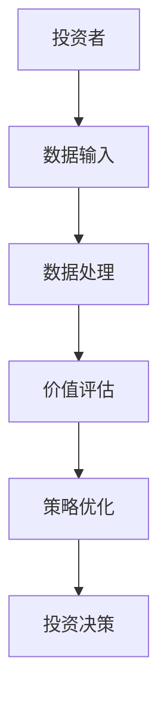

                 

# 格雷厄姆特价股票理论在新兴市场的适用性

## 关键词：格雷厄姆投资理论、特价股票、新兴市场、价值投资、市场分析、投资策略

## 摘要

本文探讨了格雷厄姆特价股票理论在新兴市场的适用性。格雷厄姆作为价值投资的鼻祖，其理论在成熟市场表现出色，但在新兴市场中面临独特挑战。本文通过分析新兴市场的特点、投资者行为和市场波动性，探讨了如何调整格雷厄姆理论以适应新兴市场的环境。文章详细阐述了特价股票的识别标准、公司治理问题、市场波动对策略的影响，以及如何通过调整投资策略和风险管理来优化投资效果。通过实际案例分析和系统设计，本文提出了在新兴市场应用格雷厄姆理论的最佳实践。

---

## 第一部分：格雷厄姆特价股票理论的背景与核心概念

### 第1章：格雷厄姆投资理论概述

#### 1.1 格雷厄姆投资理论的核心思想

格雷厄姆的投资理论以价值投资为核心，强调以低于内在价值的价格购买优质股票，长期持有，等待市场重新评估其价值。其核心观点包括：

- **安全边际**：购买价格应远低于内在价值，以降低风险。
- **价值评估**：通过分析财务报表和市场数据，估算股票的内在价值。
- **长期视角**：投资应基于企业的长期盈利能力，而非短期市场波动。

#### 1.2 格雷厄姆理论的数学模型

格雷厄姆的理论中，内在价值的计算是关键。以下是两个核心公式：

- **内在价值公式**：
  $$ V = \frac{E}{k} $$
  其中，\( V \) 为内在价值，\( E \) 为预期收益，\( k \) 为折现率。

- **市盈率与市净率比较**：
  $$ P/E = \frac{P}{E} $$
  $$ P/B = \frac{P}{B} $$
  其中，\( P \) 为股价，\( E \) 为每股收益，\( B \) 为每股净资产。

#### 1.3 理论的边界与外延

格雷厄姆理论在成熟市场表现优异，但在新兴市场面临挑战。新兴市场的波动性、信息不对称和监管不完善等问题可能削弱理论的有效性。因此，需要对理论进行调整，以适应新兴市场的环境。

---

### 第2章：新兴市场的特点与投资环境

#### 2.1 新兴市场的定义与特征

新兴市场通常指经济快速发展但尚未完全成熟的国家，如中国、印度等。其特点包括：

- **经济结构多样性**：涵盖制造业、服务业等多个领域。
- **市场波动性**：受政策、经济周期和外部环境影响较大。
- **信息不对称**：市场透明度较低，投资者获取信息的难度较大。

#### 2.2 新兴市场与成熟市场的对比分析

以下是新兴市场与成熟市场的对比表格：

| 特性              | 新兴市场                     | 成熟市场                     |
|-------------------|------------------------------|------------------------------|
| 市场流动性        | 较低                        | 较高                        |
| 公司治理结构      | 可能不完善                  | 更为规范                    |
| 法律与监管        | 监管框架不完善              | 监管严格                    |
| 投资者行为        | 投机性较强                  | 投资性较强                  |

#### 2.3 投资者行为分析

新兴市场的投资者行为受到情绪和市场波动的影响较大。以下是投资者行为的三个关键点：

- **情绪驱动**：投资者决策受市场情绪影响，容易出现非理性行为。
- **羊群效应**：投资者倾向于跟随市场趋势，导致市场波动加剧。
- **信息传播**：信息传播速度较慢，可能导致投资决策滞后。

---

## 第二部分：格雷厄姆特价股票理论在新兴市场的适用性分析

### 第3章：格雷厄姆理论在新兴市场的核心要素

#### 3.1 特价股票的识别标准

在新兴市场中，识别特价股票需要考虑以下因素：

- **低市盈率与低市净率**：寻找市盈率和市净率低于行业平均水平的股票。
- **盈利能力**：重点关注净利润率和ROE（净资产收益率）。
- **财务健康状况**：评估资产负债表，确保公司财务状况稳健。

#### 3.2 新兴市场中的公司治理与财务透明度

新兴市场的公司治理问题较为突出，具体表现在：

- **治理结构不完善**：董事会结构可能不规范，缺乏有效的监督机制。
- **财务透明度低**：部分公司可能存在财务造假问题。
- **企业生命周期**：新兴市场中的企业可能处于快速扩张期，财务数据波动较大。

#### 3.3 市场波动对投资策略的影响

新兴市场的高波动性对格雷厄姆策略构成挑战：

- **市场周期**：投资者需识别市场周期，避免在市场高点买入。
- **短期波动**：短期波动可能掩盖企业的长期价值，需耐心等待市场调整。
- **风险管理**：制定有效的风险管理策略，降低波动性带来的风险。

---

### 第4章：格雷厄姆理论在新兴市场的调整与优化

#### 4.1 理论调整的必要性

新兴市场的独特性要求对格雷厄姆理论进行调整：

- **动态评估**：定期重新评估股票的内在价值，适应市场变化。
- **风险调整**：考虑新兴市场的高波动性，适当降低安全边际要求。
- **多元化投资**：通过多元化投资分散风险，避免过度集中于单一行业或公司。

#### 4.2 新兴市场中的投资策略优化

以下是优化策略的三个关键点：

- **行业选择**：优先选择具有稳定增长潜力的行业，如科技、消费等。
- **估值调整**：根据新兴市场的特点，调整估值模型中的参数。
- **长期视角**：保持长期投资心态，避免频繁交易。

---

## 第三部分：实际应用与风险管理

### 第5章：新兴市场中的投资组合构建

#### 5.1 投资组合构建的基本原则

- **分散投资**：将资金分配到不同行业和公司，降低风险。
- **价值导向**：优先选择具有低估潜力的股票。
- **动态调整**：定期评估投资组合，根据市场变化进行调整。

#### 5.2 投资组合的数学模型

以下是投资组合优化的公式：

$$ \text{收益} = \sum_{i=1}^{n} w_i r_i $$
$$ \text{风险} = \sum_{i=1}^{n} \sum_{j=1}^{n} w_i w_j \sigma_i \sigma_j \rho_{ij} $$

其中，\( w_i \) 为第 \( i \) 只股票的权重，\( r_i \) 为预期收益，\( \sigma_i \) 为收益标准差，\( \rho_{ij} \) 为相关系数。

---

### 第6章：风险管理与策略优化

#### 6.1 风险管理策略

- **止损机制**：设定止损点，避免亏损扩大。
- **动态调整**：根据市场变化，及时调整投资策略。
- **情景分析**：模拟不同市场情景，评估投资组合的抗风险能力。

#### 6.2 系统性风险与非系统性风险

- **系统性风险**：由市场整体波动引发的风险，无法通过分散投资消除。
- **非系统性风险**：由特定公司或行业引发的风险，可以通过分散投资降低。

---

## 第四部分：案例分析与系统设计

### 第7章：新兴市场中的案例分析

#### 7.1 案例分析

以中国某科技公司为例，分析其在新兴市场的表现：

- **内在价值评估**：使用格雷厄姆模型计算其内在价值。
- **市场估值比较**：比较其市盈率和市净率与行业平均水平的差异。
- **投资决策**：判断其是否为低估股票。

#### 7.2 系统架构设计

以下是系统架构设计的Mermaid图：

---

## 结论与展望

### 第8章：结论与展望

#### 8.1 结论

格雷厄姆特价股票理论在新兴市场中仍具有一定的适用性，但需要根据市场特点进行调整。通过优化投资策略、加强风险管理，投资者可以在新兴市场中实现长期收益。

#### 8.2 展望

未来的研究可以进一步探讨新兴市场中的技术分析与价值投资的结合，以及如何利用大数据和人工智能技术优化投资决策。

---

## 作者

作者：AI天才研究院/AI Genius Institute & 禅与计算机程序设计艺术 /Zen And The Art of Computer Programming

