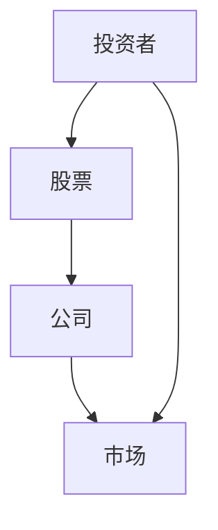
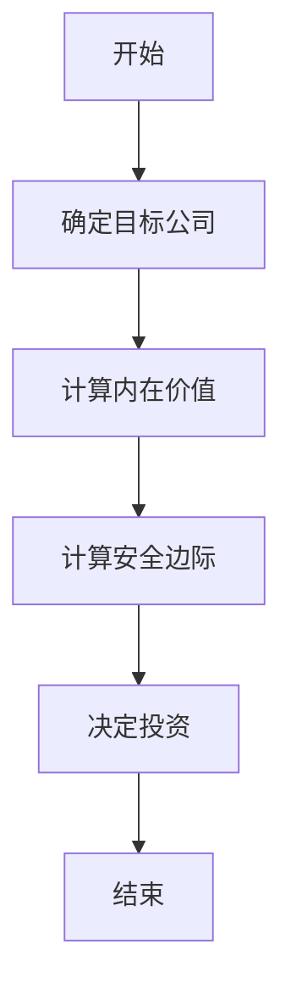
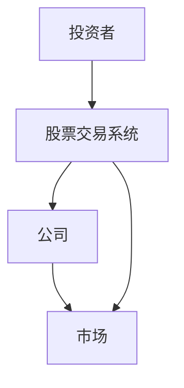

                 

# 格雷厄姆特价股票理论在社会企业融资中的运用

## 关键词：
格雷厄姆投资理论、社会企业融资、安全边际、内在价值、价值投资

## 摘要：
本文探讨了格雷厄姆投资理论在社会企业融资中的应用，通过分析安全边际、内在价值等核心概念，结合实际案例，展示了如何将价值投资理念应用于社会企业的融资决策中。文章从理论到实践，系统地介绍了格雷厄姆模型的数学公式、算法流程图以及系统架构设计，为社会企业的融资提供了新的思路。

---

# 第1章: 格雷厄姆特价股票理论概述

## 1.1 格雷厄姆投资理论的核心概念

### 1.1.1 安全边际的定义与计算
**安全边际**是指股票的市场价格低于其内在价值的部分。格雷厄姆认为，投资者应该以低于内在价值的价格买入股票，以确保投资的安全性。

**计算公式**：
$$
安全边际 = 内在价值 - 市场价格
$$

### 1.1.2 内在价值的评估方法
内在价值是股票的合理估值，可以通过未来现金流的现值来计算。

**计算公式**：
$$
内在价值 = \frac{未来现金流的现值}{折现率}
$$

### 1.1.3 股票定价的格雷厄姆模型
格雷厄姆提出了一种基于安全边际的股票定价模型，即以内在价值为基础，考虑市场价格的波动性，确定投资的安全区间。

## 1.2 社会企业融资的特点与挑战

### 1.2.1 社会企业的定义与目标
社会企业是以实现社会价值为目标的企业，其核心是通过商业手段解决社会问题，同时实现可持续发展。

### 1.2.2 社会企业融资的独特性
社会企业的融资需求与传统企业有所不同，投资者在关注财务回报的同时，也会关注企业的社会影响力。

### 1.2.3 格雷厄姆理论在社会企业融资中的适用性
格雷厄姆理论强调长期价值和安全边际，与社会企业的可持续发展目标高度契合。

---

# 第2章: 格雷厄姆特价股票理论的核心概念与联系

## 2.1 核心概念原理

### 2.1.1 安全边际的数学模型
$$
安全边际 = 内在价值 - 市场价格
$$

### 2.1.2 内在价值的计算公式
$$
内在价值 = \frac{未来现金流的现值}{折现率}
$$

### 2.1.3 股票定价的格雷厄姆模型
$$
股票价格 = 内在价值 \times (1 - 安全边际)
$$

## 2.2 核心概念属性特征对比表格

| 概念       | 属性特征                       |
|------------|----------------------------|
| 安全边际   | 投资价格低于内在价值的缓冲区 |
| 内在价值   | 股票的合理估值                 |
| 股票定价   | 基于安全边际的动态调整         |

## 2.3 ER实体关系图

---

# 第3章: 格雷厄姆特价股票理论的算法原理

## 3.1 算法原理流程图

## 3.2 格雷厄姆模型的数学公式

$$
内在价值 = \frac{未来现金流的现值}{折现率}
$$

$$
安全边际 = 内在价值 - 市场价格
$$

## 3.3 举例说明

假设某公司未来现金流的现值为 $100，折现率为 10%，则内在价值为 $111.11。若市场价格为 $100，则安全边际为 $11.11。

---

# 第4章: 社会企业融资的系统分析与架构设计

## 4.1 问题场景介绍

社会企业在融资过程中需要平衡社会责任与经济效益。投资者需要在关注财务回报的同时，评估企业的社会影响力。

## 4.2 系统功能设计

### 4.2.1 领域模型

### 4.2.2 系统架构设计

### 4.2.3 系统接口设计

- 投资者与股票交易系统的接口：投资者提交订单，系统处理交易。
- 公司与市场的接口：公司发布财务报表和社

