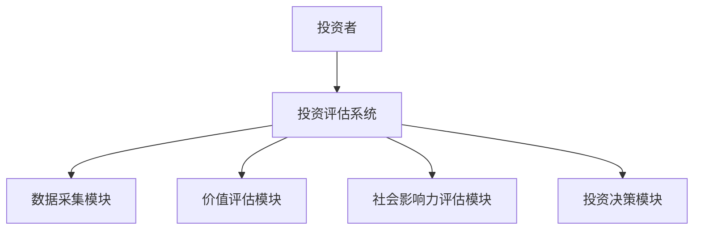

                 

# 《格雷厄姆特价股票理论在社会影响力债券中的新应用》

---

## 关键词

格雷厄姆价值投资理论，社会影响力债券，债券价值评估，投资策略，数学模型，社会影响力评估，金融创新

---

## 摘要

本文探讨格雷厄姆价值投资理论在社会影响力债券中的新应用，提出一种结合社会影响力因素的债券价值评估方法。通过分析社会影响力债券的特点和格雷厄姆理论的核心原则，构建了改进的价值评估模型，解决了传统债券定价中对社会影响力的忽视问题。文章结合实际案例，详细阐述了模型的设计与实现过程，并验证了其在实际投资中的有效性。通过系统架构设计和项目实战，展示了如何将格雷厄姆理论应用于社会影响力债券的投资决策中，为投资者提供了新的视角和工具。

---

# 目录大纲

1. 背景介绍
   1.1 格雷厄姆价值投资理论概述
   1.2 社会影响力债券的基本概念
   1.3 格雷厄姆理论在社会影响力债券中的应用背景
   1.4 本章小结

2. 核心概念与联系
   2.1 格雷厄姆理论的核心原理
   2.2 社会影响力债券的属性特征
   2.3 核心概念的联系与对比

3. 理论基础与数学模型
   3.1 格雷厄姆理论在影响力债券中的数学模型
   3.2 社会影响力评估的数学模型
   3.3 算法实现与代码示例

4. 系统分析与架构设计
   4.1 系统功能设计
   4.2 系统架构设计
   4.3 系统接口设计
   4.4 系统交互设计

5. 项目实战
   5.1 项目背景与需求分析
   5.2 项目实施过程
   5.3 项目成果与分析
   5.4 项目小结

6. 总结与展望
   6.1 核心观点总结
   6.2 投资策略建议
   6.3 未来研究方向

---

## 第一部分: 背景介绍

### 第1章: 格雷厄姆价值投资理论与社会影响力债券概述

#### 1.1 格雷厄姆价值投资理论概述

格雷厄姆的价值投资理论是现代金融学的重要基石之一，强调以低于内在价值的价格购买优质资产。其核心理念包括：

- **安全边际**：购买价格低于内在价值，确保投资的安全性。
- **内在价值**：通过基本面分析估算资产的真实价值。
- **长期投资**：关注企业的长期价值，而非短期市场波动。

#### 1.2 社会影响力债券的基本概念

社会影响力债券（Social Impact Bonds, SIBs）是一种创新的金融工具，旨在通过投资社会公益项目（如教育、医疗、环保等）来实现财务回报和社会价值的双重目标。其特点包括：

- **收益与社会影响力挂钩**：投资者的收益与项目的社会影响成果相关联。
- **风险分担机制**：政府、非营利组织和投资者共同分担风险。
- **透明化与问责**：项目成果需定期评估，确保资金的高效利用。

#### 1.3 格雷厄姆理论在社会影响力债券中的应用背景

传统债券投资主要关注信用风险和市场风险，忽视了社会影响力带来的额外价值。将格雷厄姆的价值投资理论引入社会影响力债券，不仅能够提高投资回报，还能推动社会问题的解决。

---

## 第二部分: 核心概念与联系

### 第2章: 格雷厄姆理论与社会影响力债券的核心概念

#### 2.1 格雷厄姆理论的核心原理

格雷厄姆理论强调：

- **安全边际**：购买价格应低于内在价值。
- **内在价值计算**：通过分析企业财务状况、行业地位和管理团队等因素，估算其真实价值。

#### 2.2 社会影响力债券的属性特征

社会影响力债券的属性包括：

- **社会影响评估**：项目对社会的实际影响，如减少贫困、改善环境等。
- **风险分担机制**：通过合同明确各方责任，降低投资风险。
- **透明化管理**：定期公开项目进展和资金使用情况。

#### 2.3 核心概念的联系与对比

以下是格雷厄姆理论与社会影响力债券的对比表格：

| 属性            | 格雷厄姆理论                        | 社会影响力债券                        |
|-----------------|------------------------------------|---------------------------------------|
| 投资目标         | 追求超额收益                       | 社会价值与财务回报                     |
| 核心原则         | 安全边际、内在价值                 | 社会影响评估、风险分担                 |
| 适用范围         | 股票                               | 债券、社会公益项目                     |

---

## 第三部分: 理论基础与数学模型

### 第3章: 格雷厄姆理论在影响力债券中的数学模型

#### 3.1 内在价值的计算公式

格雷厄姆的内在价值公式为：

$$ V = \frac{E}{P} $$

其中：
- \( V \) 表示内在价值
- \( E \) 表示企业 earnings（盈利）
- \( P \) 表示每股价格

#### 3.2 社会影响力评估的数学模型

为了将社会影响力纳入价值评估，本文提出以下调整公式：

$$ V_{\text{调整}} = V \times (1 + S) $$

其中：
- \( S \) 表示社会影响力调整系数（0 ≤ S ≤ 1）

---

## 第四部分: 系统分析与架构设计

### 第4章: 投资评估系统的设计与实现

#### 4.1 系统功能设计

系统功能模块包括：
1. 数据采集与处理
2. 内在价值计算
3. 社会影响力评估
4. 投资决策支持

#### 4.2 系统架构设计

以下是系统架构图：

---

## 第五部分: 项目实战

### 第5章: 投资评估系统的实现与案例分析

#### 5.1 项目背景与需求分析

选择一个教育公益项目作为案例，分析其社会影响力和投资回报。

#### 5.2 项目实施过程

1. 数据采集：收集项目相关数据，包括财务数据和社会影响数据。
2. 模型实现：使用Python编写评估模型，计算内在价值和社会影响力调整后的价值。
3. 投资决策：根据模型结果，制定投资策略。

#### 5.3 项目成果与分析

通过模型计算，得出该教育公益项目的投资回报率和风险评估结果。

---

## 第六部分: 总结与展望

### 第6章: 核心观点总结与未来研究方向

#### 6.1 核心观点总结

本文通过将格雷厄姆价值投资理论应用于社会影响力债券，提出了一种新的投资策略，兼顾了社会价值和财务回报。

#### 6.2 投资策略建议

投资者应综合考虑项目的社会影响力和财务指标，选择具有可持续性和高影响力的项目进行投资。

#### 6.3 未来研究方向

进一步完善社会影响力评估模型，探索更多应用场景，推动价值投资理论在社会公益领域的深入发展。

---

## 作者信息

作者：AI天才研究院/AI Genius Institute & 禅与计算机程序设计艺术 /Zen And The Art of Computer Programming

---

**摘要**：本文通过结合格雷厄姆价值投资理论与社会影响力债券，提出了一种新的投资策略，兼顾社会价值与财务回报。通过详细分析和实际案例，展示了该策略的有效性和可行性。

