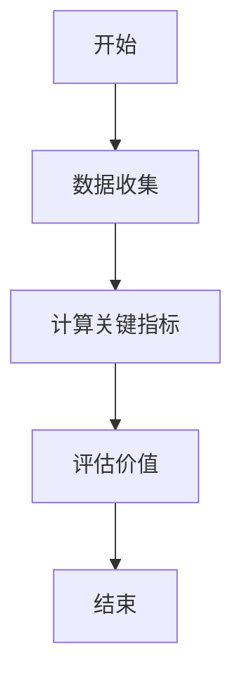
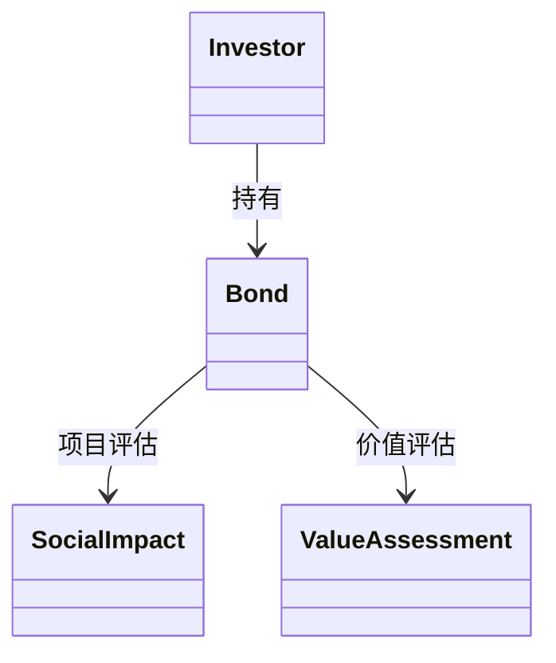
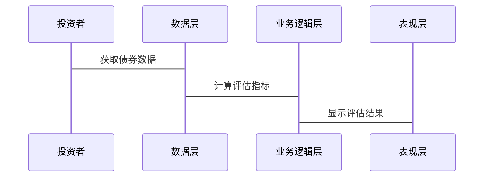

                 


# 《格雷厄姆特价股票理论在社会影响力债券中的运用》

## 关键词：
- 格雷厄姆投资理论
- 社会影响力债券
- 价值投资
- 金融建模
- 社会责任投资

## 摘要：
本文探讨如何将格雷厄姆的价值投资理论应用于社会影响力债券。通过分析核心概念、算法原理和系统架构，提出创新的投资策略，结合社会责任与经济效益，为投资者提供科学的评估方法。

---

# 第一部分：背景介绍

## 第1章：格雷厄姆特价股票理论概述

### 1.1 格雷厄姆投资理论的核心概念

#### 1.1.1 价值投资的基本原理
价值投资强调以低于内在价值的价格购买资产，长期持有，等待市场的合理估值。内在价值是资产的真实价值，不随市场波动而变化。

#### 1.1.2 特价股票的定义与特征
特价股票是市场价格低于内在价值的股票，通常具有低市盈率、低市净率和高股息率。格雷厄姆寻找这些股票，认为它们提供了安全边际。

#### 1.1.3 格雷厄姆投资策略的历史发展
格雷厄姆的投资策略起源于20世纪30年代，其核心是通过基本面分析发现低估的股票。他的策略在多次市场周期中被证明有效，影响了巴菲特等投资大师。

### 1.2 格雷厄姆理论在现代投资中的应用
格雷厄姆的理论不仅适用于传统股票，还可以扩展到其他金融工具，如债券。本文探讨其在社会影响力债券中的应用，结合社会责任投资，为投资者提供新的视角。

## 第2章：社会影响力债券的定义与特点

### 2.1 社会影响力债券的背景
社会影响力债券（SIBs）是一种固定收益工具，旨在支持社会公益项目，如教育、医疗和基础设施建设。投资者通过投资这些债券，不仅获得财务回报，还能推动社会进步。

#### 2.1.1 SIBs的起源
SIBs的概念起源于英国，2010年代逐渐发展，得到政府和社会组织的支持。它们通常由政府或非营利组织发行，资金用于特定社会项目。

#### 2.1.2 影响力债券的分类
根据还款来源，影响力债券可以分为一般用途债券和特定用途债券。本文关注特定用途债券，其收益直接与项目绩效挂钩。

#### 2.1.3 影响力债券的市场现状
全球影响力债券市场增长迅速，投资者越来越关注社会责任投资。本文分析这一市场的现状，探讨其潜力。

## 第3章：格雷厄姆理论与社会影响力债券的结合

### 3.1 理论基础的契合点
格雷厄姆的理论强调安全边际和低估资产，这与影响力债券的低估值和高社会影响力相符。通过寻找低估的影响力债券，投资者可以在支持社会项目的同时获得超额收益。

### 3.2 核心问题与解决方案
社会影响力债券市场存在信息不对称和评估标准不统一的问题。格雷厄姆的理论提供了解决方案，通过基本面分析和价值评估，识别具有潜力的债券。

### 3.3 核心要素与边界
本文的研究边界包括特定类型的影响力债券，不涉及普通债券和股票。未来研究可以扩展到其他金融工具。

---

# 第二部分：核心概念与联系

## 第4章：格雷厄姆理论的核心原理

### 4.1 格雷厄姆投资模型的数学解析

#### 4.1.1 市盈率模型
$$ P/E = \frac{\text{股价}}{\text{每股收益}} $$
低市盈率意味着股价可能被低估。

#### 4.1.2 市净率模型
$$ P/B = \frac{\text{股价}}{\text{每股净资产}} $$
低市净率同样表明资产可能被低估。

#### 4.1.3 股息率模型
$$ \text{股息率} = \frac{\text{每股股息}}{\text{股价}} $$
高股息率可能意味着资产的收益能力较强。

## 第5章：社会影响力债券的评估指标

### 5.1 影响力债券的评估维度

#### 5.1.1 社会影响力评估指标
包括项目覆盖的人数、社会影响程度等。

#### 5.1.2 项目风险评估指标
考虑项目执行的风险，如政策风险、运营风险等。

#### 5.1.3 投资回报率评估指标
包括预期收益率和债券期限。

## 第6章：核心概念对比分析

### 6.1 格雷厄姆理论与影响力债券的对比

#### 6.1.1 核心概念对比表格

| 核心概念 | 格雷厄姆理论 | 影响力债券 |
|----------|-------------|------------|
| 目标     | 内在价值    | 社会影响力 |
| 工具     | 股票         | 债券        |
| 标准     | 低估         | 低效         |

#### 6.1.2 ER实体关系图架构


---

# 第三部分：算法原理与数学模型

## 第7章：算法原理讲解

### 7.1 格雷厄姆评估算法流程


### 7.2 Python源代码实现

```python
def graham_value(stock_price, earnings_per_share, book_value_per_share):
    pe = stock_price / earnings_per_share
    pb = stock_price / book_value_per_share
    return (1 / pe) + (1 / pb)
```

### 7.3 数学模型与公式
$$ \text{内在价值} = \text{ earnings} \times (1 + g) / (r - g) $$

---

# 第四部分：系统分析与架构设计方案

## 第8章：系统分析与架构设计

### 8.1 问题场景介绍
社会影响力债券的评估需要结合财务指标和社会影响力指标，构建一个综合评估系统。

### 8.2 项目介绍
构建一个影响力债券评估系统，帮助投资者识别低估的债券。

### 8.3 系统功能设计

#### 8.3.1 领域模型类图


### 8.4 系统架构设计

#### 8.4.1 系统架构图


### 8.5 系统接口设计

#### 8.5.1 RESTful API
- GET /bonds 获取债券列表
- POST /assess 评估债券价值

### 8.6 系统交互流程图



---

# 第五部分：项目实战

## 第9章：项目实战

### 9.1 环境安装

```bash
pip install numpy pandas matplotlib
```

### 9.2 核心代码实现

```python
import pandas as pd

def assess_bond(price, earnings, book_value):
    pe = price / earnings
    pb = price / book_value
    return pe < 15 and pb < 2

# 示例数据
data = {'债券代码': ['B1', 'B2', 'B3'],
         '发行价格': [100, 90, 110],
         '每股收益': [20, 15, 25],
         '每股净资产': [50, 40, 60]}
df = pd.DataFrame(data)
```

### 9.3 代码解读与分析
代码计算市盈率和市净率，判断是否低于格雷厄姆的标准，筛选出低估的债券。

### 9.4 案例分析
以具体债券为例，展示如何应用算法进行评估，解释结果的意义。

### 9.5 项目小结
总结项目实现的过程，评估系统的有效性和可扩展性。

---

# 第六部分：总结与展望

## 第10章：总结

### 10.1 最佳实践 tips
- 结合财务指标和社会影响力指标进行评估
- 定期更新数据，保持评估的准确性
- 考虑市场变化，及时调整投资策略

### 10.2 小结
本文将格雷厄姆的理论应用于社会影响力债券，构建了评估系统，为投资者提供了新的视角。

## 第11章：注意事项与拓展阅读

### 11.1 注意事项
- 数据来源的可靠性
- 评估模型的局限性
- 市场风险的防范

### 11.2 拓展阅读
建议阅读格雷厄姆的原著和影响力投资的相关文献。

---

作者：AI天才研究院 & 禅与计算机程序设计艺术

