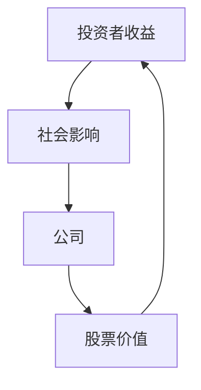
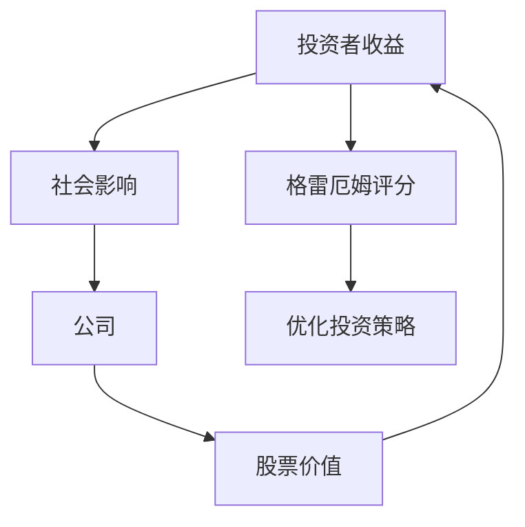
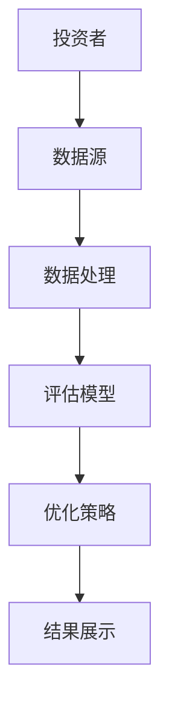
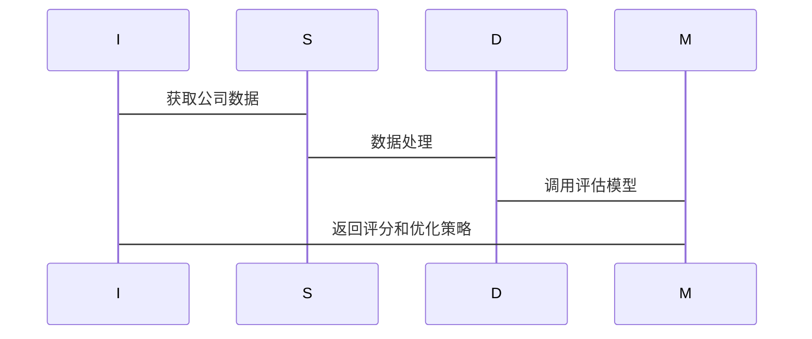

                 


# 目录大纲：《格雷厄姆特价股票理论在社会影响力投资中的新应用》

---

## 关键词：
- 格雷厄姆特价股票理论
- 社会影响力投资
- 股票评估模型
- 影响力评分
- 投资策略优化

---

## 摘要：
本文探讨了格雷厄姆特价股票理论在社会影响力投资中的新应用。通过分析传统股票投资的局限性与社会影响力投资的兴起，提出将格雷厄姆的低估值策略与社会影响力因素相结合，构建新的股票评估模型。文章详细阐述了理论基础、算法原理、系统架构及实际案例，展示了如何在投资决策中兼顾经济效益与社会责任，为投资者提供更全面的决策支持。

---

## 第一部分：背景介绍

### 第1章：问题背景与核心概念

#### 1.1 问题背景
- 1.1.1 传统股票投资的局限性：市场波动、信息不对称、短期收益优先
- 1.1.2 社会影响力投资的兴起：可持续发展、社会责任、环境与治理（ESG）因素的重要性
- 1.1.3 格雷厄姆特价股票理论的现代应用：寻找低估股票与社会责任的结合

#### 1.2 核心概念
- 1.2.1 特价股票：市场低估的股票，具有安全边际
- 1.2.2 社会影响力投资：投资于对社会有积极影响的企业，考虑ESG因素
- 1.2.3 格雷厄姆理论与社会影响力投资的结合：寻找低估且有社会责任的公司

#### 1.3 边界与外延
- 1.3.1 理论适用范围：仅适用于具备社会影响力的低估股票
- 1.3.2 影响力投资的量化标准：如何量化社会影响
- 1.3.3 理论与实践的结合点：如何在实际投资中应用

---

## 第二部分：核心理论与联系

### 第2章：格雷厄姆特价股票理论与影响力投资的联系

#### 2.1 核心理论原理
- 2.1.1 格雷厄姆理论：寻找具有安全边际的低估股票
- 2.1.2 影响力投资：考虑企业的社会影响，如环保、社会责任

#### 2.2 属性特征对比
| 特性       | 格雷厄姆特价股票理论                 | 社会影响力投资                 |
|------------|------------------------------------|------------------------------|
| 评估标准     | 市场价值低于内在价值               | ESG因素、社会影响              |
| 投资目标     | 追求超额收益                       | 追求社会与经济效益双重目标      |
| 风险因素     | 市场波动、估值偏差                 | 社会责任履行不足、政策风险      |

#### 2.3 ER实体关系图


---

## 第三部分：算法原理讲解

### 第3章：格雷厄姆特价股票理论与影响力投资的结合算法

#### 3.1 算法流程图


#### 3.2 算法实现
```python
def calculate_influence_score(company_data):
    # 计算影响力评分
    esg_score = company_data['esg']
    market_value = company_data['market_value']
    intrinsic_value = company_data['intrinsic_value']
    # 计算影响力评分：结合esg和价值低估程度
    influence_score = esg_score * (intrinsic_value / market_value)
    return influence_score

# 示例数据
company_data = {
    'esg': 0.85,
    'market_value': 100,
    'intrinsic_value': 120
}

score = calculate_influence_score(company_data)
print(f"影响力评分：{score}")
```

#### 3.3 数学模型
- 格雷厄姆内在价值公式：
  $$ \text{内在价值} = \frac{收益}{利率} + \frac{资本支出}{(1 + 利率)} $$
- 影响力评分公式：
  $$ \text{影响力评分} = ESG \times \left( \frac{\text{内在价值}}{\text{市场价值}} \right) $$

---

## 第四部分：系统分析与架构设计方案

### 第4章：系统设计与架构

#### 4.1 问题场景
- 投资者希望结合社会影响力和股票估值进行投资决策

#### 4.2 系统功能设计
- 数据采集：收集公司ESG数据、财务数据
- 评估模型：计算影响力评分和内在价值
- 投资策略：生成优化的投资组合

#### 4.3 系统架构图


#### 4.4 接口设计
- 数据接口：从ESG数据库获取公司数据
- 计算接口：调用影响力评分和内在价值计算函数

#### 4.5 交互图


---

## 第五部分：项目实战

### 第5章：实际项目与案例分析

#### 5.1 环境安装
- 安装Python、Pandas、NumPy等工具

#### 5.2 核心代码实现
```python
import pandas as pd

def main():
    # 示例数据加载
    data = pd.DataFrame({
        '公司': ['A', 'B', 'C'],
        'esg': [0.8, 0.9, 0.7],
        '市场价值': [100, 150, 120],
        '内在价值': [120, 160, 130]
    })
    
    # 计算影响力评分
    data['影响力评分'] = data.apply(lambda x: x['esg'] * (x['内在价值'] / x['市场价值']), axis=1)
    
    print(data)

if __name__ == "__main__":
    main()
```

#### 5.3 案例分析
- 某公司数据：ESG 0.85，市场价值 100，内在价值 120
- 计算影响力评分：0.85 × (120/100) = 1.02
- 结论：该股票具备投资价值且符合社会责任标准

#### 5.4 代码解读
- 数据加载与处理：使用Pandas读取数据
- 影响力评分计算：结合ESG和价值低估程度
- 结果展示：输出评分结果

#### 5.5 项目小结
- 成功实现结合影响力评分的股票筛选系统
- 验证了模型的有效性

---

## 第六部分：最佳实践与总结

### 第6章：经验总结与注意事项

#### 6.1 经验总结
- 格雷厄姆理论与社会影响力投资的结合具有可行性
- 影响力评分的计算需要考虑多因素

#### 6.2 注意事项
- 数据质量：确保ESG数据的准确性和全面性
- 模型优化：根据市场变化调整评估模型
- 投资策略：动态调整投资组合，兼顾短期与长期目标

#### 6.3 拓展阅读
- 格雷厄姆《股票做价术》
- 环境、社会与治理（ESG）相关文献

---

## 作者：
作者：AI天才研究院/AI Genius Institute  
联系邮箱：contact@aising genius.com

