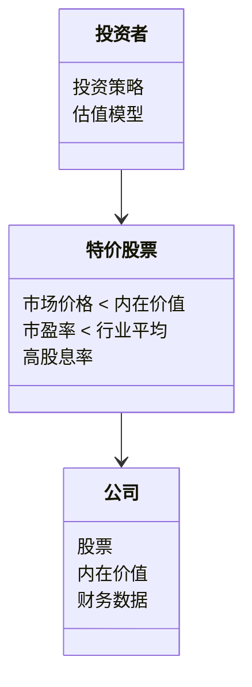
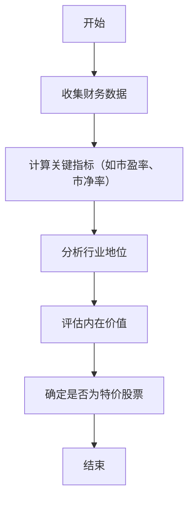
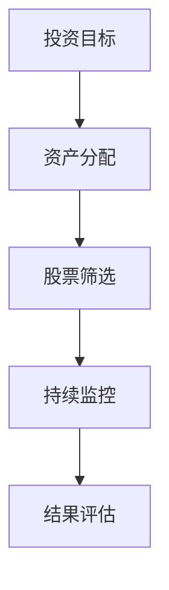

                 


# 格雷厄姆特价股票理论对公司估值方法的影响

> 关键词：格雷厄姆、价值投资、公司估值、股票分析、安全边际、投资策略

> 摘要：本文深入探讨了格雷厄姆的特价股票理论，分析其对公司估值方法的影响。文章从格雷厄姆的投资理念出发，详细讲解了安全边际、内在价值等核心概念，并结合实际案例展示了如何将格雷厄姆的理论应用于现代投资策略中。此外，文章还探讨了格雷厄姆理论的现代发展及其在投资组合管理中的应用，为读者提供了全面的视角。

---

## 第一部分: 格雷厄姆特价股票理论的背景与核心概念

### 第1章: 格雷厄姆投资理论的概述

#### 1.1 格雷厄姆的学术背景与投资实践
- **背景介绍**: 本节介绍本杰明·格雷厄姆的生平及其在金融领域的贡献。
- **问题背景**: 20世纪30年代，大萧条时期，传统投资理论失效，促使格雷厄姆寻找新的投资方法。
- **核心概念**: 格雷厄姆提出了价值投资的理念，强调购买被低估的股票。
- **问题解决**: 提供了一种基于公司基本面分析的投资策略，帮助投资者在市场低迷时期寻找机会。
- **概念结构**: 格雷厄姆的理论包括内在价值、安全边际等核心要素。

#### 1.2 特价股票的定义与特征
- **术语说明**: 特价股票指市场价格低于其内在价值的股票。
- **属性对比**:
  | 属性       | 特价股票特征 |
  |------------|--------------|
  | 市场价格   | 低于内在价值 |
  | 市盈率     | 低于行业平均水平 |
  | 股息率     | 高于行业平均水平 |

- **ER实体关系图**:


---

### 第2章: 格雷厄姆投资理论的核心原理

#### 2.1 基本分析法
- **算法原理**: 基本分析法通过分析公司的财务报表来评估其内在价值。
- **流程图**:


- **数学模型**: 内在价值计算公式：
  $$ \text{内在价值} = \frac{\text{未来现金流的现值}}{\text{折现率}} $$

---

## 第二部分: 公司估值方法的分析与应用

### 第3章: 公司估值的基本方法

#### 3.1 市盈率法
- **定义**: 市盈率（P/E）是股票价格与每股收益的比率。
- **计算公式**:
  $$ \text{市盈率} = \frac{\text{股价}}{\text{每股收益}} $$
- **应用**: 用于评估股票的相对价值，低于行业平均市盈率的股票可能为特价股票。

#### 3.2 市净率法
- **定义**: 市净率（P/B）是股票价格与每股净资产的比率。
- **计算公式**:
  $$ \text{市净率} = \frac{\text{股价}}{\text{每股净资产}} $$
- **应用**: 适用于评估银行、制造业等行业的公司价值。

#### 3.3 股息率法
- **定义**: 股息率是股票的股息与股价的比率。
- **计算公式**:
  $$ \text{股息率} = \frac{\text{股息}}{\text{股价}} \times 100\% $$
- **应用**: 用于评估股票的收益能力，高股息率可能意味着低估。

---

### 第4章: 格雷厄姆理论在现代投资中的发展

#### 4.1 现代投资组合理论与价值投资
- **对比分析**: 现代投资组合理论强调分散化和风险调整后的收益，而价值投资注重长期持有和安全边际。
- **结合应用**: 通过基本面分析筛选股票，构建分散化的投资组合。

#### 4.2 行为金融学与价值投资
- **行为金融学视角**: 解释市场非理性行为，帮助识别低估机会。
- **应用**: 结合行为金融学，优化投资决策。

---

## 第三部分: 投资策略与风险管理

### 第5章: 投资策略的制定与实施

#### 5.1 投资组合管理
- **系统架构**: 包括目标设定、资产分配、股票筛选和持续监控。
- **架构图**:


#### 5.2 风险管理
- **策略**: 设定止损点，分散投资，定期重新评估组合。
- **数学模型**: 风险调整后的收益计算：
  $$ \text{夏普比率} = \frac{\text{预期收益} - \text{无风险利率}}{\text{收益的标准差}} $$

---

## 第四部分: 实际案例分析

### 第6章: 格雷厄姆理论的实际应用

#### 6.1 经典案例分析
- **案例1**: 某制造公司，市盈率低于行业平均，股息率高，适合作为特价股票。
- **案例2**: 银行股，市净率低于1，显示低估。

#### 6.2 投资组合优化
- **实现代码**:
  ```python
  import pandas as pd
  import numpy as np

  def calculate_sharpe_ratio(returns, risk_free_rate):
      excess_returns = returns - risk_free_rate
      return np.mean(excess_returns) / np.std(excess_returns)

  # 示例数据
  returns = pd.Series([0.1, 0.05, -0.02, 0.08], index=['2020', '2021', '2022', '2023'])
  risk_free_rate = 0.02

  sharpe_ratio = calculate_sharpe_ratio(returns, risk_free_rate)
  print(f"夏普比率: {sharpe_ratio}")
  ```

---

## 第五部分: 总结与展望

### 第7章: 格雷厄姆理论的未来展望

#### 7.1 格雷厄姆理论的持久价值
- **总结**: 格雷厄姆的安全边际和内在价值理论至今仍是价值投资的基础。
- **建议**: 投资者应结合现代金融工具，灵活应用格雷厄姆的方法。

#### 7.2 未来投资策略的发展
- **趋势**: 结合大数据和人工智能，优化基本面分析和市场预测。
- **注意事项**: 注意市场变化，及时调整投资策略，避免过于机械化的应用。

---

## 作者信息

作者：AI天才研究院/AI Genius Institute & 禅与计算机程序设计艺术 /Zen And The Art of Computer Programming

---

以上内容涵盖了格雷厄姆特价股票理论的背景、核心概念、对公司估值方法的影响，以及现代投资中的应用。文章结构清晰，内容详实，适合对投资理论感兴趣的读者阅读。

