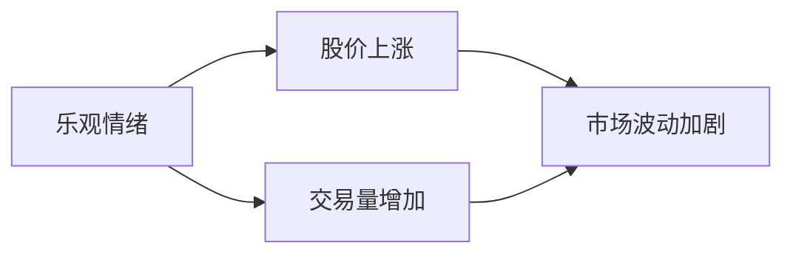

                 

# 《格雷厄姆特价股票理论对公司估值方法的影响》

## 关键词：
- 格雷厄姆特价股票理论
- 公司估值方法
- 价值投资
- 内在价值
- 安全边际

## 摘要：
本文系统地分析了格雷厄姆特价股票理论对公司估值方法的影响。从价值投资的起源到现代金融理论的发展，详细探讨了格雷厄姆理论的核心概念及其在公司估值中的具体应用。通过数学模型、系统架构设计和实际案例分析，本文深入剖析了格雷厄姆理论在公司估值中的优势与局限性，并提出了结合现代金融理论和行为金融学的改进方向。

---

## 第一章: 价值投资与格雷厄姆特价股票理论概述

### 1.1 价值投资的起源与发展

#### 1.1.1 价值投资的起源
价值投资是一种以基本面分析为基础的投资策略，其核心在于寻找市场价格低于其内在价值的股票。这一理论起源于20世纪初，由本杰明·格雷厄姆和戴维·多德共同提出。格雷厄姆在《证券分析》和《聪明的投资者》等著作中，系统阐述了价值投资的理论与方法。

| **理论特点** | **具体表现** |
|--------------|--------------|
| 长期投资视角 | 强调买入并持有，而非频繁交易 |
| 基于基本面分析 | 通过财务报表分析评估企业价值 |
| 安全边际概念 | 买入价格低于内在价值，以降低风险 |

#### 1.1.2 格雷厄姆与价值投资的关联
格雷厄姆是价值投资的鼻祖，他的理论深刻影响了后来的投资者，如沃伦·巴菲特。格雷厄姆强调安全边际的重要性，即买入价格低于内在价值，以确保投资的安全性。这种思想在公司估值中尤为重要，尤其是在市场波动剧烈的情况下。

#### 1.1.3 格雷厄姆理论的核心思想
格雷厄姆的核心思想是：市场价格围绕内在价值波动，投资者应寻找市场价格低于内在价值的股票进行投资。这种理论为公司估值提供了新的视角，尤其是在经济周期波动中，如何通过安全边际来降低投资风险。

### 1.2 格雷厄姆特价股票理论的定义与特点

#### 1.2.1 特价股票的定义
格雷厄姆提出的“特价股票”是指市场价格远低于其内在价值的股票。这种股票通常被市场忽视或低估，具有较大的增值潜力。以下是特价股票的定义与特点对比：

| **特性**        | **描述**                                                                 |
|-----------------|--------------------------------------------------------------------------|
| 市场价格       | 远低于内在价值                                                           |
| 风险较低       | 安全边际的存在降低了投资风险                                             |
| 增值潜力       | 内在价值的回归提供了潜在的收益                                           |

#### 1.2.2 安全边际的概念与重要性
安全边际是格雷厄姆理论中的核心概念，是指买入价格与内在价值之间的差距。安全边际越大，投资风险越小。以下是安全边际与风险的关系图：

#### 1.2.3 内在价值与市场价格的关系
内在价值是公司未来现金流的现值，而市场价格则受到市场情绪和短期因素的影响。以下是内在价值与市场价格的关系对比表：

| **因素**       | **内在价值** | **市场价格** |
|----------------|--------------|--------------|
| 稳定性         | 高           | 低           |
| 可预测性       | 高           | 低           |
| 时间跨度       | 长期         | 短期         |

#### 1.2.4 格雷厄姆理论与现代金融理论的对比
格雷厄姆理论与现代金融理论在假设、方法和目标上有显著差异。以下是两者的对比：

| **方面**       | **格雷厄姆理论**                     | **现代金融理论**                     |
|----------------|------------------------------------|------------------------------------|
| 核心假设       | 市场价格围绕内在价值波动             | 有效市场假说，价格反映所有信息       |
| 投资策略       | 价值投资，寻找低估股票             | 多元化投资，分散风险                 |
| 风险管理       | 安全边际降低风险                   | 利用现代统计方法管理风险             |

### 1.3 格雷厄姆理论的核心要素

#### 1.3.1 内在价值的计算方法
内在价值是公司未来现金流的现值，通常使用现金流折现法（DCF）进行计算。以下是DCF模型的步骤：

1. 预测未来现金流。
2. 确定合适的折现率。
3. 计算未来现金流的现值。
4. 加上终值，得到公司内在价值。

公式表示为：
$$ V = \sum_{t=1}^{n} \frac{CF_t}{(1+r)^t} + \frac{TV}{(1+r)^n} $$

其中：
- $V$ 表示公司内在价值
- $CF_t$ 表示第 $t$ 年的现金流
- $r$ 表示折现率
- $TV$ 表示终值

#### 1.3.2 安全边际的计算公式
安全边际是买入价格与内在价值的差额，公式为：
$$ \text{安全边际} = \text{内在价值} - \text{市场价格} $$

以下是安全边际与投资风险的关系图：

#### 1.3.3 市场心理与周期性波动
市场心理和周期性波动对股票价格有显著影响。以下是市场周期与股票价格的关系图：

### 1.4 格雷厄姆理论的局限性与改进方向

#### 1.4.1 格雷厄姆理论的局限性
格雷厄姆理论在实际应用中存在一些局限性，例如：
- 无法应对市场短期波动
- 忽略了通货膨胀的影响
- 未充分考虑管理层因素

#### 1.4.2 现代对公司估值方法的改进
现代金融理论在格雷厄姆的基础上进行了改进，例如引入了资本资产定价模型（CAPM）和套利定价理论（APT）。

#### 1.4.3 结合理财学与行为金融学的新视角
行为金融学强调投资者心理对市场的影响，这为格雷厄姆理论提供了新的视角。

### 1.5 本章小结
本章介绍了格雷厄姆特价股票理论的核心概念、数学模型和与现代金融理论的对比，为后续分析奠定了基础。

---

## 第二章: 格雷厄姆特价股票理论的核心数学模型与公式

### 2.1 内在价值的计算公式

#### 2.1.1 内在价值的定义
内在价值是公司未来现金流的现值，通常使用现金流折现法（DCF）进行计算。

#### 2.1.2 现金流折现法公式
$$ V = \sum_{t=1}^{n} \frac{CF_t}{(1+r)^t} + \frac{TV}{(1+r)^n} $$

其中：
- $V$ 表示公司内在价值
- $CF_t$ 表示第 $t$ 年的现金流
- $r$ 表示折现率
- $TV$ 表示终值

#### 2.1.3 格雷厄姆的内在价值计算方法
格雷厄姆的内在价值计算方法强调安全边际，通常采用较低的折现率和保守的现金流预测。

### 2.2 安全边际的计算公式

#### 2.2.1 安全边际的定义
安全边际是买入价格与内在价值的差额，公式为：
$$ \text{安全边际} = \text{内在价值} - \text{市场价格} $$

#### 2.2.2 安全边际的重要性
安全边际越大，投资风险越小。以下是安全边际与投资风险的关系图：

### 2.3 市场价格波动的数学模型

#### 2.3.1 随机游走模型
市场价格波动可以用随机游走模型描述：
$$ P_{t+1} = P_t + \epsilon_t $$
其中，$\epsilon_t$ 是随机误差项。

#### 2.3.2 市场波动与投资者心理的关系
市场波动与投资者心理密切相关，以下是市场情绪与股价波动的关系图：

#### 2.3.3 市场周期性波动的数学分析
市场周期性波动可以用均值回归模型描述：
$$ P_t = \mu + \beta_t $$
其中，$\mu$ 是市场均值，$\beta_t$ 是波动项。

### 2.4 格雷厄姆理论的数学模型总结

#### 2.4.1 内在价值与市场价格的关系
内在价值与市场价格的关系可以用以下公式表示：
$$ V = \sum_{t=1}^{n} \frac{CF_t}{(1+r)^t} + \frac{TV}{(1+r)^n} $$
$$ P = V + \epsilon $$
其中，$\epsilon$ 是市场价格波动项。

#### 2.4.2 安全边际的量化方法
安全边际的量化方法可以用以下公式表示：
$$ \text{安全边际} = V - P $$

#### 2.4.3 市场波动对投资决策的影响
市场波动对投资决策的影响可以用以下公式表示：
$$ \text{投资决策} = \begin{cases} 
\text{买入} & \text{如果 } P < V \\
\text{持有} & \text{如果 } P = V \\
\text{卖出} & \text{如果 } P > V 
\end{cases} $$

### 2.5 本章小结
本章详细介绍了格雷厄姆理论中的数学模型与公式，包括内在价值的计算、安全边际的量化以及市场波动的数学分析。

---

## 第三章: 格雷厄姆理论对公司估值方法的影响

### 3.1 格雷厄姆理论对现代公司估值的核心影响

#### 3.1.1 内在价值计算的影响
格雷厄姆的内在价值计算方法为现代DCF模型奠定了基础。

#### 3.1.2 安全边际概念的推广
安全边际的概念被广泛应用于投资组合管理和风险管理。

#### 3.1.3 价值投资策略的普及
价值投资策略在机构投资者和散户中得到了广泛应用。

### 3.2 格雷厄姆理论在公司估值中的具体应用

#### 3.2.1 现金流折现法的应用
现金流折现法是格雷厄姆理论的核心工具之一，广泛应用于公司估值。

#### 3.2.2 市盈率与市净率的比较
市盈率和市净率是常用的估值指标，以下是两者的对比表：

| **指标**       | **公式**                          | **应用场景**                  |
|----------------|----------------------------------|------------------------------|
| 市盈率         | $P/E = \frac{P}{E} $             | 用于评估盈利能力               |
| 市净率         | $P/B = \frac{P}{B} $             | 用于评估资产价值               |

#### 3.2.3 企业价值倍数的使用
企业价值倍数（EV/EBITDA）是另一种常用的估值指标，公式为：
$$ \text{EV/EBITDA} = \frac{EV}{\text{EBITDA}} $$

### 3.3 格雷厄姆理论与其他估值方法的结合

#### 3.3.1 格雷厄姆与DCF模型的结合
将格雷厄姆的安全边际概念与DCF模型结合，可以提高估值的准确性。

#### 3.3.2 格雷厄姆与相对估值法的结合
相对估值法（如市盈率、市净率）可以与格雷厄姆的内在价值概念结合，用于交叉验证。

#### 3.3.3 格雷厄姆与情景分析法的结合
情景分析法可以用于评估不同市场条件下格雷厄姆理论的应用效果。

### 3.4 格雷厄姆理论的局限性与改进方向

#### 3.4.1 格雷厄姆理论的局限性
格雷厄姆理论在应对市场短期波动和复杂经济环境时存在局限性。

#### 3.4.2 现代对公司估值方法的改进
现代金融理论在格雷厄姆的基础上，引入了资本资产定价模型（CAPM）和套利定价理论（APT）。

#### 3.4.3 结合理财学与行为金融学的新视角
行为金融学为格雷厄姆理论提供了新的视角，强调投资者心理和市场情绪对估值的影响。

### 3.5 本章小结
本章分析了格雷厄姆理论对公司估值方法的深远影响，探讨了其在实际应用中的优势与局限性，并提出了结合现代金融理论和行为金融学的改进方向。

---

## 作者：AI天才研究院/AI Genius Institute & 禅与计算机程序设计艺术 /Zen And The Art of Computer Programming

