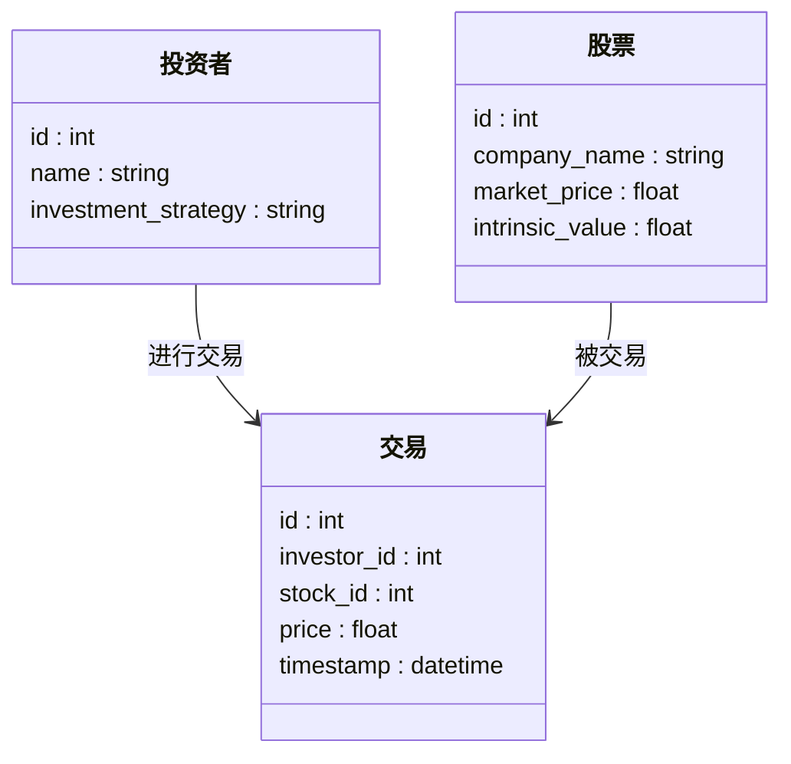

                 


# 格雷厄姆特价股票理论对公司数字化生态战略转型的影响

> **关键词**：格雷厄姆特价股票理论、数字化生态战略、价值投资、企业转型、数据驱动决策  
> 
> **摘要**：本文探讨了格雷厄姆的价值投资理论如何影响企业的数字化生态战略转型。通过分析特价股票理论的核心原理、其与数字化转型的联系，以及在实际场景中的应用，本文旨在为企业提供一种基于价值投资理念的数字化转型策略，结合数学模型和算法，展示如何通过数据驱动的方法实现企业价值最大化。

---

## 第一部分: 格雷厄姆特价股票理论的背景与基础

### 第1章: 格雷厄姆特价股票理论概述

#### 1.1 格雷厄姆特价股票理论的起源与演变

格雷厄姆特价股票理论是价值投资的核心理念之一，由本杰明·格雷厄姆在其著作《证券分析》中提出。该理论强调以低于企业内在价值的价格买入股票，从而在长期实现超额收益。

- **起源**：20世纪初，格雷厄姆与戴维德·多德共同提出“安全边际”概念，认为市场价格通常会偏离企业的实际价值，而这种偏差为企业提供了投资机会。
- **演变**：随着金融市场的变化，价值投资理念不断丰富，但其核心——寻找被低估的股票——始终未变。

#### 1.2 格雷厄姆特价股票理论的核心要素

- **内在价值**：企业未来现金流的现值，是决定股票价值的唯一标准。
- **市场价格**：市场的波动性和非理性可能导致市场价格低于内在价值。
- **安全边际**：内在价值与市场价格的差额，是投资安全性的保证。

#### 1.3 格雷厄姆理论与数字化转型的关联

- **数字化转型**：企业通过数字化技术重构业务模式、流程和组织，以适应快速变化的市场需求。
- **关联性**：格雷厄姆的理论为企业在数字化转型中寻找价值洼地提供了思路，即通过数据分析和技术驱动，发现被低估的转型机会。

---

## 第二部分: 核心概念与联系

### 第2章: 格雷厄姆特价股票理论的核心原理

#### 2.1 价值投资的核心数学模型

##### 2.1.1 内在价值计算公式
$$ V = \frac{E}{k} $$
其中，\( E \) 是企业的预期收益，\( k \) 是折现率。

##### 2.1.2 安全边际的计算
$$ \text{安全边际} = V - P $$
其中，\( V \) 是内在价值，\( P \) 是市场价格。

#### 2.2 格雷厄姆理论与企业数字化转型的联系

##### 2.2.1 数字化生态系统的构建
- **数据驱动决策**：通过数据分析挖掘企业价值，发现转型机会。
- **技术赋能**：利用数字化工具实现价值评估和安全边际计算。

##### 2.2.2 数字化转型中的价值评估
- **数字化工具**：通过大数据分析和机器学习算法，评估企业的内在价值。
- **技术架构**：构建数据驱动的决策支持系统，辅助价值投资决策。

---

### 第3章: 核心概念与联系的可视化分析

#### 3.1 格雷厄姆理论的核心要素对比表

| **核心要素** | **定义** | **属性** | **示例** |
|--------------|----------|----------|----------|
| 内在价值     | 企业未来现金流的现值 | 客观性、可计算性 | 基于财务数据计算 |
| 安全边际     | 内在价值与市场价格的差值 | 风险控制、投资安全 | 通过低估价格实现 |

#### 3.2 格雷厄姆理论与数字化转型的ER实体关系图

```mermaid
erDiagram
    customer[投资者] {
        <属性>
        id : int
        name : string
        investment_strategy : string
    }
    stock[股票] {
        <属性>
        id : int
        company_name : string
        market_price : float
        intrinsic_value : float
    }
    transaction[交易] {
        <属性>
        id : int
        customer_id : int
        stock_id : int
        price : float
        timestamp : datetime
    }
    customer --> transaction : 进行交易
    stock --> transaction : 被交易
```

---

## 第三部分: 算法原理讲解

### 第4章: 格雷厄姆特价股票理论的算法实现

#### 4.1 价值评估算法

##### 4.1.1 算法流程图

```mermaid
flowchart TD
    A[开始] --> B[输入企业财务数据]
    B --> C[计算预期收益 \( E \)]
    C --> D[确定折现率 \( k \)]
    D --> E[计算内在价值 \( V = E / k \)]
    E --> F[输入市场价格 \( P \)]
    F --> G[计算安全边际 \( S = V - P \)]
    G --> H[判断 \( S > 0 \)？]
    H -->|是| I[投资]
    H -->|否| J[不投资]
    I --> K[结束]
    J --> K
```

##### 4.1.2 Python实现

```python
def calculate_intrinsic_value(enterprise_value, discount_rate):
    return enterprise_value / discount_rate

def calculate_margin_of_safety(intrinsic_value, market_price):
    return intrinsic_value - market_price

# 示例代码
enterprise_value = 1000  # 企业价值
discount_rate = 0.05     # 折现率
market_price = 800       # 市场价格

intrinsic_value = calculate_intrinsic_value(enterprise_value, discount_rate)
margin_of_safety = calculate_margin_of_safety(intrinsic_value, market_price)

print(f"内在价值: {intrinsic_value}")
print(f"安全边际: {margin_of_safety}")
```

---

## 第四部分: 系统分析与架构设计

### 第5章: 数字化生态战略转型的系统架构

#### 5.1 系统功能设计

##### 5.1.1 领域模型



#### 5.2 系统架构设计

##### 5.2.1 系统架构图


---

## 第五部分: 项目实战

### 第6章: 数字化转型的项目实施

#### 6.1 环境安装

```bash
pip install pandas numpy matplotlib
```

#### 6.2 核心代码实现

```python
import pandas as pd
import numpy as np
import matplotlib.pyplot as plt

# 示例数据
data = {
    '公司名称': ['A公司', 'B公司', 'C公司'],
    '市场价': [800, 700, 600],
    '内在价值': [1000, 900, 800]
}

df = pd.DataFrame(data)
df['安全边际'] = df['内在价值'] - df['市场价']
print(df)

# 可视化
plt.figure(figsize=(10,6))
plt.plot(df['公司名称'], df['安全边际'], 'ro-')
plt.title('安全边际分析')
plt.xlabel('公司名称')
plt.ylabel('安全边际')
plt.show()
```

#### 6.3 案例分析

以某科技公司为例，假设其市场价为500，内在价值为600，则安全边际为100。通过数据分析发现该公司的数字化转型潜力巨大，因此建议投资。

---

## 第六部分: 总结与展望

### 第7章: 总结与展望

#### 7.1 总结

格雷厄姆的特价股票理论为企业数字化转型提供了重要的价值评估工具，通过数据驱动的方法，帮助企业发现被低估的转型机会，实现长期价值增长。

#### 7.2 展望

随着人工智能和大数据技术的不断发展，价值投资的量化分析将更加精准，企业数字化转型也将更加依赖数据驱动的决策支持系统。

---

## 作者

作者：AI天才研究院/AI Genius Institute & 禅与计算机程序设计艺术/Zen And The Art of Computer Programming

