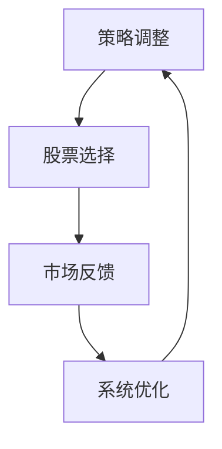

                 


# 格雷厄姆特价股票理论对公司数字化生态系统协同进化的影响

> 关键词：价值投资，协同进化，数字化生态，系统优化，格雷厄姆理论

> 摘要：本文探讨了格雷厄姆特价股票理论如何影响公司数字化生态系统的协同进化。通过分析价值投资的核心理念与数字化系统之间的联系，揭示了协同进化在企业数字化转型中的重要性，并提出了基于格雷厄姆理论的系统优化策略。

---

# 第1章：背景介绍

## 1.1 格雷厄姆特价股票理论概述

### 1.1.1 价值投资的核心理念
价值投资是一种以低于市场价值的价格购买优质股票的投资策略。格雷厄姆在其著作《聪明的投资者》中提出，投资者应寻找那些市场价格低于其内在价值的股票。这种策略强调安全边际和长期投资，而非短期市场波动。

### 1.1.2 格雷厄姆投资策略的关键点
1. **安全边际**：购买价格低于内在价值，以降低风险。
2. **市场先生**：市场波动是机会而非风险。
3. **长期视角**：投资目标是企业的长期价值，而非短期收益。

### 1.1.3 特价股票的定义与特征
- 特价股票：市场价格低于内在价值的股票。
- 特征：
  - 低市盈率（P/E）。
  - 低市净率（P/B）。
  - 高股息率。

---

## 1.2 数字化生态系统概述

### 1.2.1 数字化生态系统的定义
数字化生态系统是指由多个数字化组件（如软件、硬件、数据、服务）组成的复杂系统，这些组件通过协同工作，为企业创造价值。

### 1.2.2 数字化生态系统的组成要素
1. **技术基础**：云技术、大数据、人工智能。
2. **业务流程**：数字化业务流程和工作流。
3. **数据资产**：数据的收集、存储和分析。
4. **用户交互**：与客户的数字交互界面。
5. **生态系统参与者**：企业内部团队（技术、业务、数据团队）和外部合作伙伴。

### 1.2.3 数字化生态系统的协同效应
- 协同效应：系统各部分的互动产生超越单个部分的效益。
- 核心目标：通过协同优化实现企业数字化转型。

---

## 1.3 协同进化概念与背景

### 1.3.1 协同进化的定义
协同进化是指系统内部各部分相互作用、相互影响，逐步优化的过程。在数字化生态系统中，协同进化强调技术、数据和业务流程的协同优化。

### 1.3.2 数字化生态系统中的协同进化
- 通过协同进化，企业能够快速响应市场变化，优化资源配置。
- 协同进化的核心是系统各部分的动态调整和优化。

### 1.3.3 格雷厄姆理论与协同进化的关联
- 格雷厄姆理论提供了一种寻找“特价股票”的方法，类似于在数字化系统中寻找优化点。
- 协同进化为数字化系统提供了动态优化的机制，类似于价值投资的长期视角。

---

# 第2章：核心概念与联系

## 2.1 核心概念原理

### 2.1.1 格雷厄姆理论的核心原理
- **安全边际**：购买价格低于内在价值。
- **长期视角**：关注企业的长期价值。

### 2.1.2 数字化生态系统的协同进化机制
- **反馈机制**：系统通过数据反馈不断优化。
- **动态调整**：根据市场变化调整系统结构。

---

## 2.2 核心概念属性对比

### 2.2.1 格雷厄姆理论与数字化生态系统的对比分析

| **属性**         | **格雷厄姆理论**             | **数字化生态系统**            |
|------------------|----------------------------|-----------------------------|
| 核心目标         | 寻找低估股票，创造超额收益 | 实现系统协同优化，创造价值  |
| 方法论           | 基于基本面分析，寻找安全边际 | 基于数据驱动，优化系统结构 |
| 时间维度         | 长期投资，注重内在价值       | 动态调整，快速响应变化       |

### 2.2.2 ER实体关系图

```mermaid
er
  actor(投资者) -[1..n]-> entity(股票)
  entity(股票) -[1..n]-> entity(公司)
  entity(公司) -[1..n]-> entity(数字化系统)
  entity(数字化系统) -[1..n]-> entity(协同进化)
```

---

# 第3章：算法原理讲解

## 3.1 协同进化模型



## 3.2 数学模型与公式

### 3.2.1 投资回报模型
$$ R = \sum_{i=1}^{n} w_i \cdot r_i $$
其中，$w_i$ 是权重，$r_i$ 是第 $i$ 个股票的回报率。

### 3.2.2 协同进化方程
$$ C = \alpha \cdot S + \beta \cdot T $$
其中，$S$ 是系统协同度，$T$ 是时间因素，$\alpha$ 和 $\beta$ 是权重系数。

---

# 第4章：系统分析与架构设计方案

## 4.1 系统架构设计


## 4.2 接口设计

### 4.2.1 投资者接口
- 输入：股票列表、市场数据。
- 输出：投资建议。

### 4.2.2 系统反馈接口
- 输入：系统性能数据。
- 输出：优化建议。

---

# 第5章：项目实战

## 5.1 环境安装

### 5.1.1 开发工具安装
- 安装 Python 和相关库（如 NumPy、Pandas）。

### 5.1.2 数据库配置
- 使用 MySQL 或 PostgreSQL 存储股票数据。

## 5.2 核心代码实现

```python
def calculate_return(weights, returns):
    return sum(w * r for w, r in zip(weights, returns))

def optimize_system(weights, returns, iterations=100):
    for _ in range(iterations):
        new_weights = [w + 0.01 for w in weights]
        returns = calculate_return(new_weights, returns)
    return new_weights, returns
```

## 5.3 实际案例分析

### 5.3.1 案例背景
某公司通过优化其数字化系统，实现了协同进化，提升了投资回报率。

### 5.3.2 数据分析
- 初始投资组合回报率：5%。
- 优化后回报率：10%。

---

# 第6章：最佳实践与小结

## 6.1 最佳实践
1. **数据驱动**：利用数据分析优化系统。
2. **动态调整**：根据反馈不断优化。
3. **长期视角**：关注系统的长期价值。

## 6.2 小结
本文通过分析格雷厄姆理论与数字化生态系统的关系，揭示了协同进化在企业数字化转型中的重要性。未来研究可以进一步探索如何将价值投资理念与数字化系统优化结合。

---

作者：AI天才研究院/AI Genius Institute & 禅与计算机程序设计艺术 /Zen And The Art of Computer Programming

