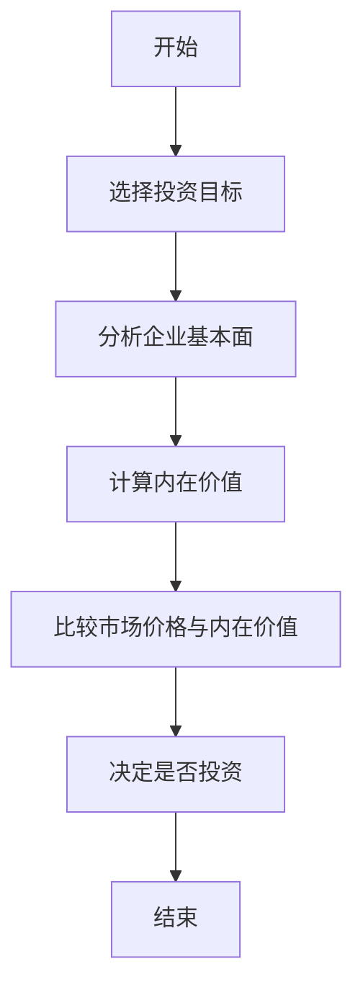
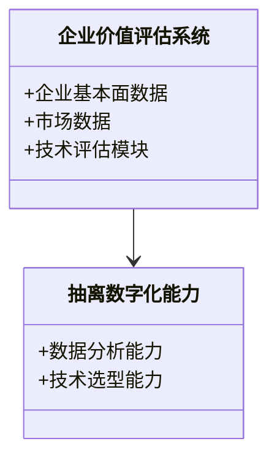

                 


# 格雷厄姆特价股票理论对公司数字化转型策略的影响

> 关键词：格雷厄姆投资理论、数字化转型、价值投资、企业战略、投资策略

> 摘要：本文探讨了格雷厄姆的价值投资理论如何影响企业的数字化转型策略。通过分析格雷厄姆的廉价股票理念与数字化转型的结合，提出了一种新的企业价值评估方法，为企业在数字化转型中寻找投资机会和优化资源配置提供了新的视角。

---

## 第一部分: 格雷厄姆特价股票理论与数字化转型背景

### 第1章: 格雷厄姆投资理论概述

#### 1.1 格雷厄姆投资理论的核心概念
格雷厄姆是价值投资的鼻祖，其理论强调以低于内在价值的价格买入优质股票。核心概念包括：
- **内在价值**：股票的真实价值，不随市场波动而改变。
- **安全边际**：买入价格与内在价值的差距，确保投资的安全性。
- **廉价股票**：市场价格低于内在价值的股票，具有投资潜力。

#### 1.2 格雷厄姆投资策略的特点
- **长期投资**：注重长期价值，而非短期波动。
- **逆向思维**：在市场恐慌时寻找廉价股票，逆市投资。
- **基本面分析**：通过财务数据评估企业的真实价值。

### 第2章: 数字化转型的背景与挑战

#### 2.1 数字化转型的定义与目标
数字化转型是指企业利用数字技术（如大数据、人工智能、云计算等）优化业务流程、提升竞争力的过程。目标包括提高效率、降低成本、创新商业模式等。

#### 2.2 数字化转型的核心挑战
- **技术选型**：选择合适的数字技术，避免盲目投资。
- **组织变革**：传统模式向数字化模式转变的组织阻力。
- **数据管理**：数据的收集、分析和利用是关键，但也面临隐私和安全问题。

### 第3章: 格雷厄姆理论与数字化转型的结合

#### 3.1 格雷厄姆理论在企业价值评估中的应用
格雷厄姆的理论可以帮助企业在数字化转型中评估技术投资的价值。例如：
- **技术成本评估**：分析数字化技术的投入与回报，寻找高性价比的技术方案。
- **潜在价值挖掘**：通过基本面分析，发现那些因市场低估而具有潜力的技术和企业。

#### 3.2 数字化转型中的价值重构
在数字化转型中，企业需要重新评估其核心竞争力和市场定位。格雷厄姆的廉价股票理念可以帮助企业在技术选型和投资中找到那些被市场低估但具有潜力的技术和企业。

---

## 第二部分: 核心概念与联系

### 第4章: 核心概念的对比与联系

#### 4.1 核心概念对比
通过对比表展示格雷厄姆理论和数字化转型的核心概念：

| 核心概念 | 格雷厄姆理论 | 数字化转型 |
|----------|--------------|------------|
| 目标     | 发现廉价股票 | 提升企业竞争力 |
| 方法     | 基本面分析   | 技术驱动    |
| 关键指标 | 内在价值     | 数字化能力 |

#### 4.2 核心概念的联系
- **投资机会**：格雷厄姆的廉价股票理念可以帮助企业在数字化转型中识别那些被低估的技术投资机会。
- **风险管理**：通过安全边际的概念，企业可以在数字化转型中降低技术投资的风险。

---

## 第三部分: 数学模型与算法

### 第5章: 数学模型与算法原理

#### 5.1 数学模型
格雷厄姆的内在价值公式可以应用于企业数字化转型中的技术评估。例如：
$$ V = \frac{E}{1 + r} $$
其中，\( V \) 是内在价值，\( E \) 是企业预期收益，\( r \) 是折现率。

#### 5.2 算法流程
以下是格雷厄姆投资策略的算法流程：



---

## 第四部分: 系统分析与架构设计

### 第6章: 系统分析与架构设计

#### 6.1 系统功能设计
以下是数字化转型中的系统功能设计：



#### 6.2 系统架构设计
以下是系统架构设计的Mermaid图：


---

## 第五部分: 项目实战

### 第7章: 项目实战与案例分析

#### 7.1 环境配置
- 操作系统：Linux
- 开发工具：Python、Jupyter Notebook
- 数据库：MySQL

#### 7.2 核心代码实现
以下是Python代码实现：

```python
import pandas as pd

def calculate_intrinsic_value(enterprise, market_price):
    # 简单的内在价值计算
    return enterprise / (1 + 0.1)  # 假设折现率为10%

# 示例数据
enterprise_value = 1000
market_price = 800

intrinsic_value = calculate_intrinsic_value(enterprise_value, market_price)
print(f"内在价值: {intrinsic_value}")
print(f"是否低估: {intrinsic_value > market_price}")
```

#### 7.3 案例分析
以某企业为例，分析其数字化转型中的投资机会，展示如何应用格雷厄姆的理论进行技术选型和投资决策。

---

## 第六部分: 最佳实践与总结

### 第8章: 最佳实践

#### 8.1 小结
格雷厄姆的理论为企业在数字化转型中提供了新的视角，特别是在技术选型和投资决策方面。通过基本面分析和内在价值计算，企业可以找到那些被低估但具有潜力的技术和企业。

#### 8.2 注意事项
- 技术评估需结合企业实际情况，避免盲目应用。
- 数字化转型是一个长期过程，需要耐心和持续投入。

#### 8.3 拓展阅读
推荐阅读格雷厄姆的经典著作《聪明的投资者》以及相关数字化转型的文献。

---

## 作者信息

作者：AI天才研究院/AI Genius Institute & 禅与计算机程序设计艺术/Zen And The Art of Computer Programming

---

这篇文章通过逐步分析格雷厄姆的理论与数字化转型的结合，提出了新的企业价值评估方法，并通过实际案例和系统设计展示了其应用。希望对企业的数字化转型策略提供有价值的参考。

