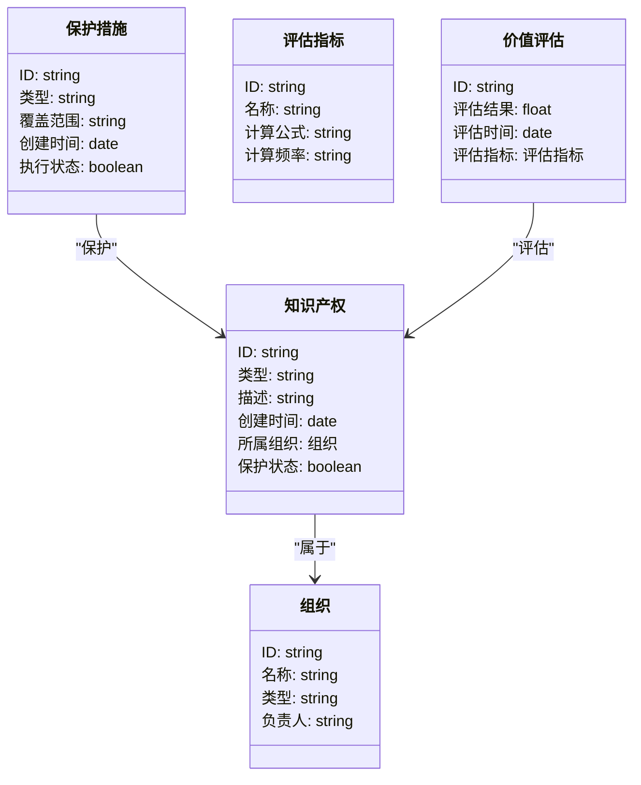
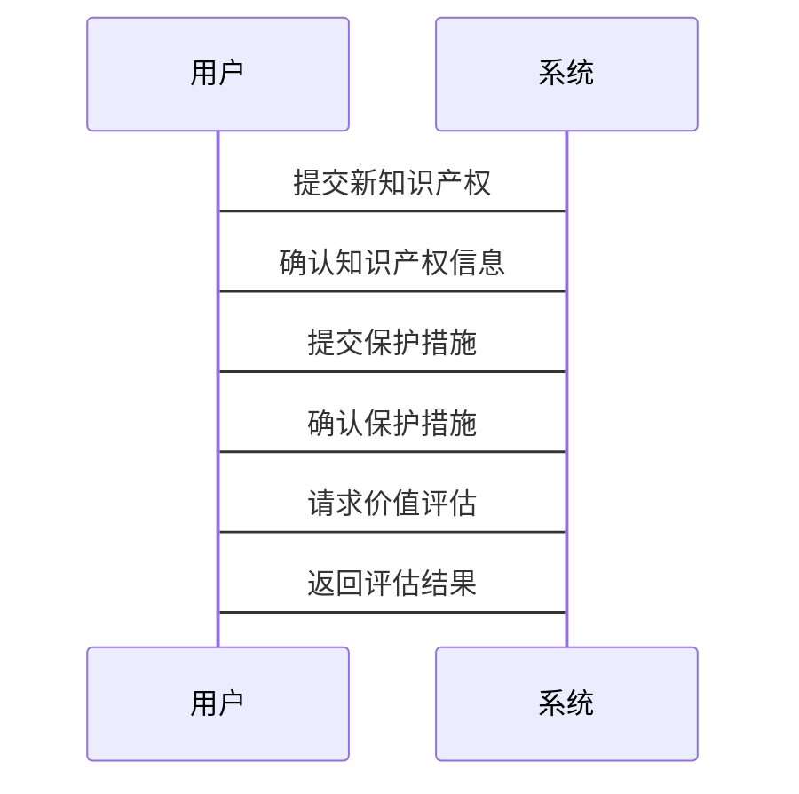

                 


# 第6章: 数字知识产权的系统分析与架构设计

## 6.1 问题场景介绍

### 6.1.1 问题背景
数字知识产权生态系统是一个复杂的系统，涉及知识产权的生成、保护、管理和商业化等多个环节。在这个系统中，企业需要面对内部和外部的多种挑战，包括技术风险、法律风险、市场竞争风险等。

### 6.1.2 问题描述
为了有效管理和优化数字知识产权生态系统，企业需要一个系统化的架构来整合各种资源、技术和策略。该系统需要具备以下功能：
1. 知识产权的生成与记录
2. 知识产权的保护与监控
3. 知识产权的评估与价值计算
4. 知识产权的商业化与运营

### 6.1.3 问题解决
通过构建一个系统化的数字知识产权管理系统，企业可以更好地控制和优化其知识产权资产，从而提升整体竞争力和价值创造能力。

## 6.2 系统功能设计

### 6.2.1 领域模型
以下是数字知识产权管理系统的核心领域模型，展示了各个实体之间的关系：



### 6.2.2 系统架构设计

以下是数字知识产权管理系统的分层架构设计：


### 6.2.3 系统接口设计

以下是系统的主要接口设计：

1. 知识产权创建接口
2. 知识产权保护措施创建接口
3. 知识产权评估接口
4. 知识产权查询与统计接口
5. 第三方系统集成接口（如法务系统、市场分析工具等）

### 6.2.4 系统交互设计

以下是用户与数字知识产权管理系统之间的交互流程：



## 6.3 项目实战

### 6.3.1 环境安装
为了实现数字知识产权管理系统，我们需要以下环境：
1. Python 3.8+
2. Django框架
3. PostgreSQL数据库
4. Redis缓存
5. Docker容器化部署

### 6.3.2 核心实现源代码

以下是系统核心模块的实现代码：

```python
from django.db import models

class IntellectualProperty(models.Model):
    IP_TYPE_CHOICES = [
        ('pat', '专利'),
        ('cop', '版权'),
        ('mar', '商标'),
    ]
    id = models.CharField(max_length=50, primary_key=True)
    type = models.CharField(max_length=3, choices=IP_TYPE_CHOICES)
    description = models.TextField()
    creation_date = models.DateTimeField(auto_now_add=True)
    owning_organization = models.ForeignKey('Organization', on_delete=models.CASCADE)
    protected = models.BooleanField(default=False)

    def __str__(self):
        return f"{self.id} {self.type}"

class Organization(models.Model):
    id = models.CharField(max_length=50, primary_key=True)
    name = models.CharField(max_length=100)
    type = models.CharField(max_length=50)
    responsible_person = models.CharField(max_length=100)

    def __str__(self):
        return self.name

class ProtectionMeasure(models.Model):
    id = models.CharField(max_length=50, primary_key=True)
    measure_type = models.CharField(max_length=50)
    coverage = models.TextField()
    creation_date = models.DateTimeField(auto_now_add=True)
    associated_ip = models.ForeignKey(IntellectualProperty, on_delete=models.CASCADE)
    status = models.CharField(max_length=20, default='pending')

    def __str__(self):
        return f"{self.id} {self.measure_type}"

class ValueMetric(models.Model):
    id = models.CharField(max_length=50, primary_key=True)
    name = models.CharField(max_length=100)
    calculation_formula = models.TextField()
    calculation_frequency = models.CharField(max_length=50)

    def __str__(self):
        return self.name

class ValueAssessment(models.Model):
    id = models.CharField(max_length=50, primary_key=True)
    assessment_result = models.FloatField(default=0)
    assessment_date = models.DateTimeField(auto_now_add=True)
    associated_metric = models.ForeignKey(ValueMetric, on_delete=models.CASCADE)

    def __str__(self):
        return f"{self.id} {self.assessment_result}"
```

### 6.3.3 代码应用解读

上述代码实现了数字知识产权管理系统的数据模型，包括知识产权、组织、保护措施和价值评估等核心模块。每个模型都定义了相应的字段和关系，确保系统能够有效地管理数字知识产权资产。

### 6.3.4 实际案例分析

以一家科技公司为例，假设该公司希望优化其专利布局。通过该系统，公司可以：
1. 提交新的专利申请
2. 设定保护措施（如申请专利保护）
3. 定期评估专利的价值
4. 根据评估结果调整专利布局策略

## 6.4 系统小结

通过构建数字知识产权管理系统，企业可以实现对知识产权资产的系统化管理，提升价值创造能力和风险控制能力。

---

# 第7章: 基于格雷厄姆理论的知识产权战略优化

## 7.1 知识产权管理的战略优化

### 7.1.1 战略调整
基于格雷厄姆理论的价值投资理念，企业需要重新审视其知识产权战略，优化资源配置，重点投资具有长期战略价值的知识产权资产。

### 7.1.2 运营优化
通过引入数据驱动的管理方法，优化知识产权的生成、保护和商业化过程，提升整体运营效率。

### 7.1.3 价值提升
通过精准的价值评估和投资决策，最大化知识产权资产的市场价值。

## 7.2 案例分析: 科技公司专利布局优化

### 7.2.1 案例背景
某科技公司通过分析其专利布局，发现部分专利的价值被低估，而部分专利的保护措施不足。

### 7.2.2 战略调整
1. 重新评估现有专利的价值，识别具有高潜力的专利
2. 加强高潜力专利的保护措施
3. 调整专利布局策略，重点投资高潜力专利
4. 定期评估专利组合的价值，动态优化布局

## 7.3 数字知识产权战略优化的数学模型

### 7.3.1 价值评估模型
$$ V = \sum_{i=1}^{n} w_i \cdot v_i $$
其中，\( V \) 是知识产权组合的总价值，\( w_i \) 是第 \( i \) 个知识产权的权重，\( v_i \) 是第 \( i \) 个知识产权的价值。

### 7.3.2 投资决策模型
$$ I = \sum_{j=1}^{m} p_j \cdot c_j $$
其中，\( I \) 是知识产权投资的总成本，\( p_j \) 是第 \( j \) 个知识产权的投资概率，\( c_j \) 是第 \( j \) 个知识产权的投资成本。

## 7.4 案例分析: 互联网企业的版权管理

### 7.4.1 案例背景
某互联网企业通过分析其版权资产，发现部分版权的商业化潜力未被充分挖掘。

### 7.4.2 战略优化
1. 重新评估版权的价值，识别高潜力版权
2. 加强高潜力版权的保护措施
3. 优化版权的商业化策略
4. 定期评估版权组合的价值，动态优化管理

---

# 第8章: 数字知识产权生态系统的可持续发展

## 8.1 可持续发展的挑战与机遇

### 8.1.1 全球化挑战
数字知识产权的全球化布局需要应对不同国家和地区的法律差异和技术壁垒。

### 8.1.2 技术挑战
随着技术的快速发展，数字知识产权的保护和管理需要不断创新和适应新技术的变化。

### 8.1.3 法律与伦理挑战
数字知识产权的保护需要应对日益复杂的法律和伦理问题。

## 8.2 可持续发展的实现路径

### 8.2.1 全球化布局
通过构建全球化的知识产权网络，提升企业在国际市场上的竞争力。

### 8.2.2 技术创新
通过引入人工智能、区块链等新技术，提升数字知识产权的保护和管理效率。

### 8.2.3 风险管理
通过建立完善的风险管理机制，降低数字知识产权管理中的各种风险。

## 8.3 案例分析: 全球化企业的知识产权管理

### 8.3.1 案例背景
某全球化企业通过分析其知识产权布局，发现其在不同国家和地区的知识产权保护存在不足。

### 8.3.2 战略优化
1. 分析各国的知识产权法律环境，优化布局策略
2. 加强跨国专利和商标的保护措施
3. 建立全球化知识产权管理团队
4. 定期评估全球知识产权组合的价值，动态优化管理

## 8.4 数字知识产权生态系统的风险管理

### 8.4.1 风险识别
通过系统化的风险识别方法，识别数字知识产权管理中的各种风险。

### 8.4.2 风险评估
通过定量和定性的方法，评估各类风险的影响程度和发生概率。

### 8.4.3 风险应对
根据风险评估结果，制定相应的风险应对策略，包括风险规避、风险降低、风险转移和风险接受。

---

# 作者：AI天才研究院/AI Genius Institute & 禅与计算机程序设计艺术 /Zen And The Art of Computer Programming

---

*文章标题：格雷厄姆特价股票理论对公司数字知识产权生态系统战略的影响

*关键词：格雷厄姆理论、数字知识产权、价值投资、知识产权战略、风险管理

*摘要：本文系统地探讨了格雷厄姆特价股票理论对公司数字知识产权生态系统战略的影响。通过分析格雷厄姆理论的核心概念和数字知识产权的基本概念，揭示了两者之间的内在联系。进一步结合数字知识产权生态系统的实际应用场景，提出了基于格雷厄姆理论的知识产权战略优化方法，并通过实际案例分析验证了该方法的有效性。最后，本文展望了数字知识产权生态系统的可持续发展，为企业的知识产权管理提供了重要的理论和实践指导。

