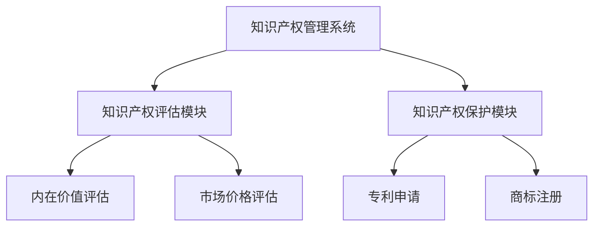
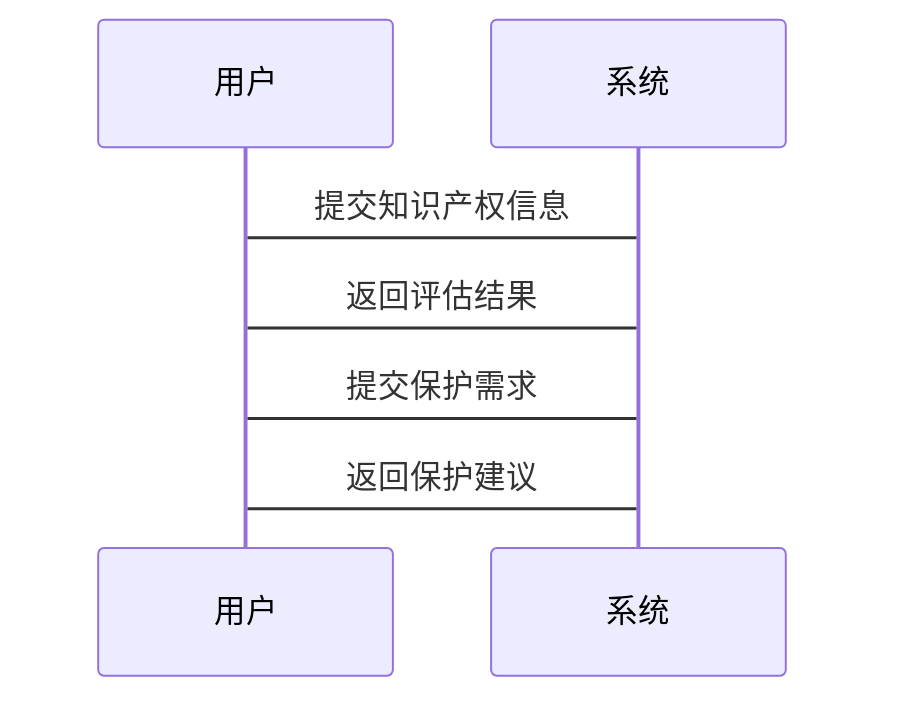

                 


# 《格雷厄姆特价股票理论对公司知识产权战略的影响》

## 关键词：格雷厄姆理论，知识产权战略，股票估值，企业价值，安全边际

## 摘要：本文探讨了格雷厄姆价值投资理论在知识产权战略中的应用，分析了知识产权如何影响企业价值，并提出了基于格雷厄姆理论的知识产权管理策略。文章从格雷厄姆理论的基本概念出发，结合知识产权的战略价值，提出了企业知识产权管理的创新方法，为企业制定知识产权战略提供了新的视角。

---

# 第1章: 格雷厄姆特价股票理论与知识产权战略的背景

## 1.1 格雷厄姆特价股票理论的核心概念

### 1.1.1 价值投资的定义与核心理念
价值投资是一种长期投资策略，强调以低于内在价值的价格购买优质资产。格雷厄姆的价值投资理论认为，市场的短期波动性为投资者提供了以折扣价买入优质资产的机会。这种理论的核心在于识别市场低估的资产，并长期持有，等待其价值回归。

### 1.1.2 格雷厄姆投资策略的关键原则
格雷厄姆的投资策略主要包括以下原则：
1. **安全边际**：买入价格低于内在价值，以确保投资的安全性。
2. **低市盈率**：选择市盈率低于市场平均水平的股票。
3. **分散投资**：通过分散投资降低风险。
4. **长期持有**：避免频繁交易，减少交易成本。

### 1.1.3 特价股票的定义与识别方法
特价股票是指市场价格低于其内在价值的股票。识别特价股票的方法包括：
1. **市盈率法**：选择市盈率低于行业平均水平的公司。
2. **市净率法**：选择市净率低于行业平均水平的公司。
3. **股息率法**：选择股息率较高的公司。

## 1.2 知识产权战略的基本概念

### 1.2.1 知识产权的定义与分类
知识产权是指创造性的智力成果所产生的权利，主要包括专利权、商标权、版权、商业秘密等。

### 1.2.2 知识产权在企业中的作用与价值
知识产权是企业的无形资产，具有以下作用：
1. **保护创新成果**：防止竞争对手抄袭。
2. **提升企业竞争力**：通过知识产权获得市场优势。
3. **增加企业价值**：知识产权是企业价值的重要组成部分。

### 1.2.3 知识产权战略的制定与实施
知识产权战略的制定包括：
1. **评估知识产权现状**：分析企业现有的知识产权资产。
2. **制定目标**：明确知识产权的战略目标。
3. **实施策略**：通过申请专利、注册商标等方式保护知识产权。

## 1.3 格雷厄姆理论与知识产权战略的结合

### 1.3.1 格雷厄姆理论在企业价值评估中的应用
格雷厄姆的内在价值公式：
$$ V = \frac{E}{1 + r} $$
其中，\( V \) 表示内在价值，\( E \) 表示未来现金流，\( r \) 表示折现率。

### 1.3.2 知识产权对企业价值的影响
知识产权是企业价值的重要组成部分，其价值可以通过以下公式计算：
$$ IPV = \sum_{t=1}^{n} \frac{CF_t}{(1 + r)^t} $$
其中，\( CF_t \) 表示第 \( t \) 年的现金流，\( r \) 表示折现率，\( n \) 表示知识产权的有效期限。

### 1.3.3 格雷厄姆理论与知识产权战略的契合点
格雷厄姆理论与知识产权战略的契合点在于：
1. **安全边际**：通过评估知识产权的安全边际，选择具有潜在增值空间的知识产权。
2. **内在价值**：通过计算知识产权的内在价值，选择具有投资价值的知识产权。

---

# 第2章: 格雷厄姆特价股票理论的核心概念与原理

## 2.1 格雷厄姆投资模型的数学公式

### 2.1.1 内在价值的计算公式
$$ V = \frac{E}{1 + r} $$
其中，\( V \) 表示内在价值，\( E \) 表示未来现金流，\( r \) 表示折现率。

### 2.1.2 安全边际的计算公式
$$ \text{安全边际} = V - P $$
其中，\( V \) 表示内在价值，\( P \) 表示市场价格。

## 2.2 格雷厄姆安全边际的概念

### 2.2.1 安全边际的定义
安全边际是指内在价值与市场价格之间的差值，用于衡量投资的安全性。

### 2.2.2 安全边际的计算方法
$$ \text{安全边际} = V - P $$

### 2.2.3 安全边际在投资决策中的作用
安全边际用于评估投资的风险，安全边际越高，投资风险越小。

## 2.3 格雷厄姆投资策略的优缺点

### 2.3.1 优点
1. **风险较低**：通过安全边际的评估，降低了投资风险。
2. **长期稳定**：格雷厄姆的投资策略注重长期持有，避免了短期波动的影响。

### 2.3.2 缺点
1. **流动性差**：格雷厄姆策略要求长期持有，可能导致流动性问题。
2. **市场反应慢**：在市场快速变化的情况下，格雷厄姆策略可能反应较慢。

### 2.3.3 适用场景分析
格雷厄姆策略适用于市场低估、企业基本面稳定的场景。

---

# 第3章: 格雷厄姆理论与知识产权战略

## 3.1 格雷厄姆理论在知识产权战略中的应用

### 3.1.1 知识产权的内在价值评估
通过格雷厄姆的内在价值公式，评估知识产权的内在价值：
$$ V = \frac{E}{1 + r} $$

### 3.1.2 知识产权的安全边际评估
通过安全边际公式，评估知识产权的安全边际：
$$ \text{安全边际} = V - P $$

## 3.2 知识产权战略的实施步骤

### 3.2.1 知识产权评估
1. **评估知识产权的内在价值**：使用格雷厄姆的内在价值公式。
2. **评估知识产权的市场价格**：通过市场比较法确定。

### 3.2.2 知识产权保护
1. **申请专利**：保护发明成果。
2. **注册商标**：保护品牌。

### 3.2.3 知识产权管理
1. **建立知识产权管理系统**：实现知识产权的全生命周期管理。
2. **定期评估知识产权价值**：确保知识产权的内在价值与市场价格一致。

## 3.3 格雷厄姆理论与知识产权战略的结合案例

### 3.3.1 案例背景
某科技公司拥有多项专利技术，但市场对其知识产权的估值较低。

### 3.3.2 案例分析
1. **评估知识产权的内在价值**：使用格雷厄姆的内在价值公式。
2. **评估知识产权的市场价格**：通过市场比较法确定。

### 3.3.3 结果分析
通过格雷厄姆理论的应用，该科技公司成功识别出具有潜在增值空间的知识产权，并通过保护和管理，实现了知识产权价值的最大化。

---

# 第4章: 格雷厄姆理论与知识产权战略的系统分析

## 4.1 系统功能设计

### 4.1.1 知识产权评估模块
1. **内在价值评估**：使用格雷厄姆的内在价值公式。
2. **市场价格评估**：通过市场比较法确定。

### 4.1.2 知识产权保护模块
1. **专利申请**：实现专利的申请和管理。
2. **商标注册**：实现商标的注册和管理。

## 4.2 系统架构设计

### 4.2.1 系统架构图


### 4.2.2 系统接口设计
1. **输入接口**：接收知识产权的基本信息。
2. **输出接口**：输出知识产权的评估结果和保护建议。

## 4.3 系统交互设计

### 4.3.1 系统交互流程图


---

# 第5章: 格雷厄姆理论与知识产权战略的实战项目

## 5.1 项目背景

### 5.1.1 项目目标
通过格雷厄姆理论，评估某科技公司的知识产权价值，并制定知识产权保护策略。

## 5.2 项目实施

### 5.2.1 环境配置
1. **安装Python**：用于数据处理和建模。
2. **安装Mermaid**：用于绘制图表。

### 5.2.2 核心代码实现

#### 5.2.2.1 知识产权内在价值计算
```python
def calculate_intrinsic_value(E, r):
    return E / (1 + r)
```

#### 5.2.2.2 知识产权安全边际计算
```python
def calculate_margin_of_safety(V, P):
    return V - P
```

### 5.2.3 案例分析
通过上述代码，评估某科技公司的知识产权价值，并制定保护策略。

## 5.3 项目总结

### 5.3.1 项目成果
成功评估了知识产权的内在价值，并制定了保护策略。

### 5.3.2 项目经验
通过格雷厄姆理论的应用，实现了知识产权价值的最大化。

---

# 第6章: 格雷厄姆理论与知识产权战略的总结与展望

## 6.1 总结
本文探讨了格雷厄姆价值投资理论在知识产权战略中的应用，提出了基于格雷厄姆理论的知识产权管理策略，为企业制定知识产权战略提供了新的视角。

## 6.2 展望
未来的研究可以进一步探讨格雷厄姆理论在不同行业中的应用，以及如何结合人工智能技术，提升知识产权战略的实施效果。

## 6.3 最佳实践 tips
1. **定期评估知识产权价值**：确保知识产权的内在价值与市场价格一致。
2. **加强知识产权保护**：通过专利申请和商标注册等方式，保护知识产权。
3. **注重安全边际**：选择具有安全边际的知识产权，降低投资风险。

---

# 作者：AI天才研究院/AI Genius Institute & 禅与计算机程序设计艺术 /Zen And The Art of Computer Programming

