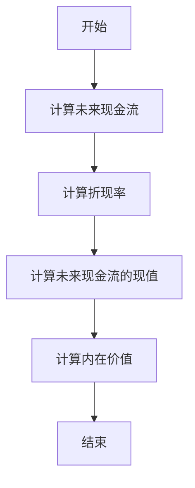
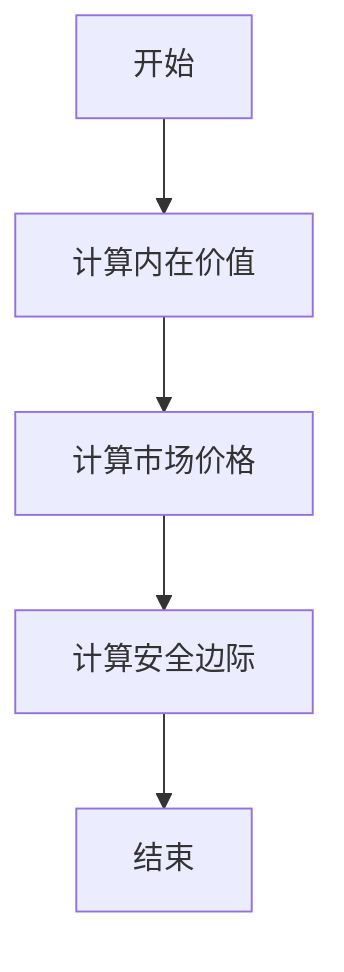
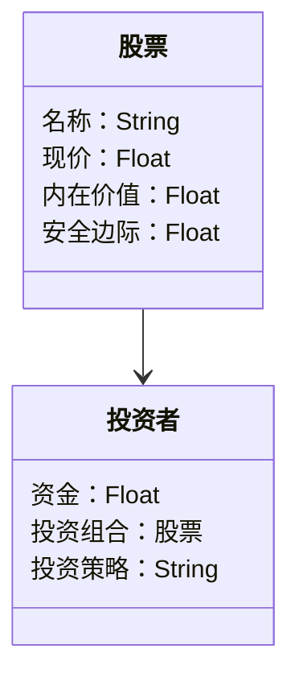

                 


# 格雷厄姆特价股票理论对公司财务政策的影响

> 关键词：格雷厄姆，特价股票，财务政策，公司财务，投资理论

> 摘要：格雷厄姆的特价股票理论强调以低于内在价值的价格购买股票，这一理念对公司的财务政策产生了深远影响。本文从格雷厄姆理论的核心概念出发，分析其对股利政策、资本结构和资本预算等财务政策的具体影响，并结合实际案例，探讨如何在实践中应用这些理论。通过本文的分析，读者将更好地理解如何将格雷厄姆的投资理念融入公司的财务决策中，以实现长期价值增长。

---

## 第一部分：格雷厄姆特价股票理论概述

### 第1章：格雷厄姆特价股票理论的核心概念

#### 1.1 投资学说的演变与格雷厄姆的贡献
格雷厄姆是价值投资的鼻祖，他的投资理念深刻影响了现代投资理论。在20世纪30年代，格雷厄姆与多德共同提出的“价值投资”理念，强调以低于内在价值的价格购买股票，从而在市场波动中获利。这种投资策略的核心在于寻找被市场低估的股票，并长期持有，直至其价值回归。

#### 1.2 格雷厄姆特价股票理论的核心要素
格雷厄姆的理论主要包括以下几个核心要素：
1. **安全边际**：通过购买价格低于内在价值的股票，为投资提供一个安全边际，以减少市场波动带来的风险。
2. **内在价值评估**：通过基本面分析，计算出股票的内在价值，作为判断其是否被低估的依据。
3. **长期投资**：强调长期持有股票，避免频繁交易，以减少交易成本和市场波动的影响。

#### 1.3 格雷厄姆理论的现代意义
尽管格雷厄姆的理论提出已有几十年，但其核心思想在现代投资实践中仍然具有重要的指导意义。尤其是在当前市场波动加剧的情况下，格雷厄姆的安全边际概念为投资者提供了重要的风险管理工具。

---

### 第2章：格雷厄姆特价股票理论对公司财务政策的影响

#### 2.1 公司财务政策的基本框架
公司财务政策主要包括以下几个方面：
1. **股利政策**：决定如何分配利润给股东。
2. **资本结构**：确定公司资本的组成，包括股权和债务的比例。
3. **资本预算**：制定资本支出计划，包括投资项目的决策。

#### 2.2 格雷厄姆理论对财务政策的启示
格雷厄姆的理论对公司的财务政策有以下几个方面的启示：
1. **股利政策**：公司应注重股利的可持续性，避免过度分配利润，以保持财务稳健性。
2. **资本结构**：公司应合理安排股权和债务的比例，确保资本结构的稳健性，以降低财务风险。
3. **资本预算**：公司在制定资本预算时，应注重项目的内在价值，避免盲目追求高增长，而忽视项目的实际回报能力。

---

## 第二部分：格雷厄姆特价股票理论的数学模型与算法原理

### 第3章：格雷厄姆特价股票理论的数学模型

#### 3.1 内在价值的计算公式
内在价值的计算通常基于现金流量折现模型（DCF）：
$$ V = \sum_{t=1}^{n} \frac{CF_t}{(1+r)^t} $$
其中，\( CF_t \) 是第 \( t \) 年的现金流，\( r \) 是折现率，\( n \) 是预测的年数。

#### 3.2 安全边际的计算方法
安全边际可以通过以下公式计算：
$$ \text{安全边际} = \text{内在价值} - \text{市场价格} $$

---

### 第4章：格雷厄姆特价股票理论的算法实现

#### 4.1 内在价值评估算法


#### 4.2 安全边际计算算法


---

## 第三部分：系统分析与架构设计方案

### 第5章：系统功能设计

#### 5.1 领域模型


---

### 第6章：系统架构设计

#### 6.1 系统架构图


---

## 第四部分：项目实战

### 第7章：环境安装与核心实现

#### 7.1 环境安装
需要安装以下工具：
- Python 3.x
- Pandas库
- Matplotlib库

#### 7.2 核心实现
```python
import pandas as pd

def calculate_intrinsic_value(cash_flows, discount_rate):
    return sum(cash_flows / (1 + discount_rate)**t for t in range(len(cash_flows)))

def calculate_margin_of_safety(intrinsic_value, market_price):
    return intrinsic_value - market_price

# 示例数据
cash_flows = [100, 120, 150, 200]
discount_rate = 0.1
market_price = 150

# 计算内在价值
iv = calculate_intrinsic_value(cash_flows, discount_rate)
# 计算安全边际
mos = calculate_margin_of_safety(iv, market_price)

print(f"内在价值: {iv}")
print(f"安全边际: {mos}")
```

---

## 第五部分：小结与展望

### 第8章：总结
格雷厄姆的特价股票理论为投资者提供了重要的风险管理工具，同时也对公司的财务政策产生了深远影响。通过合理应用格雷厄姆的理论，公司可以在复杂的市场环境中制定更加稳健的财务政策，实现长期价值增长。

### 第9章：展望
未来的研究可以进一步探讨格雷厄姆理论在不同市场环境下的应用，以及其对不同类型公司财务政策的具体影响。此外，还可以结合人工智能技术，开发更加智能化的内在价值评估和安全边际计算工具，为投资者提供更精准的投资决策支持。

---

## 作者：AI天才研究院/AI Genius Institute & 禅与计算机程序设计艺术/Zen And The Art of Computer Programming

---

以上是文章的基本结构和内容框架，每一部分都将详细展开，确保逻辑清晰、内容详实。

