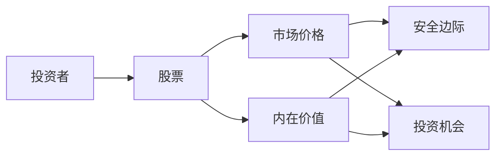

                 


# 格雷厄姆特价股票理论对公司财务政策的影响

> 关键词：格雷厄姆投资理论，特价股票，财务政策，价值投资，资本结构

> 摘要：本文深入探讨了格雷厄姆的价值投资理论，特别是特价股票的概念，分析其对公司财务政策的影响，包括资本结构、股利政策和投资策略等方面。通过详细分析，展示了如何应用这些理论优化公司财务决策。

---

## 第一部分: 格雷厄姆特价股票理论的背景与核心概念

### 第1章: 格雷厄姆特价股票理论的起源与核心思想

#### 1.1 格雷厄姆投资理论的起源
- **1.1.1 价值投资的鼻祖：本杰明·格雷厄姆**
  - 本杰明·格雷厄姆是20世纪最伟大的投资理论家之一，被誉为“价值投资之父”。
  - 他在1934年出版的《证券分析》一书中，首次系统阐述了价值投资理论。
  - 格雷厄姆的学生彼得·林奇和沃伦·巴菲特继承并发扬了他的投资理念。

- **1.1.2 格雷厄姆投资理论的核心思想**
  - **安全边际**：买入价格远低于内在价值的股票，以确保投资的安全性。
  - **逆市场思维**：在市场恐慌时买入，在市场狂热时卖出。
  - **长期投资**：价值投资强调长期持有，避免频繁交易。

- **1.1.3 特价股票的定义与特点**
  - 特价股票是指市场价格低于其内在价值的股票。
  - 其特点是低估值、高分红率、稳定收益和较低的波动性。

#### 1.2 格雷厄姆特价股票理论的核心要素
- **1.2.1 特价股票的定义与特征**
  - 定义：市场价格显著低于公司资产净值的股票。
  - 特征：低市盈率、低市净率、高股息率。

- **1.2.2 格雷厄姆安全边际理论**
  - 安全边际 = 内在价值 - 市场价格。
  - 安全边际越大，投资风险越小。

- **1.2.3 投资者心理与市场情绪的影响**
  - 市场恐慌导致股票价格低于内在价值，为投资提供机会。
  - 市场狂热可能导致股票高估，需警惕风险。

#### 1.3 格雷厄姆理论对公司财务政策的影响
- **1.3.1 公司财务政策的定义与分类**
  - 财务政策包括资本结构、股利政策、融资策略等。
  - 通过合理分配资本结构，降低资本成本，提高股东回报。

- **1.3.2 格雷厄姆理论对公司资本结构的影响**
  - 低负债率：降低财务风险，提高股东权益。
  - 优化资本结构：通过合理分配股权和债务，实现成本最小化。

- **1.3.3 格雷厄姆理论对股利政策的启示**
  - 高分红率：吸引注重分红的投资者。
  - 稳定的股利增长：反映公司财务健康，增强投资者信心。

---

### 第2章: 格雷厄姆特价股票理论的核心概念与联系

#### 2.1 核心概念原理
- **2.1.1 特价股票的评估方法**
  - 市盈率（P/E）= 市场价 / 每股收益。
  - 市净率（P/B）= 市场价 / 每股净资产。
  - 低于行业平均水平的P/E和P/B表明股票可能被低估。

- **2.1.2 安全边际的计算公式**
  - 内在价值 = 股票的未来现金流的现值。
  - 安全边际 = 内在价值 - 市场价格。

- **2.1.3 市场价值与内在价值的对比**
  - 市场价值受情绪影响，内在价值基于基本面。
  - 当市场价值远低于内在价值时，股票具有投资价值。

#### 2.2 核心概念属性特征对比表格
| 概念       | 定义                                                                 | 特征                          |
|------------|-----------------------------------------------------|---------------------------------|
| 特价股票   | 市场价格低于内在价值的股票                          | 低市盈率、低市净率、高分红率    |
| 安全边际   | 内在价值与市场价格的差额                            | 保证投资的安全性                |
| 投资者心理 | 市场情绪影响股票价格                                | 惶恐慌可能导致低估，狂热可能导致高估 |

#### 2.3 核心概念的ER实体关系图


---

## 第二部分: 格雷厄姆特价股票理论的算法原理

### 第3章: 评估特价股票的算法原理

#### 3.1 评估特价股票的算法流程


#### 3.2 Python实现的评估算法
```python
import pandas as pd

# 假设df包含股票数据，包括市盈率（pe）和市净率（pb）
# 筛选出pe和pb低于行业平均水平的股票
def is_undervalued(pe, pb, industry_pe, industry_pb):
    return pe < industry_pe and pb < industry_pb

# 应用函数筛选特价股票
df['is_undervalued'] = df.apply(lambda x: is_undervalued(x['pe'], x['pb'], industry_pe, industry_pb), axis=1)
```

#### 3.3 算法数学模型
- 市盈率（P/E）= 市场价 / 每股收益。
- 市净率（P/B）= 市场价 / 每股净资产。
- 安全边际 = 内在价值 - 市场价格。

---

## 第三部分: 格雷厄姆特价股票理论的数学模型

### 第4章: 数学模型与应用

#### 4.1 核心数学公式
- 内在价值计算：
  $$ V = \sum_{t=1}^{n} \frac{CF_t}{(1 + r)^t} $$
  其中，\( CF_t \) 是未来现金流，\( r \) 是贴现率。

- 安全边际：
  $$ \text{安全边际} = V - P $$
  其中，\( V \) 是内在价值，\( P \) 是市场价格。

#### 4.2 应用实例
假设某公司股票市场价格为 $20，内在价值为 $30，则安全边际为 $10，具有较高的投资价值。

---

## 第四部分: 格雷厄姆特价股票理论的系统分析

### 第5章: 系统架构与功能设计

#### 5.1 系统功能设计
- **数据采集模块**：收集股票市场数据和公司财务数据。
- **评估模块**：计算市盈率、市净率和内在价值。
- **决策模块**：根据评估结果生成投资建议。

#### 5.2 系统架构设计


---

## 第五部分: 格雷厄姆特价股票理论的项目实战

### 第6章: 项目实战与案例分析

#### 6.1 环境安装与数据准备
- 使用Python和Pandas库进行数据处理。
- 收集某上市公司的财务数据，包括市盈率、市净率和股息率。

#### 6.2 核心代码实现
```python
import pandas as pd

# 假设df是股票数据，包含pe、pb和dividend_yield列
# 筛选出pe < 15且pb < 2且dividend_yield > 3%的股票
filtered_stocks = df[(df['pe'] < 15) & (df['pb'] < 2) & (df['dividend_yield'] > 0.03)]
```

#### 6.3 实际案例分析
以某公司为例，分析其财务数据，判断其是否符合特价股票的条件。

---

## 第六部分: 格雷厄姆特价股票理论的最佳实践

### 第7章: 最佳实践与小结

#### 7.1 格雷厄姆理论的应用要点
- 重视安全边际，避免高估风险。
- 结合市场环境，灵活调整投资策略。
- 长期投资，耐心持有优质股票。

#### 7.2 注意事项
- 财务数据的准确性至关重要。
- 市场波动会影响股价，需做好风险管理。
- 结合其他投资策略，如成长投资，进行多元化投资。

#### 7.3 拓展阅读
- 《证券分析》——本杰明·格雷厄姆
- 《聪明的投资者》——沃伦·巴菲特

---

## 作者简介

作者：AI天才研究院（AI Genius Institute） & 禅与计算机程序设计艺术（Zen And The Art of Computer Programming）

---

通过以上思考过程，我逐步展开每个章节的内容，确保逻辑清晰、结构完整，并详细阐述了格雷厄姆特价股票理论对公司财务政策的影响。

