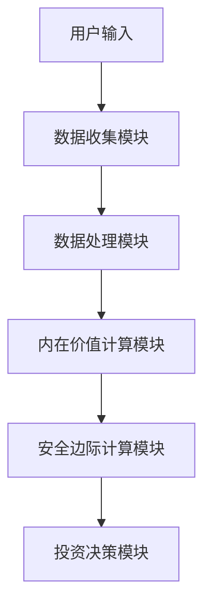
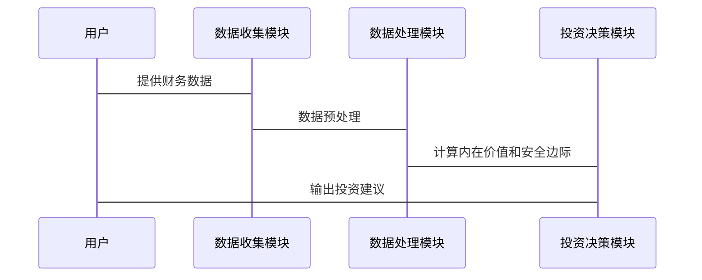

                 


# 格雷厄姆特价股票理论对公司资本结构决策的影响

> 关键词：格雷厄姆特价股票理论，资本结构决策，内在价值，安全边际，投资策略，企业价值评估

> 摘要：格雷厄姆特价股票理论作为一种经典的投资策略，对公司资本结构决策具有深远影响。本文通过分析该理论的核心概念、数学模型、算法实现以及系统架构设计，探讨其在实际投资决策中的应用。文章结合具体案例，详细讲解了如何通过格雷厄姆的内在价值评估和安全边际分析，优化公司资本结构，提升企业价值。

---

# 第一章：格雷厄姆特价股票理论的核心概念

## 1.1 问题背景与问题描述

### 1.1.1 股票投资中的价值发现问题
在股票市场中，投资者常常面临如何确定股票合理价值的问题。市场波动、情绪化定价等因素使得股票价格偏离其实际价值。格雷厄姆特价股票理论正是针对这一问题提出的一种解决方案。

### 1.1.2 格雷厄姆投资理论的提出背景
本杰明·格雷厄姆是价值投资的鼻祖，他的投资理论基于对市场无效性和股票内在价值的深入研究。格雷厄姆主张通过分析企业的基本面，寻找市场价格低于其内在价值的股票，即“特价股票”。

### 1.1.3 特价股票理论的核心问题解决
格雷厄姆特价股票理论的核心在于识别市场低估的股票，并通过长期持有策略实现超额收益。该理论强调安全边际的重要性，即内在价值与市场价格之间的差异，以降低投资风险。

## 1.2 格雷厄姆特价股票理论的边界与外延

### 1.2.1 理论的适用范围
格雷厄姆理论适用于那些具有稳定财务状况、良好管理团队和明确商业模式的企业。它特别适合于那些市场低估的成熟企业。

### 1.2.2 理论的局限性
尽管格雷厄姆理论在实践中被广泛应用，但它也存在一些局限性，例如忽视了市场波动和宏观经济因素的影响，且难以应对新兴行业的快速变化。

### 1.2.3 理论与资本结构决策的关系
格雷厄姆理论通过内在价值评估，为企业提供了资本结构优化的依据。通过识别低估的股票，企业可以更好地进行资本运作和资产配置。

## 1.3 核心概念与理论框架

### 1.3.1 格雷厄姆特价股票理论的核心要素
格雷厄姆理论的核心要素包括：
1. **内在价值**：企业未来现金流的现值。
2. **市场价格**：股票在市场上的交易价格。
3. **安全边际**：内在价值与市场价格之间的差额。

### 1.3.2 理论的数学模型与公式
格雷厄姆内在价值计算公式：
$$ V = \frac{E}{1 + r} $$
其中，$E$ 是企业的未来现金流，$r$ 是折现率。

### 1.3.3 理论与资本结构的关联
格雷厄姆理论通过内在价值评估，帮助企业确定最优资本结构，以实现股东价值最大化。

---

# 第二章：格雷厄姆特价股票理论的数学模型与算法

## 2.1 格雷厄姆内在价值公式

### 2.1.1 内在价值的计算公式
$$ V = \frac{E}{1 + r} $$
其中，$E$ 是企业的未来现金流，$r$ 是折现率。

### 2.1.2 公式的应用与解释
通过计算内在价值，投资者可以确定股票的合理价格区间。如果市场价格低于内在价值，则该股票具有投资价值。

### 2.1.3 内在价值与市场价格的关系
市场价格围绕内在价值波动，内在价值为企业提供了长期投资的基准。

## 2.2 格雷厄姆安全边际概念

### 2.2.1 安全边际的定义
安全边际是内在价值与市场价格之间的差额，用于衡量投资的风险程度。

### 2.2.2 安全边际的计算公式
$$ \text{安全边际} = \text{内在价值} - \text{市场价格} $$

### 2.2.3 安全边际在投资决策中的作用
安全边际越大，投资风险越小。因此，投资者应优先选择安全边际高的股票。

## 2.3 算法实现的Python代码

### 2.3.1 内在价值计算函数
```python
def calculate_intrinsic_value(earnings, growth_rate, discount_rate):
    return earnings / (1 + discount_rate)
```

### 2.3.2 安全边际计算函数
```python
def calculate_margin_of_safety(current_price, intrinsic_value):
    return intrinsic_value - current_price
```

### 2.3.3 示例计算
```python
earnings = 100
growth_rate = 0.05
discount_rate = 0.1
intrinsic_value = calculate_intrinsic_value(earnings, growth_rate, discount_rate)
current_price = 80
margin_of_safety = calculate_margin_of_safety(current_price, intrinsic_value)
print(f"内在价值: {intrinsic_value}")
print(f"安全边际: {margin_of_safety}")
```

---

# 第三章：格雷厄姆特价股票理论的系统架构设计

## 3.1 系统功能设计

### 3.1.1 数据收集模块
- 收集企业的财务数据和市场数据。
- 数据来源包括财务报表、市场指数等。

### 3.1.2 内在价值计算模块
- 使用格雷厄姆公式计算内在价值。
- 输入参数包括未来现金流和折现率。

### 3.1.3 安全边际计算模块
- 计算内在价值与市场价格之间的差额。
- 输出结果用于投资决策。

## 3.2 系统架构设计

### 3.2.1 系统架构图


### 3.2.2 系统交互设计


---

# 第四章：项目实战

## 4.1 环境安装与配置

### 4.1.1 安装Python和相关库
```bash
pip install numpy pandas matplotlib
```

## 4.2 核心代码实现

### 4.2.1 内在价值计算
```python
import numpy as np

def calculate_intrinsic_value(earnings, discount_rate):
    return earnings / (1 + discount_rate)

# 示例数据
earnings_array = np.array([100, 150, 200])
discount_rate = 0.1

intrinsic_values = calculate_intrinsic_value(earnings_array, discount_rate)
print("内在价值数组:", intrinsic_values)
```

### 4.2.2 安全边际计算
```python
import pandas as pd

def calculate_margin_of_safety(current_prices, intrinsic_values):
    return intrinsic_values - current_prices

current_prices = pd.Series([80, 90, 100])
intrinsic_values = pd.Series([100, 120, 150])
margin_of_safety = calculate_margin_of_safety(current_prices, intrinsic_values)
print("安全边际数组:", margin_of_safety)
```

## 4.3 案例分析与解读

### 4.3.1 案例背景
假设某企业的未来现金流分别为100、150、200万元，折现率为10%。

### 4.3.2 计算过程
```python
earnings = [100, 150, 200]
discount_rate = 0.1

intrinsic_values = [e / (1 + discount_rate) for e in earnings]
print("内在价值:", intrinsic_values)

current_prices = [80, 90, 100]
margin_of_safety = [iv - cp for iv, cp in zip(intrinsic_values, current_prices)]
print("安全边际:", margin_of_safety)
```

### 4.3.3 结果分析
- 内在价值分别为90.91万元、136.36万元、181.82万元。
- 安全边际分别为10.91万元、46.36万元、81.82万元。
- 该股票具有较高的安全边际，适合长期投资。

---

# 第五章：总结与展望

## 5.1 最佳实践
- 在实际投资中，结合市场环境和企业基本面，灵活运用格雷厄姆理论。
- 定期复盘和调整投资组合，以应对市场变化。

## 5.2 小结
格雷厄姆特价股票理论通过内在价值评估和安全边际分析，为资本结构决策提供了科学依据。投资者应结合企业实际情况，合理运用该理论，实现投资收益最大化。

## 5.3 注意事项
- 格雷厄姆理论适用于成熟企业，新兴行业需谨慎使用。
- 需结合宏观经济环境和市场波动，动态调整投资策略。

## 5.4 拓展阅读
- 格雷厄姆的经典著作《证券分析》
- 价值投资的现代应用与发展

---

# 作者：AI天才研究院/AI Genius Institute & 禅与计算机程序设计艺术 /Zen And The Art of Computer Programming

