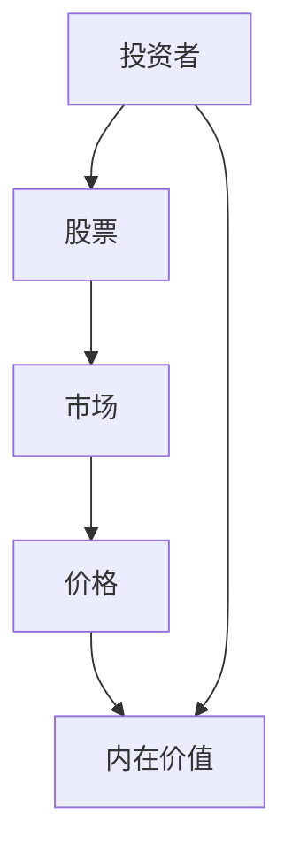
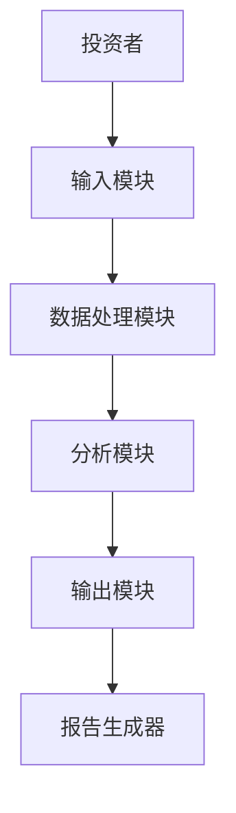

                 


# 格雷厄姆特价股票理论对投资者教育的启示

## 关键词
格雷厄姆、特价股票理论、投资者教育、投资策略、风险管理、价值投资、安全边际

## 摘要
格雷厄姆的特价股票理论是价值投资的重要基石，强调通过分析安全边际、市盈率和市净率等指标来识别被低估的股票。本文详细探讨了格雷厄姆的投资理念及其对投资者教育的启示，结合实际案例和系统设计，帮助投资者理解和应用这些理论。

---

## 第一部分: 格雷厄姆特价股票理论概述

### 第1章: 格雷厄姆及其投资理论背景

#### 1.1 本杰明·格雷厄姆的生平简介
本杰明·格雷厄姆（Benjamin Graham）是20世纪著名的投资学家，被誉为“价值投资之父”。他于1894年出生于英国，后随家人移民至美国。格雷厄姆在哥伦比亚大学学习法律，并在华尔街开始了他的投资生涯。他的投资理念深刻影响了后来的投资者，包括沃伦·巴菲特。

#### 1.2 格雷厄姆的投资哲学与价值投资理念
格雷厄姆的价值投资理念的核心在于寻找那些市场价格低于其内在价值的股票。他认为，市场先生的情绪波动为投资者提供了机会，通过分析公司的基本面，投资者可以在市场恐慌时买入优质资产，在市场狂热时卖出。

#### 1.3 格雷厄姆对现代投资理论的贡献
格雷厄姆的理论为现代投资组合理论奠定了基础，他的安全边际概念至今仍被广泛使用。他强调，投资者应关注企业的内在价值，而不是市场的短期波动。

### 第2章: 特价股票理论的核心概念与联系

#### 2.1 核心概念原理
格雷厄姆的特价股票理论主要基于以下几个核心概念：
1. **安全边际**：购买价格低于内在价值的部分，提供了风险缓冲。
2. **内在价值**：基于公司基本面分析得出的股票真实价值。
3. **市场价格**：市场参与者情绪波动导致的价格波动。

#### 2.2 核心概念属性特征对比表格
以下是格雷厄姆理论中几个关键概念的对比：

| 概念       | 定义与特征 | 计算公式 | 应用场景 |
|------------|------------|----------|----------|
| 安全边际   | 股票价格低于其内在价值的部分 | 安全边际 = 内在价值 - 市场价格 | 降低投资风险 |
| 市盈率     | 每股价格与每股收益的比率 | P/E = 市场价格 / 每股收益 | 评估股票估值 |
| 市净率     | 每股价格与每股净资产的比率 | P/B = 市场价格 / 每股净资产 | 评估资产价值 |

#### 2.3 ER实体关系图
以下是格雷厄姆理论中的核心关系图：



### 第3章: 特价股票理论的数学模型与公式

#### 3.1 安全边际计算模型
安全边际的计算公式如下：
$$ \text{安全边际} = \text{内在价值} - \text{市场价格} $$

#### 3.2 内在价值评估模型
内在价值可以通过以下公式进行估算：
$$ \text{内在价值} = \frac{\text{预期现金流}}{\text{折现率}} $$

#### 3.3 市盈率与市净率对比
市盈率和市净率的计算公式分别为：
$$ P/E = \frac{\text{市场价格}}{\text{每股收益}} $$
$$ P/B = \frac{\text{市场价格}}{\text{每股净资产}} $$

### 第4章: 投资者教育与心理分析

#### 4.1 投资者心理与行为分析
投资者的心理偏差，如过度自信和从众心理，常常导致错误决策。格雷厄姆强调，投资者应避免情绪化决策，而是基于理性分析。

#### 4.2 格雷厄姆理论对投资者教育的启示
格雷厄姆的理论教育投资者如何识别低估股票，培养长期投资视角，并强调风险管理的重要性。

---

## 第二部分: 投资者教育体系的构建

### 第5章: 投资者教育体系的核心要素

#### 5.1 投资知识普及
教育投资者理解价值投资的基本原理，包括如何计算内在价值和安全边际。

#### 5.2 实战案例分析
通过实际案例分析，展示如何应用格雷厄姆的理论识别低估股票。

#### 5.3 心理素质培养
帮助投资者克服心理偏差，避免情绪化决策。

---

## 第三部分: 系统分析与架构设计

### 第6章: 系统分析与架构设计方案

#### 6.1 问题场景介绍
本文构建一个基于格雷厄姆理论的投资决策支持系统，帮助投资者识别低估股票。

#### 6.2 系统功能设计
以下是系统的功能需求：

```mermaid
classDiagram
    class 投资者 {
        输入股票代码
        查询股价数据
    }
    class 系统 {
        计算内在价值
        计算安全边际
        生成报告
    }
    投资者 --> 系统
    系统 -->抽屉式模块1 {
        数据库模块
    }
    系统 -->抽屉式模块2 {
        分析模块
    }
```

#### 6.3 系统架构设计
以下是系统的架构设计：



---

## 第四部分: 项目实战

### 第7章: 项目实战

#### 7.1 环境配置
安装Python和必要的库，如pandas和numpy。

#### 7.2 核心代码实现
以下是计算内在价值和安全边际的代码示例：

```python
import pandas as pd

def calculate_intrinsic_value(enterprise_value, free_cash_flow):
    return enterprise_value / free_cash_flow

def calculate_margin_of_safety(stock_price, intrinsic_value):
    return intrinsic_value - stock_price

# 示例数据
stock_data = pd.read_csv('stock_data.csv')
enterprise_value = stock_data['enterprise_value'].mean()
free_cash_flow = stock_data['free_cash_flow'].mean()
intrinsic_value = calculate_intrinsic_value(enterprise_value, free_cash_flow)
stock_price = stock_data['price'].mean()
margin_of_safety = calculate_margin_of_safety(stock_price, intrinsic_value)

print(f"内在价值: {intrinsic_value}")
print(f"安全边际: {margin_of_safety}")
```

#### 7.3 实际案例分析
以某公司为例，分析其内在价值和安全边际，判断是否为低估股票。

---

## 第五部分: 总结与启示

### 第8章: 总结与启示

#### 8.1 投资者教育的重要性
教育投资者正确理解格雷厄姆的理论，避免常见错误。

#### 8.2 实践中的注意事项
投资者应结合市场变化和公司基本面，动态调整投资策略。

#### 8.3 拓展阅读
推荐阅读格雷厄姆的《聪明的投资者》和巴菲特的《投资之道》。

---

## 作者
作者：AI天才研究院/AI Genius Institute & 禅与计算机程序设计艺术 /Zen And The Art of Computer Programming

