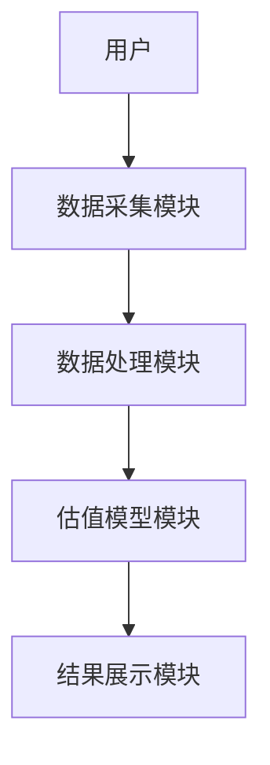

                 


# 《格雷厄姆特价股票理论对数字原生企业估值的启示》

---

## 关键词

- 格雷厄姆投资理论
- 数字原生企业
- 企业估值
- 数据驱动
- 价值投资

---

## 摘要

本文深入探讨了格雷厄姆特价股票理论在数字原生企业估值中的应用，结合数字企业的特点，提出了一种基于数据驱动的估值方法。通过分析格雷厄姆理论的核心概念，如内在价值和安全边际，本文展示了如何将其应用于高增长、数据驱动的数字企业。文章还详细介绍了系统架构设计和项目实现，提供了一个完整的解决方案，为投资者和数据科学家提供了新的视角和工具。

---

## 目录

1. [格雷厄姆特价股票理论的背景与核心概念](#格雷厄姆特价股票理论的背景与核心概念)
2. [数字原生企业的特点与估值挑战](#数字原生企业的特点与估值挑战)
3. [格雷厄姆理论与数字企业估值的结合](#格雷厄姆理论与数字企业估值的结合)
4. [系统架构设计与实现](#系统架构设计与实现)
5. [项目实战：数字企业估值系统实现](#项目实战数字企业估值系统实现)
6. [总结与展望](#总结与展望)

---

## 1. 格雷厄姆特价股票理论的背景与核心概念

### 1.1 格雷厄姆投资理论的核心概念

格雷厄姆的投资理论以“价值投资”为核心，强调以低于内在价值的价格购买优质资产。以下是其核心概念：

- **内在价值**：资产在市场中真实的、客观的价值，与市场波动无关。
- **安全边际**：购买价格与内在价值之间的差距，用以降低风险。
- **市场先生**：市场情绪波动的比喻，提醒投资者避免受短期波动影响。

#### 格雷厄姆理论与现代金融学的对比

| 对比维度 | 格雷厄姆理论 | 现代金融学 |
|----------|--------------|------------|
| 核心假设 | 稳定的内在价值 | 随机游走假设 |
| 投资策略 | 买入并持有 | 短期交易为主 |
| 风险管理 | 安全边际 | 多样化投资 |

### 1.2 格雷厄姆理论的数学模型

格雷厄姆提出了多种估值公式，以下是两个经典的模型：

- **市盈率模型**：$$ P = \frac{E}{P/E} $$
- **市净率模型**：$$ P = \frac{B}{P/B} $$

其中，$E$ 是净利润，$P/E$ 是市盈率，$B$ 是净资产，$P/B$ 是市净率。

---

## 2. 数字原生企业的特点与估值挑战

### 2.1 数字原生企业的特点

数字原生企业是指从成立之初就基于数字化技术的企业，其特点包括：

- **数据驱动**：依赖数据进行决策和优化。
- **高增长性**：通常在新兴市场中快速发展。
- **轻资产模式**：主要依赖无形资产，如数据和算法。

#### 数字原生企业的商业模式

| 商业模式 | 描述 |
|----------|------|
| SaaS | 软件即服务，按月订阅 |
| DTC | 直接面对消费者，减少中间商 |
| 平台经济 | 通过平台连接供需双方 |

### 2.2 数字原生企业的估值难点

数字企业的估值面临以下挑战：

- **数据质量**：数据的真实性和完整性直接影响估值。
- **高增长不确定性**：高增长企业难以用传统模型预测。
- **无形资产评估**：数据和品牌难以量化。

---

## 3. 格雷厄姆理论与数字企业估值的结合

### 3.1 格雷厄姆理论在数字企业估值中的应用

将格雷厄姆理论应用于数字企业，需要进行以下调整：

- **内在价值的重新定义**：考虑数据资产的价值。
- **安全边际的调整**：根据数字企业的特点调整安全边际。
- **动态估值**：结合市场变化进行实时调整。

#### 数字企业估值的数学模型

以下是基于格雷厄姆理论的数字企业估值模型：

$$ V = \frac{E}{P/E} \times (1 + g) $$

其中，$g$ 是企业的增长率，反映了数字企业的高增长特性。

---

## 4. 系统架构设计与实现

### 4.1 系统功能设计

数字企业估值系统需要以下功能模块：

- **数据采集**：收集企业财务数据和市场数据。
- **数据处理**：清洗和转换数据。
- **估值模型**：实现格雷厄姆理论的数学模型。
- **结果展示**：生成估值报告。

#### 系统架构图



### 4.2 系统接口设计

- **数据接口**：与财务数据库对接。
- **用户界面**：提供友好的操作界面。
- **输出接口**：生成报告并导出。

---

## 5. 项目实战：数字企业估值系统实现

### 5.1 环境安装与配置

- **Python环境**：安装Python 3.8及以上版本。
- **数据库**：使用MySQL或PostgreSQL。
- **开发工具**：推荐使用PyCharm。

### 5.2 核心代码实现

以下是数据处理模块的代码示例：

```python
import pandas as pd

def process_data(dataframe):
    # 删除缺失值
    dataframe.dropna(inplace=True)
    # 标准化处理
    dataframe['revenue'] = dataframe['revenue'].astype(float)
    return dataframe

# 示例数据
data = {
    'revenue': ['100', '200', '300', None],
    'profit': [20, 30, None, 40]
}
df = pd.DataFrame(data)
processed_df = process_data(df)
print(processed_df)
```

### 5.3 代码解释

上述代码展示了如何处理数据，包括删除缺失值和数据类型转换。以下是详细解释：

- **删除缺失值**：使用`dropna()`方法，去掉含有缺失值的行。
- **数据类型转换**：将收入列转换为浮点数，确保后续计算准确。

---

## 6. 总结与展望

### 6.1 总结

本文结合格雷厄姆的特价股票理论，探讨了其在数字原生企业估值中的应用，提出了基于数据驱动的估值方法。通过系统设计和项目实现，展示了如何将理论应用于实际。

### 6.2 展望

未来的研究可以进一步探索以下方向：

- **实时估值模型**：结合市场变化进行动态调整。
- **多模型对比**：比较不同估值方法的优劣。
- **扩展应用场景**：将方法应用于更多类型的数字企业。

---

## 作者：AI天才研究院 & 禅与计算机程序设计艺术

---

以上是《格雷厄姆特价股票理论对数字原生企业估值的启示》的完整目录和文章内容。

