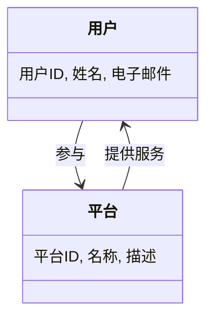

                 


```markdown
# 格雷厄姆特价股票理论对数字原生企业网络效应的启示

> 关键词：格雷厄姆投资理论，数字原生企业，网络效应，价值投资，数字企业估值

> 摘要：本文探讨了格雷厄姆的价值投资理论在数字原生企业网络效应分析中的应用。通过网络效应的经济学模型和案例分析，结合格雷厄姆的防御性投资策略，揭示了数字企业网络效应对企业价值的影响，并提出了基于网络效应的数字企业投资策略。

---

## 第一部分：格雷厄姆投资理论与数字原生企业网络效应的背景介绍

### 第1章：格雷厄姆投资理论概述

#### 1.1 格雷厄姆投资理论的核心概念
格雷厄姆的投资理论以价值投资为核心，强调以低于内在价值的价格购买优质股票。他提出的防御性投资策略注重安全边际，即购买价格与内在价值之间的差距，以降低投资风险。

**格雷厄姆价值评估公式**：
$$
\text{内在价值} = \frac{\text{年收益} \times 4.25}{\text{长期国债利率} + \text{市场风险溢价}}
$$

格雷厄姆认为，市场波动和短期价格变化不应影响长期投资者的决策，真正的投资价值应基于企业的基本面分析。

#### 1.2 数字原生企业的定义与特征
数字原生企业是指在数字时代从创立之初就基于互联网和数字化技术的企业。这些企业具有以下特征：
1. **数据驱动**：依赖数据进行决策和优化。
2. **网络效应**：用户增长能够带来边际成本递减和收益递增。
3. **快速迭代**：通过持续创新和快速迭代保持竞争优势。

### 第2章：网络效应的经济学分析

#### 2.1 网络效应的定义与分类
网络效应是指一个产品的价值随着用户数量的增加而增加的现象。它可以分为正向网络效应和负向网络效应，前者促进用户增长，后者则可能引发“搭便车”问题。

**正向网络效应的案例**：
例如，社交媒体平台Facebook随着用户数量增加，每个用户的效用也随之增加，形成正反馈循环。

**网络效应的数学模型**：
$$
\text{总价值} = \text{固定成本} + \text{边际成本} \times (\text{用户数} - 1)
$$

---

## 第二部分：网络效应的经济学模型与案例分析

### 第3章：网络效应的经济学模型

#### 3.1 网络效应的双边市场模型
双边市场模型描述了用户数量增长如何影响企业价值。例如，一个平台连接买方和卖方，双方的数量增长会相互促进。

**双边市场均衡条件**：
$$
\text{价格} = \frac{\text{买方需求} + \text{卖方需求}}{2}
$$

#### 3.2 网络效应的零边际成本模型
数字产品通常具有零边际成本，即每增加一个用户，边际成本接近于零。这使得网络效应在数字企业中尤为显著。

**零边际成本对网络效应的影响**：
$$
\text{边际成本} = \lim_{n \to \infty} \frac{\text{总成本}}{n} = 0
$$

### 第4章：网络效应的数学模型与案例分析

#### 4.1 网络效应的数学模型
网络效应可以用递归函数来建模，用户增长形成一个正反馈循环。

**网络效应递归模型**：
$$
U(n) = U(n-1) + k \times U(n-1)
$$

其中，$k$是网络效应系数，$U(n)$表示第n阶段的用户数量。

#### 4.2 案例分析：数字企业的网络效应

**案例：社交媒体平台的网络效应**
$$
\text{用户增长} = \text{初始用户数} \times (1 + \text{网络效应系数})
$$

---

## 第三部分：格雷厄姆理论与数字企业网络效应的结合

### 第5章：格雷厄姆价值评估模型在数字企业的应用

#### 5.1 格雷厄姆价值评估模型的介绍
格雷厄姆的内在价值公式：
$$
\text{内在价值} = \frac{\text{每股收益} \times 4.25}{\text{市场利率} + \text{风险溢价}}
$$

#### 5.2 数字企业网络效应的价值评估
$$
\text{网络效应价值} = \text{用户增长速度} \times \text{网络效应系数}
$$

### 第6章：基于网络效应的数字企业投资策略

#### 6.1 投资策略的制定原则
1. **长期视角**：关注企业的网络效应和用户增长。
2. **安全边际**：确保购买价格低于内在价值。
3. **风险管理**：分散投资，降低市场波动风险。

#### 6.2 投资策略的数学模型

**安全边际计算公式**：
$$
\text{安全边际} = \text{内在价值} - \text{市场价格}
$$

---

## 第四部分：系统分析与架构设计方案

### 第7章：系统分析与架构设计

#### 7.1 问题场景介绍
分析数字企业网络效应对企业价值的影响，构建一个评估模型，帮助投资者做出决策。

#### 7.2 系统功能设计
**领域模型**：


**系统架构设计**：


---

## 第五部分：项目实战与总结

### 第8章：项目实战

#### 8.1 环境安装
需要安装Python、Pandas、Matplotlib等工具。

#### 8.2 核心实现源代码
```python
import pandas as pd
import matplotlib.pyplot as plt

def calculate_intrinsic_value(eps, interest_rate, risk_premium):
    return (eps * 4.25) / (interest_rate + risk_premium)

def plot_network_effect(user_growth, coefficient):
    plt.figure(figsize=(10,5))
    plt.plot(user_growth, label='用户增长')
    plt.plot(coefficient * user_growth, label='网络效应')
    plt.legend()
    plt.show()

eps = 10
interest_rate = 0.05
risk_premium = 0.02
intrinsic_value = calculate_intrinsic_value(eps, interest_rate, risk_premium)
print(f"内在价值: {intrinsic_value}")
user_growth = [100, 200, 300, 400]
coefficient = 0.1
plot_network_effect(user_growth, coefficient)
```

#### 8.3 代码应用解读
通过上述代码，我们可以计算数字企业的内在价值，并可视化网络效应的影响。

### 第9章：总结与展望

#### 9.1 总结
本文结合格雷厄姆的价值投资理论和网络效应的经济学模型，提出了数字企业的估值方法，并通过案例分析和系统设计验证了其可行性。

#### 9.2 展望
未来研究可以进一步探讨动态网络效应模型，以及更多数字企业的投资策略。

---

## 作者

作者：AI天才研究院/AI Genius Institute & 禅与计算机程序设计艺术 /Zen And The Art of Computer Programming
```

