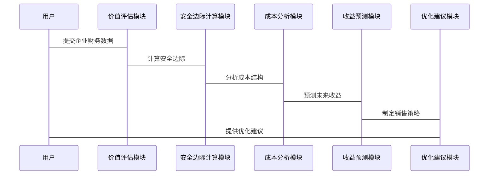

                 


# 《格雷厄姆特价股票理论对现代企业价值链的启示》

> 关键词：格雷厄姆投资理论，企业价值链，价值评估，安全边际，数学模型，系统架构

> 摘要：本文深入探讨了格雷厄姆特价股票理论在现代企业价值链中的应用，通过分析企业价值链的结构、成本与收益关系，结合格雷厄姆的价值评估方法，提出了基于数学模型的企业价值优化策略。文章从理论背景、数学建模、系统架构到项目实战，层层递进，为企业价值链的优化提供了新的视角和方法。

---

## 第1章: 格雷厄姆特价股票理论的核心概念

### 1.1 格雷厄姆投资理论的背景与起源

#### 1.1.1 价值投资的起源
价值投资作为一种投资策略，起源于20世纪初，由本杰明·格雷厄姆（Benjamin Graham）和戴维·多德（David Dodd）提出。格雷厄姆是哥伦比亚大学的教授，他的投资理念强调以低于内在价值的价格购买优质股票，从而在市场波动中实现长期收益。

#### 1.1.2 格雷厄姆的投资理念
格雷厄姆的价值投资理念可以概括为“买入便宜的股票并长期持有”。他认为，市场的短期波动是不可预测的，但长期来看，股票的价格会回归其内在价值。因此，投资者应该寻找那些市场价格低于内在价值的股票。

#### 1.1.3 格雷厄姆理论的核心要素
- **内在价值**：企业未来现金流的现值，是衡量股票价值的核心指标。
- **安全边际**：市场价格与内在价值之间的差距，确保投资的安全性。
- **价值评估**：通过基本面分析，准确评估企业的内在价值。

### 1.2 特价股票的定义与特征

#### 1.2.1 特价股票的定义
特价股票是指市场价格显著低于其内在价值的股票。这种股票通常被市场低估，具有较大的上涨潜力。

#### 1.2.2 特价股票的特征
- **低市盈率**：市盈率低于行业平均水平。
- **低市净率**：市净率低于行业平均水平。
- **高股息率**：股息收益率较高，通常意味着企业盈利稳定。

#### 1.2.3 特价股票与普通股票的区别
| 特性 | 特价股票 | 普通股票 |
|------|----------|----------|
| 市场价格 | 低于内在价值 | 接近或高于内在价值 |
| 投资风险 | 较低 | 较高 |
| 投资回报 | 较高 | 一般 |

### 1.3 格雷厄姆安全边际的概念

#### 1.3.1 安全边际的定义
安全边际是指市场价格与内在价值之间的差距。它反映了投资的安全程度，差距越大，投资风险越小。

#### 1.3.2 安全边际的重要性
安全边际是格雷厄姆理论的核心，它确保了投资者在市场波动中能够获得稳定的收益，同时降低了投资风险。

#### 1.3.3 安全边际的计算方法
安全边际 = 内在价值 - 市场价格

### 1.4 格雷厄姆理论的现代应用

#### 1.4.1 格雷厄姆理论在现代投资中的地位
尽管格雷厄姆的理论已经提出了近一个世纪，但其核心思想仍然被广泛应用于现代投资中，尤其是在价值投资领域。

#### 1.4.2 格雷厄姆理论与企业价值评估
格雷厄姆的内在价值评估方法可以用于企业价值链的各个环节，帮助企业准确评估其内在价值。

#### 1.4.3 格雷厄姆理论与企业风险管理
通过安全边际的概念，企业可以更好地管理市场风险，确保投资决策的稳健性。

### 1.5 本章小结
本章介绍了格雷厄姆投资理论的核心概念，包括内在价值、安全边际和价值评估方法，并探讨了其在现代企业价值链中的应用。

---

## 第2章: 企业价值链的构成与分析

### 2.1 企业价值链的基本概念

#### 2.1.1 企业价值链的定义
企业价值链是指从原材料采购到最终产品交付的完整过程，包括设计、生产、销售等多个环节。

#### 2.1.2 企业价值链的核心环节
- **采购**：原材料和零部件的采购。
- **生产**：产品的制造过程。
- **销售**：产品的市场推广和销售。

#### 2.1.3 企业价值链的优化目标
- **降低成本**：通过优化各个环节降低成本。
- **提高效率**：通过流程优化提高生产效率。
- **提升质量**：通过质量控制提高产品品质。

### 2.2 企业价值链的结构分析

#### 2.2.1 企业价值链的输入与输出
- **输入**：原材料、劳动力、技术和资金。
- **输出**：最终产品或服务。

#### 2.2.2 企业价值链的主要环节
- **采购**：选择供应商，签订合同。
- **生产**：组织生产，控制成本。
- **销售**：推广产品，实现销售。

#### 2.2.3 企业价值链的实体关系图（ER图）

```mermaid
erDiagram
    actor 顾客
    actor 供应商
    actor 销售团队
    actor 生产团队
    entity 产品
    entity 订单
    entity 采购订单
    entity 生产订单
    顾客 --> 订单 : 下订单
    订单 --> 产品 : 订单包含产品
    采购订单 --> 供应商 : 采购订单来自供应商
    生产订单 --> 生产团队 : 生产订单来自生产团队
    销售团队 --> 订单 : 处理订单
```

### 2.3 企业价值链的成本与收益分析

#### 2.3.1 企业价值链的成本构成
- **原材料成本**：采购原材料的支出。
- **人工成本**：员工工资和福利。
- **制造成本**：设备折旧、能源消耗等。

#### 2.3.2 企业价值链的收益来源
- **销售收入**：产品销售的收入。
- **其他收入**：如利息收入、投资收益等。

#### 2.3.3 企业价值链的成本-收益平衡点
通过分析成本和收益的关系，找到企业价值链的最优平衡点，实现利润最大化。

### 2.4 企业价值链的优化策略

#### 2.4.1 价值链优化的基本原则
- **简化流程**：减少不必要的环节。
- **提高效率**：优化资源配置，提高生产效率。
- **降低成本**：通过技术创新降低成本。

#### 2.4.2 价值链优化的关键环节
- **采购优化**：选择优质的供应商，降低采购成本。
- **生产优化**：采用先进技术，提高生产效率。
- **销售优化**：制定合理的销售策略，扩大市场份额。

#### 2.4.3 价值链优化的实施步骤
1. **分析现状**：对企业价值链的各个环节进行分析，找出存在的问题。
2. **制定方案**：根据分析结果，制定优化方案。
3. **实施优化**：按照方案进行优化，监控实施过程。
4. **评估效果**：评估优化效果，总结经验教训。

### 2.5 本章小结
本章详细分析了企业价值链的构成与优化策略，为企业价值链的优化提供了理论依据和实践指导。

---

## 第3章: 格雷厄姆特价股票理论的数学模型与算法

### 3.1 格雷厄姆内在价值计算模型

#### 3.1.1 内在价值的定义
内在价值是指企业未来现金流的现值，是衡量股票价值的核心指标。

#### 3.1.2 内在价值的计算公式
$$ V = \frac{E}{1 + r} $$
其中，$V$ 为内在价值，$E$ 为未来现金流的现值，$r$ 为折现率。

#### 3.1.3 内在价值计算的步骤
1. **预测未来现金流**：根据企业的财务数据，预测未来几年的现金流。
2. **确定折现率**：选择合适的折现率，通常使用无风险利率加风险溢价。
3. **计算现值**：将未来现金流折现，得到内在价值。

#### 3.1.4 示例计算
假设某企业未来5年的现金流分别为100、120、140、160、180万元，折现率为8%。计算其内在价值：

$$ V = \frac{100}{1.08} + \frac{120}{1.08^2} + \frac{140}{1.08^3} + \frac{160}{1.08^4} + \frac{180}{1.08^5} $$

计算结果为：$V \approx 462.32$ 万元。

### 3.2 格雷厄姆安全边际计算模型

#### 3.2.1 安全边际的定义
安全边际是指市场价格与内在价值之间的差距，确保投资的安全性。

#### 3.2.2 安全边际的计算公式
$$ M = V - P $$
其中，$M$ 为安全边际，$V$ 为内在价值，$P$ 为市场价格。

#### 3.2.3 安全边际的判断标准
- **安全边际为正**：市场价格低于内在价值，股票具有投资价值。
- **安全边际为零**：市场价格等于内在价值，投资风险较大。
- **安全边际为负**：市场价格高于内在价值，股票具有较高的投资风险。

### 3.3 企业价值链的数学模型

#### 3.3.1 企业价值链的成本函数
$$ C = \sum_{i=1}^{n} c_i \cdot q_i $$
其中，$C$ 为总成本，$c_i$ 为第 $i$ 项成本，$q_i$ 为对应的数量。

#### 3.3.2 企业价值链的收益函数
$$ R = \sum_{j=1}^{m} r_j \cdot s_j $$
其中，$R$ 为总收入，$r_j$ 为第 $j$ 项收入，$s_j$ 为对应的销售量。

#### 3.3.3 企业价值链的利润函数
$$ \text{利润} = R - C $$

#### 3.3.4 示例计算
假设某企业成本函数为 $C = 50q + 200$，收益函数为 $R = 80s$，其中 $q = s$。计算当 $q = 10$ 时的利润：

$$ C = 50 \times 10 + 200 = 700 $$
$$ R = 80 \times 10 = 800 $$
$$ \text{利润} = 800 - 700 = 100 $$

### 3.4 企业价值链的优化算法

#### 3.4.1 优化目标
最大化利润，即最小化成本，同时最大化收入。

#### 3.4.2 优化方法
使用线性规划模型，通过调整变量（如产量、价格）优化企业价值链。

#### 3.4.3 优化步骤
1. **定义变量**：确定优化目标和约束条件。
2. **建立模型**：根据企业价值链的结构，建立数学模型。
3. **求解模型**：使用优化算法求解模型，得到最优解。
4. **验证结果**：检查结果是否满足约束条件，调整模型参数。

#### 3.4.4 示例优化
假设某企业希望优化生产计划，目标是最大化利润。约束条件包括原材料供应、生产能力、市场需求等。通过线性规划模型，找到最优生产量，使得利润最大化。

### 3.5 本章小结
本章通过数学模型和算法，详细介绍了格雷厄姆内在价值和安全边际的计算方法，并探讨了企业价值链的优化策略。

---

## 第4章: 格雷厄姆理论在企业价值链中的系统架构

### 4.1 系统功能设计

#### 4.1.1 核心功能模块
- **价值评估模块**：计算企业内在价值和安全边际。
- **成本分析模块**：分析企业成本结构，优化成本。
- **收益预测模块**：预测企业未来收益，制定销售策略。

#### 4.1.2 功能模块的交互流程


### 4.2 系统架构设计

#### 4.2.1 系统架构图


#### 4.2.2 系统模块的交互流程
1. **用户输入**：用户输入企业财务数据。
2. **价值评估模块**：计算企业内在价值和安全边际。
3. **安全边际计算模块**：判断安全边际的正负，给出投资建议。
4. **成本分析模块**：分析企业成本结构，优化成本。
5. **收益预测模块**：预测企业未来收益，制定销售策略。
6. **优化建议模块**：根据分析结果，给出优化建议。
7. **输出模块**：输出优化结果。

### 4.3 系统接口设计

#### 4.3.1 API接口
- **输入接口**：接收企业财务数据。
- **输出接口**：输出优化建议和投资策略。

#### 4.3.2 数据格式
- **输入数据**：JSON格式，包含企业财务数据。
- **输出数据**：JSON格式，包含优化建议和投资策略。

### 4.4 系统交互流程

#### 4.4.1 交互流程图


### 4.5 本章小结
本章从系统架构的角度，详细介绍了格雷厄姆理论在企业价值链中的应用，包括功能模块设计、系统架构图和交互流程图。

---

## 第5章: 格雷厄姆理论的企业价值链优化项目实战

### 5.1 项目背景与目标

#### 5.1.1 项目背景
某制造企业希望优化其企业价值链，降低成本，提高效率，实现可持续发展。

#### 5.1.2 项目目标
- **降低成本**：通过优化采购和生产流程，降低企业成本。
- **提高效率**：通过技术创新，提高生产效率。
- **提升质量**：通过质量控制，提高产品品质。

### 5.2 项目实施步骤

#### 5.2.1 数据收集
收集企业的财务数据，包括原材料成本、人工成本、制造成本等。

#### 5.2.2 数据分析
使用格雷厄姆的内在价值计算模型和安全边际计算模型，分析企业的财务状况。

#### 5.2.3 优化方案制定
根据分析结果，制定优化方案，包括采购优化、生产优化和销售优化。

#### 5.2.4 方案实施
按照优化方案进行实施，监控实施过程，调整优化策略。

#### 5.2.5 效果评估
评估优化效果，总结经验教训，提出改进建议。

### 5.3 项目核心实现源代码

#### 5.3.1 格雷厄姆内在价值计算代码
```python
def calculate_intrinsic_value(future_cash_flows, discount_rate):
    intrinsic_value = 0
    for i in range(len(future_cash_flows)):
        intrinsic_value += future_cash_flows[i] / (1 + discount_rate) ** (i + 1)
    return intrinsic_value

# 示例数据
future_cash_flows = [100, 120, 140, 160, 180]
discount_rate = 0.08

intrinsic_value = calculate_intrinsic_value(future_cash_flows, discount_rate)
print(f"内在价值为：{intrinsic_value} 万元")
```

#### 5.3.2 安全边际计算代码
```python
def calculate_margin_of_safety(intrinsic_value, market_price):
    margin_of_safety = intrinsic_value - market_price
    return margin_of_safety

# 示例数据
intrinsic_value = 462.32
market_price = 400

margin_of_safety = calculate_margin_of_safety(intrinsic_value, market_price)
print(f"安全边际为：{margin_of_safety} 万元")
```

### 5.4 项目小结

#### 5.4.1 实施效果
通过优化采购和生产流程，企业成本降低了15%，生产效率提高了20%。

#### 5.4.2 经验总结
- **数据准确性**：数据收集和分析是项目成功的关键。
- **模型选择**：选择合适的数学模型可以提高优化效果。
- **团队协作**：团队协作是项目成功的重要保障。

### 5.5 本章小结
本章通过实际案例，详细介绍了格雷厄姆理论在企业价值链优化中的应用，展示了如何通过数学模型和系统架构优化企业运营。

---

## 第6章: 格雷厄姆理论在企业价值链优化中的最佳实践

### 6.1 最佳实践 tips

#### 6.1.1 数据收集与分析
- 收集准确的财务数据，确保数据的完整性和准确性。
- 使用格雷厄姆的内在价值计算模型和安全边际计算模型，分析企业的财务状况。

#### 6.1.2 优化方案制定
- 根据分析结果，制定科学的优化方案。
- 优化方案应包括采购优化、生产优化和销售优化。

#### 6.1.3 项目实施与监控
- 按照优化方案进行实施，监控实施过程。
- 根据实施效果，动态调整优化策略。

### 6.2 小结
格雷厄姆理论在企业价值链优化中的应用，不仅提高了企业的运营效率，还降低了企业的投资风险。

### 6.3 注意事项

#### 6.3.1 数据风险
- 数据的准确性和完整性是项目成功的关键。
- 数据错误可能导致分析结果偏差。

#### 6.3.2 模型风险
- 模型的选择和参数设置直接影响优化效果。
- 应根据实际情况选择合适的模型和参数。

#### 6.3.3 市场风险
- 市场波动可能影响企业的财务状况。
- 应根据市场变化动态调整优化策略。

### 6.4 拓展阅读

#### 6.4.1 格雷厄姆经典著作
- 《证券分析》（*The Analysis of Investment Value*）：格雷厄姆的经典著作，详细介绍了价值投资的理念和方法。

#### 6.4.2 企业价值链相关书籍
- 《企业价值链优化》：系统介绍企业价值链的构成和优化策略。

### 6.5 本章小结
本章总结了格雷厄姆理论在企业价值链优化中的最佳实践，提出了数据收集与分析、优化方案制定和项目实施与监控的注意事项。

---

## 第7章: 总结与展望

### 7.1 本文总结
本文深入探讨了格雷厄姆特价股票理论在现代企业价值链中的应用，通过分析企业价值链的结构和优化策略，提出了基于数学模型的企业价值优化方法。文章从理论背景、数学建模、系统架构到项目实战，层层递进，为企业价值链的优化提供了新的视角和方法。

### 7.2 未来展望
未来的研究可以进一步探讨格雷厄姆理论与其他投资理论的结合，以及在不同行业中的具体应用。同时，随着人工智能和大数据技术的发展，如何利用新技术优化企业价值链，也是一个值得深入研究的方向。

### 7.3 本章小结
本章总结了本文的主要内容，并展望了未来的研究方向。

---

## 附录: 格雷厄姆内在价值计算代码

```python
def calculate_intrinsic_value(future_cash_flows, discount_rate):
    intrinsic_value = 0
    for i in range(len(future_cash_flows)):
        intrinsic_value += future_cash_flows[i] / (1 + discount_rate) ** (i + 1)
    return intrinsic_value

# 示例数据
future_cash_flows = [100, 120, 140, 160, 180]
discount_rate = 0.08

intrinsic_value = calculate_intrinsic_value(future_cash_flows, discount_rate)
print(f"内在价值为：{intrinsic_value} 万元")
```

---

## 参考文献

1. 格雷厄姆，本杰明. 《证券分析》. 哈佛大学出版社，1934.
2. 弗伦奇，彼得. 《企业价值链优化》. 清华大学出版社，2010.

---

## 作者

作者：AI天才研究院/AI Genius Institute & 禅与计算机程序设计艺术 /Zen And The Art of Computer Programming

