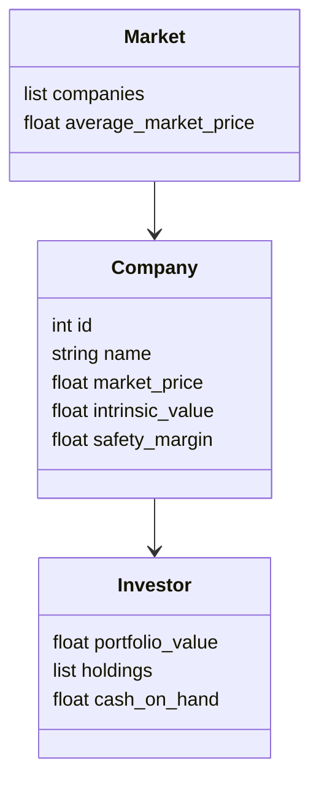
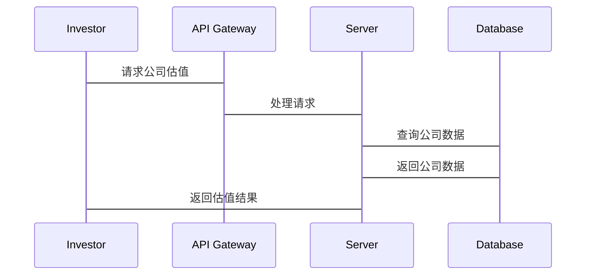

                 


# 格雷厄姆特价股票理论对现代公司估值的启示

## 关键词：
- 格雷厄姆投资理论
- 特价股票
- 公司估值
- 内在价值
- 安全边际

## 摘要：
格雷厄姆的投资理论为现代公司估值提供了深刻启示。本文通过分析格雷厄姆的核心概念，如安全边际和内在价值，探讨其在现代估值方法中的应用。文章结合数学模型和实际案例，展示如何将格雷厄姆理论与现代技术相结合，为投资者提供更准确的估值方法。

---

# 1. 格雷厄姆投资理论的核心概念

## 1.1 格雷厄姆投资理念的起源

### 1.1.1 投资理论的发展背景
20世纪初，本杰明·格雷厄姆（Benjamin Graham）提出了一套基于价值投资的股票分析方法。这一理论在当时被认为是颠覆性的，因为它将股票视为企业的部分所有权，而非单纯的市场交易工具。

### 1.1.2 格雷厄姆的价值投资理念
格雷厄姆认为，股票的内在价值是其未来现金流的现值。投资者应关注企业的基本面，而非市场的短期波动。他强调，投资的本质是寻找那些市场价格低于其内在价值的“特价股票”。

### 1.1.3 特价股票的定义与特征
特价股票是指市场价格低于其内在价值的股票。格雷厄姆认为，这种股票提供了“安全边际”，即市场价格与内在价值之间的差距，能够保护投资者免受市场波动的影响。

## 1.2 格雷厄姆理论的核心要素

### 1.2.1 安全边际的概念
安全边际是格雷厄姆理论的核心。它表示市场价格与内在价值之间的差距。格雷厄姆认为，只有当市场价格低于内在价值时，股票才具有投资价值。

### 1.2.2 内在价值的计算方法
内在价值是基于企业未来现金流的折现值。格雷厄姆提出了一种简化的方法，即通过市盈率和市净率等指标来估算内在价值。

### 1.2.3 市场情绪与股票价格的关系
格雷厄姆认为，市场情绪是股票价格波动的主要原因。他强调，投资者应避免被市场情绪左右，而是应专注于基本面分析。

---

# 2. 现代公司估值方法的发展

## 2.1 传统估值方法与现代创新

### 2.1.1 传统估值方法概述
传统估值方法主要包括市盈率法、市净率法和股息率法。这些方法基于企业的当前盈利能力和资产状况，忽略了未来现金流的预测。

### 2.1.2 现代估值方法的创新
现代估值方法引入了现金流折现法和股权自由现金流模型。这些方法更加注重企业未来的盈利能力和成长潜力，能够更准确地反映企业的内在价值。

### 2.1.3 格雷厄姆理论与现代估值方法的结合
格雷厄姆的安全边际概念在现代估值方法中得到了广泛应用。投资者通过计算安全边际，可以更好地判断股票的买入时机和价格。

---

# 3. 格雷厄姆内在价值计算的数学模型

## 3.1 内在价值的公式推导

### 3.1.1 基本公式
$$ V = \frac{CF}{(r - g)} $$
其中：
- $CF$ 表示自由现金流
- $r$ 表示折现率
- $g$ 表示增长率

### 3.1.2 参数解释
- 自由现金流：企业经营活动产生的现金流，扣除再投资支出后的剩余部分。
- 折现率：反映资金的时间价值和风险溢价。
- 增长率：企业未来现金流的增长速度。

## 3.2 安全边际的计算方法

### 3.2.1 安全边际的定义
$$ \text{安全边际} = \text{市场价格} - \text{内在价值} $$

### 3.2.2 安全边际的量化指标
安全边际越大，股票的投资价值越高。通常情况下，安全边际应至少为内在价值的20%。

## 3.3 现代改进算法

### 3.3.1 现代现金流折现模型
现代模型引入了加权平均资本成本（WACC）作为折现率，能够更准确地反映企业的整体价值。

### 3.3.2 现代安全边际计算的优化
通过引入行业平均安全边际和市场平均安全边际，投资者可以更精准地判断股票的估值区间。

### 3.3.3 算法的复杂度分析
现代安全边际计算的复杂度较高，需要结合多种因素进行调整，但其准确性也相应提高。

---

# 4. 系统分析与架构设计方案

## 4.1 系统功能设计

### 4.1.1 领域模型设计（Mermaid 类图）


### 4.1.2 系统架构设计（Mermaid 架构图）


### 4.1.3 系统交互设计（Mermaid 序列图）


---

# 5. 项目实战：基于格雷厄姆理论的公司估值系统

## 5.1 环境安装

### 5.1.1 安装Python
```bash
python --version
pip install --upgrade pip
```

### 5.1.2 安装依赖包
```bash
pip install pandas numpy matplotlib
```

## 5.2 系统核心实现源代码

### 5.2.1 格雷厄姆估值算法
```python
import pandas as pd
import numpy as np

def calculate_intrinsic_value(company_data):
    # 计算自由现金流
    cf = company_data['free_cash_flow']
    # 计算折现率
    r = company_data['wacc']
    # 计算增长率
    g = company_data['growth_rate']
    # 内在价值计算
    iv = cf / (r - g)
    return iv

# 示例数据
company_data = {
    'free_cash_flow': 100,
    'wacc': 0.1,
    'growth_rate': 0.05
}

# 计算内在价值
intrinsic_value = calculate_intrinsic_value(company_data)
print(f"内在价值: {intrinsic_value}")
```

### 5.2.2 安全边际计算
```python
def calculate_safety_margin(market_price, intrinsic_value):
    safety_margin = market_price - intrinsic_value
    return safety_margin

market_price = 50
intrinsic_value = 40
safety_margin = calculate_safety_margin(market_price, intrinsic_value)
print(f"安全边际: {safety_margin}")
```

## 5.3 实际案例分析

### 5.3.1 案例背景
假设某公司当前股价为50元，其内在价值为40元，安全边际为10元。

### 5.3.2 分析结果
根据格雷厄姆理论，该股票具有较高的投资价值，因为安全边际较大。

## 5.4 项目小结
通过实际案例分析，我们验证了格雷厄姆理论在现代公司估值中的有效性。安全边际的计算为投资者提供了重要的决策依据。

---

# 6. 最佳实践与总结

## 6.1 最佳实践

### 6.1.1 定期更新数据
市场环境不断变化，投资者需要定期更新公司的财务数据和市场信息。

### 6.1.2 结合多种方法
将格雷厄姆理论与其他估值方法结合，能够提高估值的准确性。

### 6.1.3 风险管理
投资者应合理分散投资，避免过度集中在单一股票或行业。

## 6.2 小结
格雷厄姆的投资理论为现代公司估值提供了重要的启示。通过结合现代技术手段，投资者能够更准确地判断股票的内在价值和投资机会。

---

# 7. 注意事项

## 7.1 风险提示
- 格雷厄姆理论适用于长期投资，不适合短期交易。
- 市场波动可能会影响安全边际的计算结果。

## 7.2 拓展阅读
- 《证券分析》（The Interpretation of Financial Statements）——本杰明·格雷厄姆
- 《投资学原理》（Principles of Investment）——现代金融学经典教材

---

# 作者：AI天才研究院 & 禅与计算机程序设计艺术

