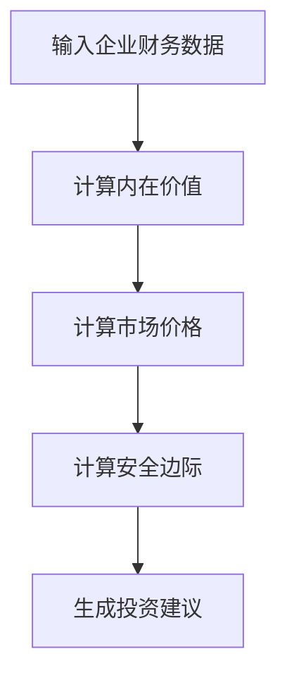
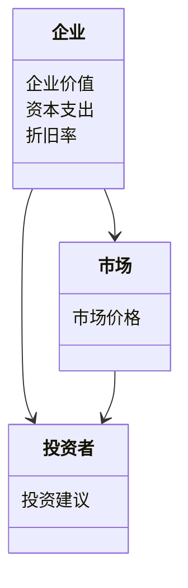
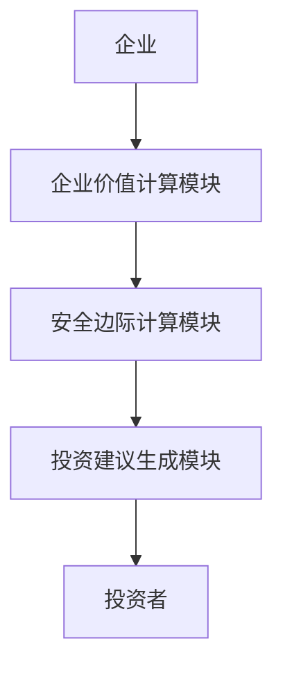

                 


# 格雷厄姆特价股票理论对现代公司治理的启示

## 关键词：格雷厄姆、特价股票理论、公司治理、价值投资、安全边际

## 摘要：本文探讨了格雷厄姆的特价股票理论在现代公司治理中的应用，分析了如何通过价值投资的理念优化公司治理结构，提升企业价值，并在市场波动中保持稳定。文章结合理论与实践，提出了具体的实施方法和建议。

---

## 第1章 格雷厄姆特价股票理论的核心概念

### 1.1 格雷厄姆投资理论的背景与起源

#### 1.1.1 价值投资的起源与发展
价值投资是一种长期投资策略，起源于20世纪初。本杰明·格雷厄姆是该领域的先驱，他强调以低于内在价值的价格买入优质股票。这一理论在金融界产生了深远影响，成为价值投资的基石。

#### 1.1.2 格雷厄姆的学术背景与投资实践
格雷厄姆是一位著名的经济学家和投资家，他的理论结合了深厚的学术背景和丰富的实战经验。他在《证券分析》一书中首次系统阐述了价值投资的理念。

#### 1.1.3 特价股票理论的基本思想
格雷厄姆认为，市场波动为投资者提供了以低于内在价值的价格买入优质股票的机会。这种理论强调安全边际的重要性，即市场价格与内在价值之间的差距。

---

### 1.2 特价股票理论的核心观点

#### 1.2.1 安全边际的概念与计算
安全边际是格雷厄姆理论中的关键概念，指市场价格与内在价值之间的差额。计算公式为：
$$ \text{安全边际} = \text{内在价值} - \text{市场价格} $$

#### 1.2.2 内在价值的定义与评估方法
内在价值是基于公司财务状况和未来现金流折现计算出的理论价值。格雷厄姆的内在价值公式为：
$$ \text{内在价值} = \frac{\text{息税前利润} \times 4 + \text{资本支出}}{1 - \text{折旧率}} $$

#### 1.2.3 市场先生的行为与投资机会
格雷厄姆将市场波动比作“市场先生”，认为市场的非理性行为为投资者提供了廉价买入股票的机会。

---

## 第2章 格雷厄姆特价股票理论的算法原理

### 2.1 特价股票筛选算法

#### 2.1.1 算法输入：企业财务数据
- 息税前利润
- 资本支出
- 折旧率

#### 2.1.2 算法处理：计算内在价值与市场价格
- 内在价值计算
- 市场价格获取

#### 2.1.3 算法输出：安全边际与投资建议
- 安全边际计算
- 投资建议生成

### 2.2 算法流程图



### 2.3 算法实现代码

```python
def calculate_intrinsic_value(enterprise_value, capital_expenditure, depreciation_rate):
    return (enterprise_value * (1 - depreciation_rate) + capital_expenditure) / (1 - depreciation_rate)

def calculate_market_price(current_price):
    return current_price

def calculate_margin_of_safety(intrinsic_value, market_price):
    return intrinsic_value - market_price

# 示例
enterprise_value = 1000000
capital_expenditure = 50000
depreciation_rate = 0.1
market_price = 800000

intrinsic_value = calculate_intrinsic_value(enterprise_value, capital_expenditure, depreciation_rate)
market_price = calculate_market_price(market_price)
margin_of_safety = calculate_margin_of_safety(intrinsic_value, market_price)

print(f"内在价值: {intrinsic_value}")
print(f"市场价格: {market_price}")
print(f"安全边际: {margin_of_safety}")
```

---

## 第3章 现代公司治理中的应用

### 3.1 公司治理的基本概念与重要性

#### 3.1.1 公司治理的定义
公司治理是通过董事会和管理层对公司进行有效管理的过程，旨在实现股东价值最大化。

#### 3.1.2 现代公司治理的核心问题
- 股东权益保护
- 经理人激励机制
- 风险管理与控制

#### 3.1.3 格雷厄姆理论与公司治理的关联性
格雷厄姆的理论为公司治理提供了价值评估的方法，帮助董事会做出更明智的决策。

---

### 3.2 格雷厄姆理论在公司治理中的具体应用

#### 3.2.1 安全边际与风险管理
通过计算安全边际，公司可以评估其股票的市场价值是否合理，从而做出更稳健的投资决策。

#### 3.2.2 内在价值评估与董事会决策
董事会可以通过内在价值评估确定公司的长期目标，并制定相应的战略。

#### 3.2.3 市场波动与公司治理策略
在市场波动中，公司可以通过格雷厄姆理论优化资本结构，降低财务风险。

---

## 第4章 系统分析与架构设计

### 4.1 系统功能设计

#### 4.1.1 领域模型


#### 4.1.2 系统架构设计


---

## 第5章 项目实战

### 5.1 案例分析

#### 5.1.1 案例背景
某公司财务数据如下：
- 企业价值：1000万美元
- 资本支出：50万美元
- 折旧率：10%
- 市场价格：800万美元

#### 5.1.2 计算过程
- 内在价值：1000万美元
- 市场价格：800万美元
- 安全边际：200万美元

#### 5.1.3 结论
建议投资者在当前价格下买入该股票，因为安全边际较高。

---

## 第6章 总结与展望

### 6.1 核心启示
格雷厄姆的特价股票理论为现代公司治理提供了重要的价值评估工具，帮助董事会和管理层做出更明智的决策。

### 6.2 未来展望
随着市场的波动和公司治理的复杂化，格雷厄姆理论的应用将更加广泛，尤其是在人工智能和大数据分析的支持下，其价值将进一步提升。

---

## 作者：AI天才研究院/AI Genius Institute & 禅与计算机程序设计艺术 /Zen And The Art of Computer Programming

