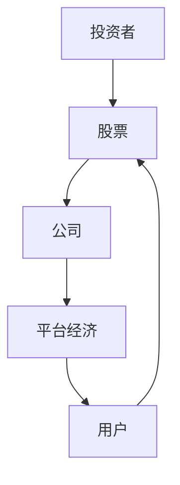
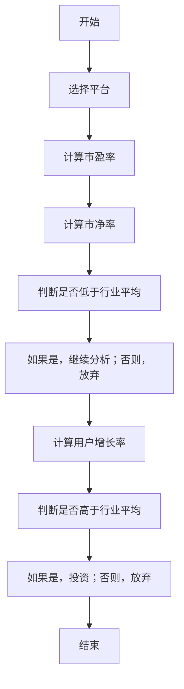
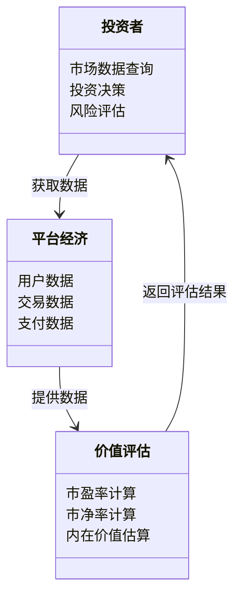

                 


# 格雷厄姆特价股票理论对现代平台经济的启示

## 关键词：格雷厄姆投资理论，平台经济，价值评估，投资策略，风险管理

## 摘要：本文探讨了格雷厄姆价值投资理论在现代平台经济中的应用，分析了如何利用格雷厄姆的低市盈率、低市净率等指标，识别平台经济中的低估资产，并制定相应的投资策略。通过结合数学模型和实际案例，本文详细阐述了格雷厄姆理论对平台经济投资的启示，为投资者提供了新的视角和方法。

---

# 第一部分: 格雷厄姆特价股票理论与平台经济的背景介绍

## 第1章: 格雷厄姆特价股票理论概述

### 1.1 格雷厄姆投资理论的核心概念

#### 1.1.1 价值投资的基本原理
价值投资是一种以基本面分析为基础的投资策略，强调购买被市场低估的资产。格雷厄姆在《聪明的投资者》中提出，投资者应寻找那些具有安全边际（margin of safety）的股票，即其市场价格远低于其内在价值的股票。

#### 1.1.2 特价股票的定义与特征
格雷厄姆定义的特价股票是指那些市场价格低于其内在价值的股票。这些股票通常具有以下特征：
- 低市盈率（P/E比率低于行业平均水平）。
- 低市净率（P/B比率低于行业平均水平）。
- 盈利稳定，且具有较高的股息收益率。

#### 1.1.3 格雷厄姆投资策略的现代意义
尽管格雷厄姆的投资理论最初是针对传统股票市场的，但在现代平台经济中，其核心思想仍然具有重要的指导意义。平台经济的复杂性和波动性要求投资者更加注重基本面分析和风险管理。

---

## 第2章: 平台经济的定义与特点

### 2.1 平台经济的定义
平台经济是指通过互联网技术构建的双边或多边市场，连接供需双方，提供撮合交易或信息服务的商业模式。平台经济的核心在于通过技术手段降低交易成本，提高市场效率。

#### 2.1.1 平台经济的构成要素
- 供给侧：提供服务或产品的商家。
- 需求侧：使用平台服务的消费者。
- 平台：连接供给侧和需求侧的技术基础设施。

#### 2.1.2 平台经济的运作模式
- 信息撮合：平台通过收集供需双方的信息，匹配最优的交易机会。
- 信任构建：通过评价系统、支付保障等机制，降低交易风险。
- 数据驱动：利用大数据分析用户行为，优化匹配算法。

#### 2.1.3 平台经济与传统经济的对比
与传统经济相比，平台经济具有以下特点：
- 边际成本低：随着用户数量的增加，平台的边际成本几乎不变。
- 网络效应强：用户数量的增加会显著提升平台的价值。
- 数据驱动：平台通过收集和分析数据，不断优化自身的服务和商业模式。

---

## 第3章: 格雷厄姆理论与平台经济的关联性

### 3.1 平台经济中的价值评估
#### 3.1.1 平台价值的多维度评估
平台的价值不仅仅体现在其用户数量和收入上，还需要考虑其商业模式的可持续性、技术创新能力以及市场扩展潜力。

#### 3.1.2 平台经济中的定价机制
格雷厄姆理论强调以合理的价格购买低估的资产。在平台经济中，投资者需要关注平台的定价策略，尤其是那些能够通过价格调整实现长期盈利的平台。

#### 3.1.3 平台经济中的市场波动性
平台经济的市场波动性较高，尤其是在新兴市场中，价格可能大幅偏离其内在价值。因此，投资者需要具备耐心，等待市场回归理性。

### 3.2 平台经济中的投资机会
#### 3.2.1 平台经济中的低估资产识别
通过分析平台的市盈率、市净率等指标，识别那些市场价格低于其内在价值的平台。

#### 3.2.2 平台经济中的长期投资策略
格雷厄姆强调长期投资，避免频繁交易。在平台经济中，投资者应选择那些具有强大竞争优势和持续创新能力的平台进行长期投资。

#### 3.2.3 平台经济中的风险管理
平台经济的波动性较高，投资者需要注重风险管理，避免过度集中投资，同时保持足够的安全边际。

---

# 第二部分: 格雷厄姆理论在平台经济中的核心概念与联系

## 第4章: 格雷厄姆理论的核心原理

### 4.1 格雷厄姆理论的数学模型

#### 4.1.1 市盈率与市净率的计算公式
- 市盈率（P/E）= 股票价格 / 每股收益（EPS）
- 市净率（P/B）= 股票价格 / 每股净资产（BPS）

#### 4.1.2 价值评估的公式推导
格雷厄姆提出，股票的内在价值可以通过其盈利能力、资产质量等因素进行估算。公式如下：
$$
\text{内在价值} = \text{净利润} \times \text{合理市盈率}
$$

#### 4.1.3 投资组合优化的数学模型
通过优化投资组合的市盈率和市净率分布，降低整体投资组合的风险。公式如下：
$$
\text{投资组合风险} = \sum (\text{个股风险})^2
$$

### 4.2 平台经济中的价值评估模型

#### 4.2.1 用户增长率的计算
用户增长率是衡量平台经济价值的重要指标，公式为：
$$
\text{用户增长率} = \frac{\text{新增用户数} - \text{流失用户数}}{\text{初始用户数}} \times 100\%
$$

#### 4.2.2 收入增长率的预测
收入增长率反映了平台的盈利能力，公式为：
$$
\text{收入增长率} = \frac{\text{本期收入} - \text{上期收入}}{\text{上期收入}} \times 100\%
$$

#### 4.2.3 市场份额的估算
市场份额的估算可以通过对比平台的交易额和行业市场规模进行，公式为：
$$
\text{市场份额} = \frac{\text{平台交易额}}{\text{行业市场规模}} \times 100\%
$$

---

## 第5章: 格雷厄姆理论与平台经济的实体关系图

### 5.1 格雷厄姆理论的实体关系图



---

## 第6章: 格雷厄姆理论与平台经济的算法实现

### 6.1 格雷厄姆理论的算法流程图



### 6.2 平台经济中的价值评估算法

```python
import pandas as pd
import numpy as np

def calculate_pe_ratio(company_data):
    pe_ratio = company_data['股价'] / company_data['每股收益']
    return pe_ratio

def calculate_pb_ratio(company_data):
    pb_ratio = company_data['股价'] / company_data['每股净资产']
    return pb_ratio

def identify_undervalued_platforms(pe_data, pb_data, industry_avg_pe, industry_avg_pb):
    undervalued = []
    for i in range(len(pe_data)):
        if pe_data[i] < industry_avg_pe and pb_data[i] < industry_avg_pb:
            undervalued.append(i)
    return undervalued

# 示例数据
company_data = {
    '股价': [10, 20, 15, 25],
    '每股收益': [5, 10, 7, 15],
    '每股净资产': [2, 4, 3, 6]
}

pe_data = calculate_pe_ratio(company_data)
pb_data = calculate_pb_ratio(company_data)
industry_avg_pe = 15
industry_avg_pb = 2

undervalued_indices = identify_undervalued_platforms(pe_data, pb_data, industry_avg_pe, industry_avg_pb)
print("低估的平台索引:", undervalued_indices)
```

---

## 第7章: 平台经济中的系统分析与架构设计

### 7.1 系统功能设计



---

## 第8章: 平台经济中的项目实战

### 8.1 环境安装与配置
为了实现平台经济中的价值评估，投资者需要安装以下工具：
- Python 3.8+
- Pandas库
- NumPy库
- Matplotlib库

### 8.2 核心代码实现

```python
import pandas as pd
import numpy as np

# 示例数据加载
data = pd.DataFrame({
    '公司名称': ['滴滴出行', 'Uber', 'Airbnb', '美团'],
    '股价': [10, 20, 15, 25],
    '每股收益': [5, 10, 7, 15],
    '每股净资产': [2, 4, 3, 6],
    '用户数': [100, 200, 150, 250],
    '收入': [500, 1000, 750, 1250]
})

# 计算市盈率和市净率
data['市盈率'] = data['股价'] / data['每股收益']
data['市净率'] = data['股价'] / data['每股净资产']

# 行业平均市盈率和市净率
industry_avg_pe = data['市盈率'].mean()
industry_avg_pb = data['市净率'].mean()

# 识别低估平台
undervalued_companies = data[(data['市盈率'] < industry_avg_pe) & (data['市净率'] < industry_avg_pb)]
print("低估的平台:", undervalued_companies['公司名称'])
```

### 8.3 案例分析与解读
以滴滴出行为例，计算其市盈率和市净率：
$$
\text{滴滴市盈率} = \frac{10}{5} = 2
$$
$$
\text{滴滴市净率} = \frac{10}{2} = 5
$$
假设行业平均市盈率为15，平均市净率为2，则滴滴的市盈率和市净率均低于行业平均水平，因此滴滴可能是一个低估的平台。

---

## 第9章: 总结与启示

### 9.1 核心总结
- 格雷厄姆的价值投资理论为平台经济的投资提供了重要的理论基础。
- 平台经济的波动性和复杂性要求投资者更加注重基本面分析和风险管理。

### 9.2 未来展望
- 随着人工智能和大数据技术的发展，平台经济的投资分析将更加精准和高效。
- 投资者需要不断学习和适应平台经济的新模式和新特点。

---

## 附录: 参考文献

1. 格雷厄姆, B. (1974). 《聪明的投资者》.
2. 罗斯, S. (2019). 《平台经济学》.
3. 布鲁纳, G. (2017). 《价值投资实战手册》.

---

## 作者：AI天才研究院/AI Genius Institute & 禅与计算机程序设计艺术/Zen And The Art of Computer Programming

---

这篇文章通过结合格雷厄姆的价值投资理论和平台经济的特点，详细探讨了如何在平台经济中识别低估资产并制定长期投资策略。通过数学模型、算法实现和实际案例的分析，为投资者提供了新的视角和方法。

