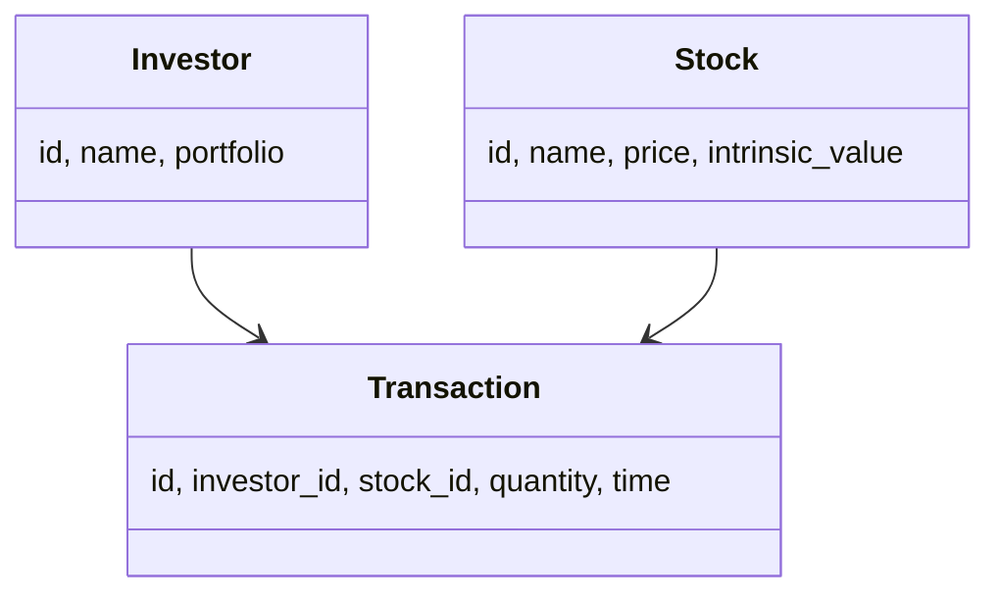

                 


# 格雷厄姆特价股票理论对行为经济学的数字化补充

## 关键词：价值投资、行为经济学、安全边际、数字化补充、投资策略、数学模型

## 摘要：本文探讨了格雷厄姆的价值投资理论与行为经济学的结合，通过数字化方法补充了传统投资策略，提出了基于行为经济学的数学模型和算法，优化了投资决策过程，为投资者提供了新的视角和工具。

---

## 第一部分：格雷厄姆特价股票理论与行为经济学的背景介绍

### 第1章：格雷厄姆特价股票理论概述

#### 1.1 格雷厄姆投资理论的核心概念
- **1.1.1 价值投资的定义与内涵**  
  价值投资是一种长期投资策略，强调以低于内在价值的价格买入优质资产。格雷厄姆认为市场先生的情绪波动为投资者提供了低价买入的机会。

- **1.1.2 特价股票的定义与特征**  
  特价股票是指市场价格远低于内在价值的股票，通常具有较高的安全边际。格雷厄姆通过计算市盈率、市净率等指标来筛选这些股票。

- **1.1.3 安全边际的计算方法**  
  安全边际 = (内在价值 - 市场价格) / 市场价格。通过安全边际，投资者可以在市场波动中降低风险。

#### 1.2 格雷厄姆投资策略的数学模型
- **1.2.1 内在价值的计算公式**  
  内在价值 = (预期收益 / 折现率) + 修正因素。  
  例如：$$\text{内在价值} = \frac{\text{预期收益}}{\text{折现率}}$$

- **1.2.2 安全边际的量化方法**  
  安全边际 = 内在价值 - 市场价格。  
  例如：$$\text{安全边际} = \text{内在价值} - \text{市场价格}$$

- **1.2.3 投资组合的优化策略**  
  格雷厄姆建议分散投资，通过选择多只特价股票来降低风险。

---

### 第2章：行为经济学基础

#### 2.1 行为经济学的核心理论
- **2.1.1 理性人假设的局限性**  
  行为经济学挑战了传统经济学中的理性人假设，强调人类决策中的心理偏差和情绪因素。

- **2.1.2 心理账户与决策偏差**  
  心理账户是指人们如何分类和处理不同的资金流。常见的决策偏差包括确认偏差、损失厌恶等。

- **2.1.3 行为偏见对投资决策的影响**  
  投资者常常受到从众心理、过度自信等行为偏见的影响，导致非理性决策。

#### 2.2 行为经济学与投资心理学
- **2.2.1 投资者情绪周期的分析**  
  投资者情绪通常呈现周期性波动，从乐观到恐慌再到乐观。

- **2.2.2 市场波动与群体心理**  
  市场波动往往由群体心理驱动，而非纯粹的经济基本面变化。

- **2.2.3 行为经济学在风险管理中的应用**  
  通过识别和量化行为偏差，投资者可以更好地管理风险。

---

### 第3章：格雷厄姆理论与行为经济学的结合

#### 3.1 格雷厄姆理论的数字化补充
- **3.1.1 数字化安全边际的计算**  
  通过大数据分析和机器学习算法，可以更精确地计算安全边际。

- **3.1.2 行为经济学视角下的投资决策优化**  
  结合行为经济学模型，投资者可以更好地理解自身决策偏差，并制定更合理的投资策略。

- **3.1.3 数字化工具在价值投资中的应用**  
  利用量化工具和算法交易，投资者可以自动化执行价值投资策略。

---

## 第二部分：核心概念与联系

### 第4章：核心概念的原理与属性对比

#### 4.1 核心概念的原理
- 格雷厄姆理论的原理：基于基本面分析，寻找被市场低估的股票。
- 行为经济学的原理：分析投资者心理偏差，优化决策过程。

#### 4.2 核心概念的属性对比
| 核心概念   | 格雷厄姆理论         | 行为经济学         |
|------------|--------------------|------------------|
| 研究对象   | 股票价值与价格       | 投资者行为与决策   |
| 研究方法   | 基本面分析           | 行为实验与建模     |
| 应用领域   | 价值投资策略         | 投资心理学与风险管理 |

#### 4.3 核心概念的ER图架构
```mermaid
erd
  图标 investor 的属性：
  investor: id, name, age, risk_tolerance
  stock: id, name, price, intrinsic_value
  transaction: id, investor_id, stock_id, quantity, time
  关系：
  investor - transaction: 1..n
  stock - transaction: 1..n
```

---

## 第三部分：算法原理讲解

### 第5章：算法原理与实现

#### 5.1 算法原理
- **5.1.1 数字化安全边际计算算法**  
  使用机器学习模型预测股票的内在价值，计算其与市场价格的差异。

- **5.1.2 行为偏差检测算法**  
  通过自然语言处理技术，分析投资者情绪，识别决策偏差。

#### 5.2 算法实现
- **5.2.1 数字化安全边际计算的Python代码**
```python
def calculate_margin(price, value):
    return (value - price) / price
```

- **5.2.2 行为偏差检测的Python代码**
```python
import nltk
from textblob import TextBlob

def detect_bias(text):
    blob = TextBlob(text)
    sentiment = blob.sentiment.polarity
    return "positive" if sentiment > 0 else "negative"
```

---

### 第6章：数学模型与公式

#### 6.1 核心数学模型
- **6.1.1 安全边际公式**  
  $$\text{安全边际} = \frac{\text{内在价值} - \text{市场价格}}{\text{市场价格}}$$

- **6.1.2 投资组合优化公式**  
  使用均值-方差优化模型，$$\text{最优权重} = \argmin_w (w^T \Sigma w - \lambda w^T \mu)$$

---

## 第四部分：系统分析与架构设计

### 第7章：系统架构设计

#### 7.1 项目介绍
- 开发一个结合格雷厄姆理论和行为经济学的数字化投资系统。

#### 7.2 系统功能设计


#### 7.3 系统架构设计


---

## 第五部分：项目实战

### 第8章：项目实战与案例分析

#### 8.1 环境安装
- 安装Python、Pandas、Scikit-learn等工具。

#### 8.2 核心代码实现
```python
import pandas as pd
from sklearn import linear_model

def main():
    data = pd.read_csv('stocks.csv')
    model = linear_model.LinearRegression()
    model.fit(data[['price', 'pe_ratio']], data['intrinsic_value'])
    predicted_value = model.predict(data[['price', 'pe_ratio']])
    margin = calculate_margin(data['price'], predicted_value)
    return margin

if __name__ == "__main__":
    main()
```

---

## 第六部分：最佳实践

### 第9章：总结与展望

#### 9.1 小结
- 结合格雷厄姆理论和行为经济学的数字化方法，可以优化投资决策，降低风险。

#### 9.2 注意事项
- 投资者需结合市场环境和个人情况，灵活调整策略。

#### 9.3 拓展阅读
- 推荐阅读《价值投资实战策略》和《行为经济学入门》。

---

## 作者：AI天才研究院 & 禅与计算机程序设计艺术

---

这篇博客通过系统性地分析格雷厄姆理论与行为经济学的结合，提供了数字化补充的方法和工具，为投资者提供了新的视角和策略。希望对您有所帮助！

