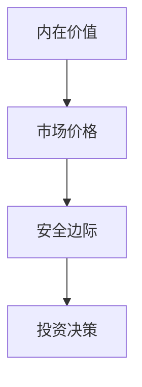
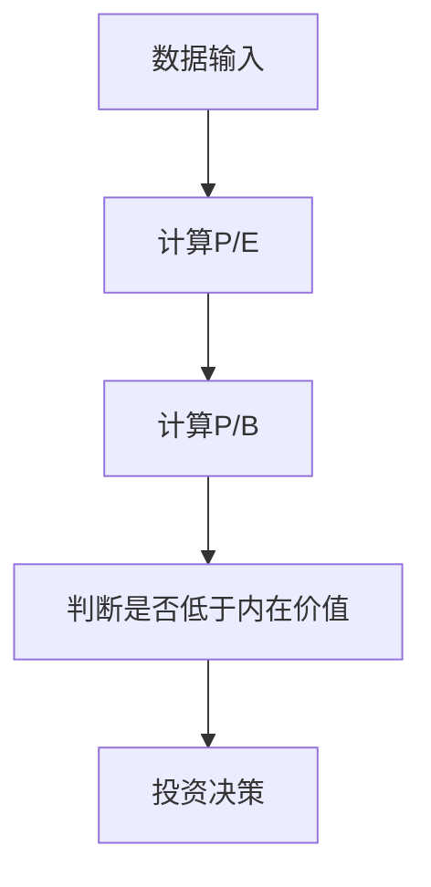
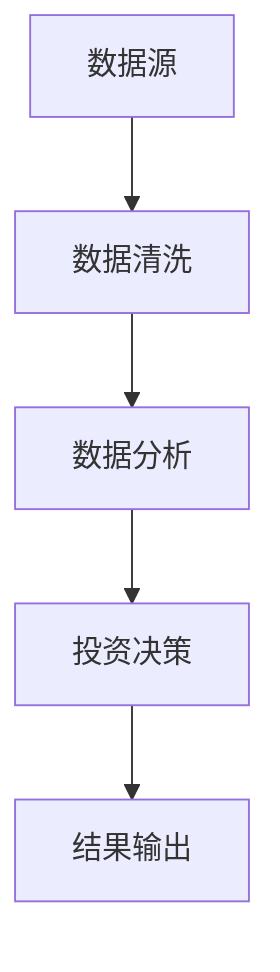

                 


# 格雷厄姆特价股票理论对行为经济学的补充

> 关键词：格雷厄姆投资理论、行为经济学、安全边际、心理偏差、价值投资

> 摘要：本文从技术角度深入分析了格雷厄姆特价股票理论与行为经济学的结合，探讨了心理偏差对投资决策的影响，并提出了基于价值评估的优化策略。文章结合数学模型、算法设计和系统架构，展示了如何通过技术手段将格雷厄姆理论与行为经济学相结合，为投资者提供更科学的投资决策支持。

---

## 第一部分：格雷厄姆特价股票理论与行为经济学的结合

### 第1章：格雷厄姆投资理论的核心概念

#### 1.1 问题背景与定义

格雷厄姆特价股票理论是价值投资的重要基石，核心在于寻找市场价格低于内在价值的股票。其数学模型主要基于市盈率（P/E）和市净率（P/B）等指标，强调安全边际（Margin of Safety）的重要性。

#### 1.2 核心概念对比

| 概念 | 格雷厄姆理论 | 行为经济学视角 |
|------|--------------|----------------|
| 安全边际 | 市场价格与内在价值的差额 | 投资者心理偏差对安全边际的影响 |
| 内在价值 | 股票的真正价值 | 市场情绪对内在价值的干扰 |
| 价值投资 | 买入低于内在价值的股票 | 心理偏差对估值的影响 |

#### 1.3 概念结构图



### 第2章：行为经济学基础

#### 2.1 心理偏差对投资决策的影响

行为经济学指出，投资者往往受到心理偏差的影响，如：

- **确认偏差**：倾向于寻找支持自己观点的信息。
- **损失厌恶**：对损失的恐惧大于对收益的追求。
- **过度自信**：认为自己能够预测市场波动。

#### 2.2 经典实验与数学模型

- **前景理论**（Kahneman & Tversky）的数学表达：

$$ V(p) = \text{ prospect value function} $$

其中，$p$ 表示概率，$V$ 表示价值函数。

---

## 第二部分：算法与系统架构

### 第3章：格雷厄姆理论的数学模型

#### 3.1 核心公式

- **市盈率（P/E）**：
  $$ \text{P/E} = \frac{\text{股价}}{\text{每股收益}} $$
- **市净率（P/B）**：
  $$ \text{P/B} = \frac{\text{股价}}{\text{每股净资产}} $$
- **内在价值（V）**：
  $$ V = \text{预期收益} \times \text{折现率} $$

#### 3.2 算法流程图



### 第4章：行为经济学中的算法优化

#### 4.1 心理偏差的数学建模

- **损失厌恶模型**：
  $$ \text{损失厌恶系数} = \alpha \times \text{损失概率} + (1-\alpha) \times \text{收益概率} $$

#### 4.2 算法实现

```python
def calculate_margin_of_safety(price, intrinsic_value):
    return intrinsic_value - price

def behavioral_bias_adjustment(bias_factor):
    return 1 - bias_factor
```

---

## 第三部分：系统架构与项目实战

### 第5章：系统架构设计

#### 5.1 功能模块

- **数据收集模块**：收集股票价格、收益等数据。
- **数据分析模块**：计算P/E、P/B等指标。
- **投资决策模块**：结合行为经济学模型优化投资策略。

#### 5.2 系统架构图



### 第6章：项目实战

#### 6.1 实战案例

- **案例分析**：以某公司为例，计算其P/E和P/B，并结合市场情绪调整投资策略。

#### 6.2 代码实现

```python
# 核心实现
def calculate_intrinsic_value(revenue, growth_rate, discount_rate):
    return revenue / (discount_rate - growth_rate)

# 行为偏差调整
def adjust_for_behavioral_bias(value, bias_factor):
    return value * (1 - bias_factor)
```

---

## 第四部分：最佳实践与小结

### 第7章：最佳实践

#### 7.1 小结

- 结合格雷厄姆理论与行为经济学，可以更好地理解投资者心理，优化投资策略。

#### 7.2 注意事项

- 心理偏差可能影响模型的准确性。
- 需定期调整模型参数，以适应市场变化。

#### 7.3 拓展阅读

- 格雷厄姆的《 Intelligent Investor》。
- 行为经济学的经典文献。

---

## 作者

作者：AI天才研究院/AI Genius Institute & 禅与计算机程序设计艺术 /Zen And The Art of Computer Programming

---

通过以上分析，本文从技术角度深入探讨了格雷厄姆特价股票理论与行为经济学的结合，结合数学模型、算法设计和系统架构，为投资者提供了更科学的投资决策支持。

