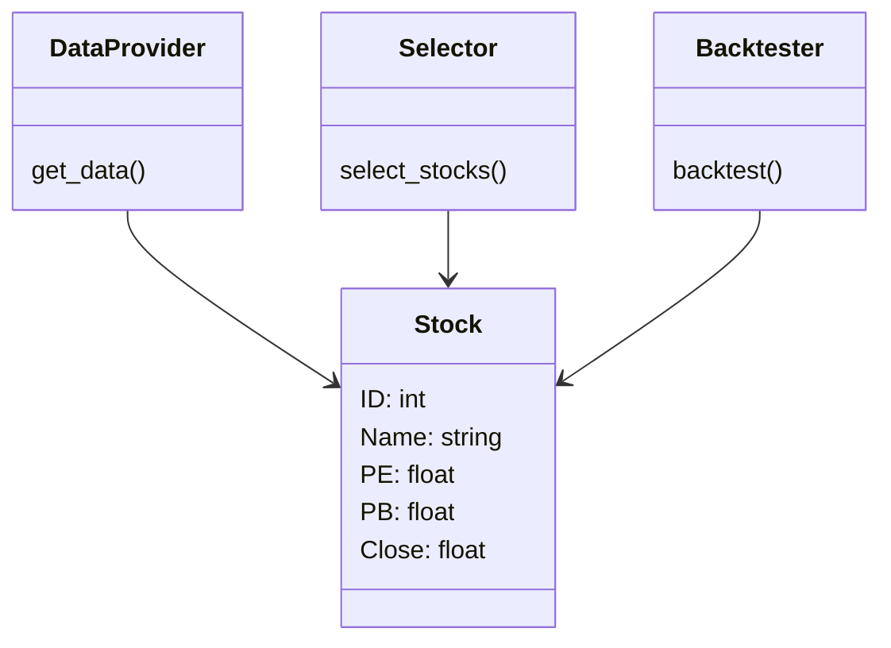

                 


# 格雷厄姆特价股票理论对量化投资的启示

> 关键词：价值投资、量化投资、格雷厄姆理论、股票筛选、数学模型

> 摘要：本文探讨了格雷厄姆的价值投资理论如何启发量化投资领域，通过构建数学模型和算法，展示了如何将格雷厄姆的选股标准转化为可执行的量化策略。文章详细介绍了理论背景、量化模型的构建、算法实现、系统架构设计以及实际案例分析，最后总结了该方法的优势与局限。

---

# 第一部分: 格雷厄姆特价股票理论与量化投资的结合

## 第1章: 格雷厄姆投资理论概述

### 1.1 价值投资的起源与发展

格雷厄姆是价值投资之父，他的理论强调寻找被市场低估的股票，通过安全边际来降低投资风险。价值投资的核心在于分析公司的基本面，寻找价格低于其内在价值的股票。量化投资则利用数学模型和算法进行投资决策，两者结合为现代投资策略提供了新的思路。

### 1.2 格雷厄姆的核心思想

格雷厄姆提出，股票的内在价值是其未来现金流的现值。他强调安全边际的重要性，即以低于内在价值的价格买入股票，以降低投资风险。此外，格雷厄姆还提出了选股标准，如低市盈率、低市净率、高股息率等。

### 1.3 量化投资的基本原理

量化投资利用数据和算法进行决策，通常涉及高频交易、因子模型和机器学习。量化方法的优势在于快速处理大量数据，发现传统方法难以察觉的模式和趋势。

---

## 第2章: 格雷厄姆选股标准的量化模型

### 2.1 格雷厄姆选股标准的数学模型

格雷厄姆的选股标准可以转化为数学公式。例如，市盈率（P/E）和市净率（P/B）是常用的估值指标。通过设定这些指标的阈值，可以筛选出符合条件的股票。

### 2.2 量化模型的构建与实现

#### 2.2.1 数据获取与预处理

首先，获取历史股价、市盈率、市净率等数据，清洗数据，去除缺失值。

#### 2.2.2 模型参数的设定与优化

设定筛选条件，如市盈率低于行业平均值，市净率低于历史均值。通过回测优化模型参数。

#### 2.2.3 模型的验证与回测

使用历史数据验证模型的有效性，计算回测收益、最大回撤等指标。

---

## 第3章: 格雷厄姆量化模型的算法实现

### 3.1 算法原理与流程

1. 数据清洗与特征提取：获取并处理股票数据，提取相关指标。
2. 模型训练：基于格雷厄姆标准构建筛选条件。
3. 模型预测：筛选符合条件的股票，生成投资组合。

### 3.2 量化模型的代码实现

#### 3.2.1 数据获取与处理

```python
import pandas as pd
import numpy as np

# 获取数据
data = pd.read_csv('stock_data.csv')

# 数据清洗
data = data.dropna()
```

#### 3.2.2 模型训练

```python
# 筛选条件：市盈率 < 15，市净率 < 2
selected_stocks = data[(data['PE'] < 15) & (data['PB'] < 2)]
```

#### 3.2.3 模型验证

```python
# 计算回测收益
selected_stocks['Return'] = selected_stocks['Close'].pct_change()

# 计算平均收益
average_return = selected_stocks['Return'].mean()
```

---

## 第4章: 系统分析与架构设计

### 4.1 系统功能设计

#### 4.1.1 领域模型



#### 4.1.2 系统架构


---

## 第5章: 项目实战

### 5.1 环境安装

安装必要的库，如Pandas、NumPy等。

### 5.2 核心实现

编写筛选和回测的代码。

### 5.3 案例分析

分析实际案例，展示模型的效果。

---

## 第6章: 总结与展望

### 6.1 总结

格雷厄姆理论与量化投资结合，提供了一种新的选股方法，具有较高的实用价值。

### 6.2 展望

未来，可以进一步优化模型，结合机器学习等技术，提升投资效果。

---

# 附录

### 附录A: 术语表

列出文章中使用的术语及其定义。

### 附录B: 数据来源

说明数据的来源和获取方式。

---

作者：AI天才研究院/AI Genius Institute & 禅与计算机程序设计艺术 /Zen And The Art of Computer Programming

