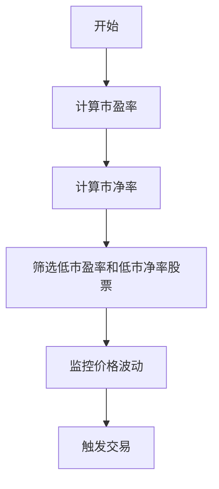
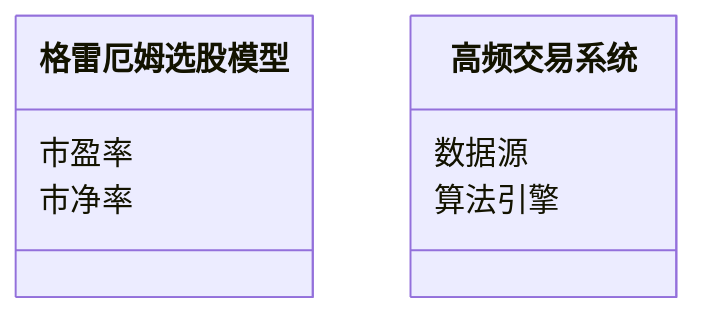
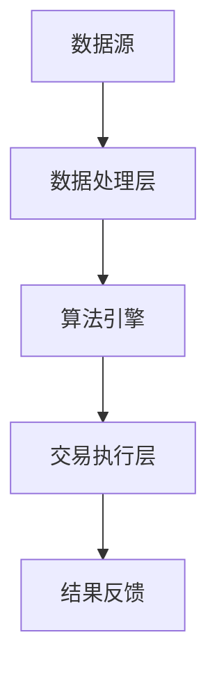

                 


# 格雷厄姆特价股票理论对高频算法交易的影响

> 关键词：格雷厄姆特价股票理论、高频算法交易、价值投资、算法交易、市场分析

> 摘要：本文探讨了格雷厄姆的特价股票理论如何影响高频算法交易。通过分析价值投资与技术分析的结合，揭示了高频交易中如何利用格雷厄姆的选股标准，结合数学模型和系统架构，优化交易策略。

---

# 第1章: 格雷厄姆特价股票理论概述

## 1.1 格雷厄姆投资理论的起源与发展

### 1.1.1 价值投资的起源与发展
价值投资是一种长期投资策略，由本杰明·格雷厄姆在20世纪初提出。其核心理念是寻找市场低估的股票，即“烟蒂股”，通过深入分析企业基本面，等待市场重新评估其价值。

### 1.1.2 格雷厄姆的“烟蒂股”投资策略
格雷厄姆强调购买具有安全边际的股票，即市场价格远低于其内在价值。他提出了多个选股标准，包括低市盈率、低市净率和高股息率等。

### 1.1.3 特价股票的定义与特征
特价股票是指市场价格低于其内在价值的股票。其特征包括低市盈率、低市净率、高股息率和稳定的财务状况。

## 1.2 高频算法交易的基本概念

### 1.2.1 高频交易的定义与特点
高频交易是指在极短时间内进行大量交易，利用价格波动和技术优势获取收益。其特点是速度快、算法驱动和高频执行。

### 1.2.2 算法交易的核心原理
算法交易利用数学模型和统计分析，通过算法自动执行交易决策。其核心在于快速分析市场数据，识别价格波动中的获利机会。

### 1.2.3 高频交易与传统交易的对比
高频交易以技术分析为主，而传统交易以基本面分析为主。高频交易强调速度和算法优化，传统交易注重长期价值。

---

# 第2章: 格雷厄姆特价股票理论的核心原理

## 2.1 格雷厄姆的选股标准

### 2.1.1 市盈率与市净率的计算公式
$$ P/E = \frac{Price}{Earnings} $$
$$ P/B = \frac{Price}{Book\ Value} $$

### 2.1.2 股票安全边际的计算方法
安全边际 = 内在价值 - 市场价格

### 2.1.3 企业内在价值的评估模型
内在价值 = (净利润 × 折现率) / (折现率 - 增长率)

## 2.2 高频交易中的数学模型

### 2.2.1 时间序列分析的基本原理
时间序列分析用于预测未来价格走势，常用ARIMA模型。

### 2.2.2 马科维茨投资组合理论
$$ \text{收益} = \sum_{i=1}^{n} w_i r_i $$
$$ \text{风险} = \sqrt{\sum_{i=1}^{n} \sum_{j=1}^{n} w_i w_j \sigma_i \sigma_j \rho_{ij}} $$

### 2.2.3 高频交易中的统计套利模型
统计套利模型利用市场价差进行无风险套利，常用均值回归策略。

---

# 第3章: 格雷厄姆理论与高频交易的结合

## 3.1 高频交易中的格雷厄姆选股模型

### 3.1.1 基于格雷厄姆标准的筛选算法
1. 计算市盈率和市净率
2. 筛选低市盈率和低市净率的股票
3. 结合高频交易算法，实时监控价格波动

### 3.1.2 算法流程图


## 3.2 格雷厄姆理论对高频交易的影响

### 3.2.1 提高交易机会
通过筛选低估股票，高频交易可以找到更多的交易机会。

### 3.2.2 降低交易风险
基于价值投资的策略，减少因市场波动带来的风险。

---

# 第4章: 高频交易中的系统架构设计

## 4.1 系统功能设计

### 4.1.1 领域模型类图


### 4.1.2 系统架构图


---

# 第5章: 项目实战

## 5.1 环境安装

### 5.1.1 安装Python环境
```bash
pip install python
pip install numpy
pip install pandas
pip install matplotlib
```

## 5.2 核心代码实现

### 5.2.1 格雷厄姆选股模型代码
```python
import pandas as pd
import numpy as np

def calculate_pe(stock_price, earnings):
    return stock_price / earnings

def calculate_pb(stock_price, book_value):
    return stock_price / book_value

def select_undervalued_stocks(stocks, threshold_pe=15, threshold_pb=2):
    undervalued = []
    for stock in stocks:
        pe = calculate_pe(stock['price'], stock['earnings'])
        pb = calculate_pb(stock['price'], stock['book_value'])
        if pe < threshold_pe and pb < threshold_pb:
            undervalued.append(stock)
    return undervalued
```

### 5.2.2 高频交易算法代码
```python
import numpy as np
import pandas as pd

def mean_reversion_strategy(prices, window=20):
    # 计算短期移动平均线
    short_ma = prices.rolling(window=2).mean()
    # 计算长期移动平均线
    long_ma = prices.rolling(window=10).mean()
    # 生成交易信号
    signal = np.where(short_ma > long_ma, 1, -1)
    return signal
```

## 5.3 实际案例分析

### 5.3.1 案例分析
某公司股票价格为50元，市盈率为10，市净率为1.5。假设市场平均市盈率为15，市净率为2，该股票符合格雷厄姆选股标准，触发买入信号。

## 5.4 项目小结
通过结合格雷厄姆的选股模型和高频交易算法，可以在短时间内发现低估股票，提高交易效率和收益。

---

# 第6章: 总结与展望

## 6.1 核心观点总结
格雷厄姆的特价股票理论与高频算法交易的结合，为投资者提供了新的交易策略，提高了交易效率和准确性。

## 6.2 未来展望
未来，随着人工智能和大数据技术的发展，格雷厄姆理论在高频交易中的应用将更加广泛和深入。

---

作者：AI天才研究院 & 禅与计算机程序设计艺术

