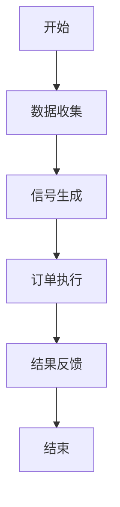
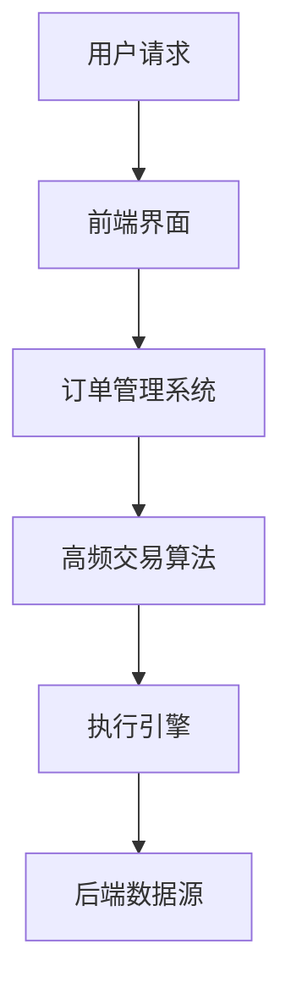
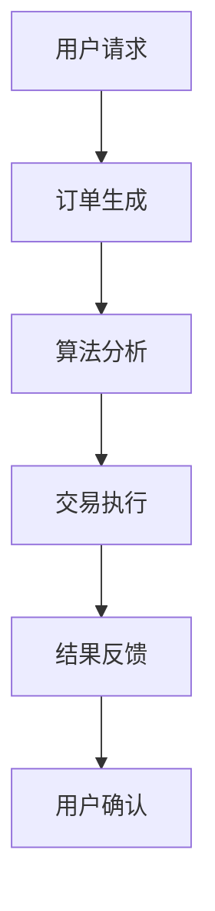

                 


# 格雷厄姆特价股票理论对高频量化交易的伦理影响

## 关键词：格雷厄姆投资理论、高频量化交易、伦理影响、市场公平性、算法交易、价值投资

## 摘要：本文探讨了格雷厄姆特价股票理论与高频量化交易的伦理影响，分析了两者在金融市场中的互动关系，特别是高频量化交易对传统投资策略的挑战以及对市场公平性的影响。通过数学模型和实际案例，本文揭示了高频交易对格雷厄姆理论的潜在冲击，并提出了伦理框架下的解决方案。

---

# 第一部分: 格雷厄姆特价股票理论与高频量化交易的背景

## 第1章: 格雷厄姆投资理论的核心概念

### 1.1 价值投资的定义与核心原则
价值投资是一种长期投资策略，强调以低于内在价值的价格购买优质资产。格雷厄姆在他的经典著作《The Intelligent Investor》中提出，投资者应寻找那些市场价格远低于其内在价值的股票。

- **安全边际**：格雷厄姆的核心概念之一，是指购买价格与内在价值之间的差距。公式为：
  $$ \text{安全边际} = \text{内在价值} - \text{市场价格} $$
- **低市盈率股票**：格雷厄姆倾向于投资那些市盈率低于市场平均水平的股票，认为这些股票具有较高的价值吸引力。

### 1.2 高频量化交易的基本原理
高频量化交易是一种依靠算法在极短时间内进行大量交易的策略。其核心在于利用市场微观结构中的套利机会和价格波动。

- **高频交易的特点**：
  - 交易速度极快，通常以毫秒为单位。
  - 依赖复杂的算法模型，包括统计套利、算法交易和高频交易策略。
  - 需要高性能硬件和低延迟网络支持。

### 1.3 格雷厄姆理论与高频交易的结合
尽管格雷厄姆的投资理念与高频量化交易在时间尺度和策略目标上有明显差异，但高频交易的快速发展正在改变传统的价值投资环境。

- **时间维度的冲突**：
  - 格雷厄姆强调长期投资，而高频交易追求短期收益。
  - 高频交易可能导致市场价格短期剧烈波动，影响格雷厄姆模型的有效性。

- **市场环境的变化**：
  - 高频交易增加了市场的流动性，但也可能导致市场分割和价格发现机制的扭曲。
  - 格雷厄姆理论假设市场存在非有效性的前提下成立，而高频交易可能加速市场的有效性，削弱格雷厄姆策略的优势。

---

## 第2章: 格雷厄姆理论的核心概念与伦理框架

### 2.1 格雷厄姆理论的数学模型
格雷厄姆的理论虽然以基本面分析为主，但也涉及一些数学模型，特别是安全边际的计算。

- **安全边际计算公式**：
  $$ \text{安全边际} = \frac{\text{内在价值}}{\text{市场价格}} - 1 $$
  其中，内在价值可以通过市盈率、市净率等指标进行估算。

### 2.2 高频量化交易的伦理框架
高频量化交易的伦理问题主要集中在公平性、透明性和对市场结构的影响上。

- **交易公平性**：
  - 高频交易可能导致中小投资者在信息获取和交易执行上处于劣势。
  - 机构投资者与个人投资者之间的信息不对称被进一步放大。

- **市场操纵的潜在风险**：
  - 高频交易可能被滥用进行市场操纵，例如通过高频算法制造虚假的买卖信号。
  - 这种行为可能破坏市场的正常运行，影响价格发现机制。

### 2.3 格雷厄姆理论与高频交易的伦理联系
格雷厄姆的价值投资理念强调长期、稳健的投资，而高频交易则追求短期收益。两者的结合可能引发以下伦理问题：

- **短期与长期目标的冲突**：
  - 高频交易可能导致市场的短期波动，影响格雷厄姆模型的长期有效性。
  - 投资者可能被迫在短期收益和长期价值之间做出权衡。

- **伦理决策的复杂性**：
  - 格雷厄姆理论强调道德投资，即投资应考虑公司的社会责任。
  - 高频交易往往忽视公司的基本面，仅关注价格波动，可能导致投资决策与公司价值脱节。

---

## 第3章: 高频量化交易的算法原理与数学模型

### 3.1 高频交易算法的流程图
以下是一个简化的高频交易算法流程图：



### 3.2 量化交易的数学模型
高频量化交易依赖于复杂的数学模型，包括统计套利、算法交易和机器学习模型。

- **统计套利模型**：
  - 利用资产价格的统计相关性进行套利。
  - 常用模型包括配对交易模型和动量策略。

- **机器学习模型**：
  - 使用回归分析、聚类分析和神经网络等技术进行预测。
  - 例如，使用LSTM（长短期记忆网络）预测价格波动。

### 3.3 算法实现与代码解读
以下是一个简单的高频交易算法示例：

```python
import pandas as pd
import numpy as np

def calculate_signals(data):
    # 计算短期移动平均线
    short_ma = data['close'].rolling(5).mean()
    # 计算长期移动平均线
    long_ma = data['close'].rolling(20).mean()
    # 生成信号
    signals = pd.DataFrame(index=data.index)
    signals['signal'] = 0
    signals['signal'][short_ma > long_ma] = 1
    signals['signal'][short_ma < long_ma] = -1
    return signals
```

---

## 第4章: 格雷厄姆理论与高频交易的伦理影响分析

### 4.1 高频交易对市场结构的影响
高频交易可能导致以下问题：

- **市场分割**：
  - 高频交易可能将市场分割为多个独立的交易池，影响市场的整体流动性。
  - 这可能导致不同投资者群体之间的价格差异。

- **价格发现机制的扭曲**：
  - 高频交易可能导致短期价格波动，影响价格发现的准确性。
  - 格雷厄姆理论依赖于长期价格稳定性，而高频交易可能削弱这一假设。

### 4.2 对投资者的影响
- **机构投资者的优势**：
  - 高频交易为大型机构提供了更多的机会，但中小投资者可能无法获得同样的信息和技术支持。
  - 这可能导致市场不公平性增加。

- **个人投资者的风险**：
  - 高频交易可能导致市场波动加剧，个人投资者面临更大的风险。
  - 格雷厄姆的长期投资理念在高频交易环境下可能难以实施。

### 4.3 伦理解决方案
为了减少高频交易对格雷厄姆理论的负面影响，可以采取以下措施：

- **加强监管**：
  - 制定更严格的高频交易监管政策，限制高频交易对市场的操纵行为。
  - 例如，引入交易费用或延迟订单执行时间。

- **提高市场透明度**：
  - 要求高频交易机构公开其交易策略和算法，增加市场的透明度。
  - 通过公开信息，帮助中小投资者更好地理解市场动态。

---

## 第5章: 高频量化交易的系统架构与伦理影响

### 5.1 系统架构设计
高频交易系统通常包括以下几个关键部分：



### 5.2 系统接口设计
高频交易系统需要高效的接口设计，以确保快速的数据处理和交易执行。

- **API接口**：
  - 使用REST API或WebSocket协议与数据源和交易所连接。
  - 例如，使用Interactive Brokers的API进行高频交易。

### 5.3 系统交互流程
以下是一个高频交易系统的交互流程图：



---

## 第6章: 高频量化交易的项目实战与伦理影响

### 6.1 项目实战
以下是一个简单的高频交易策略实现：

```python
import pandas as pd
import numpy as np
import time

def execute_high_frequency_trading(data):
    # 计算短期移动平均线
    short_ma = data['close'].rolling(5).mean()
    # 计算长期移动平均线
    long_ma = data['close'].rolling(20).mean()
    # 生成信号
    signals = pd.DataFrame(index=data.index)
    signals['signal'] = 0
    signals['signal'][short_ma > long_ma] = 1
    signals['signal'][short_ma < long_ma] = -1
    # 执行交易
    positions = []
    for i in range(len(signals)):
        if signals.iloc[i]['signal'] == 1:
            positions.append(1)
        elif signals.iloc[i]['signal'] == -1:
            positions.append(-1)
    return positions
```

### 6.2 伦理影响分析
- **短期收益与长期价值的平衡**：
  - 高频交易追求短期收益，而格雷厄姆理论强调长期价值。
  - 这种冲突可能导致投资决策的短期化，影响市场的长期稳定性。

- **市场公平性与透明度**：
  - 高频交易可能加剧市场不公平性，尤其是对中小投资者而言。
  - 提高市场透明度和公平性是缓解伦理冲突的关键。

---

## 第7章: 项目小结与展望

### 7.1 项目小结
通过本文的分析，我们探讨了格雷厄姆特价股票理论与高频量化交易的伦理影响。高频交易的快速发展正在改变传统的投资环境，同时也带来了新的伦理挑战。

### 7.2 未来展望
未来，随着技术的进步和市场的变化，高频交易与格雷厄姆理论的互动将继续演变。我们需要进一步研究高频交易对市场结构和投资者行为的长期影响，并探索更有效的伦理解决方案。

---

## 作者：AI天才研究院/AI Genius Institute & 禅与计算机程序设计艺术 /Zen And The Art of Computer Programming

---

通过以上内容，我们深入分析了格雷厄姆特价股票理论与高频量化交易的伦理影响，探讨了两者在金融市场中的互动关系，特别是在高频交易对传统投资策略的挑战以及对市场公平性的影响。通过数学模型和实际案例，我们揭示了高频交易对格雷厄姆理论的潜在冲击，并提出了伦理框架下的解决方案。

