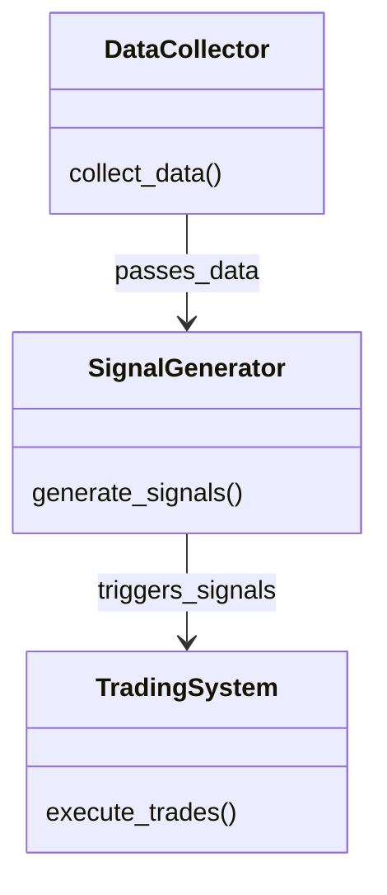
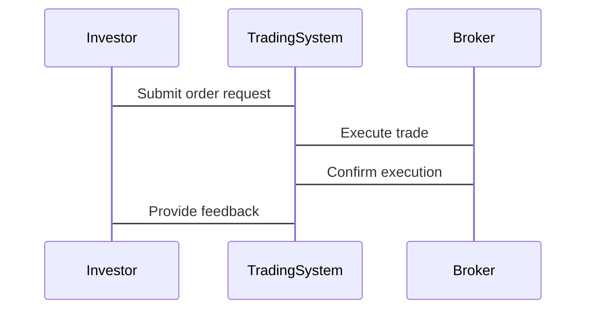

                 


# 格雷厄姆特价股票理论对高频量化交易的影响

## 关键词：格雷厄姆，价值投资，高频交易，量化交易，算法，金融分析

## 摘要：本文探讨格雷厄姆特价股票理论与高频量化交易的结合，分析其对现代金融交易的影响。通过理论分析、算法设计和案例研究，展示如何利用格雷厄姆的估值方法优化高频交易策略，提升交易效率和收益。

---

## 第一部分: 引言

### 第1章: 背景介绍

#### 1.1 格雷厄姆特价股票理论概述
- 格雷厄姆是价值投资的奠基人，强调以低于内在价值的价格购买股票。
- 核心概念包括安全边际、内在价值和市场先生理论。
- 特价股票定义为市场价格低于内在价值的股票，是投资机会。

#### 1.2 高频量化交易的基本概念
- 高频交易：利用算法在极短时间内进行大量交易。
- 量化交易：基于数学模型和算法做出交易决策。
- 结合两者：通过算法快速识别并执行低估股票交易。

#### 1.3 结合的必要性
- 格雷厄姆理论提供价值评估，高频交易实现快速执行。
- 数据驱动的交易机会识别，结合两者优势，提升交易效率和收益。

### 第2章: 核心概念与联系

#### 2.1 核心概念原理
- 格雷厄姆：基本面分析，寻找低估股票。
- 高频交易：技术分析，利用算法快速交易。

#### 2.2 概念属性特征对比
| 核心概念 | 格雷厄姆理论 | 高频量化交易 |
|----------|--------------|---------------|
| 核心目标 | 寻找低估股票 | 短期内快速盈利 |
| 时间框架 | 长期投资 | 极短时间内交易 |
| 数据依赖 | 财务报表分析 | 市场数据流 |

#### 2.3 ER实体关系图
```mermaid
graph TD
    A[投资者] --> B[股票] : 价值评估
    B --> C[市场数据] : 数据输入
    C --> D[交易系统] : 信号生成
    D --> A : 交易执行
```

### 第3章: 算法原理讲解

#### 3.1 算法原理
```mermaid
graph TD
    A[数据输入] --> B[信号生成] : 根据格雷厄姆指标生成信号
    B --> C[交易策略] : 优化
    C --> D[交易执行] : 执行交易
```

#### 3.2 Python代码实现
```python
def graham_strategy(data, g_value):
    # 计算内在价值
    intrinsic_value = data['Financials'].apply(lambda x: x['Revenue'] / g_value)
    # 识别低估股票
    undervalued_stocks = data['Price'] < intrinsic_value
    return undervalued_stocks
```

#### 3.3 数学模型
$$ P \leq \frac{E}{V} \times P_{E} $$
其中，P为市场价格，E为每股收益，V为市净率，P_E为安全边际比例。

### 第4章: 数学模型

#### 4.1 核心数学模型
$$ P_{target} = \max(P_{low}, P_{graham}) $$
其中，P_low为历史低价，P_graham为格雷厄姆计算的内在价值。

#### 4.2 解释
通过比较历史低价和内在价值，确定买入目标价，优化交易时机。

---

## 第二部分: 系统分析与架构设计

### 第5章: 系统架构设计

#### 5.1 领域模型类图


#### 5.2 系统架构图
```mermaid
graph LR
    A[Data Source] --> B[Data Collector] : Collect market data
    B --> C[Signal Generator] : Process data
    C --> D[Trading System] : Generate signals
    D --> E[Broker] : Execute trades
```

#### 5.3 系统交互序列图


---

## 第三部分: 项目实战

### 第6章: 项目实现

#### 6.1 环境安装
- Python 3.8+
- 导入库：pandas, numpy, matplotlib, backtrader。

#### 6.2 核心实现代码
```python
import pandas as pd
import numpy as np

def calculate_intrinsic_value(financials):
    return financials['Revenue'] / 4.33  # 假设g_value为4.33

def graham_strategy(data):
    iv = data['Financials'].apply(calculate_intrinsic_value)
    return data['Price'] < iv

# 示例数据
data = pd.DataFrame({
    'Price': np.random.uniform(10, 50, 100),
    'Financials': {'Revenue': np.random.uniform(100, 1000, 100)}
})

signal = graham_strategy(data)
print("生成信号:", signal.sum())
```

#### 6.3 实际案例分析
- 数据收集：获取股票的财务数据和市场数据。
- 信号生成：应用格雷厄姆模型，识别低估股票。
- 策略回测：评估交易信号的有效性，优化策略参数。

---

## 第四部分: 结论

### 第7章: 结论与展望

#### 7.1 结论
- 格雷厄姆理论与高频交易的结合，提供了新的投资策略。
- 结合价值评估和算法交易，提升交易效率和准确性。

#### 7.2 展望
- 研究更复杂的价值评估模型。
- 优化高频交易算法，降低延迟和成本。
- 探索跨市场和跨资产的应用。

### 最佳实践 Tips
- 定期更新模型参数，适应市场变化。
- 注意交易成本和市场冲击，优化执行策略。
- 结合技术分析，提升交易信号的有效性。

---

## 作者：AI天才研究院 & 禅与计算机程序设计艺术

这篇文章详细探讨了格雷厄姆特价股票理论与高频量化交易的结合，分析了其对现代金融交易的影响，并通过理论分析、算法设计和案例研究，展示了如何利用格雷厄姆的估值方法优化高频交易策略。希望对读者在金融投资和量化交易领域有所帮助。

