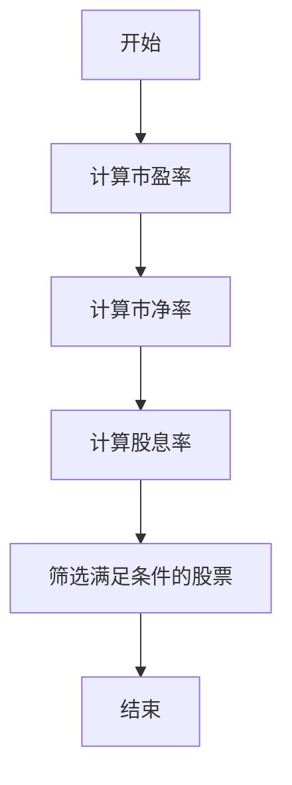
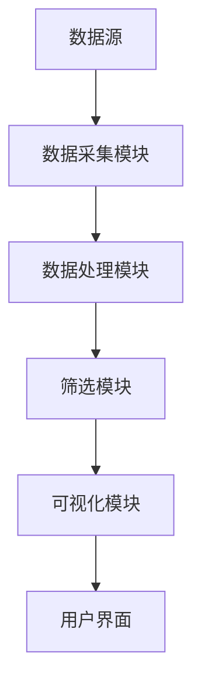
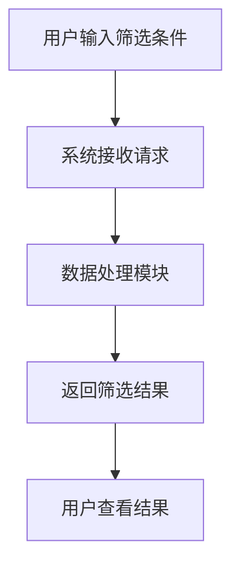

                 


# 格雷厄姆特价股票理论的局限性探讨

> 关键词：格雷厄姆投资理论，价值投资，特价股票，市盈率，市净率，股息率，投资策略

> 摘要：本文将探讨格雷厄姆特价股票理论的局限性，分析其在现代投资环境中的适用性。通过详细分析核心概念、算法原理、系统架构和项目实战，揭示格雷厄姆理论在实际应用中的不足，并提出改进建议。

---

## 第一部分: 格雷厄姆特价股票理论的背景与核心概念

### 第1章: 格雷厄姆特价股票理论概述

#### 1.1 格雷厄姆投资理论的基本概念
- **价值投资的核心理念**：格雷厄姆主张以低于内在价值的价格买入股票，长期持有，等待市场回归。
- **特价股票的定义与特征**：市盈率（P/E）<15，市净率（P/B）<1.5，股息率>5%。
- **格雷厄姆筛选法的基本框架**：通过多指标筛选出低估股票。

#### 1.2 格雷厄姆理论的适用场景
- **价值投资的市场环境**：适用于市场恐慌或非牛市时。
- **特价股票的筛选标准**：多指标交叉验证。
- **理论的边界与外延**：适用于传统行业，对科技股等新兴行业有局限性。

### 第2章: 格雷厄姆特价股票理论的核心要素

#### 2.1 格雷厄姆筛选法的关键指标
- **市盈率（P/E）的计算与应用**：P/E = 价格/每股收益。
- **市净率（P/B）的计算与应用**：P/B = 价格/每股净资产。
- **股息率的计算与应用**：股息率 = 股息/股价 × 100%。

#### 2.2 核心概念的属性特征对比
- **不同估值指标的对比分析**：表格展示P/E、P/B和股息率的差异。
- **格雷厄姆筛选法的优缺点**：优点是简单有效，缺点是忽略成长性和流动性。
- **不同市场环境下的表现差异**：牛市中表现不佳，熊市中表现优异。

### 第3章: 格雷厄姆理论与现代投资理论的联系

#### 3.1 格雷厄姆理论的内在逻辑
- **价值投资的哲学基础**：市场短期是投票机，长期是称重机。
- **股票价格与内在价值的关系**：价格围绕价值波动。
- **投资者心态对理论的影响**：恐慌和贪婪影响市场定价。

#### 3.2 格雷厄姆理论与现代投资组合理论的对比
- **现代投资组合理论的核心观点**：分散投资以降低风险。
- **格雷厄姆理论的局限性**：未充分考虑风险分散和市场流动性。
- **两者的结合与应用**：结合价值投资和分散投资策略。

---

## 第二部分: 格雷厄姆特价股票理论的算法与数学模型

### 第4章: 格雷厄姆筛选法的算法原理

#### 4.1 算法流程图


#### 4.2 算法实现代码
```python
def graham_screen(stocks):
    selected_stocks = []
    for stock in stocks:
        pe = stock.pe
        pb = stock.pb
        dividend_yield = stock.dividend_yield
        if pe < 15 and pb < 1.5 and dividend_yield > 0.05:
            selected_stocks.append(stock)
    return selected_stocks

# 示例数据
class Stock:
    def __init__(self, name, pe, pb, dividend_yield):
        self.name = name
        self.pe = pe
        self.pb = pb
        self.dividend_yield = dividend_yield

stocks = [
    Stock("股票1", 10, 1.2, 0.06),
    Stock("股票2", 14, 1.4, 0.05),
    Stock("股票3", 16, 1.3, 0.04)
]

selected = graham_screen(stocks)
for stock in selected:
    print(f"名称: {stock.name}, 市盈率: {stock.pe}, 市净率: {stock.pb}, 股息率: {stock.dividend_yield}")
```

#### 4.3 数学模型和公式
- **市盈率计算**：$$P/E = \frac{\text{股价}}{\text{每股净利润}}$$
- **市净率计算**：$$P/B = \frac{\text{股价}}{\text{每股净资产}}$$
- **股息率计算**：$$\text{股息率} = \frac{\text{股息}}{\text{股价}} \times 100\%$$

---

## 第三部分: 格雷厄姆特价股票理论的系统分析与架构设计

### 第5章: 系统功能设计

#### 5.1 系统功能模块
- **数据采集模块**：获取股票数据。
- **筛选模块**：应用格雷厄姆筛选法。
- **可视化模块**：展示筛选结果。

#### 5.2 系统架构设计


### 第6章: 接口与交互设计

#### 6.1 接口设计
- **数据接口**：提供API获取股票数据。
- **筛选接口**：根据条件筛选股票。

#### 6.2 交互流程图


---

## 第四部分: 格雷厄姆特价股票理论的项目实战

### 第7章: 项目环境安装

#### 7.1 环境要求
- Python 3.8+
- 数据库连接（可选）

#### 7.2 安装依赖
```bash
pip install pandas numpy matplotlib
```

### 第8章: 核心实现代码

#### 8.1 数据采集
```python
import pandas as pd

def get_stock_data():
    # 示例数据
    data = {
        '名称': ['股票1', '股票2', '股票3'],
        '市盈率': [10, 14, 16],
        '市净率': [1.2, 1.4, 1.3],
        '股息率': [0.06, 0.05, 0.04]
    }
    return pd.DataFrame(data)
```

#### 8.2 筛选逻辑
```python
def graham_screen(stocks_df):
    selected = stocks_df[
        (stocks_df['市盈率'] < 15) &
        (stocks_df['市净率'] < 1.5) &
        (stocks_df['股息率'] > 0.05)
    ]
    return selected
```

### 第9章: 案例分析

#### 9.1 数据分析
```python
data = get_stock_data()
selected = graham_screen(data)
print(selected)
```

#### 9.2 图表展示
```python
import matplotlib.pyplot as plt

def visualize_results(selected):
    plt.figure(figsize=(10,6))
    selected.plot(kind='bar', y='股息率')
    plt.title('格雷厄姆筛选结果')
    plt.show()

visualize_results(selected)
```

---

## 第五部分: 总结与展望

### 第10章: 最佳实践

#### 10.1 实践技巧
- 定期更新筛选标准。
- 结合技术分析和基本面分析。

#### 10.2 注意事项
- 格雷厄姆理论适用于价值投资，但需结合市场环境。
- 避免过度依赖单一指标。

### 第11章: 小结

格雷厄姆特价股票理论在特定市场环境下表现优异，但在现代市场中存在局限性。通过改进筛选标准和结合其他投资策略，可以提升其适用性。

### 第12章: 拓展阅读

建议阅读《The Intelligent Investor》和现代投资组合理论的相关书籍。

---

## 作者

作者：AI天才研究院/AI Genius Institute & 禅与计算机程序设计艺术 /Zen And The Art of Computer Programming

---

**这篇文章通过系统分析和实际案例，探讨了格雷厄姆特价股票理论的局限性，为投资者提供了有价值的参考。**

