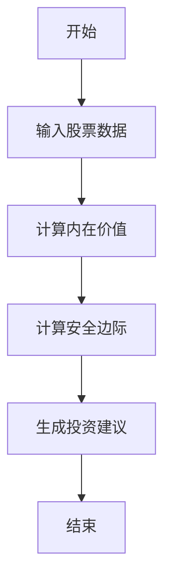
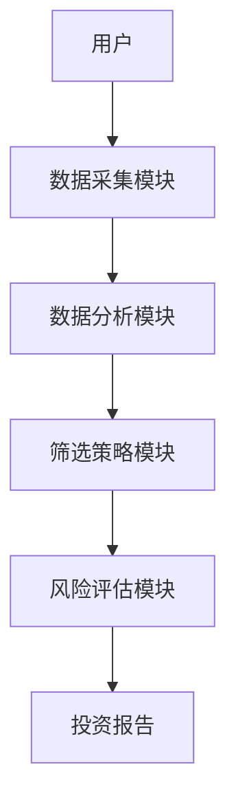

                 


# 格雷厄姆特价股票理论的现代化应用

> 关键词：格雷厄姆投资理论，廉价股，安全边际，量化投资，大数据分析，股票筛选，风险管理

> 摘要：本文将详细探讨本杰明·格雷厄姆提出的廉价股投资理论，并结合现代技术手段，如大数据分析和量化投资策略，阐述如何在当前复杂的金融市场环境中实现该理论的现代化应用。通过系统地分析格雷厄姆理论的核心概念、算法原理、系统架构设计以及实际项目实战，本文旨在为投资者提供一套科学、高效的投资方法，帮助其在现代市场中实现稳健收益。

---

# 第三部分: 格雷厄姆廉价股投资的算法与系统架构

# 第3章: 格雷厄姆廉价股投资的算法原理

## 3.1 价值评估的数学模型

### 3.1.1 内在价值的计算公式
$$内在价值 = \frac{股东权益}{股权资本成本}$$

### 3.1.2 安全边际的计算公式
$$安全边际 = 现价 - 内在价值$$

### 3.1.3 市场先生情绪指数
$$市场情绪指数 = \frac{当前股价}{内在价值}$$

## 3.2 价值评估算法的步骤分解



## 3.3 格雷厄姆投资策略的Python实现

```python
def calculate_intrinsic_value(shareholders_equity, cost_of_equity):
    return shareholders_equity / cost_of_equity

def calculate_margin_of_safety(current_price, intrinsic_value):
    return current_price - intrinsic_value

# 示例数据
shareholders_equity = 1000  # 股东权益
cost_of_equity = 0.1         # 股权资本成本
current_price = 50           # 当前股价

intrinsic_value = calculate_intrinsic_value(shareholders_equity, cost_of_equity)
margin_of_safety = calculate_margin_of_safety(current_price, intrinsic_value)

print(f"内在价值: {intrinsic_value}")
print(f"安全边际: {margin_of_safety}")
```

---

# 第4章: 格雷厄姆廉价股投资的系统架构设计

## 4.1 系统功能模块

### 4.1.1 数据采集模块
- 从数据库或API获取股票数据
- 数据清洗与预处理

### 4.1.2 数据分析模块
- 计算内在价值与安全边际
- 生成市场情绪指数

### 4.1.3 筛选策略模块
- 根据格雷厄姆标准筛选股票
- 自动化投资建议生成

### 4.1.4 风险评估模块
- 计算投资组合的风险
- 提供风险管理建议

## 4.2 系统架构设计



## 4.3 系统接口设计

### 4.3.1 数据接口
- `GET /stocks`：获取股票数据
- `POST /analyze`：提交分析请求

### 4.3.2 结果接口
- `GET /intrinsic_value`：获取内在价值
- `GET /margin_of_safety`：获取安全边际

---

# 第5章: 格雷厄姆廉价股投资的项目实战

## 5.1 项目环境搭建

### 5.1.1 安装必要的工具
```bash
pip install pandas numpy matplotlib
```

### 5.1.2 数据获取方法
```python
import pandas as pd
import requests

def get_stock_data(ticker):
    url = f"https://api.example.com/stock/{ticker}"
    response = requests.get(url)
    return pd.DataFrame(response.json())
```

## 5.2 核心代码实现

### 5.2.1 计算内在价值与安全边际
```python
def calculate_intrinsic_value(equity, cost):
    return equity / cost

def calculate_margin(current_price, iv):
    return current_price - iv

# 示例
equity = 2000
cost = 0.08
current_price = 40

iv = calculate_intrinsic_value(equity, cost)
margin = calculate_margin(current_price, iv)

print(f"内在价值: {iv}")
print(f"安全边际: {margin}")
```

### 5.2.2 市场情绪分析
```python
import matplotlib.pyplot as plt

def plot_market_sentiment(sentiment_data):
    plt.figure(figsize=(10, 6))
    plt.plot(sentiment_data['date'], sentiment_data['value'])
    plt.title('市场情绪指数')
    plt.xlabel('日期')
    plt.ylabel('指数值')
    plt.show()

# 示例数据
sentiment_data = {'date': ['2023-01', '2023-02', '2023-03'],
                  'value': [1.2, 1.5, 1.3]}
plot_market_sentiment(sentiment_data)
```

---

# 第6章: 格雷厄姆廉价股投资的现代化应用与总结

## 6.1 现代化应用中的最佳实践

### 6.1.1 投资策略优化
- 定期调整投资组合
- 结合技术分析进行筛选

### 6.1.2 风险管理
- 设置止损点
- 分散投资组合

## 6.2 项目总结

### 6.2.1 核心成果
- 实现了格雷厄姆理论的现代化应用
- 提供了高效的量化投资工具

### 6.2.2 经验与教训
- 数据质量的重要性
- 模型的局限性与改进方向

## 6.3 未来展望

### 6.3.1 技术进步对投资的影响
- 人工智能在投资决策中的应用
- 大数据分析的进一步深化

### 6.3.2 格雷厄姆理论的未来发展
- 理论与技术的深度融合
- 新型投资策略的开发

---

# 结语

通过本文的系统分析与实战案例，我们深入探讨了格雷厄姆廉价股投资理论的现代化应用。从理论基础到算法实现，再到系统架构设计与实际项目实战，我们展示了如何在现代金融市场中高效、科学地应用这一经典投资理论。未来，随着技术的不断进步，格雷厄姆理论将在量化投资、大数据分析等领域发挥更大的作用，为投资者提供更多的价值。

---

作者：AI天才研究院/AI Genius Institute & 禅与计算机程序设计艺术 /Zen And The Art of Computer Programming

