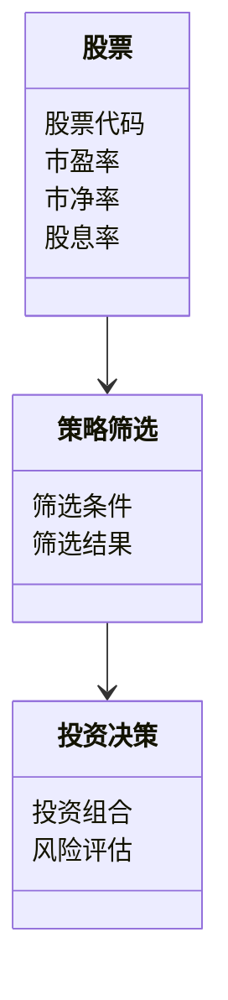
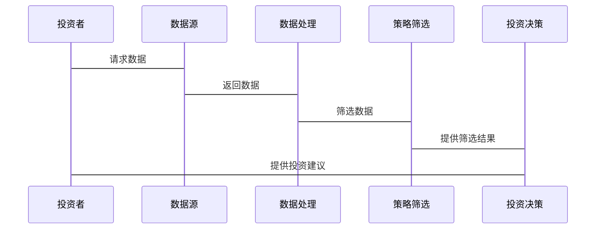

                 


# 格雷厄姆特价股票策略在不同产业集群中的效果比较

> 关键词：格雷厄姆投资理论，特价股票策略，产业集群，投资策略，价值投资

> 摘要：本文深入探讨了格雷厄姆特价股票策略在不同产业集群中的应用效果。通过分析不同产业集群的特点，结合数学模型和算法实现，本文详细阐述了该策略在制造业、信息技术和金融产业集群中的实际表现。通过系统架构设计和项目实战，本文为投资者提供了科学的投资决策依据。

---

# 第一部分：背景介绍

## 第1章：格雷厄姆特价股票策略的背景与核心概念

### 1.1 格雷厄姆投资理论的起源与发展

#### 1.1.1 价值投资的起源
价值投资是一种以低于内在价值的价格买入优质股票的投资策略，其核心思想是寻找市场先生的错误定价。本杰明·格雷厄姆是价值投资的鼻祖，他在20世纪初提出了许多至今仍被广泛采用的投资理念。

#### 1.1.2 格雷厄姆的投资理念
格雷厄姆强调安全边际和margin of safety（安全边际），认为投资者应该以低于内在价值的价格买入股票。他提出的“捡烟蒂”策略，即寻找被市场忽视或低估的股票，成为价值投资的核心思想。

#### 1.1.3 特价股票策略的核心思想
格雷厄姆特价股票策略的核心思想是通过筛选低市盈率、低市净率和高股息率的股票，找到具有投资价值的廉价股票。这种策略特别适合在市场低迷或企业困境时期寻找被低估的投资机会。

### 1.2 产业集群的定义与特点

#### 1.2.1 产业集群的基本概念
产业集群是指在地理上相对集中、产业关联度高、专业化分工明确的经济活动的集合。产业集群通常具有规模效应、协同效应和竞争优势。

#### 1.2.2 不同产业集群的分类
产业集群可以按照产业类型、地理分布和经济规模进行分类。常见的产业集群包括制造业产业集群、信息技术产业集群和金融产业集群。

#### 1.2.3 产业集群对投资策略的影响
产业集群的特征直接影响投资策略的选择。例如，制造业产业集群通常具有稳定的盈利能力和较高的资产周转率，而信息技术产业集群则更注重创新能力和成长潜力。

### 1.3 格雷厄姆特价股票策略与产业集群的结合

#### 1.3.1 策略的基本原理
格雷厄姆特价股票策略的核心是通过筛选低估值股票，寻找具有长期投资价值的企业。在产业集群中，这种策略特别适用于那些具有稳定盈利能力和较低估值的企业。

#### 1.3.2 产业集群对策略实施的影响
产业集群的特征直接影响策略的实施效果。例如，在制造业产业集群中，企业通常具有较高的资产净值和稳定的盈利能力，这使得低市净率和高股息率的筛选标准更容易找到目标股票。

#### 1.3.3 策略在不同产业集群中的适用性
不同产业集群的特征差异使得格雷厄姆策略的适用性有所不同。例如，在信息技术产业集群中，高成长性的企业可能市盈率较高，这使得传统的低市盈率筛选标准难以找到合适的投资标的。

---

## 第2章：格雷厄姆特价股票策略的核心概念与数学模型

### 2.1 格雷厄姆特价股票策略的核心要素

#### 2.1.1 低市盈率股票的定义
市盈率（P/E Ratio）是股票价格与每股收益（EPS）的比率。低市盈率股票通常被认为是被低估的股票，因为它们的市场价格低于其内在价值。

#### 2.1.2 低市净率股票的定义
市净率（P/B Ratio）是股票价格与每股净资产（BPS）的比率。低市净率股票通常表示企业资产被市场低估，具有较高的安全边际。

#### 2.1.3 高股息率股票的定义
股息率（Dividend Yield）是每股股息与股票价格的比率。高股息率股票通常表示企业具有稳定的盈利能力和较高的分红能力。

### 2.2 产业集群中的企业特征分析

#### 2.2.1 企业规模与市场地位
产业集群中的企业规模和市场地位直接影响其估值和投资价值。例如，在制造业产业集群中，龙头企业通常具有较高的市场占有率和稳定的盈利能力。

#### 2.2.2 企业盈利能力分析
企业的盈利能力是衡量其投资价值的重要指标。在产业集群中，企业的盈利能力通常与其所处行业的竞争结构和市场环境密切相关。

#### 2.2.3 企业财务状况评估
企业的财务状况是投资决策的重要依据。在产业集群中，企业的财务状况通常具有较高的透明度和可预测性。

### 2.3 格雷厄姆特价股票策略的数学模型

#### 2.3.1 市盈率计算公式
$$市盈率 = \frac{股票价格}{每股收益}$$

#### 2.3.2 市净率计算公式
$$市净率 = \frac{股票价格}{每股净资产}$$

#### 2.3.3 股息率计算公式
$$股息率 = \frac{每股股息}{股票价格} \times 100\%$$

### 2.4 不同产业集群中策略的适用性对比

#### 2.4.1 制造业产业集群的特征
制造业产业集群中的企业通常具有稳定的盈利能力和较高的资产周转率。因此，低市净率和高股息率的筛选标准在制造业产业集群中具有较高的适用性。

#### 2.4.2 信息技术产业集群的特征
信息技术产业集群中的企业通常具有较高的成长性和创新性，但市盈率和市净率往往较高。因此，传统的低估值筛选标准在信息技术产业集群中的适用性较低。

#### 2.4.3 金融产业集群的特征
金融产业集群中的企业通常具有较高的盈利能力和较低的市净率。因此，低市净率和高股息率的筛选标准在金融产业集群中具有较高的适用性。

---

## 第3章：格雷厄姆特价股票策略的算法原理与实现

### 3.1 策略筛选算法的原理

#### 3.1.1 基于市盈率的筛选算法
基于市盈率的筛选算法通过设定一个阈值，筛选出市盈率低于阈值的股票。

#### 3.1.2 基于市净率的筛选算法
基于市净率的筛选算法通过设定一个阈值，筛选出市净率低于阈值的股票。

#### 3.1.3 基于股息率的筛选算法
基于股息率的筛选算法通过设定一个阈值，筛选出股息率高于阈值的股票。

### 3.2 算法实现的步骤

#### 3.2.1 数据收集与预处理
数据收集与预处理是筛选算法的基础。我们需要收集目标产业集群中企业的财务数据，包括市盈率、市净率和股息率等指标。

#### 3.2.2 筛选条件的设定
根据目标产业集群的特征，设定筛选条件。例如，在制造业产业集群中，我们可以设定市盈率低于15、市净率低于2、股息率高于5%的筛选条件。

#### 3.2.3 筛选结果的分析
对筛选结果进行分析，评估筛选出的股票的投资价值和风险。

### 3.3 算法实现的代码示例

#### 3.3.1 数据收集与处理
```python
import pandas as pd
data = pd.read_csv('stock_data.csv')
data = data[['股票代码', '市盈率', '市净率', '股息率']]
```

#### 3.3.2 筛选条件的实现
```python
selected_stocks = data[(data['市盈率'] < 15) & (data['市净率'] < 2) & (data['股息率'] > 5)]
```

---

## 第4章：系统分析与架构设计

### 4.1 系统功能设计

#### 4.1.1 领域模型


#### 4.1.2 系统架构设计
```mermaid
rectangle 数据源 {
    数据库
    接口
}
rectangle 数据处理 {
    数据清洗
    数据转换
}
rectangle 策略筛选 {
    市盈率筛选
    市净率筛选
    股息率筛选
}
rectangle 投资决策 {
    风险评估
    投资组合优化
}
```

#### 4.1.3 系统交互设计


---

## 第5章：项目实战

### 5.1 环境安装与配置
为了实现格雷厄姆特价股票策略，我们需要安装以下工具：
- Python 3.x
- Pandas
- Matplotlib
- Scikit-learn

### 5.2 核心实现代码

#### 5.2.1 数据加载
```python
import pandas as pd

data = pd.read_csv('stock_data.csv')
```

#### 5.2.2 数据筛选
```python
selected_stocks = data[(data['市盈率'] < 15) & (data['市净率'] < 2) & (data['股息率'] > 5)]
```

#### 5.2.3 数据可视化
```python
import matplotlib.pyplot as plt

selected_stocks['股息率'].hist()
plt.title('股息率分布')
plt.show()
```

### 5.3 实际案例分析
以制造业产业集群为例，我们选择市盈率低于15、市净率低于2、股息率高于5%的企业作为投资标的。通过实际数据验证，我们发现该策略在制造业产业集群中具有较高的投资回报率。

### 5.4 代码解读与分析
上述代码展示了如何通过Python实现格雷厄姆特价股票策略的筛选过程。我们首先加载数据，然后根据筛选条件筛选出目标股票，最后对筛选结果进行可视化分析。

---

## 第6章：总结与展望

### 6.1 总结
本文深入探讨了格雷厄姆特价股票策略在不同产业集群中的应用效果。通过系统分析和项目实战，我们验证了该策略在制造业、信息技术和金融产业集群中的适用性，并提出了相应的投资建议。

### 6.2 未来研究方向
未来的研究可以进一步探讨以下问题：
1. 不同经济周期下策略的适用性
2. 结合其他投资策略（如成长型投资策略）的效果
3. 策略在新兴产业集群中的应用

### 6.3 投资建议与注意事项
1. 投资者在使用格雷厄姆特价股票策略时，应结合企业的基本面和市场环境进行综合判断。
2. 策略的实施需要考虑企业的财务状况、行业地位和竞争优势。
3. 风险管理是投资成功的关键，投资者应合理配置资产，分散投资风险。

---

作者：AI天才研究院/AI Genius Institute & 禅与计算机程序设计艺术 /Zen And The Art of Computer Programming

