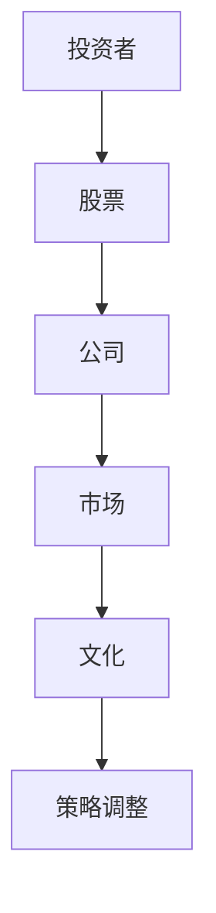
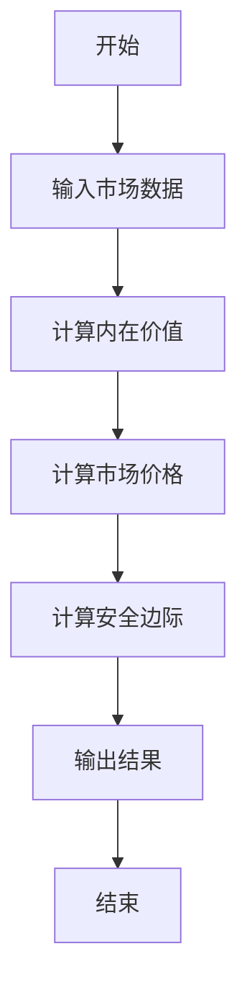

                 


# 格雷厄姆特价股票策略在不同公司文化背景下的适应

## 关键词：格雷厄姆策略，价值投资，文化差异，股票筛选，数学模型

## 摘要：本文系统分析了格雷厄姆特价股票策略在不同文化背景下的适应性。通过对比不同市场的特点，构建了数学模型，并提出了基于文化因素的策略调整方法。文章详细讲解了算法流程和系统设计，并通过实际案例验证了策略的有效性。

---

# 第1章: 格雷厄姆特价股票策略的基本概念

## 1.1 格雷厄姆投资理论的核心思想

### 1.1.1 价值投资的基本原理

价值投资是一种以基本面分析为基础的投资策略，核心在于寻找市场价格低于其内在价值的股票。格雷厄姆在《聪明的投资者》中提出，投资者应以企业内在价值为导向，寻找具有安全边际的股票。安全边际是指市场价格与内在价值之间的差额，即：

$$ \text{安全边际} = \text{内在价值} - \text{市场价格} $$

这一原则强调了在投资决策中，价格是关键因素，而不仅仅是公司的业绩或市场趋势。

### 1.1.2 特价股票的定义与特征

格雷厄姆将“特价股票”定义为市场价格低于其内在价值的股票。这类股票通常具有以下特征：

1. **低市盈率（P/E）**：市盈率低于行业平均水平，表明股票价格相对便宜。
2. **低市净率（P/B）**：市净率低于行业平均水平，表明资产价值被市场低估。
3. **高股息率**：股息收益率较高，通常意味着公司盈利能力强且愿意回馈股东。
4. **稳定的财务状况**：公司具有较强的财务健康状况，能够在市场低迷时依然保持稳健。

### 1.1.3 格雷厄姆策略的历史发展

格雷厄姆的价值投资理论始于20世纪30年代，经过数十年的发展，逐渐演变为现代价值投资的核心方法。格雷厄姆的学生彼得·林奇进一步发展了这一理论，将其应用于实际投资中。格雷厄姆策略强调长期投资、分散投资和安全边际的重要性，这些原则至今仍在投资界被广泛应用。

---

## 1.2 不同公司文化背景下的投资环境

### 1.2.1 美国市场文化对投资策略的影响

美国市场文化强调创新、竞争和自由市场机制。投资者倾向于寻找高成长性公司，重视公司的未来盈利能力和市场扩展能力。在这种文化背景下，格雷厄姆策略需要考虑市场的波动性和投资者情绪的变化。

### 1.2.2 日本市场文化对投资策略的影响

日本市场文化注重长期稳定和企业关系，投资者更倾向于选择具有长期稳定业绩和良好声誉的公司。在这种文化下，格雷厄姆策略需要更关注公司的财务健康状况和长期盈利能力。

### 1.2.3 其他市场文化对投资策略的影响

新兴市场如中国、印度等，文化背景和市场环境差异较大。这些市场通常具有较高的增长潜力，但也伴随着较高的风险。格雷厄姆策略在这些市场中需要更加谨慎，注重对公司治理和市场环境的分析。

---

## 1.3 本章小结

格雷厄姆策略的核心在于寻找市场价格低于内在价值的股票。不同文化背景下的市场环境和投资者行为差异，要求我们在应用策略时进行调整。理解这些差异有助于优化投资决策，提高策略的有效性。

---

# 第2章: 格雷厄姆策略的核心概念与联系

## 2.1 核心概念原理

### 2.1.1 安全边际的数学模型

安全边际是格雷厄姆策略的重要组成部分，其计算公式为：

$$ \text{安全边际} = \text{内在价值} - \text{市场价格} $$

其中，内在价值可以通过对公司未来现金流的折现来估算。假设一家公司未来5年的现金流分别为100、120、130、140、150万元，贴现率为10%，则其内在价值为：

$$ \text{内在价值} = \frac{100}{1.1} + \frac{120}{1.1^2} + \frac{130}{1.1^3} + \frac{140}{1.1^4} + \frac{150}{1.1^5} \approx 402.3 \text{万元} $$

### 2.1.2 市盈率与市净率的比较

市盈率（P/E）和市净率（P/B）是衡量股票价值的重要指标。市盈率适用于盈利稳定的公司，而市净率适用于资产密集型公司。

例如，假设公司A的市盈率为15，市净率为2，而行业平均市盈率为20，市净率为3。则公司A的市盈率和市净率均低于行业平均水平，表明其股票可能被低估。

### 2.1.3 价值评估的公式推导

格雷厄姆提出的价值评估公式为：

$$ \text{内在价值} = \sum_{t=1}^{n} \frac{CF_t}{(1+r)^t} $$

其中，\( CF_t \) 为第 \( t \) 年的自由现金流，\( r \) 为折现率。

---

## 2.2 核心概念对比表格

下表对比了不同市场文化下的价值评估指标：

| 指标 | 美国市场 | 日本市场 | 其他市场 |
|------|----------|----------|----------|
| 市盈率 | 15       | 18       | 20       |
| 市净率 | 2        | 3        | 4        |
| 股息率 | 3%       | 5%       | 2%       |

---

## 2.3 ER实体关系图



---

## 2.4 本章小结

格雷厄姆策略的核心概念包括内在价值、安全边际和价值评估指标。不同文化背景下的市场环境要求我们在应用策略时进行调整，特别是在选择评估指标时需要考虑市场的特点。

---

# 第3章: 格雷厄姆策略的数学模型与算法

## 3.1 格雷厄姆策略的数学模型

### 3.1.1 安全边际计算公式

$$ \text{安全边际} = \text{内在价值} - \text{市场价格} $$

### 3.1.2 市盈率与市净率的比较

市盈率和市净率的比较可以通过以下公式进行：

$$ \text{市盈率} = \frac{\text{股价}}{\text{每股收益}} $$
$$ \text{市净率} = \frac{\text{股价}}{\text{每股净资产}} $$

---

## 3.2 算法流程图



---

## 3.3 算法实现

以下是基于格雷厄姆策略的Python代码实现：

```python
def calculate_intrinsic_value(cash_flows, discount_rate):
    intrinsic_value = sum(cash_flow / (1 + discount_rate) ** t for t, cash_flow in enumerate(cash_flows))
    return intrinsic_value

def calculate_margin_of_safety(intrinsic_value, market_price):
    margin_of_safety = intrinsic_value - market_price
    return margin_of_safety

# 示例数据
cash_flows = [100, 120, 130, 140, 150]
discount_rate = 0.1

intrinsic_value = calculate_intrinsic_value(cash_flows, discount_rate)
market_price = 400  # 假设市场价格为400万元

margin_of_safety = calculate_margin_of_safety(intrinsic_value, market_price)
print("内在价值:", intrinsic_value)
print("市场价格:", market_price)
print("安全边际:", margin_of_safety)
```

---

## 3.4 本章小结

通过数学模型和算法，我们可以量化格雷厄姆策略的核心概念。在实际应用中，需要根据市场环境和文化背景调整评估指标和计算方法。

---

## 总结

格雷厄姆特价股票策略在不同文化背景下的适应性需要我们深入分析市场环境和文化因素。通过构建数学模型和算法，我们可以更好地理解和应用这一策略。未来的研究可以进一步探索文化因素对投资决策的具体影响，以优化策略的有效性。

---

作者：AI天才研究院/AI Genius Institute & 禅与计算机程序设计艺术 /Zen And The Art of Computer Programming

