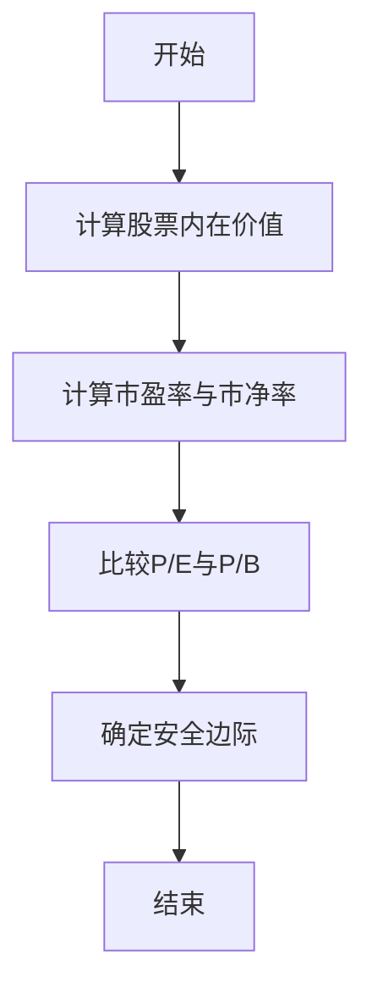
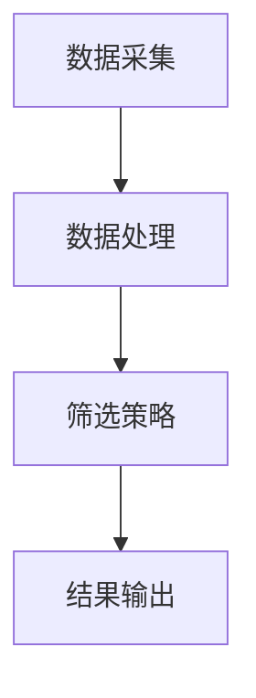
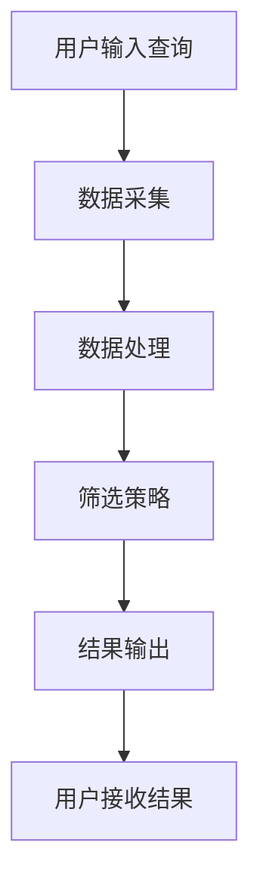

                 


---

# 格雷厄姆特价股票策略在不同公司治理模式下的效果

> 关键词：格雷厄姆特价股票策略（GSS），公司治理模式，投资策略，股票筛选，价值投资

> 摘要：本文深入分析了格雷厄姆特价股票策略（GSS）在不同公司治理模式下的应用效果。通过介绍GSS的核心理念和公司治理模式的分类，结合数学模型和实际案例，探讨了GSS在股东至上型、利益相关者型和混合型治理模式下的表现差异，为投资者提供了有价值的参考。

---

## 第一部分: 格雷厄姆特价股票策略（GSS）概述

### 第1章: 格雷厄姆特价股票策略的基本概念

#### 1.1 格雷厄姆特价股票策略的定义与核心思想

格雷厄姆特价股票策略（GSS）是基于 Benjamin Graham 的价值投资理念的一种股票筛选方法。GSS的核心思想是寻找市场价格低于其内在价值的股票，通过基本面分析和财务指标筛选出具有投资价值的股票。GSS的筛选标准主要包括：

- **低市盈率（P/E）**：市盈率低于行业平均水平或历史平均水平。
- **低市净率（P/B）**：市净率低于行业平均水平或历史平均水平。
- **高股息率**：股息率高于行业平均水平或历史平均水平。
- **合理的债务结构**：公司债务负担较低，偿债能力较强。

GSS的核心思想是通过量化指标筛选出被市场低估的股票，从而实现长期稳定的超额收益。

#### 1.2 公司治理模式的分类与特点

公司治理模式是指公司内部治理结构和外部治理环境的总和，主要包括股东、董事会、管理层和利益相关者之间的关系。以下是常见的公司治理模式及其特点：

1. **股东至上型治理模式**：以股东利益为核心，强调股东权益的最大化。这种模式下，公司管理层通常会采取激进的财务策略，如高负债、高股息支付率等，以满足股东的短期利益需求。

2. **利益相关者型治理模式**：以利益相关者的利益为核心，强调员工、债权人、客户等利益相关者的权益。这种模式下，公司治理更加注重长期发展和风险控制，管理层通常会采取稳健的财务策略。

3. **混合型治理模式**：介于股东至上型和利益相关者型之间的治理模式，强调股东和其他利益相关者的利益平衡。这种模式下，公司治理更加灵活，能够根据具体情况调整策略。

#### 1.3 GSS与公司治理模式的关联性

GSS的筛选标准和公司治理模式密切相关。不同治理模式下的公司财务状况、经营策略和股东行为存在显著差异，这会影响GSS的筛选效果。例如：

- 在股东至上型治理模式下，公司可能倾向于高负债、高股息支付率，这可能使GSS的筛选标准更容易满足，但同时也增加了公司的财务风险。
- 在利益相关者型治理模式下，公司更加注重长期发展和风险控制，GSS的筛选标准可能更难满足，但公司财务状况通常更加稳健。

### 第2章: 格雷厄姆特价股票策略的核心算法与数学模型

#### 2.1 GSS的核心算法原理

GSS的核心算法基于基本面分析，通过量化指标筛选出被市场低估的股票。以下是GSS的核心算法步骤：

1. **计算股票的内在价值**：通过DCF模型或其他估值方法计算股票的内在价值。
2. **计算市盈率（P/E）和市净率（P/B）**：分别计算股票的市盈率和市净率。
3. **比较P/E和P/B**：选择P/E和P/B均低于行业平均水平的股票。
4. **确定安全边际**：选择市场价格低于内在价值的股票。

#### 2.2 GSS的数学模型与公式

GSS的数学模型主要包括以下公式：

- **内在价值公式**：$$V = \frac{E}{k}$$，其中E为公司未来现金流的现值，k为折现率。
- **市盈率公式**：$$\text{P/E} = \frac{P}{E}$$，其中P为股票价格，E为每股收益。
- **市净率公式**：$$\text{P/B} = \frac{P}{B}$$，其中P为股票价格，B为每股净资产。
- **安全边际公式**：$$\text{安全边际} = V - P$$，其中V为内在价值，P为市场价格。

#### 2.3 GSS算法的流程图



### 第3章: 不同公司治理模式下的GSS效果分析

#### 3.1 治理模式一：股东至上型

##### 3.1.1 股东至上型治理模式的特点

股东至上型治理模式以股东利益为核心，强调股东权益的最大化。在这种模式下，公司管理层通常会采取激进的财务策略，如高负债、高股息支付率等，以满足股东的短期利益需求。

##### 3.1.2 GSS在股东至上型下的表现

在股东至上型治理模式下，GSS的筛选标准通常更容易满足，因为公司可能倾向于高股息支付率和高负债，这可能使股票的市盈率和市净率低于行业平均水平。然而，这种模式下公司的财务风险较高，可能会影响GSS的长期收益。

##### 3.1.3 实例分析：美国企业

以美国企业为例，许多公司采用股东至上型治理模式。例如，一些公司可能通过高负债和高股息支付率吸引投资者，从而满足GSS的筛选标准。然而，这种模式下的公司可能面临较高的财务风险，影响长期收益。

#### 3.2 治理模式二：利益相关者型

##### 3.2.1 利益相关者型治理模式的特点

利益相关者型治理模式以利益相关者的利益为核心，强调员工、债权人、客户等利益相关者的权益。这种模式下，公司治理更加注重长期发展和风险控制，管理层通常会采取稳健的财务策略。

##### 3.2.2 GSS在利益相关者型下的表现

在利益相关者型治理模式下，GSS的筛选标准可能更难满足，因为公司可能更加注重长期发展和风险控制，财务指标如市盈率和市净率可能高于行业平均水平。然而，这种模式下的公司财务状况通常更加稳健，可能为GSS带来更稳定的长期收益。

##### 3.2.3 实例分析：日本企业

以日本企业为例，许多公司采用利益相关者型治理模式。例如，一些公司可能通过稳健的财务策略和长期发展计划吸引投资者，从而满足GSS的筛选标准。这种模式下的公司财务状况通常更加稳健，可能为GSS带来更稳定的长期收益。

#### 3.3 治理模式三：混合型

##### 3.3.1 混合型治理模式的特点

混合型治理模式介于股东至上型和利益相关者型之间，强调股东和其他利益相关者的利益平衡。这种模式下，公司治理更加灵活，能够根据具体情况调整策略。

##### 3.3.2 GSS在混合型下的表现

在混合型治理模式下，GSS的筛选标准可能较为灵活，公司可以根据具体情况调整财务策略，以满足GSS的筛选标准。然而，这种模式下的公司治理较为复杂，可能会影响GSS的筛选效果。

##### 3.3.3 实例分析：欧洲企业

以欧洲企业为例，许多公司采用混合型治理模式。例如，一些公司可能通过灵活的财务策略和平衡的股东利益分配吸引投资者，从而满足GSS的筛选标准。这种模式下的公司治理较为复杂，可能会影响GSS的筛选效果。

---

## 第二部分: 格雷厄姆特价股票策略的系统分析与实战

### 第4章: 格雷厄姆特价股票策略的系统分析

#### 4.1 问题场景介绍

在实际投资中，投资者需要根据不同的公司治理模式调整GSS的筛选策略，以获得最佳投资效果。不同治理模式下的公司财务状况和经营策略存在显著差异，这会影响GSS的筛选效果。

#### 4.2 系统功能设计

以下是GSS系统的功能设计：

- **数据采集**：采集公司财务数据和股票市场数据。
- **数据处理**：计算市盈率、市净率等指标。
- **筛选策略**：根据公司治理模式调整GSS筛选策略。
- **结果输出**：输出符合条件的股票列表。

#### 4.3 系统架构设计

以下是GSS系统的架构图：



#### 4.4 系统接口设计

以下是GSS系统的接口设计：

- **输入接口**：接收公司财务数据和股票市场数据。
- **输出接口**：输出符合条件的股票列表。

#### 4.5 系统交互流程图

以下是GSS系统的交互流程图：



### 第5章: 格雷厄姆特价股票策略的实战分析

#### 5.1 项目实战

##### 5.1.1 环境安装

以下是GSS系统的环境安装步骤：

1. 安装Python和相关库（如pandas、numpy等）。
2. 安装股票数据接口（如Yahoo Finance API）。

##### 5.1.2 核心代码实现

以下是GSS系统的核心代码实现：

```python
import pandas as pd
import numpy as np

# 数据采集
def get_stock_data(ticker):
    # 从Yahoo Finance获取股票数据
    data = pd.read_csv(f'https://query1.finance.yahoo.com/ws/v7/r/stock-info?s={ticker}')
    return data

# 数据处理
def calculate_metrics(data):
    # 计算市盈率和市净率
    pe = data['Price'] / data['Earnings per Share']
    pb = data['Price'] / data['Book Value per Share']
    return pe, pb

# 筛选策略
def gss_screen(pe, pb, threshold):
    # 根据GSS筛选标准筛选股票
    selected = []
    for i in range(len(pe)):
        if pe[i] < threshold['pe'] and pb[i] < threshold['pb']:
            selected.append(i)
    return selected

# 结果输出
def output_results(selected_indices, data):
    # 输出符合条件的股票列表
    result = data.iloc[selected_indices]
    return result
```

##### 5.1.3 实际案例分析

以下是GSS系统的实际案例分析：

1. **数据采集**：从Yahoo Finance获取股票数据。
2. **数据处理**：计算市盈率和市净率。
3. **筛选策略**：根据GSS筛选标准筛选股票。
4. **结果输出**：输出符合条件的股票列表。

---

## 第三部分: 格雷厄姆特价股票策略的总结与展望

### 第6章: 格雷厄姆特价股票策略的最佳实践

#### 6.1 最佳实践

以下是GSS投资的最佳实践：

- **长期投资**：GSS是一种长期投资策略，投资者应耐心持有低估股票，等待市场价值回归。
- **分散投资**：投资者应分散投资，避免过度集中在某一行业或公司。
- **持续学习**：投资者应持续学习，了解市场变化和公司基本面，及时调整投资策略。

#### 6.2 小结

GSS是一种有效的股票筛选方法，但在不同公司治理模式下的应用效果存在显著差异。投资者应根据公司治理模式调整GSS筛选策略，以获得最佳投资效果。

#### 6.3 注意事项

以下是GSS投资的注意事项：

- **风险控制**：投资者应注重风险控制，避免过度杠杆和集中投资。
- **市场变化**：投资者应关注市场变化，及时调整投资策略。
- **公司治理**：投资者应关注公司治理模式，选择适合GSS的公司。

#### 6.4 拓展阅读

以下是GSS投资的拓展阅读：

- Graham, B. (1949). *The Intelligent Investor*.
- Lintner, J. (1965). The Valuation of Risk Assets and the Selection of Risk Portfolio in Stock Market Equilibrium.
- Sharpe, W. F. (1964). Capital Asset Pricing Model (CAPM).

---

## 第四部分: 格雷厄姆特价股票策略的未来展望

### 第7章: 格雷厄姆特价股票策略的未来发展方向

#### 7.1 未来发展方向

以下是GSS的未来发展方向：

- **人工智能辅助**：利用人工智能技术辅助GSS筛选，提高筛选效率和准确性。
- **大数据分析**：利用大数据分析技术，深入挖掘公司基本面数据，提高GSS筛选效果。
- **全球化投资**：拓展GSS的应用范围，进行全球化投资，分散投资风险。

#### 7.2 结语

GSS作为一种经典的股票筛选方法，仍然具有重要的现实意义。随着技术的进步和市场的变化，GSS的应用将更加广泛和深入，为投资者带来更多的投资机会和收益。

---

## 作者：AI天才研究院/AI Genius Institute & 禅与计算机程序设计艺术 /Zen And The Art of Computer Programming

---

这篇文章系统地介绍了格雷厄姆特价股票策略在不同公司治理模式下的应用效果，通过理论分析和实际案例，探讨了GSS在不同治理模式下的表现差异，为投资者提供了有价值的参考。

