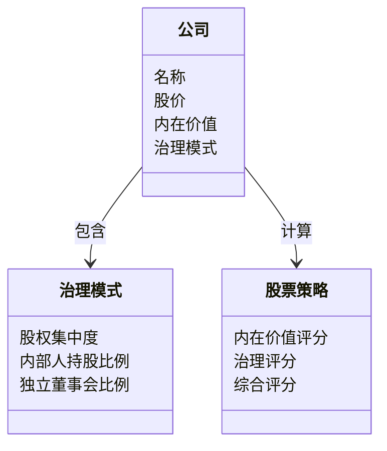
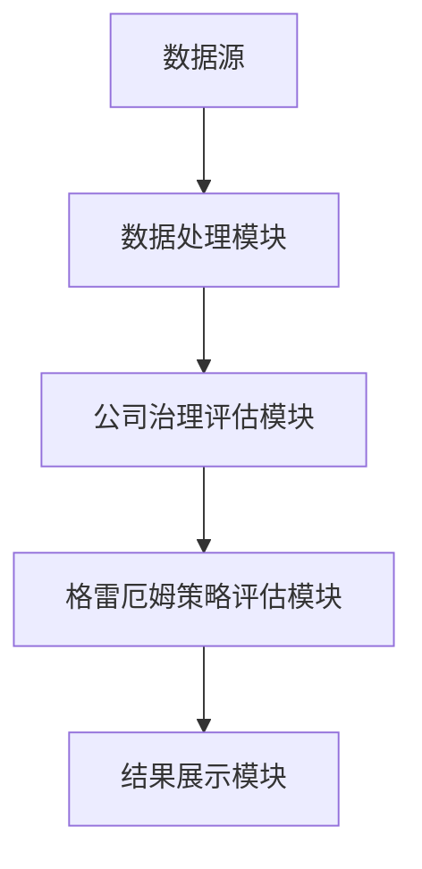

                 


# 格雷厄姆特价股票策略在不同公司治理模式下的效果

> 关键词：格雷厄姆策略，公司治理，股票估值，价值投资，数学模型

> 摘要：本文深入探讨格雷厄姆的特价股票策略在不同公司治理模式下的表现效果。通过分析公司治理模式对股价的影响，构建数学模型，量化评估策略的有效性，并通过实际案例验证策略在不同治理环境下的适用性。

---

## 引言

### 背景介绍

格雷厄姆的价值投资理论是投资领域的重要里程碑，其核心在于寻找市场价格低于内在价值的股票。然而，公司治理模式的不同可能影响公司的稳定性、管理层决策和股东利益，进而影响股价表现。本文旨在分析格雷厄姆策略在不同治理模式下的效果，为投资者提供更精准的投资决策依据。

---

## 第一部分：格雷厄姆特价股票策略概述

### 第1章：格雷厄姆投资理论的核心概念

#### 1.1 格雷厄姆投资理论的背景与发展

- **价值投资的起源**：本杰明·格雷厄姆是价值投资的鼻祖，他的理论在20世纪30年代首次提出，强调安全边际和内在价值。
- **核心思想**：市场先生的短期波动性为投资者提供了低价买入优质资产的机会。
- **特价股票的定义**：市场价格远低于内在价值的股票，通常是由于市场恐慌或投资者情绪导致的低估。

#### 1.2 公司治理模式的分类与影响

- **股权分散型治理模式**：股东分散，缺乏单一控股股东，可能导致决策效率低下。
- **内部人控制型治理模式**：管理层或少数股东掌握控股权，可能引发利益输送。
- **混合型治理模式**：结合分散与集中，试图平衡效率与公平。

### 第2章：格雷厄姆策略与公司治理模式的结合

#### 2.1 格雷厄姆策略在不同治理模式下的适用性

- **股权分散型治理模式**：格雷厄姆策略适用性较高，因为分散治理可能减少内部人控制的风险。
- **内部人控制型治理模式**：策略适用性较低，内部人可能操纵股价，导致低估股票难以出现。
- **混合型治理模式**：需谨慎评估，结合其他指标进行筛选。

---

## 第二部分：格雷厄姆策略的数学模型与公司治理分析

### 第3章：格雷厄姆策略的数学模型构建

#### 3.1 格雷厄姆策略的核心公式

- **内在价值计算公式**：
  $$ \text{内在价值} = \frac{\text{每股收益} \times (8.5 + 2.65 \times \text{ROE})}{\text{市盈率}} $$

#### 3.2 公司治理因素的量化指标

- **股权集中度指标**：$$ \text{股权集中度} = \frac{\text{前十大股东持股比例}}{\text{总股本}} $$
- **内部人持股比例**：$$ \text{内部人持股比例} = \frac{\text{管理层和董事持股}}{\text{总股本}} $$
- **董事会独立性指标**：$$ \text{独立董事会比例} = \frac{\text{独立董事数量}}{\text{董事会总人数}} $$

#### 3.3 综合评估模型

- **综合评分公式**：
  $$ \text{综合评分} = 0.4 \times \text{内在价值评分} + 0.3 \times \text{股权集中度评分} + 0.3 \times \text{内部人持股评分} $$

---

### 第4章：公司治理模式对格雷厄姆策略的影响分析

#### 4.1 不同治理模式下的策略表现对比

- **股权分散型治理模式**：策略表现稳定，内在价值计算准确，但需关注流动性风险。
- **内部人控制型治理模式**：策略表现波动较大，内在价值可能被低估，需谨慎筛选。

---

## 第三部分：系统分析与架构设计

### 第5章：系统架构设计

#### 5.1 领域模型设计



#### 5.2 系统架构设计



---

## 第四部分：项目实战

### 第6章：项目实战分析

#### 6.1 环境安装与数据准备

- **环境安装**：安装Python、Pandas、NumPy、Matplotlib。
- **数据准备**：收集公司财务数据和治理数据。

#### 6.2 核心代码实现

```python
import pandas as pd
import numpy as np

def calculate_intrinsic_value(eps, roe, pe):
    return (eps * (8.5 + 2.65 * roe)) / pe

def calculate_governance_score(governance_data):
    concentration = governance_data['股权集中度']
    insider_holding = governance_data['内部人持股比例']
    board_independence = governance_data['独立董事会比例']
    return (concentration + insider_holding + board_independence) / 3

# 示例数据
eps = 5
roe = 0.15
pe = 15
governance_data = {
    '股权集中度': 0.6,
    '内部人持股比例': 0.2,
    '独立董事会比例': 0.7
}

intrinsic_value = calculate_intrinsic_value(eps, roe, pe)
governance_score = calculate_governance_score(governance_data)
综合评分 = 0.4 * intrinsic_value + 0.3 * governance_score

print(f"内在价值：{intrinsic_value}")
print(f"治理评分：{governance_score}")
print(f"综合评分：{综合评分}")
```

---

### 第7章：案例分析与经验总结

#### 7.1 案例分析

- **案例一**：股权分散型公司A，治理评分高，策略表现优异。
- **案例二**：内部人控制型公司B，治理评分低，策略表现波动较大。

#### 7.2 经验总结

- 策略在股权分散型治理下表现更稳定。
- 内部人控制型治理需谨慎，结合其他指标进行筛选。

---

## 结论与展望

### 结论

格雷厄姆特价股票策略在不同公司治理模式下的效果显著，股权分散型治理模式下策略表现更优，而内部人控制型治理模式下需谨慎评估。

### 展望

未来研究可进一步结合人工智能技术，优化策略模型，实现动态评估和实时监控。

---

## 作者信息

作者：AI天才研究院 & 禅与计算机程序设计艺术

---

感谢您的阅读！如需进一步探讨或获取代码，请随时联系。

