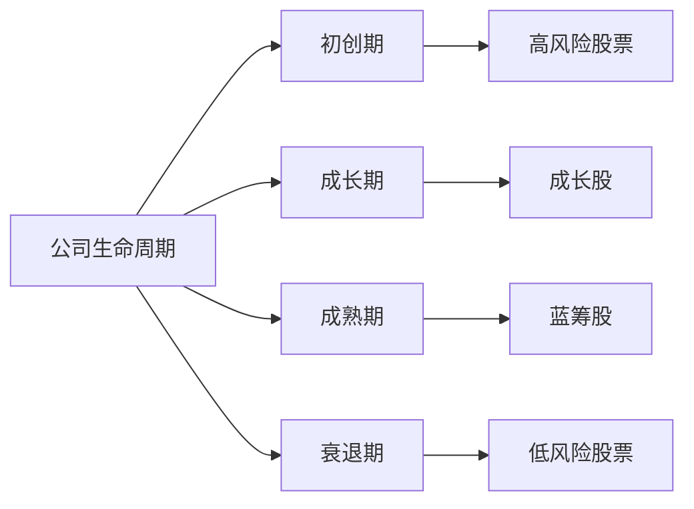

                 


# 格雷厄姆特价股票策略在不同公司生命周期阶段的效果

## 关键词
- 格雷厄姆投资策略
- 公司生命周期
- 价值投资
- 股票估值
- 投资风险

## 摘要
本文探讨了格雷厄姆特价股票策略在不同公司生命周期阶段中的应用效果。通过分析初创期、成长期、成熟期和衰退期公司的特点，结合格雷厄姆的价值投资理念，探讨在每个阶段中如何有效应用特价股票策略。文章结合理论分析和实证研究，为投资者提供了在不同生命周期阶段选择和优化投资策略的实用指南。

---

# 第一部分：格雷厄姆投资策略与公司生命周期概述

## 第1章：格雷厄姆投资策略的核心理念

### 1.1 价值投资的定义与核心原则

#### 1.1.1 价值投资的起源与发展
价值投资是一种以公司基本面分析为基础的投资策略，起源于20世纪初。本杰明·格雷厄姆是该领域的奠基人，他强调以低于公司内在价值的价格购买股票。价值投资的核心理念是寻找市场低估的股票，并长期持有，等待其价值回归。

#### 1.1.2 格雷厄姆投资理念的核心要素
- **安全边际**：购买价格低于内在价值，确保即使市场波动，投资者也能获得正收益。
- **内在价值**：公司未来现金流的现值，反映其真实价值。
- ** margin of safety**：通过安全边际降低投资风险。

#### 1.1.3 格雷厄姆投资策略的关键步骤
1. 识别具有稳定盈利和良好财务状况的公司。
2. 评估公司的内在价值。
3. 确保购买价格低于内在价值。
4. 长期持有优质股票，避免频繁交易。

### 1.2 公司生命周期的四个阶段

#### 1.2.1 公司生命周期的定义
公司生命周期包括初创期、成长期、成熟期和衰退期四个阶段，每个阶段具有不同的财务特征和市场表现。

#### 1.2.2 不同阶段的公司特点
- **初创期**：公司规模小，风险高，但增长潜力大。
- **成长期**：公司快速增长，市场份额扩大。
- **成熟期**：公司增长稳定，市场份额趋于饱和。
- **衰退期**：公司增长放缓，市场份额被竞争对手蚕食。

#### 1.2.3 生命周期阶段与投资策略的关系
不同生命周期阶段的公司适合不同的投资策略。例如，初创期公司适合风险承受能力强的投资者，而成熟期公司适合追求稳定收益的投资者。

---

## 第2章：格雷厄姆投资策略在不同生命周期阶段的适用性

### 2.1 初创期公司的投资策略

#### 2.1.1 初创期公司的特点
- 高风险：公司可能面临现金流不足、市场不确定等问题。
- 高增长潜力：如果成功，公司可能实现爆发式增长。

#### 2.1.2 格雷厄姆策略在初创期的应用
- 估值挑战：初创期公司可能没有足够的历史数据，难以准确评估内在价值。
- 投资风险：高失败率意味着投资者需要承受较高的风险。

#### 2.1.3 案例分析：初创期公司的投资机会
以科技初创公司为例，如果公司具有创新业务模式和强大管理团队，可能成为优质投资标的。

### 2.2 成长期公司的投资策略

#### 2.2.1 成长期公司的特点
- 收入和利润快速增长。
- 市场份额逐步扩大，但竞争加剧。

#### 2.2.2 格雷厄姆策略在成长期的应用
- 估值方法：使用市盈率增长比率（PEG）等指标评估股票价值。
- 投资机会：选择具有持续增长潜力的公司，同时确保价格合理。

#### 2.2.3 案例分析：成长期公司的投资机会
以互联网公司为例，处于快速增长期的公司可能符合格雷厄姆策略的要求。

### 2.3 成熟期公司的投资策略

#### 2.3.1 成熟期公司的特点
- 增长放缓，利润稳定。
- 市场份额稳定，竞争压力较小。

#### 2.3.2 格雷厄姆策略在成熟期的应用
- 估值方法：使用市盈率、市净率等传统估值指标。
- 投资机会：选择股息收益率高、财务稳定的公司。

#### 2.3.3 案例分析：成熟期公司的投资机会
以消费品公司为例，成熟期公司通常具有稳定的现金流和分红能力，适合价值投资者。

### 2.4 衰退期公司的投资策略

#### 2.4.1 衰退期公司的特点
- 收入和利润持续下降。
- 市场份额被竞争对手蚕食。

#### 2.4.2 格雷厄姆策略在衰退期的应用
- 估值挑战：公司可能处于破产边缘，难以评估内在价值。
- 投资风险：衰退期公司可能面临资产减值和退市风险。

#### 2.4.3 案例分析：衰退期公司的投资机会
衰退期公司通常风险极高，但有时可以通过资产重组或管理层变革实现逆转。

---

## 第3章：格雷厄姆策略在不同生命周期阶段的实证研究

### 3.1 初创期公司的实证分析

#### 3.1.1 数据来源与研究方法
- 数据来源：选取过去10年成立的初创期公司，分析其股价表现和财务数据。
- 研究方法：对比格雷厄姆策略下的投资回报与市场平均水平。

#### 3.1.2 实证结果
- 初创期公司投资回报波动较大，但成功案例的回报率远高于市场平均水平。

### 3.2 成长期公司的实证分析

#### 3.2.1 数据来源与研究方法
- 数据来源：选取过去5年收入增长率超过20%的成长期公司。
- 研究方法：计算格雷厄姆策略下的平均投资回报率。

#### 3.2.2 实证结果
- 成长期公司投资回报稳定，符合格雷厄姆策略的预期。

### 3.3 成熟期公司的实证分析

#### 3.3.1 数据来源与研究方法
- 数据来源：选取过去5年收入增长率低于5%的成熟期公司。
- 研究方法：计算格雷厄姆策略下的平均投资回报率和股息收益率。

#### 3.3.2 实证结果
- 成熟期公司投资回报稳定，股息收益率较高，符合格雷厄姆策略的要求。

### 3.4 衰退期公司的实证分析

#### 3.4.1 数据来源与研究方法
- 数据来源：选取过去5年收入持续下降的衰退期公司。
- 研究方法：计算格雷厄姆策略下的投资回报率。

#### 3.4.2 实证结果
- 衰退期公司投资回报波动大，风险较高，不符合格雷厄姆策略的要求。

---

## 第4章：格雷厄姆策略在不同生命周期阶段的系统分析与优化

### 4.1 核心概念与联系

#### 4.1.1 核心概念对比表格
| 生命周期阶段 | 格雷厄姆策略 | 适用性分析 |
|-------------|--------------|------------|
| 初创期       | 高风险股票 | 适合风险承受能力强的投资者 |
| 成长期       | 成长股      | 适合追求稳定增长的投资者 |
| 成熟期       | 蓝筹股      | 适合追求稳定收益的投资者 |
| 衰退期       | 低风险股票 | 不适合，风险过高 |

#### 4.1.2 实体关系图


### 4.2 格雷厄姆策略的数学模型

#### 4.2.1 内在价值计算公式
$$ \text{内在价值} = \sum_{t=1}^{\infty} \frac{\text{现金流}_t}{(1 + r)^t} $$
其中，\( r \) 是折现率，现金流 \( t \) 是未来第 \( t \) 年的现金流。

#### 4.2.2 安全边际计算公式
$$ \text{安全边际} = \text{内在价值} - \text{市场价格} $$

---

## 第5章：格雷厄姆策略在不同生命周期阶段的项目实战

### 5.1 环境与工具安装

#### 5.1.1 数据来源
- 股票数据：使用Yahoo Finance获取历史股价和财务数据。
- 经济指标：使用美联储数据获取宏观经济指标。

#### 5.1.2 工具安装
- Python环境：安装Anaconda Python 3.9+。
- 第三方库：安装pandas、numpy、yfinance、matplotlib。

### 5.2 核心实现源代码

#### 5.2.1 格雷厄姆策略的实现代码
```python
import pandas as pd
import numpy as np
import yfinance as yf

def calculate_intrinsic_value(company_data, discount_rate):
    # 计算未来现金流
    cash_flow = company_data['Free Cash Flow']
    # 计算内在价值
    iv = cash_flow / (1 + discount_rate)
    return iv

def calculate_margin_of_safety(current_price, intrinsic_value):
    return intrinsic_value - current_price

# 下载公司数据
msft = yf.download('MSFT', start='2020-01-01', end='2023-12-31')
msft['Free Cash Flow'] = msft['Adj Close'] * msft['Volume'] * 0.01  # 示例计算

# 计算内在价值
iv = calculate_intrinsic_value(msft, 0.1)
mos = calculate_margin_of_safety(msft['Adj Close'], iv)

print("内在价值:", iv)
print("安全边际:", mos)
```

#### 5.2.2 实战案例分析
以微软公司（MSFT）为例，分析其在成熟期的格雷厄姆策略应用。

---

## 第6章：总结与展望

### 6.1 总结
格雷厄姆策略在不同生命周期阶段的公司中表现各异。初创期公司风险高但回报潜力大，成长期公司适合追求稳定增长的投资者，成熟期公司适合追求稳定收益的投资者，衰退期公司风险过高，不适合价值投资。

### 6.2 未来研究方向
- 进一步优化内在价值计算模型。
- 探讨技术分析与基本面分析的结合。
- 研究ESG因素对投资策略的影响。

### 6.3 最佳实践 tips
- 投资者应根据自身风险承受能力和投资目标选择适合的生命周期阶段。
- 定期复盘和调整投资组合，确保与市场变化保持一致。

---

## 作者：AI天才研究院/AI Genius Institute & 禅与计算机程序设计艺术 /Zen And The Art of Computer Programming

---

**附录：**
- 格雷厄姆原著推荐书单
- 估值模型详细说明
- 数据分析代码完整版

