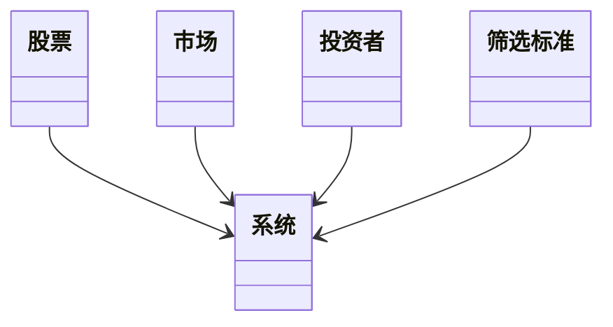
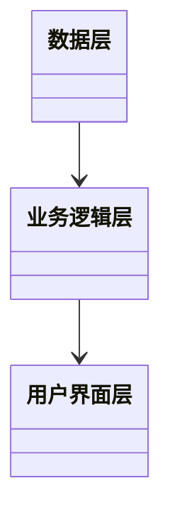
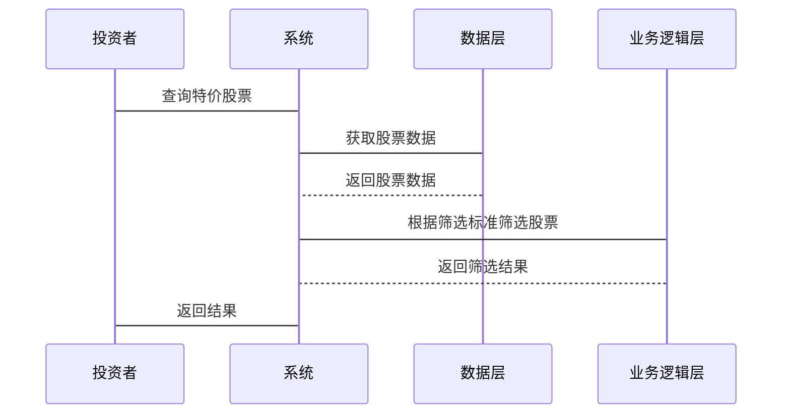

                 


# 格雷厄姆特价股票策略在不同国家市场的应用

> 关键词：格雷厄姆投资策略，特价股票，价值投资，股票市场，国际投资

> 摘要：本文详细探讨了本杰明·格雷厄姆的价值投资策略在不同国家市场中的应用。通过分析美国、欧洲、亚洲和新兴市场的特点，本文揭示了如何在不同市场环境下优化格雷厄姆策略，以实现超额收益。文章还结合数学模型和实际案例，展示了如何构建投资系统，并提供了系统的架构设计和实战操作指南。

---

## 第一部分：格雷厄姆投资策略的核心理念

### 第1章：格雷厄姆投资策略的核心理念

#### 1.1 格雷厄姆投资策略的起源与发展

格雷厄姆是价值投资的鼻祖，其投资理念在20世纪初奠定了现代价值投资的基础。他的策略强调寻找市场价格低于内在价值的股票，即特价股票。这种策略在《证券分析》一书中得到详细阐述，并被 Warren Buffett 等投资者广泛采用。

- **1.1.1 价值投资的鼻祖——本杰明·格雷厄姆**
  - 格雷厄姆的投资哲学强调安全边际和长期稳健的回报。
  - 他提出的“烟屁股”理论，即购买被市场忽视的股票，以低于其真实价值的价格买入。

- **1.1.2 格雷厄姆投资策略的基本原理**
  - 市场价格与内在价值的差异是投资机会的来源。
  - 投资者应寻找那些市场价格远低于其内在价值的股票。

- **1.1.3 格雷厄姆策略在现代投资中的地位**
  - 格雷厄姆的策略为机构投资者和个人投资者提供了稳健的投资框架。
  - 他的方法在量化投资和风险管理中具有重要影响。

#### 1.2 特价股票的定义与特征

- **1.2.1 什么是特价股票**
  - 特价股票是指市场价格远低于其内在价值的股票。
  - 这种股票通常被市场忽视或低估，具有较高的投资潜力。

- **1.2.2 特价股票的核心特征**
  - 低市盈率（P/E ratio）：市盈率 = 股价 / 每股收益。
  - 低市净率（P/B ratio）：市净率 = 股价 / 每股净资产。
  - 高股息率：高股息率通常意味着公司有稳定的盈利能力和较高的股息支付率。

- **1.2.3 特价股票与普通股票的对比**
  - 普通股票：市场价格反映市场情绪，可能高于或低于其真实价值。
  - 特价股票：市场价格通常低于其真实价值，具有长期增值潜力。

#### 1.3 格雷厄姆策略的核心要素

- **1.3.1 股票的内在价值**
  - 内在价值是公司未来现金流的现值。
  - 格雷厄姆使用简化模型估算内在价值，例如：内在价值 = 保守估计的未来现金流 / 合理的折现率。

- **1.3.2 市场价格与内在价值的差异**
  - 格雷厄姆策略的核心是寻找市场价格远低于内在价值的股票。
  - 通常，格雷厄姆建议市场价格低于内在价值的 2/3。

- **1.3.3 安全边际的概念**
  - 安全边际 = 内在价值 - 市场价格。
  - 安全边际越大，投资风险越小，潜在回报越高。

---

### 第2章：格雷厄姆策略在不同市场中的应用背景

#### 2.1 全球主要市场的特点分析

- **2.1.1 美国市场**
  - 美国市场流动性高，信息公开透明。
  - 特价股票通常出现在周期性行业，如制造业和科技业。

- **2.1.2 欧洲市场**
  - 欧洲市场以稳健的蓝筹股为主，适合长期投资。
  - 特价股票可能出现在资源丰富的国家，如英国和德国。

- **2.1.3 亚洲市场**
  - 亚洲市场增长潜力大，尤其是中国和印度。
  - 特价股票可能出现在新兴行业，如科技和消费领域。

- **2.1.4 新兴市场**
  - 新兴市场波动性高，但增长速度快。
  - 特价股票通常出现在基本面良好的公司，但风险也较高。

#### 2.2 不同市场环境对格雷厄姆策略的影响

- **2.2.1 市场波动性**
  - 波动性高的市场中，特价股票出现频率可能更高，但风险也更大。
  - 投资者需要更严格的安全边际要求。

- **2.2.2 宏观经济环境**
  - 经济衰退时，某些行业可能被低估，成为特价股票的来源。
  - 通货膨胀环境下，高股息率的股票更具吸引力。

- **2.2.3 监管政策差异**
  - 监管严格的市场中，信息公开透明，更容易找到特价股票。
  - 监管宽松的市场中，风险较高，需要更谨慎的选择。

#### 2.3 特价股票在不同市场中的表现

- **2.3.1 美国市场的历史表现**
  - 美国市场的特价股票通常在经济衰退或市场低迷时出现。
  - 历史数据显示，格雷厄姆策略在美国市场能够获得稳定的超额收益。

- **2.3.2 欧洲市场的历史表现**
  - 欧洲市场的特价股票在经济低迷或行业整合时出现。
  - 历史案例显示，英国和德国的部分股票符合格雷厄姆标准。

- **2.3.3 亚洲市场的历史表现**
  - 亚洲市场的特价股票通常在新兴经济体中出现。
  - 历史案例显示，中国和印度的部分股票符合格雷厄姆标准。

- **2.3.4 新兴市场的历史表现**
  - 新兴市场的特价股票通常在经济快速增长但市场不成熟时出现。
  - 历史案例显示，巴西和韩国的部分股票符合格雷厄姆标准。

---

### 第3章：格雷厄姆策略的跨国比较与优化

#### 3.1 不同市场的策略差异

- **3.1.1 美国市场**
  - 由于市场成熟，特价股票出现频率较低，但一旦出现，回报率较高。
  - 投资者需要更严格的筛选标准。

- **3.1.2 欧洲市场**
  - 市场较为稳定，特价股票通常在经济低迷时出现。
  - 投资者需要关注公司的财务状况和行业前景。

- **3.1.3 亚洲市场**
  - 市场波动性较高，特价股票可能在新兴行业中出现。
  - 投资者需要关注公司的增长潜力和区域经济趋势。

- **3.1.4 新兴市场**
  - 市场波动性高，但增长潜力大。
  - 投资者需要关注公司的基本面和行业前景。

#### 3.2 优化策略

- **3.2.1 根据市场特点调整筛选标准**
  - 在新兴市场中，可以适当放宽市盈率和市净率的要求。
  - 在成熟市场中，需要更严格的筛选标准。

- **3.2.2 关注行业周期**
  - 在周期性行业中，市场低迷时更容易找到特价股票。
  - 在成长性行业中，需要关注公司的未来增长潜力。

- **3.2.3 结合宏观环境**
  - 在经济衰退时，寻找被低估的股票。
  - 在通货膨胀时，关注高股息率的股票。

---

## 第四部分：格雷厄姆策略的系统分析与架构设计

### 第4章：系统分析与架构设计方案

#### 4.1 问题场景介绍

- 投资者需要在不同市场中寻找符合格雷厄姆标准的特价股票。
- 市场环境复杂，投资者需要一个高效的投资系统来筛选和监控股票。

#### 4.2 项目介绍

- **项目目标**：构建一个基于格雷厄姆策略的投资系统，能够在不同市场中自动筛选特价股票。
- **项目范围**：涵盖美国、欧洲、亚洲和新兴市场。
- **项目利益相关者**：投资者、投资顾问、投资机构。

#### 4.3 系统功能设计

- **领域模型**：使用 Mermaid 类图展示系统的核心实体和关系。



---

#### 4.4 系统架构设计

- **系统架构**：采用分层架构，包括数据层、业务逻辑层和用户界面层。



#### 4.5 系统接口设计

- **数据接口**：从金融数据源获取股票数据。
- **筛选接口**：根据格雷厄姆标准筛选特价股票。
- **监控接口**：实时监控股票价格和市场变化。

#### 4.6 系统交互设计

- **投资者查询特价股票**：投资者通过用户界面层提交查询请求，系统从数据层获取股票数据，业务逻辑层根据筛选标准筛选出符合要求的股票，并返回结果。



---

## 第五部分：格雷厄姆策略的实战应用

### 第5章：项目实战

#### 5.1 环境安装

- **工具安装**：
  - 安装 Python 和相关库（如 pandas、numpy、scikit-learn）。
  - 安装金融数据接口（如 Yahoo Finance API）。

#### 5.2 核心实现源代码

```python
import pandas as pd
import numpy as np

# 获取股票数据
def get_stock_data(ticker):
    # 这里假设我们有一个获取股票数据的函数
    pass

# 计算内在价值
def calculate_intrinsic_value(ticker):
    # 简化的内在价值计算模型
    pass

# 筛选特价股票
def screen_cheap_stock(ticker_list):
    # 根据格雷厄姆标准筛选股票
    pass

# 筛选标准：市盈率 < 15，市净率 < 2，股息率 > 3%
def graham_screen(stock):
    pe = stock.pe
    pb = stock.pb
    dividend_yield = stock.dividend_yield
    return pe < 15 and pb < 2 and dividend_yield > 0.03

# 实战案例：分析日本市场
def japan_market_analysis():
    # 获取日本市场的股票列表
    japan_stocks = get_stock_data('Japan')
    # 筛选符合格雷厄姆标准的股票
    cheap_stocks = [stock for stock in japan_stocks if graham_screen(stock)]
    return cheap_stocks

# 实战案例：新兴市场分析
def emerging_market_analysis():
    # 获取新兴市场的股票列表
    emerging_stocks = get_stock_data('Emerging Markets')
    # 筛选符合格雷厄姆标准的股票
    cheap_stocks = [stock for stock in emerging_stocks if graham_screen(stock)]
    return cheap_stocks
```

#### 5.3 实际案例分析

- **案例1：日本市场分析**
  - 获取日本市场的股票数据。
  - 根据格雷厄姆标准筛选符合要求的股票。
  - 分析筛选出的股票的历史表现和潜在回报。

- **案例2：新兴市场分析**
  - 获取新兴市场的股票数据。
  - 根据格雷厄姆标准筛选符合要求的股票。
  - 分析筛选出的股票的历史表现和潜在回报。

#### 5.4 项目小结

- **项目总结**：
  - 系统化的投资策略能够提高投资效率和成功率。
  - 不同市场中的策略应用需要结合市场特点进行调整。
  - 投资者需要持续关注市场变化和公司基本面。

---

## 第六部分：格雷厄姆策略的优化与展望

### 第6章：格雷厄姆策略的优化与展望

#### 6.1 现有策略的局限性

- **市场流动性**：在新兴市场中，流动性不足可能导致交易成本增加。
- **数据质量**：不同市场中的数据质量可能影响筛选结果。
- **市场波动性**：高波动性市场中，策略的有效性可能受到挑战。

#### 6.2 优化策略的建议

- **动态调整筛选标准**：根据市场环境变化调整安全边际要求。
- **结合技术分析**：将技术分析与价值分析相结合，提高投资决策的科学性。
- **分散投资**：通过分散投资降低市场风险，提高投资组合的稳定性。

#### 6.3 未来展望

- **智能化投资**：利用人工智能技术优化投资策略，提高筛选效率和准确性。
- **全球化投资**：随着全球化的深入，投资者需要更加灵活地应对不同市场环境。
- **风险管理**：建立完善的风险管理体系，降低投资风险。

---

## 作者：AI天才研究院/AI Genius Institute & 禅与计算机程序设计艺术 /Zen And The Art of Computer Programming

---

这篇文章通过详细分析格雷厄姆特价股票策略在不同国家市场的应用，结合理论、系统设计和实战案例，为投资者提供了丰富的投资策略和实践指南。文章不仅探讨了不同市场的特点，还提供了具体的筛选标准和系统架构设计，帮助投资者在复杂的市场环境中实现稳健的投资回报。

