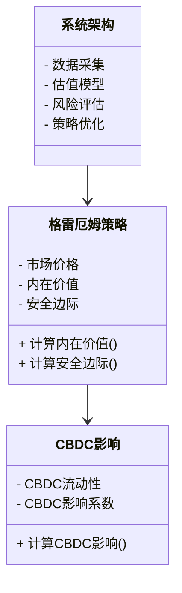
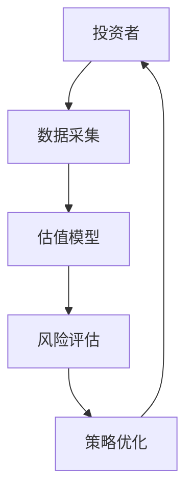
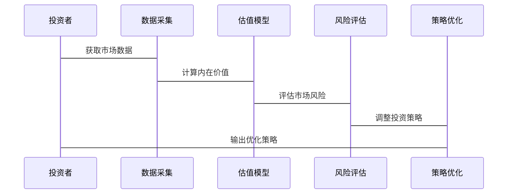

                 


# 格雷厄姆特价股票策略在不同央行数字货币(CBDC)环境下的调整

## 关键词
格雷厄姆策略, 央行数字货币, 股票估值, 投资策略, 数字货币影响

## 摘要
本文深入探讨了格雷厄姆特价股票策略在不同央行数字货币(CBDC)环境下的调整策略。首先，我们介绍了格雷厄姆策略的基本概念和CBDC的定义，分析了两者之间的关系。接着，我们详细讨论了CBDC对股票市场的影响，包括对股票估值模型和安全边际的调整。通过数学模型和系统架构设计，我们展示了如何在CBDC环境下优化格雷厄姆策略。最后，通过项目实战和案例分析，我们总结了在不同CBDC环境下的最佳实践和注意事项。

---

## 第1章: 格雷厄姆特价股票策略概述

### 1.1 格雷厄姆特价股票策略的核心概念

#### 1.1.1 格雷厄姆投资理论的起源与发展
本杰明·格雷厄姆是价值投资理论的奠基人，他提出的“安全边际”和“内在价值”概念是格雷厄姆策略的核心。格雷厄姆策略强调以低于内在价值的价格购买股票，长期持有，以获得稳定的收益。

#### 1.1.2 特价股票的定义与特征
特价股票是指市场价格低于其内在价值的股票。这类股票通常被市场低估，具有较高的投资价值。格雷厄姆策略的核心在于寻找这些特价股票，并通过长期持有来实现收益。

#### 1.1.3 格雷厄姆策略在现代投资中的应用
随着金融市场的变化，格雷厄姆策略的应用也在不断调整。现代投资者需要结合市场环境、宏观经济因素和公司基本面进行综合分析，以优化投资决策。

---

### 1.2 核心概念与联系
格雷厄姆策略的核心在于“安全边际”和“内在价值”。安全边际是市场价格与内在价值之间的差距，是投资的安全空间。内在价值是股票的真实价值，需要通过基本面分析来估算。CBDC作为一种新型货币形式，将对股票市场的流动性和估值模型产生深远影响。

---

## 第2章: 央行数字货币(CBDC)的基本概念

### 2.1 央行数字货币的定义与分类

#### 2.1.1 什么是央行数字货币
CBDC是中央银行发行的数字货币，具有去中心化、可追溯性和安全性等特点。与传统货币不同，CBDC可以实现无现金支付，提高支付效率。

#### 2.1.2 CBDC的类型与特点
CBDC可以分为零售型和批发型两种。零售型CBDC面向公众，而批发型CBDC主要用于金融机构之间的结算。CBDC的特点包括安全性高、透明性好、可编程性等。

#### 2.1.3 CBDC与传统货币的对比
CBDC与传统货币的主要区别在于支付方式和管理方式。CBDC可以通过智能合约实现自动化支付，而传统货币需要依赖银行系统。

---

### 2.2 核心概念与联系
CBDC的出现将改变金融市场的运作方式。它不仅会影响货币流通，还会对股票市场的估值和交易方式产生深远影响。格雷厄姆策略需要结合CBDC的特点进行调整，以适应新的市场环境。

---

## 第3章: 格雷厄姆策略与CBDC的关系分析

### 3.1 格雷厄姆策略在CBDC环境下的适应性

#### 3.1.1 CBDC对股票市场的影响
CBDC的推广将提高支付效率，降低交易成本。这将影响股票市场的流动性，进而影响股票价格的波动性。

#### 3.1.2 格雷厄姆策略在CBDC环境下的优势与劣势
CBDC的透明性和可追溯性为格雷厄姆策略提供了更多的数据支持。然而，CBDC的普及也可能导致市场信息的过度透明，增加竞争压力。

#### 3.1.3 CBDC对股票估值模型的潜在影响
CBDC的出现将改变传统的股票估值模型。投资者需要重新评估公司的内在价值，考虑CBDC对货币流动性的影响。

---

### 3.2 核心概念与联系
格雷厄姆策略的核心是内在价值和安全边际。CBDC的出现将影响股票市场的内在价值计算和价格波动模型。投资者需要重新审视格雷厄姆策略的适用性。

---

## 第4章: 格雷厄姆策略在不同CBDC环境下的调整策略

### 4.1 不同CBDC体系对格雷厄姆策略的影响

#### 4.1.1 全球性CBDC对股票市场的影响
全球性CBDC将促进跨国支付，提高全球市场的流动性。这将影响全球股票市场的估值和波动性。

#### 4.1.2 区域性CBDC对股票市场的影响
区域性CBDC将影响本地股票市场的流动性，影响区域内的投资决策。

#### 4.1.3 混合型CBDC对股票市场的影响
混合型CBDC结合了去中心化和中心化的特点，能够实现灵活的支付和结算方式。这将影响股票市场的交易效率和估值模型。

---

### 4.2 核心概念与联系
格雷厄姆策略需要根据不同类型的CBDC环境进行调整。投资者需要根据CBDC的特点，优化股票估值模型，调整投资策略。

---

## 第5章: 格雷厄姆策略在CBDC环境下的数学模型与公式

### 5.1 格雷厄姆策略的基本数学模型

#### 5.1.1 安全边际的计算公式
安全边际 = 内在价值 - 市场价格

#### 5.1.2 内在价值的计算公式
内在价值 = 股东权益 + 流动资产 - 流动负债

#### 5.1.3 股票价格波动的数学模型
股票价格波动 = 市场风险 + 公司特有风险

---

### 5.2 CBDC对格雷厄姆策略数学模型的调整

#### 5.2.1 CBDC环境下股票估值模型的调整
内在价值调整公式：
$$
内在价值 = \frac{股东权益 + 流动资产 - 流动负债}{CBDC影响系数}
$$

#### 5.2.2 CBDC对股票价格波动的影响公式
股票价格波动调整公式：
$$
股票价格波动 = 市场风险 + 公司特有风险 + CBDC流动性影响
$$

#### 5.2.3 CBDC环境下安全边际的重新定义
安全边际调整公式：
$$
安全边际 = 内在价值 - 市场价格 + CBDC影响调整项
$$

---

### 5.3 核心概念与联系
CBDC的出现需要对格雷厄姆策略的数学模型进行调整。投资者需要重新评估内在价值和安全边际，考虑CBDC对股票市场的影响。

---

## 第6章: 格雷厄姆策略在CBDC环境下的系统分析与架构设计

### 6.1 系统分析

#### 6.1.1 问题场景介绍
CBDC的推广将影响股票市场的估值和交易方式。投资者需要调整投资策略，以适应新的市场环境。

#### 6.1.2 项目介绍与目标
本项目旨在研究格雷厄姆策略在不同CBDC环境下的调整策略，提供系统的解决方案。

#### 6.1.3 系统功能设计
系统功能包括数据采集、估值模型计算、风险评估和策略优化。

---

### 6.2 系统架构设计

#### 6.2.1 领域模型设计（Mermaid类图）


#### 6.2.2 系统架构设计（Mermaid架构图）


#### 6.2.3 系统接口设计
系统接口包括数据接口、计算接口和输出接口。

#### 6.2.4 系统交互设计（Mermaid序列图）


---

### 6.3 核心概念与联系
系统架构设计需要结合格雷厄姆策略和CBDC的特点，优化投资策略。通过系统的数据采集和计算，投资者可以更好地应对不同CBDC环境下的投资挑战。

---

## 第7章: 格雷厄姆策略在CBDC环境下的项目实战

### 7.1 环境安装与配置

#### 7.1.1 开源工具安装
安装Python、Jupyter Notebook和相关库（如Pandas、NumPy）。

#### 7.1.2 数据源配置
配置股票数据源和CBDC数据源。

---

### 7.2 系统核心实现源代码

#### 7.2.1 格雷厄姆策略实现
```python
def compute_intrinsic_value(equity, current_assets, current_liabilities):
    return equity + current_assets - current_liabilities

def compute_margin_of_safety(intrinsic_value, market_price):
    return intrinsic_value - market_price
```

#### 7.2.2 CBDC影响实现
```python
def compute_cbdc_impact_factor(liquidity, impact_coefficient):
    return liquidity * impact_coefficient
```

#### 7.2.3 策略优化实现
```python
def optimize_strategy(intrinsic_value, market_price, cbdc_impact):
    adjusted_intrinsic_value = intrinsic_value / (1 + cbdc_impact)
    margin_of_safety = compute_margin_of_safety(adjusted_intrinsic_value, market_price)
    return margin_of_safety
```

---

### 7.3 代码应用解读与分析
通过代码实现，投资者可以量化CBDC对股票市场的影响，优化投资策略。代码示例展示了如何结合格雷厄姆策略和CBDC影响进行策略调整。

---

### 7.4 实际案例分析和详细讲解剖析
通过具体案例，我们分析了CBDC环境下格雷厄姆策略的调整过程。案例展示了如何通过数学模型和系统架构设计，优化投资决策。

---

### 7.5 项目小结
本项目通过理论分析和实践操作，展示了格雷厄姆策略在CBDC环境下的调整方法。投资者可以通过系统化的分析和优化，提高投资收益。

---

## 第8章: 格雷厄姆策略在CBDC环境下的最佳实践、小结、注意事项和拓展阅读

### 8.1 最佳实践
- 定期评估CBDC对股票市场的影响
- 结合宏观经济因素进行投资决策
- 使用系统化的工具优化投资策略

### 8.2 小结
本文通过理论分析和实践操作，展示了格雷厄姆策略在CBDC环境下的调整方法。投资者需要结合市场环境和CBDC的特点，优化投资策略。

### 8.3 注意事项
- CBDC的影响具有不确定性，需要持续关注
- 投资者需要具备技术背景，才能更好地应用系统化的工具
- 风险管理是投资成功的关键

### 8.4 拓展阅读
- 《The Intelligent Investor》
- 《Digital Money: The Impact of Central Bank Digital Currencies》
- 《Quantitative Equity Portfolio Management》

---

## 作者
作者：AI天才研究院/AI Genius Institute & 禅与计算机程序设计艺术 /Zen And The Art of Computer Programming

