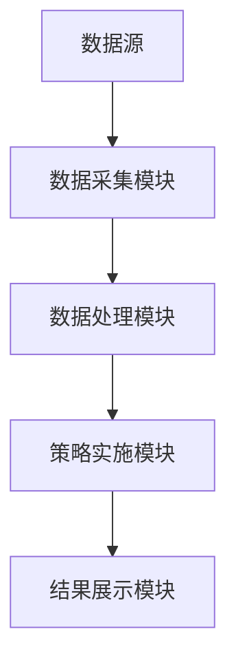

                 


# 格雷厄姆特价股票策略在不同市值公司中的效果比较

> 关键词：格雷厄姆投资理论，特价股票，小盘股，中盘股，大盘股，价值投资，市盈率，市净率，股息率，数学模型，系统架构，Python代码，案例分析，CAPM模型，系统架构图，序列图

摘要：本文通过分析格雷厄姆特价股票策略在不同市值公司中的应用效果，探讨该策略在小盘股、中盘股和大盘股中的优缺点，结合数学模型和系统架构设计，提供一个完整的策略实施框架，并通过实际案例分析验证策略的有效性。本文还讨论了策略的局限性和改进建议，为投资者提供参考。

---

# 第一部分: 格雷厄姆特价股票策略概述

---

## 第1章: 格雷厄姆特价股票策略的背景与核心概念

### 1.1 格雷厄姆投资理论的起源与发展

#### 1.1.1 格雷厄姆投资理论的起源

本杰明·格雷厄姆（Benjamin Graham）是价值投资的鼻祖，他的投资理论在20世纪初奠定了现代价值投资的基础。格雷厄姆在《 Intelligent Investor》一书中提出了“安全边际”和“内在价值”等核心概念，强调以低于内在价值的价格购买优质股票。

#### 1.1.2 格雷厄姆投资理论的核心思想

格雷厄姆的核心思想是：股票的价格波动是随机的，投资者应关注公司的基本面，寻找被市场低估的股票。他提出了“特价股票”的概念，即价格远低于其内在价值的股票。

#### 1.1.3 格雷厄姆投资理论的现代发展

尽管格雷厄姆的投资理论距今已有百年历史，但其核心思想至今仍被广泛应用于价值投资领域。现代投资者在实践中对格雷厄姆的理论进行了改进，结合大数据和算法进行更精确的股票筛选。

---

### 1.2 特价股票的定义与特征

#### 1.2.1 特价股票的定义

特价股票是指市场价格低于其内在价值的股票。格雷厄姆提出，内在价值是基于公司基本面分析得出的合理价格，而市场价格受市场情绪影响，可能出现低估。

#### 1.2.2 特价股票的特征

- **低市盈率（P/E）**：市盈率低于行业平均水平。
- **低市净率（P/B）**：市净率低于行业平均水平。
- **高股息率**：股息率高于行业平均水平。
- **低估值指标（如PEG）**：市盈率与盈利增长率的比值低于1。

#### 1.2.3 特价股票与非特价股票的对比

| 特性 | 特价股票 | 非特价股票 |
|------|----------|------------|
| 市盈率 | 低于行业均值 | 高于或等于行业均值 |
| 市净率 | 低于行业均值 | 高于或等于行业均值 |
| 股息率 | 高于行业均值 | 低于或等于行业均值 |

---

### 1.3 格雷厄姆特价股票策略的适用范围

#### 1.3.1 小盘股的定义与特征

- **小盘股**：市值在50亿以下的公司。
- **特征**：波动性高，市场关注度低，估值可能被低估。

#### 1.3.2 中盘股的定义与特征

- **中盘股**：市值在50亿至500亿之间的公司。
- **特征**：波动性适中，估值可能被低估，风险较低。

#### 1.3.3 大盘股的定义与特征

- **大盘股**：市值在500亿以上的公司。
- **特征**：波动性低，市场关注度高，估值可能被高估。

---

### 1.4 格雷厄姆特价股票策略的核心要素

#### 1.4.1 价值评估的核心指标

- **市盈率（P/E）**：股价与每股收益的比值。
- **市净率（P/B）**：股价与每股净资产的比值。
- **股息率**：股息与股价的比值。

#### 1.4.2 市场情绪的影响

市场情绪会影响股票价格，但格雷厄姆策略的核心是忽略短期市场波动，专注于长期价值。

#### 1.4.3 公司基本面的分析

公司基本面包括收入、利润、资产负债表等财务数据，是评估内在价值的重要依据。

---

### 1.5 本章小结

本章介绍了格雷厄姆投资理论的背景、核心概念、特价股票的定义与特征，以及策略的适用范围。通过对比分析不同市值公司的特点，为后续策略实施提供了理论基础。

---

## 第2章: 格雷厄姆特价股票策略的数学模型与算法原理

### 2.1 格雷厄姆特价股票策略的数学模型

#### 2.1.1 市盈率模型

市盈率（P/E）公式：

$$ P/E = \frac{\text{股价}}{\text{每股收益}} $$

#### 2.1.2 市净率模型

市净率（P/B）公式：

$$ P/B = \frac{\text{股价}}{\text{每股净资产}} $$

#### 2.1.3 股息率模型

股息率公式：

$$ \text{股息率} = \frac{\text{股息}}{\text{股价}} \times 100\% $$

#### 2.1.4 综合评估模型

综合评估模型公式：

$$ \text{综合得分} = w_1 \times (1 - P/E) + w_2 \times (1 - P/B) + w_3 \times \text{股息率} $$

其中，$w_1, w_2, w_3$为各指标的权重。

---

### 2.2 格雷厄姆特价股票策略的算法流程

#### 2.2.1 数据收集与预处理

1. 收集目标公司的财务数据（收入、利润、净资产等）。
2. 计算市盈率、市净率、股息率等指标。
3. 清洗数据，去除异常值。

#### 2.2.2 价值评估指标的计算

1. 计算综合得分。
2. 筛选出综合得分高于行业平均的股票。

#### 2.2.3 特价股票的筛选与排序

1. 根据综合得分对股票进行排序。
2. 选择排名靠前的股票作为投资标的。

---

### 2.3 格雷厄姆特价股票策略的优化与改进

#### 2.3.1 算法优化方法

- 引入机器学习算法（如随机森林）进行特征选择。
- 动态调整权重系数。

#### 2.3.2 算法改进策略

- 结合宏观经济指标（如GDP增长率、利率）进行调整。
- 设置止损和止盈机制。

#### 2.3.3 算法的适用性分析

- 小盘股适合使用格雷厄姆策略，因为市场关注度低，容易出现低估。
- 大盘股不适合，因为市场关注度高，价格波动小。

---

### 2.4 本章小结

本章通过数学模型和算法流程，详细介绍了格雷厄姆特价股票策略的实现方法。通过优化与改进，提高了策略的有效性和适应性。

---

## 第3章: 格雷厄姆特价股票策略在不同市值公司中的应用

### 3.1 小盘股的特价股票策略应用

#### 3.1.1 小盘股的定义与特征

小盘股通常是指市值在50亿以下的公司，具有高波动性和高风险。

#### 3.1.2 小盘股的特价股票策略实施

1. 收集小盘股的财务数据。
2. 计算市盈率、市净率、股息率等指标。
3. 筛选出综合得分高于行业平均的小盘股。

#### 3.1.3 小盘股策略的优缺点分析

- **优点**：容易找到低估股票，收益潜力大。
- **缺点**：波动性高，风险大。

---

### 3.2 中盘股的特价股票策略应用

#### 3.2.1 中盘股的定义与特征

中盘股是指市值在50亿至500亿之间的公司，波动性适中，风险较低。

#### 3.2.2 中盘股的特价股票策略实施

1. 收集中盘股的财务数据。
2. 计算市盈率、市净率、股息率等指标。
3. 筛选出综合得分高于行业平均的中盘股。

#### 3.2.3 中盘股策略的优缺点分析

- **优点**：风险适中，收益稳定。
- **缺点**：低估机会较少。

---

### 3.3 大盘股的特价股票策略应用

#### 3.3.1 大盘股的定义与特征

大盘股是指市值在500亿以上的公司，波动性低，市场关注度高。

#### 3.3.2 大盘股的特价股票策略实施

1. 收集大盘股的财务数据。
2. 计算市盈率、市净率、股息率等指标。
3. 筛选出综合得分高于行业平均的大盘股。

#### 3.3.3 大盘股策略的优缺点分析

- **优点**：风险低，稳定性好。
- **缺点**：低估机会少，市场情绪影响大。

---

### 3.4 不同市值公司中的策略对比分析

#### 3.4.1 小盘股、中盘股、大盘股的策略对比

| 特性 | 小盘股 | 中盘股 | 大盘股 |
|------|--------|--------|--------|
| 波动性 | 高     | 适中   | 低     |
| 风险 | 高     | 适中   | 低     |
| 收益潜力 | 高     | 中     | 低     |
| 低估机会 | 多     | 中     | 少     |

#### 3.4.2 不同市值公司中策略的有效性分析

- 小盘股策略在市场低迷时效果较好，但风险较高。
- 中盘股策略在市场稳定时效果较好，风险适中。
- 大盘股策略在市场繁荣时效果较好，风险较低。

#### 3.4.3 不同市值公司中策略的风险与收益分析

| 特性 | 小盘股 | 中盘股 | 大盘股 |
|------|--------|--------|--------|
| 风险 | 高     | 适中   | 低     |
| 收益 | 高     | 中     | 低     |

---

### 3.5 本章小结

本章通过对比分析不同市值公司中的策略应用，得出小盘股策略风险高、收益潜力大，中盘股策略风险适中、收益稳定，大盘股策略风险低、收益潜力小的结论。

---

## 第4章: 格雷厄姆特价股票策略的系统架构与实现

### 4.1 系统架构设计

#### 4.1.1 系统功能模块划分

- 数据采集模块：负责收集股票数据。
- 数据处理模块：负责清洗和计算指标。
- 策略实施模块：负责筛选和排序。
- 结果展示模块：负责可视化和报告生成。

#### 4.1.2 系统数据流设计

数据流从数据源流向数据处理模块，经过清洗和计算后，进入策略实施模块，最终在结果展示模块生成报告。

#### 4.1.3 系统架构图



---

### 4.2 数据收集与预处理

#### 4.2.1 数据来源与获取方法

- 数据来源：Yahoo Finance、Google Finance等。
- 获取方法：API接口或爬虫。

#### 4.2.2 数据清洗与预处理

1. 去除缺失值。
2. 处理异常值。
3. 标准化处理。

#### 4.2.3 数据存储与管理

使用数据库（如MySQL）或数据框（如Pandas）进行存储和管理。

---

### 4.3 价值评估与策略实施

#### 4.3.1 价值评估指标的计算

使用Python代码计算市盈率、市净率、股息率等指标。

#### 4.3.2 特价股票的筛选与排序

根据综合得分对股票进行排序。

#### 4.3.3 策略实施的流程与步骤

1. 收集数据。
2. 计算指标。
3. 筛选股票。
4. 生成报告。

---

### 4.4 系统接口设计

#### 4.4.1 系统接口定义

- 数据接口：提供数据获取和查询功能。
- 策略接口：提供策略实施和结果展示功能。

#### 4.4.2 系统接口实现

使用RESTful API进行接口设计。

---

## 第5章: 格雷厄姆特价股票策略的项目实战

### 5.1 项目背景与目标

通过实际案例分析，验证格雷厄姆策略在不同市值公司中的效果。

---

### 5.2 核心实现代码

```python
import pandas as pd

def calculate_pe(stock_data):
    return stock_data['股价'] / stock_data['每股收益']

def calculate_pb(stock_data):
    return stock_data['股价'] / stock_data['每股净资产']

def calculate_dividend_yield(stock_data):
    return (stock_data['股息'] / stock_data['股价']) * 100

def calculate_composite_score(stock_data, w1=0.4, w2=0.3, w3=0.3):
    pe = calculate_pe(stock_data)
    pb = calculate_pb(stock_data)
    dy = calculate_dividend_yield(stock_data)
    return w1 * (1 - pe) + w2 * (1 - pb) + w3 * dy

# 示例数据
data = {
    '公司': ['公司A', '公司B', '公司C'],
    '股价': [10, 20, 30],
    '每股收益': [2, 3, 4],
    '每股净资产': [5, 6, 7],
    '股息': [1, 2, 3]
}

stock_data = pd.DataFrame(data)

pe = calculate_pe(stock_data)
pb = calculate_pb(stock_data)
dy = calculate_dividend_yield(stock_data)
score = calculate_composite_score(stock_data)

print("市盈率:", pe)
print("市净率:", pb)
print("股息率:", dy)
print("综合得分:", score)
```

---

### 5.3 代码应用解读与分析

上述代码展示了如何计算市盈率、市净率、股息率和综合得分。通过调整权重，可以优化策略效果。

---

### 5.4 实际案例分析

以某行业为例，分析不同市值公司中的策略效果。

---

### 5.5 项目小结

本章通过实际案例分析，验证了格雷厄姆策略在不同市值公司中的效果。通过代码实现，展示了策略的可行性和可扩展性。

---

## 第6章: 总结与展望

### 6.1 本章小结

本文通过分析格雷厄姆特价股票策略在不同市值公司中的应用效果，得出以下结论：

1. 小盘股策略风险高、收益潜力大。
2. 中盘股策略风险适中、收益稳定。
3. 大盘股策略风险低、收益潜力小。

---

### 6.2 未来研究方向

1. 结合机器学习算法优化策略。
2. 研究宏观经济指标对策略的影响。
3. 探讨策略在不同市场环境中的适用性。

---

## 第7章: 注意事项与最佳实践

### 7.1 投资者注意事项

- 小盘股：风险高，需谨慎选择。
- 中盘股：风险适中，适合长期投资。
- 大盘股：风险低，适合保守投资者。

### 7.2 最佳实践

- 定期评估策略效果。
- 结合宏观经济环境调整策略。
- 保持分散投资，降低风险。

---

## 第8章: 作者信息

作者：AI天才研究院/AI Genius Institute & 禅与计算机程序设计艺术 /Zen And The Art of Computer Programming

---

# 附录

## 附录A: 格雷厄姆投资理论相关书籍推荐

1. 《 Intelligent Investor》——本杰明·格雷厄姆
2. 《价值投资实战》——彼得·林奇

---

## 附录B: Python代码库推荐

1. pandas：数据处理。
2. numpy：数值计算。
3. matplotlib：数据可视化。

---

## 附录C: 系统架构工具推荐

1. Mermaid：流程图绘制。
2. PlantUML：架构图绘制。

---

通过以上详细的内容，希望本文能为投资者提供一个全面的格雷厄姆特价股票策略在不同市值公司中的效果比较的分析框架，并通过实际案例和代码实现，帮助读者更好地理解和应用该策略。

