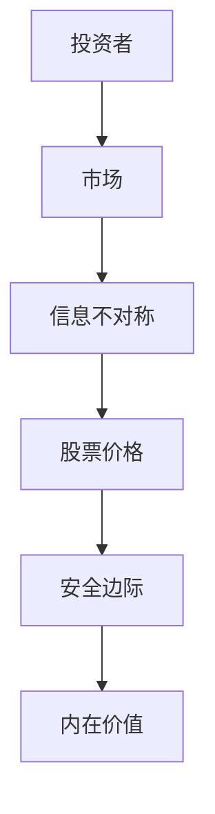
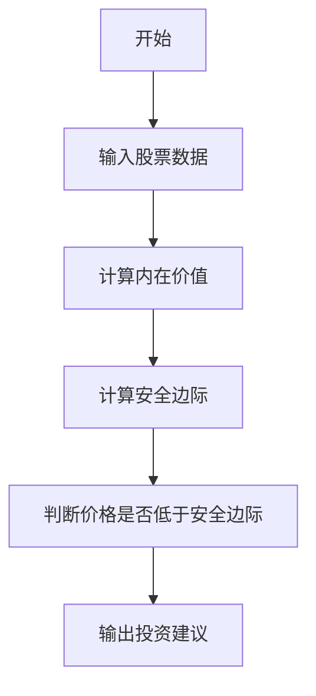

                 


# 格雷厄姆特价股票策略在不同市场信息不对称下的表现

## 关键词：信息不对称，格雷厄姆策略，特价股票，安全边际，价值投资

## 摘要：  
本文深入探讨了格雷厄姆特价股票策略在不同市场信息不对称条件下的表现。通过分析信息不对称对市场定价的影响，结合格雷厄姆价值投资的核心理念，探讨特价股票策略的有效性。本文从理论到实践，结合数学模型和系统架构，全面分析了策略在信息不对称环境下的优劣，并提出了优化建议。  

---

## 正文

### 第一部分：格雷厄姆特价股票策略概述

#### 第1章：格雷厄姆特价股票策略的基本概念

##### 1.1 格雷厄姆投资理论的核心思想  
格雷厄姆是价值投资的鼻祖，其核心思想是“以低于内在价值的价格买入股票”。他认为，市场的短期波动性使得股票价格与内在价值之间存在偏差，投资者可以通过这种偏差获利。  

##### 1.2 信息不对称对市场的影响  
信息不对称是指市场参与者之间掌握的信息不一致，通常表现为机构投资者和个人投资者之间的信息差异。信息不对称会导致股票价格偏离其内在价值，为格雷厄姆策略提供了套利机会。  

##### 1.3 格雷厄姆策略与信息不对称的关系  
格雷厄姆策略依赖于市场定价的非效率性，而信息不对称正是这种非效率性的主要来源之一。信息不对称使得某些股票的市场价格低于其内在价值，从而为格雷厄姆策略提供了可操作的空间。  

---

#### 第2章：格雷厄姆特价股票策略的核心概念与联系

##### 2.1 核心概念原理  
- **内在价值**：股票的真正价值，与市场短期波动无关。  
- **安全边际**：买入价格与内在价值之间的差距，用以降低投资风险。  
- **特价股票**：市场价格低于内在价值的股票。  

##### 2.2 信息不对称下的策略优化  
- **信息不对称对安全边际的影响**：信息不对称可能导致某些股票的安全边际被低估或高估。  
- **策略调整**：通过分析信息不对称的来源，优化选股标准，提高策略的有效性。  

##### 2.3 实体关系图  


---

### 第二部分：格雷厄姆特价股票策略的算法原理

#### 第3章：格雷厄姆特价股票策略的算法原理

##### 3.1 算法原理概述  
格雷厄姆策略的核心算法是通过计算股票的内在价值，并与市场价格进行比较，判断是否存在安全边际。公式如下：  
$$\text{安全边际} = \text{内在价值} - \text{市场价格}$$  

##### 3.2 算法流程图  


##### 3.3 算法实现代码  
```python
def calculate_intrinsic_value(stock_data):
    # 假设 stock_data 包含收入、利润等数据
    return stock_data['收入'] * 0.5 + stock_data['利润'] * 0.3

def calculate_margin_of_safety(price, intrinsic_value):
    return intrinsic_value - price

# 示例数据
stock_data = {'收入': 100, '利润': 20}
price = 30
iv = calculate_intrinsic_value(stock_data)
mo

